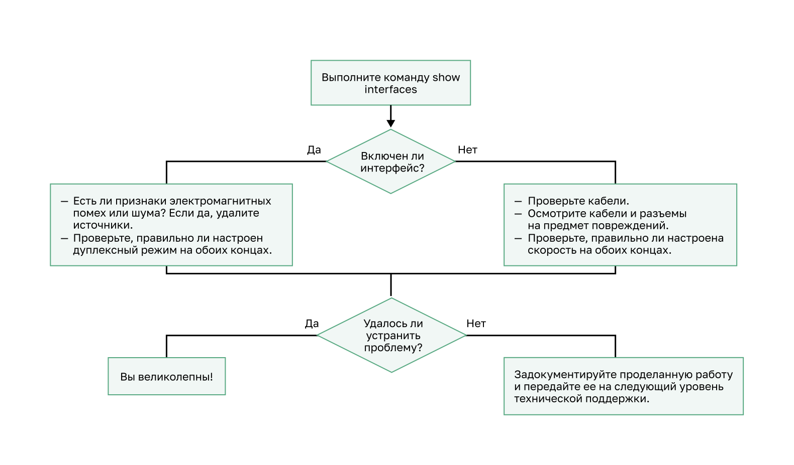

<!-- 1.2.1 -->
## Дуплексная связь

Порты коммутатора могут настраиваться независимо для различных потребностей. В этом разделе описывается настройка портов коммутатора, проверка конфигураций, распространенные ошибки и устранение неполадок конфигурации коммутатора.

Полнодуплексная связь повышает эффективность использования полосы пропускания, позволяя обоим сторонам канала одновременно передавать и принимать данные. Данный вид связи также называют двунаправленной связью и это требуется для микросегментации. Микросегментированная локальная сеть создается, когда к коммутационному порту подключено только одно устройство, а порт работает в полнодуплексном режиме. Когда коммутационный порт работает в полнодуплексном режиме, то коллизионные домены, связанные с портом, отсутствуют.

В отличие от полнодуплексной связи, полудуплексная связь является однонаправленной. Полудуплексная связь создает проблемы с производительностью, поскольку данные могут поступать только в одном направлении одновременно, что часто приводит к столкновениям. Полудуплексные соединения обычно наблюдаются в более старом оборудовании, например, в концентраторах. Полнодуплексная связь заменила полудуплекс в большинстве аппаратных средств.

На рисунке показана полнодуплексная и полудуплексная связь.


<!--
На рисунке показана разница между полнодуплексной и полудуплексной связью между двумя коммутаторами. На диаграмме вверху показан полный дуплекс со стрелками в обоих направлениях на линии связи между двумя коммутаторами с текстом: Отправить И получить, одновременно. Нижняя диаграмма показывает полудуплекс с одной стрелкой, идущей от одного переключателя к другому с текстом: Прием ИЛИ передача.
-->

Для работы полнодуплексных соединений требуются сетевые интерфейсные платы, поддерживающие Gigabit Ethernet и 10Gb Ethernet. В полнодуплексном режиме схема обнаружения столкновений на сетевой плате отключена. Полнодуплексный режим Fast Ethernet обеспечивает эффективность 100% в обоих направлениях. Это приводит к удвоению потенциального использования указанной полосы пропускания.

<!-- 1.2.2 -->
## Настройка портов коммутатора на физическом уровне

Порты коммутатора можно настроить вручную с помощью определенных параметров дуплекса и скорости. Используйте команду **duplex** в режиме конфигурации интерфейса, чтобы вручную указать дуплексный режим для порта коммутатора. Используйте команду режима конфигурации интерфейса **speed**, чтобы вручную указать скорость. Например, оба коммутатора в топологии всегда должны работать в полнодуплексном режиме со скоростью 100 Мбит/с.


<!--
топология сети, показывающая соединение между двумя коммутаторами, работающими в полнодуплексном режиме со скоростью 100/Mpbs
-->

В таблице показаны команды для S1. Те же команды могут быть применены к S2.

| Задача | Команды IOS |
| --- | --- |
| Войдите в режим глобальной настройки. | S1# **configure terminal** |
| Войдите в режим интерфейсной конфигурации. | S1(config)# **interface FastEthernet 0/1** |
| Настройте дуплексный режим интерфейса. | S1(config-if)# **duplex full** |
| Настройте скорость интерфейса. | S1(config-if)# **speed 100** |
| Вернитесь в привилегированный исполнительский режим. | S1(config-if)# **end** |
| Сохраните текущую конфигурацию в качестве загрузочной конфигурации. | S1# **copy running-config startup-config** |

По умолчанию для дуплексного режима и скорости портов коммутаторов на коммутаторах Cisco Catalyst 2960 и 3560 используется автоматически. Порты 10/100/1000 работают в полудуплексном или полнодуплексном режиме, если они установлены на 10 или 100 Мбит/с, и работают только в полнодуплексном режиме, если установлено значение 1000 Мбит/с (1 Гбит/с). Автосогласование полезно, если параметры скорости и дуплексного режима устройства, подключенного к порту, неизвестны или могут измениться. При подключении к известным устройствам, таким как серверы, выделенные рабочие станции или сетевые устройства, рекомендуется вручную задать параметры скорости и дуплекса.

При устранении проблем с портами коммутатора важно проверить параметры дуплекса и скорости.

**Примечание**: Несоответствие настроек дуплексного режима или скорости может привести к проблемам с подключением. Ошибка автосогласования создает несовпадающие параметры.

Все порты оптоволоконных кабелей, например порты 1000BASE-SX, работают только на предустановленной скорости и всегда в полнодуплексном режиме.

<!-- 1.2.3 -->
## Функция Auto-MDIX

В прошлом при подключении устройств было обязательно использовать определенные типы кабелей (прямые или кроссовые). Подключения «коммутатор-коммутатор» или «коммутатор-маршрутизатор» требуются с использованием различных кабелей Ethernet. Функция автоматической настройки интерфейса в зависимости от передающей среды (auto-MDIX) устраняет эту проблему. Интерфейс с функцией auto-MDIX автоматически определяет требуемый тип кабельного соединения (прямой или перекрестный) и соответствующим образом настраивает подключение. При подключении к коммутаторам без функции auto-MDIX необходимо использовать прямые кабели для соединения с устройствами, такими как серверы, рабочие станции или маршрутизаторы. Перекрестные кабели должны использоваться для подключения к другим коммутаторам или ретрансляторам.

Включенная функция auto-MDIX позволяет использовать любой тип кабеля для подключения к другим устройствам, а интерфейс автоматически настраивается для успешного взаимодействия. На новых коммутаторах Cisco эту функцию включает команда режима интерфейсной настройки **mdix auto**. При использовании функции auto-MDIX на интерфейсе необходимо задать для его скорости и режима дуплекса значение **auto** (Автоопределение).

Команда включения auto-MDIX выдается в режиме конфигурации интерфейса на коммутаторе, как показано на рисунке:

```
S1(config-if)# mdix auto
```

**Примечание**: Функция auto-MDIX включена по умолчанию на коммутаторах Catalyst 2960 и Catalyst 3560, но недоступна на старых коммутаторах Catalyst 2950 и Catalyst 3550.

Чтобы проверить настройку auto-MDIX для конкретного интерфейса, используйте команду с **show controllers ethernet-controller** ключевым словом **phy**. Чтобы ограничить выходные данные строками, ссылающихся на автоматическое MDIX, используйте фильтр **include Auto-MDIX**. Как показано на рисунке, выходные данные указывают «Вкл» или «Выкл» для объекта.

```
S1# show controllers ethernet-controller fa0/1 phy | include MDIX
 Auto-MDIX           :  On   [AdminState=1   Flags=0x00052248]
```

<!-- 1.2.4 -->
## Команды проверки коммутатора

В таблице приведены некоторые из наиболее полезных команд проверки коммутаторов.

| Задача | Команды IOS |
| --- | --- |
| Отобразите состояние и конфигурацию интерфейса. | S1# **show interfaces** [*interface-id*] |
| Отобразите текущую загрузочную конфигурацию. | S1# **show startup-config** |
| Отобразите текущую конфигурацию. | S1# **show running-config** |
| Отобразите данные о файловой флеш-системе. | S1# **show flash** |
| Отобразите состояние системного аппаратного и программного обеспечения. | S1# **show version** |
| Отобразите историю введенных команд. | S1# **show history** |
| Отобразите данные IP для интерфейса. | S1# **show ip interface** [_interface-id_]<br>ИЛИ<br>S1# **show ipv6 interface** [_interface-id_] |
| Отобразите таблицу MAC-адресов. | S1# **show mac-address-table**<br>ИЛИ<br>S1# **show mac address-table** |

<!-- 1.2.5 -->
## Проверка конфигурации порта коммутатора

Команда **show running-config** может использоваться для проверки правильности настройки коммутатора. Из выборки сокращенного вывода по S1 на рисунке показана некоторая важная информация:

* Интерфейс Fast Ethernet 0/18 настроен с сетью управления VLAN 99.
* VLAN 99 назначен IPv4-адрес 172.17.99.11 с маской подсети 255.255.255.0.
* Задан шлюз по умолчанию 172.17.99.1

```
S1# show running-config
Building configuration...
Current configuration : 1466 bytes
!
interface FastEthernet0/18
 switchport access vlan 99
 switchport mode access
!
(output omitted)
!
interface Vlan99
 ip address 172.17.99.11 255.255.255.0
 ipv6 address 2001:DB8:ACAD:99::1/64
!
ip default-gateway 172.17.99.1 
```

Эта **show interfaces** команда является еще одной часто используемой командой, которая отображает информацию о состоянии и статистике сетевых интерфейсов коммутатора. Команда **show interfaces** часто используется при настройке и мониторинге сетевых устройств.

Первая строка выходных данных команды **show interfaces fastEthernet 0/18** указывает на то, что интерфейс FastEthernet 0/18 up/up, что означает, что он работает. Следующие данные вывода показывают, что включен полнодуплексный режим и установлена скорость 100 Мбит/с.

```
S1# show interfaces fastEthernet 0/18
FastEthernet0/18 is up, line protocol is up (connected)
  Hardware is Fast Ethernet, address is 0025.83e6.9092 (bia 0025.83e6.9092)
  MTU 1500 bytes, BW 100000 Kbit/sec, DLY 100 usec,
     reliability 255/255, txload 1/255, rxload 1/255
  Encapsulation ARPA, loopback not set
  Keepalive set (10 sec)
  Full-duplex, 100Mb/s, media type is 10/100BaseTX
```

<!-- 1.2.6 -->
## Неполадки на уровне сетевого доступа

Выходные данные команды **show interfaces** полезны для обнаружения распространенных проблем со средой передачи данных. Одной из наиболее важных частей этого вывода является отображение состояния протокола канального уровня и канала передачи данных, как показано в примере.

```
S1# show interfaces fastEthernet 0/18
FastEthernet0/18 is up, line protocol is up (connected)
Hardware is Fast Ethernet, address is 0025.83e6.9092 (bia 0025.83e6.9092)MTU 1500 bytes, BW 100000 Kbit/sec, DLY 100 usec,
```

Первый параметр (FastEthernet0/1 is up) относится к аппаратному уровню. Он указывает, получает ли интерфейс сигнал обнаружения несущей. Второй параметр (line protocol is up) относится к уровню линии. Он указывает, принимаются ли сообщения keepalive протокола канального уровня.

Основываясь на выходных данных команды **show interfaces**, возможные проблемы могут быть исправлены следующим образом:

* Если интерфейс включен, а протокол канального уровня не функционирует, возникает проблема. Может быть несоответствие типа инкапсуляции, интерфейс на другом конце может быть отключен, или может быть аппаратная проблема.
* Если протокол канального уровня и интерфейс отключены, кабель не подключается или возникает другая проблема с интерфейсом. Например, во встречно-параллельном включении мог быть административно отключен другой конец подключения. команда * Если интерфейс административно выключен, он был отключен вручную (the **shutdown** была выдана в активной конфигурации. 

Выходные данные команды **show interfaces** отображают счетчики и статистику для интерфейса FastEthernet0/18, как показано в примере.

```
S1# show interfaces fastEthernet 0/18
FastEthernet0/18 is up, line protocol is up (connected)
  Hardware is Fast Ethernet, address is 0025.83e6.9092 (bia 0025.83e6.9092)
  MTU 1500 bytes, BW 100000 Kbit/sec, DLY 100 usec,
     reliability 255/255, txload 1/255, rxload 1/255
  Encapsulation ARPA, loopback not set
  Keepalive set (10 sec)
  Full-duplex, 100Mb/s, media type is 10/100BaseTX
  input flow-control is off, output flow-control is unsupported
  ARP type: ARPA, ARP Timeout 04:00:00
  Last input never, output 00:00:01, output hang never
  Last clearing of "show interface" counters never
  Input queue: 0/75/0/0 (size/max/drops/flushes); Total output drops: 0
  Queueing strategy: fifo
  Output queue: 0/40 (size/max)
  5 minute input rate 0 bits/sec, 0 packets/sec
  5 minute output rate 0 bits/sec, 0 packets/sec
     2295197 packets input, 305539992 bytes, 0 no buffer
     Received 1925500 broadcasts (74 multicasts)
     0 runts, 0 giants, 0 throttles
     3 input errors, 3 CRC, 0 frame, 0 overrun, 0 ignored
     0 watchdog, 74 multicast, 0 pause input
     0 input packets with dribble condition detected
     3594664 packets output, 436549843 bytes, 0 underruns
     8 output errors, 1790 collisions, 10 interface resets
     0 unknown protocol drops
     0 babbles, 235 late collision, 0 deferred
```

Некоторые ошибки среды передачи данных недостаточно серьезны, чтобы привести к сбою цепи, но вызывают проблемы с производительностью сети. В таблице объясняются некоторые из этих распространенных ошибок, которые можно обнаружить с помощью команды **show interfaces**.

| **Тип ошибки** | **Описание** |
| --- | --- |
| **Ошибки ввода** | Общее количество ошибок. Она включает в себя ранты, гиганты, без буфера, CRC, кадра, перезапуски и счетчик проигнорируемых пакетов. |
| **Ошибки типа «карликовый кадр» (Runts)** | Пакеты, отброшенные из-за того, что они меньше минимального размера пакета для среды передачи данных. Например, любой пакет Ethernet, который является менее 64 байт считается - runt. |
| **Гигантские кадры (Giant)** | Пакеты, которые отброшены из-за превышения максимального размера пакета для среды. Например, любой кадр Ethernet размером более 1 518 байтов считается слишком большим (giant). |
| **CRC** | Ошибки CRC создаются, когда рассчитанная контрольная сумма не соответствует полученной контрольной сумме. |
| **Ошибки вывода** | Сумма всех ошибок, которые мешали окончательной передаче дейтаграмм из анализируемого интерфейса. |
| **Коллизии** | Количество сообщений, повторно переданных из-за коллизий Ethernet. |
| **Поздние коллизии** | Коллизия, которая случается после передачи 512 бит кадра. |

<!-- 1.2.7 -->
## Ошибки ввода и вывода интерфейса

«Входные ошибки» — это сумма всех ошибок в датаграммах, полученных на анализируемом интерфейсе. Включает «карликовые» и «гигантские» кадры, отсутствие буфера, CRC, ошибки в кадрах, переполнение и проигнорированные пакеты. К ошибкам вывода, которые можно обнаружить с помощью команды **show interfaces**, относятся следующие:

* **Runt Frames** — кадры Ethernet, которые короче, чем 64-байт минимально допустимой длинны, называются runts. Обычно причиной большого числа карликовых кадров являются неисправные сетевые интерфейсные платы, но они также могут быть вызваны коллизиями.
* **Гигантские кадры (giants)** — кадры Ethernet, размер которых превышает максимально допустимый.
* **Ошибки CRC** — в Ethernet и последовательных интерфейсах ошибки CRC обычно свидетельствуют о неполадках в среде передачи или кабеле. Частыми причинами ошибок являются электрические помехи, плохо закрепленные или поврежденные разъемы, а также неверно выбранный тип кабеля. Большое количество ошибок CRC приводит к шуму на канале, поэтому следует проверить кабель. Также следует найти и устранить источники электромагнитного шума.

«Ошибки вывода» — это сумма всех ошибок, которые препятствовали окончательной передаче датаграмм из проверяемого интерфейса. К ошибкам вывода, которые можно обнаружить с помощью команды **show interfaces**, относятся следующие:

* **Коллизии** являются обычным явлением при работе в полудуплексном режиме. Однако они никогда не должны возникать на интерфейсе, настроенном для полнодуплексного режима связи.
* **Поздние коллизии** — это коллизии, которые происходят после передачи 512 бит кадра. Чрезмерная длина кабеля является наиболее распространенной причиной поздних коллизий. Другой распространенной причиной является неправильная конфигурация дуплекса. Например, одна сторона подключения может быть настроен для полнодуплексного, а другая — для полудуплексного. Вы увидите поздние коллизии на интерфейсе, настроенном для полудуплексного режима. В этом случае необходимо настроить один и тот же параметр дуплекса на обоих сторонах. Правильно спроектированная и настроенная сеть никогда не должна иметь поздних коллизий.

<!-- 1.2.8 -->
## Поиск и устранение неполадок на уровне сетевого доступа

Большинство проблем, влияющих на коммутируемые сети, возникают во время исходной реализации. Теоретически после его установки сеть продолжает работать без проблем. Однако кабели повреждаются, меняются конфигурации и подключаются к коммутатору новые устройства, требующие изменения конфигурации коммутатора. Требуется постоянное обслуживание и устранение неисправностей сетевой инфраструктуры.

Для поиска и устранения неполадок при отсутствии или плохом качестве соединения коммутатора с другим устройством следуйте данному алгоритму действий:




<!--
Рисунок представляет собой блок-схему для устранения неполадок, связанных с неправильной связью или отсутствием соединения между сетевыми устройствами. Выполните команду show interfaces Это сводится к вопросу, является ли интерфейс активным? Если ответ отрицательный, это происходит следующим образом: проверка правильных кабелей; проверка кабелей и разъемов на наличие повреждений; и проверка правильности настройки скорости на обоих сторонах. Если ответ утвердительный, переходим в следующие шаги: есть ли признаки EMI/шума? Если да. Проверьте, правильно ли настроен дуплексный режим на обоих сторонах. Это сводится к вопросу, проблема решена?  Если ответ отрицательный, то следующим шагом является документирование проделанной работы и эскалация проблемы. Если ответ «да», то все сделано.
-->

Используйте команду **show interfaces** для проверки состояния интерфейса.

Если интерфейс отключен:

* Убедитесь, что используются соответствующие кабели. Кроме того, проверьте кабель и разъемы на наличие повреждений. В случае возникновения подозрений в неправильном или неправильном кабеле замените кабель. 
* Если интерфейс все еще отключен, проблема может быть вызвана несоответствием в настройке скорости. Скорость интерфейса обычно согласовывается автоматически; поэтому, даже если она применяется вручную к одному интерфейсу, подключаемый интерфейс должен соответствующим образом согласовываться. Несовпадение в скорости, возникающее из-за неправильной настройки или проблем с аппаратным или программным обеспечением, может создать проблемы в работе интерфейса. Вручную установите одинаковую скорость на обоих концах соединения, если возникает подозрение в возникновении проблемы.

Если интерфейс не работает, но проблемы с подключением сохраняются:

* Используйте команду **show interfaces** и проверьте наличие признаков чрезмерного шума. Показания могут включать увеличение счетчиков для карликов, гигантов и ошибок CRC. Если есть чрезмерный шум, сначала найдите и удалите источник шума, если это возможно. Кроме того, убедитесь, что длина кабеля не превышает максимальную длину, и проверьте тип используемого кабеля.
* Если шум не является проблемой, проверьте наличие чрезмерных коллизий. При наличии коллизий или поздних коллизий проверьте параметры дуплекса на обоих сторонах соединения. Подобно настройке скорости, дуплексный режим обычно согласовывается автоматически. Если вы предполагаете несоответствие дуплексных режимов, вручную настройте полнодуплексный режим на обоих концах соединения.

<!-- 1.2.9 -->
<!-- syntax -->

