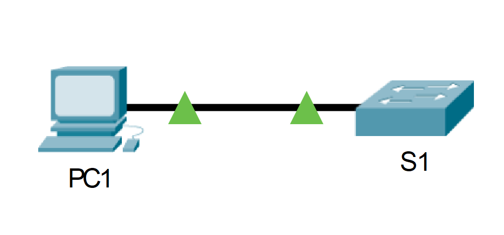

---

> **ВАЖНО**
> 
> Форма для ответов на вопросы будет доступна только при развертывании лабораторной работы 

---

## Топология



## Таблица адресации

| Устройство | Интерфейс | IP-адрес    | Маска подсети |
|------------|-----------|-------------|---------------|
| S1         | VLAN 1    | 10.10.10.2  | 255.255.255.0 |
| PC1        | NIC       | 10.10.10.10 | 255.255.255.0 |

## Цели

Часть 1. Настроить шифрование паролей

Часть 2. Зашифровать передачу данных

Часть 3. Проверить реализацию SSH

## Общие сведения

Для безопасного управления удаленными подключениями Cisco рекомендует заменить протокол Telnet на SSH. В Telnet используется открытый незашифрованный текстовый обмен. Протокол SSH обеспечивает безопасность удалённых соединений, предоставляя надёжное шифрование всех данных, передаваемых между устройствами. В этом упражнении необходимо обеспечить безопасность удалённого коммутатора с использованием зашифрованного пароля и протокола SSH.

## Инструкции

### Часть 1. Безопасные пароли

1.  С помощью командной строки на узле **PC1** подключитесь к коммутатору **S1** через Telnet. Пароль для пользовательского и привилегированного доступа — **cisco**.

2.  Сохраните текущую конфигурацию, чтобы любые допущенные вами ошибки можно было отменить, отключив питание коммутатора **S1**.

3.  Отобразите текущую конфигурацию и обратите внимание на то, что пароли написаны в виде открытого текста. Введите команду, которая шифрует текстовые пароли:

    ```
    S1(config)# service password-encryption
    ```

4.  Убедитесь, что пароли зашифрованы.

### Часть 2. Обеспечение защищенной коммуникации

**Шаг 1. Настройте имя домена IP и создайте ключи шифрования**

Использование Telnet небезопасно, поскольку текстовые данные передаются в незашифрованном виде. Поэтому рекомендуется по возможности использовать протокол SSH.

1.  Присвойте домену имя **netacad.pka.**

2.  Для шифрования данных требуются ключи шифрования. Создайте **RSA** ключи длиной 1024 бит.

**Шаг 2. Создайте пользователя SSH и перенастройте линии VTY на доступ только по протоколу SSH**

1.  Создайте пользователя **administrator** с секретным паролем **cisco**.

2.  Настройте линии VTY для проверки регистрационных данных на основе локальной базы данных имен пользователей, а также для разрешения удаленного доступа только по протоколу SSH. Удалите существующий пароль линии VTY.

**Шаг 3. Проверка реализации протокола SSH**

1.  Завершите сеанс Telnet и попробуйте заново войти в систему, используя этот протокол. Попытка должна завершиться неудачей.

2. Попробуйте войти в систему через протокол SSH. Введите **ssh** и нажмите **ВВОД**, не добавляя какие-либо параметры, чтобы отобразить инструкции использования команды.
**Примечание.** Параметр **-l** — это буква «L», а не цифра 1.

3. После успешного входа перейдите в режим привилегированного доступа EXEC и сохраните конфигурацию. Если вам не удалось получить доступ к коммутатору **S1**, отключите питание и повторите шаги, описанные в части 1.

[Скачать файл Packet Tracer для локального запуска](./assets/1.3.6-lab.pka)
