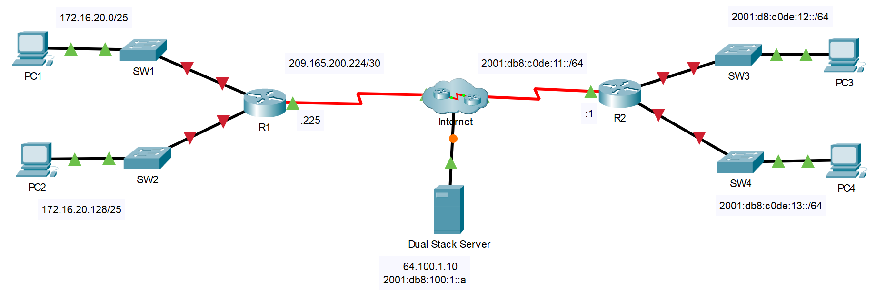

---

> **ВАЖНО**
> 
> Форма для ответов на вопросы будет доступна только при развертывании лабораторной работы 

---

## Топология

## Таблица адресации

| Устройство | Интерфейс | IP-адрес/префикс      | Шлюз по умолчанию |
|------------|-----------|-----------------------|-------------------|
| R1         | G0/0      | 172.16.20.1/25        | —                 |
|            | G0/1      | 172.16.20.129/25      | —                 |
|            | S0/0/0    | 209.165.200.225/30    | —                 |
| PC1        | NIC       | 172.16.20.10/25       | 172.16.20.1       |
| PC2        | NIC       | 172.16.20.138/25      | 172.16.20.129     |
| R2         | G0/0      | 2001:db8:c0de:12።1/64 | —                 |
|            | G0/1      | 2001:db8:c0de:13።1/64 | —                 |
|            | S0/0/1    | 2001:db8:c0de:11።1/64 | —                 |
|            |           | fe80::2               | Нет               |
| PC3        | NIC       | 2001:db8:c0de:12።а/64 | fe80::2           |
| PC4        | NIC       | 2001:db8:c0de:13።а/64 | fe80::2           |

## Задачи

Часть 1. Настроить IPv4-адресацию и проверить подключение

Часть 2. Настроить IPv6-адресацию и проверить подключение

## Общие сведения

К роутерам R1 и R2 подключено по две локальных сети. Ваша задача — настроить соответствующую адресацию на каждом устройстве и проверить подключение между локальными сетями.

**Примечание**. Пароль пользовательского режима — **cisco**. Пароль привилегированного режима EXEC — **class**.

## Инструкции

### Часть 1. Настройка IPv4-адресации и проверка подключения

**Шаг 1. Назначьте IPv4-адреса роутеру R1 и устройствам локальной сети**

Руководствуясь **таблицей адресации**, настройте IP-адресацию для интерфейсов локальной сети роутера **R1**, а также для узлов **PC1** и **PC2**. Последовательный интерфейс уже настроен.

**Шаг 2. Проверьте подключение**

Компьютеры **PC1** и **PC2** с помощью утилиты **ping** должны успешно проверять связь между собой и сервером с **двойным стеком**.

### Часть 2. Настройка IPv6-адресации и проверка подключения

**Шаг 1. Назначьте IPv6-адреса роутеру R2 и устройствам локальной сети**

Руководствуясь **таблицей адресации**, настройте IP-адресацию для интерфейсов локальной сети роутера **R2**, а также для узлов **PC3** и **PC4**. Последовательный интерфейс уже настроен.

**Шаг 2. Проверьте подключение**

Компьютеры **PC3** и **PC4** с помощью утилиты **ping** должны успешно проверять связь между собой и сервером с **двойным стеком**.

[Скачать файл Packet Tracer для локального запуска](./assets/1.4.7-lab.pka)
