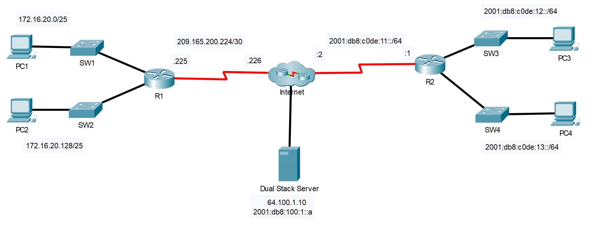

## Топология



## Таблица адресации

| Устройство | Интерфейс | IP адрес/префикс       | Шлюз по умолчанию |
|------------|-----------|------------------------|-------------------|
| R1         | G0/0/0    | 172.16.20.1/25         | —                 |
| R1         | G0/0/1    | 172.16.20.129/25       | —                 |
| R1         | S0/1/0    | 209.165.200.225/30     | —                 |
| PC1        | NIC       | 172.16.20.10/25        | 172.16.20.1       |
| PC2        | NIC       | 172.16.20.138/25       | 172.16.20.129     |
| R2         | G0/0      | 2001:db8:c0de:12።1/64  | —                 |
| R2         | G0/0/1    | 2001:db8:c0de:13። 1/64 | —                 |
| R2         | S0/1/1    | 2001:db8:c0de:11።1/64  | —                 |
| R2         | S0/1/1    | fe80::2                | Нет               |
| PC3        | NIC       | 2001:db8:c0de:12።а/64  | fe80::2           |
| PC4        | NIC       | 2001:db8:c0de:13።а/64  | fe80::2           |

## Цели

-   Проверка связи IPv4 между подключенными напрямую сетями

-   Проверка связи IPv6 между подключенными напрямую сетями

-   Поиск и устранение неполадок подключения

## Общие сведения

К маршрутизаторам R1 и R2 подключено по две локальных сети. Ваша задача — настроить соответствующую адресацию на каждом устройстве и проверить подключение между локальными сетями.

**Примечание**. Пароль пользовательского режима — **cisco**. Пароль привилегированного режима EXEC — **class**.

## Инструкции

### Часть 1. Проверка связи IPv4 между подключенными напрямую сетями

**Шаг 1. Проверьте адреса IPv4 и состояние порта на R1.**

1.  Проверьте состояние настроенных интерфейсов, фильтруя выходные данные.

    ```
    R1# show ip interface brief | exclude unassigned
    ```

2.  На основе выходных данных исправляйте все проблемы состояния порта, которые вы видите.

3.  Обратитесь к **таблице адресации** и проверьте IP-адреса, настроенные на R1. При необходимости можете вносить любые коррективы в адресацию.

4.  Отобразить таблицу маршрутизации путем фильтрации, чтобы начать вывод на слово **Gateway**.

    **Примечание.** Термины, используемые для фильтрации выходных данных, могут быть сокращены до соответствия тексту, если совпадение уникально. Например, Gateway, Gate и Ga будут иметь тот же эффект. G не будет давать такой эффект. Фильтрация чувствительна к регистру

    ```
    R1# show ip route | begin Gate
    ```

    Вопрос: Какой шлюз является шлюзом «последней надежды»?

    **Введите ваш ответ здесь.**

5.  Отображение информации об интерфейсе и фильтра для **описания** или **подключения**.

    Примечание. При использовании **include** или **exclude** несколько поисков можно выполнить, разделив строки поиска символом ( **\|** )

    ```
    R1# show interface | include Desc|conn
    ```

    Вопрос: Что такое Circuit ID, отображаемый на выводе?

    **Введите ваш ответ здесь.**

6.  Отображение конкретной информации интерфейса для G0/0/0 путем фильтрации для **дуплексного режима**.

    Вопрос: Что такое настройка дуплекса, скорость и тип среды?

    **Введите ваш ответ здесь.**

**Шаг 2. Проверьте подключение.**

**Компьютеры PC1** и **PC2** с помощью утилиты ping должны успешно проверять связь между собой и сервером с **двойным стеком**. Если нет, проверьте состояние интерфейсов и назначения IP-адресов.

### Часть 2. Проверка связи IPv6 между подключенными напрямую сетями

**Шаг 1. Проверьте адреса IPv6 и состояние порта на R2.**

1.  Проверьте состояние настроенных интерфейсов.

    ```
    R2# show ipv6 int brief
    ```

    Вопрос: Каково состояние настроенных интерфейсов?

    **Введите ваш ответ здесь.**

2.  Обратитесь к **таблице адресации** и внесите необходимые исправления в адресации.

    **Примечание.** При изменении адреса IPv6 необходимо удалить неверный адрес, так как интерфейс способен поддерживать несколько сетей IPv6.

    ```
    R2(config)# int g0/0/1
    R2(config-if)# no ipv6 address 2001:db8:c0de:14::1/64
    ```

    Вопрос: Настройте правильный адрес на интерфейсе.

    **Введите ваш ответ здесь.**

3.  Отобразите таблицу маршрутизации IPv6.

    **Примечание.** Команды фильтрации в настоящее время не работают с командами IPv6.

4. Отображение всех адресов IPv6, настроенных на интерфейсах, путем фильтрации выходных данных **running-config**.

    Фильтрация вывода на **R2** для **ipv6** или **интерфейса** .

    ```
    R2# sh run | include ipv6|interface
    ```

    Вопрос: Сколько адресов настроено на каждом интерфейсе Gigabit?

    **Введите ваш ответ здесь.**

**Шаг 2. Проверьте подключение.**

**Компьютеры** PC3 **и** PC4 **с помощью утилиты ping должны успешно проверять связь между собой и** сервером с двойным стеком. Если нет, проверьте состояние интерфейса и назначения адресов IPv6.

[Скачать файл Packet Tracer для локального запуска](./assets/1.5.10-packet-tracer---verify-directly-connected-networks_ru-RU.pka)
