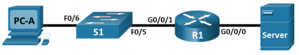

## Топология

## Таблица адресации

| Устройство | Интерфейс | IP адрес/префикс        | Шлюз по умолчанию |
|------------|-----------|-------------------------|-------------------|
| **R1**     | G0/0/0    | 192.168.0.1 /24         | —                 |
| **R1**     | G0/0/0    | 2001:db8:acad::1 /64    | —                 |
| **R1**     | G0/0/0    | fe80::1                 | —                 |
| **R1**     | G0/0/1    | 192.168.1.1 /24         | —                 |
| **R1**     | G0/0/1    | 2001:db8:acad:1::1 /64  | —                 |
| **R1**     | G0/0/1    | fe80::1                 | —                 |
| **R1**     | Loopback0 | 10.0.0.1 /24            | —                 |
| **R1**     | Loopback0 | 2001:db8:acad:2።1/64    | —                 |
| **R1**     | Loopback0 | fe80::1                 | —                 |
| **PC-A**   | NIC       | 192.168.1.10 /24        | 192.168.1.1       |
| **PC-A**   | NIC       | 2001:db8:acad:1::10 /64 | fe80::1           |
| **Server** | NIC       | 192.168.0.10 /24        | 192.168.0.1       |
| **Server** | NIC       | 2001:db8:acad::10 /64   | fe80::1           |

## Задачи

Часть 1. Настройка топологии и инициализация устройств

Часть 2. Настройка устройств и проверка подключения

Часть 3. Отображение сведений о маршрутизаторе

## Общие сведения и сценарий

Это комплексная лабораторная работав режиме симуляции физического оборудования (PTPM), нацеленная на повторение ранее изученных команд IOS для маршрутизатора. В первой и второй частях вам предстоит подключить кабели к оборудованию и выполнить базовую настройку конфигураций и параметров IPv4-интерфейса на маршрутизаторе.

В третьей части вам нужно будет настроить удаленное подключение к маршрутизатору с помощью протокола SSH, а также использовать команды IOS для получения от устройства данных, необходимых для того, чтобы ответить на вопросы о маршрутизаторе.

В целях повторения в этой лабораторной работе представлены команды, необходимые для определенных конфигураций маршрутизатора.

## Инструкции

### Часть 1. Настройка топологии и инициализация устройств

**Шаг 1. Подключите кабели сети согласно приведенной топологии.**

1.  Нажмите на **Cisco 4321 ISR**, **Cisco 2960 Switch** и **Server**, которые находятся на полке **Shelf** и перетащите а стойку **Rack**.

2.  Нажмите на **PC** на полке **Shelf** и перетащите на стол **Table**.

3.  Кабель устройств, как указано в схеме топологии. Используйте **медные прямые** кабели для сетевых подключений.

4.  Подключите **консольный кабель** от **PC** до **Cisco 4321 ISR**.

5.  Включите **Cisco 4321 ISR**, **PC-A** и **Server**. Кнопка питания для **Server** находится в правом нижнем углу. Коммутатор 2960 должен включаться автоматически.

### Часть 2. Настройка устройств и проверка подключения

**Шаг 1. Настройте интерфейсы ПК.**

1.  Настройте на компьютере **PC-A** IP-адрес, маску подсети и параметры основного шлюза.

2.  Настройте на сервере **Server** IP-адрес, маску подсети и параметры основного шлюза.

**Шаг 2. Настройте маршрутизатор.**

1.  Подключитесь к маршрутизатору с помощью консоли и активируйте привилегированный режим EXEC.

2.  Войдите в режим конфигурации.

3.  Назначьте маршрутизатору имя устройства.

4.  Укажите имя домена **ccna-lab.com**.

5.  Зашифруйте открытые пароли.

6.  Настройте в системеограничение на минимальный 12-значный пароль.

7.  Настройте имя пользователя **SSHadmin** с зашифрованным паролем **55HAdm!n2020**

8.  Создайте набор криптоключей с 1024 битным модулем.

9.  Назначьте **$cisco!PRIV\*** в качестве пароля доступа к привилегированному режиму EXEC.

10. Назначьте **$cisco!!CON\*** в качестве пароля консоли. Настройте сеансы на отключение после четырех минут бездействия и включите вход в систему.

11. Установите **$cisco!!VTY\*** в качестве пароля vty. Далее нужно настроить линии VTY, чтобы принимались только SSH-подключения. Настройте сеансы для отключения после четырех минут бездействия и включите вход с помощью локальной базы данных.

12. Создайте баннер с предупреждением о запрете несанкционированного доступа к устройству.

13. Включите маршрутизацию IPv6.

14. Настройте все три интерфейса маршрутизатора с информацией адресации IPv4 и IPv6 из таблицы адресации выше. Настройте все три интерфейса с описаниями. Включите все три интерефейса.

    Маршрутизатор не должен разрешать вход в систему VTY в течение двух минут, если в течение 60 секунд произошло три неудачных попытки входа.

15. Настройте на маршрутизаторе время.

16. Сохраните текущую конфигурацию в файл загрузочной конфигурации.

    Вопрос: Что произойдет, если перезагрузить маршрутизатор до того, как будет выполнена команда **copy running-config startup-config**?

    **Введите ваш ответ здесь.**

**Шаг 3. Проверьте подключение к сети.**

1.  Используя командную строку на **PC-A**, проверьте связь эхо-запросами до IPv4- и IPv6-адресов сервера **Server**.

    Вопрос: Успешно ли выполнена проверка связи?

    **Введите ваш ответ здесь.**

2.  С **PC-A** получите удаленный доступ к маршрутизатору **R1** с помощью клиента Telnet/SSH.

    Используя клиент Telnet/SSH на PC-A, откройте сеанс SSH на IPv4-адрес интерфейса замыкания на себя R1. Убедитесь, что для параметра Тип подключения (Connection Type ) установлен в значение **SSH**, и используйте **sShadmin** в качестве имени пользователя. При появлении запроса введите пароль **55Hadm!n2020**.

    Вопрос: Удаленный доступ был настроен успешно?

    **Введите ваш ответ здесь.**

3.  Используя клиент Telnet/SSH на **PC-A**, откройте сеанс SSH на IPv6-адрес интерфейса Loopback R1. Убедитесь, что для параметра Тип подключения (Connection Type ) установлен в значение **SSH**, и используйте **SSHadmin** в качестве имени пользователя. При появлении запроса введите пароль **55Hadm!n2020**.

    Вопросы:

    Удаленный доступ был настроен успешно?

    **Введите ваш ответ здесь.**

    Почему использование протокола Telnet считается угрозой безопасности?

    **Введите ваш ответ здесь.**

### Часть 3. Отображение сведений о маршрутизаторе

В третьей части вам предстоит использовать команду **show** в сеансе SSH, чтобы получить информацию из маршрутизатора.

**Шаг 1. Установите SSH-подключение к R1.**

Используя клиент Telnet/SSH на **PC-A**, откройте сеанс SSH на IPv6-адрес интерфейса Loopback **R1** и войдите в систему как **sShadmin** с паролем **55Hadm! n2020**.

**Шаг 2. Получите основные данные об аппаратном и программном обеспечении.**

1.  Используйте команду **show version**, чтобы ответить на вопросы о маршрутизаторе.

    Вопросы:

    Как называется образ IOS, под управлением которой работает маршрутизатор?

    **Введите ваш ответ здесь.**

    Какой объем энергонезависимого ОЗУ (NVRAM) имеет маршрутизатор?

    **Введите ваш ответ здесь.**

    Каким объемом флеш-памяти обладает маршрутизатор?

    **Введите ваш ответ здесь.**

2.  Зачастую команды **show** могут выводить несколько экранов данных. Фильтрация выходных данных позволяет пользователю отображать лишь нужные разделы выходных данных. Чтобы включить команду фильтрации, после команды **show** введите прямую черту (**\|**), после которой следует ввести параметр и выражение фильтрации. Чтобы отобразить все строки выходных данных, которые содержат выражение фильтрации, можно согласовать выходные данные с оператором фильтрации с помощью ключевого слова **include**. Настройте фильтрацию для команды **show version** и используйте команду **show version \| include register**, чтобы ответить на следующий вопрос.

    Вопрос: Каков был бы процесс загрузки маршрутизатора при следующей перезагрузке, если регистр конфигурации был 0x2142?

    **Введите ваш ответ здесь.**

**Шаг 3. Отобразите загрузочную конфигурацию.**

1.  Выполните команду **show startup-config** на маршрутизаторе, чтобы ответить на следующие вопросы.

    Вопрос: Как пароли представлены в выходных данных?

    **Введите ваш ответ здесь.**

2.  Введите команду **show running-config \| section vty**.

    Вопрос: Что происходит в результате выполнения этой команды?

    **Введите ваш ответ здесь.**

**Шаг 4. Отобразите таблицу маршрутизации на маршрутизаторе.**

Выполните команду **show ip route** на маршрутизаторе, чтобы ответить на следующие вопросы.

Вопросы:

Какой код используется в таблице маршрутизации для обозначения сети с прямым подключением?

**Введите ваш ответ здесь.**

Сколько записей маршрутов закодированы с символом «C» в таблице маршрутизации?

**Введите ваш ответ здесь.**

**Шаг 5. Отобразите на маршрутизаторе сводный список интерфейсов.**

1.  Выполните команду **show ip interface brief** на маршрутизаторе, чтобы ответить на следующий вопрос.

    Вопрос: Какая команда позволяет изменить состояние портов Gigabit Ethernet с DOWN на UP?

    **Введите ваш ответ здесь.**

2.  Чтобы проверить параметры IPv6 на маршрутизаторе **R1** выполните команду **show ipv6 int brief**.

    Вопрос: В чем смысл части **\[up/up\]** вывода?

    **Введите ваш ответ здесь.**

3.  На сервере**Server** измените его конфигурацию таким образом, чтобы он больше не имел статического IPv6-адреса. Затем введите команду **ipconfig** на **Server**, чтобы проверить конфигурацию IPv6.

    Вопросы:

    Какой IPv6-адрес назначен на **Server**?

    **Введите ваш ответ здесь.**

    Каким будет шлюз по умолчанию для этого сервера **Server**?

    **Введите ваш ответ здесь.**

    От компьютера **PC-B** отправьте эхо-запрос на локальный адрес канала шлюза по умолчанию маршрутизатора **R1**. Была ли проверка успешной?

    **Введите ваш ответ здесь.**

    От сервера **Server** отправьте эхо-запрос на индивидуальный IPv6-адрес маршрутизатора **R1** 2001:db8:acad:a::1. Была ли проверка успешной?

    **Введите ваш ответ здесь.**

## Вопросы для повторения

1.  Во время диагностики проблемы подключения сети технический специалист решает, что интерфейс не был включен. Какую команду **show** следует использовать специалисту для выявления и устранения этой неполадки?

    **Введите ваш ответ здесь.**

2.  Во время диагностики проблемы подключения сети технический специалист решает, что интерфейсу была назначена неверная маска подсети. Какую команду **show** следует использовать специалисту для выявления и устранения этой неполадки?

    **Введите ваш ответ здесь.**

[Скачать файл Packet Tracer для локального запуска](./assets/1.6.2-packet-tracer----configure-basic-router-settings---physical-mode_ru-RU.pka)