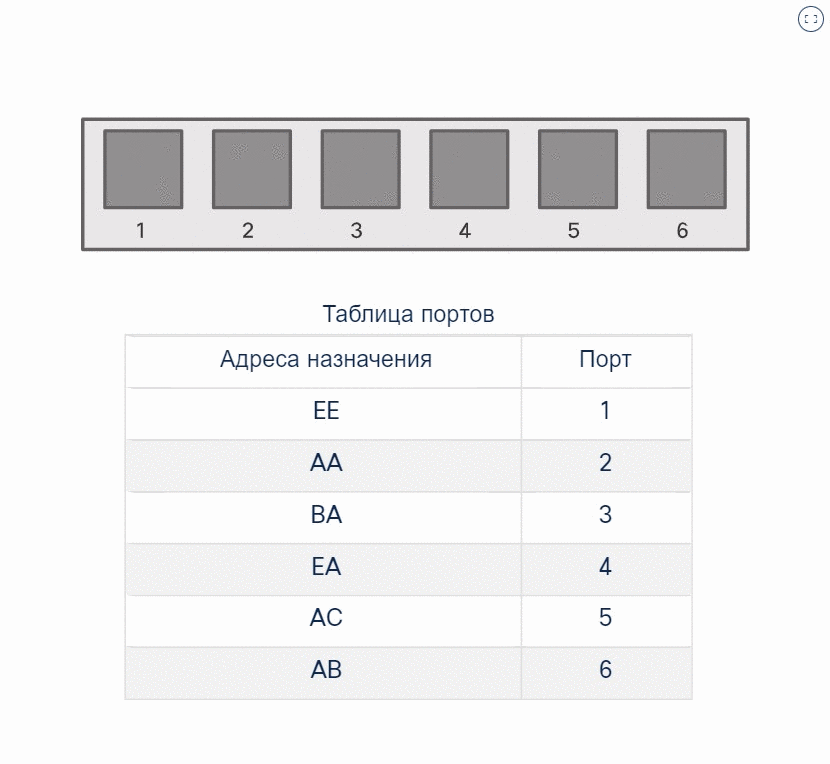
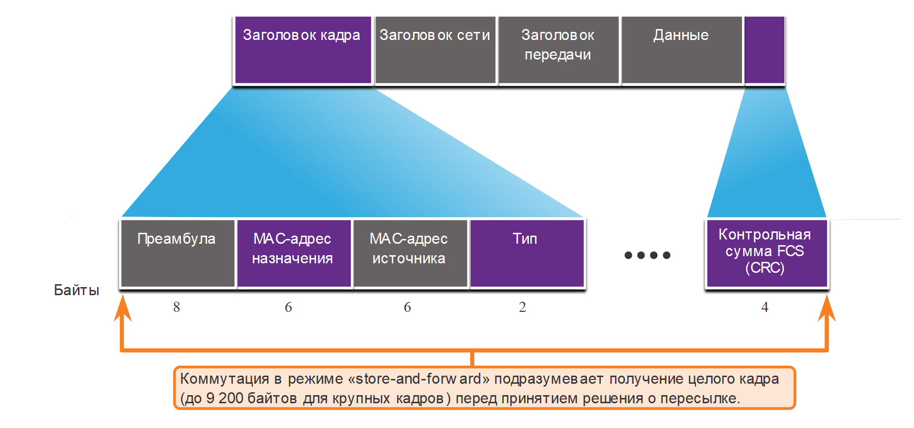
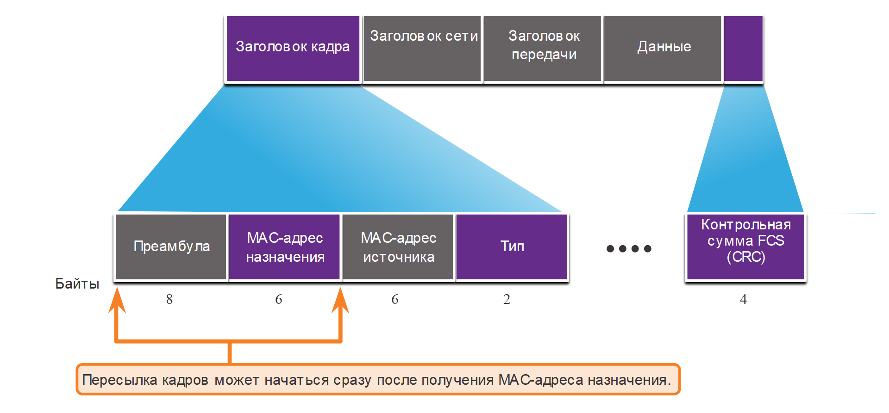

<!-- 2.1.1 -->
## Коммутация в сети

Концепция коммутации и пересылки кадров универсальна для сетевых и телекоммуникационных технологий. В локальной, глобальной и телефонной сетях используются различные типы коммутаторов.

Решение о том, как коммутатор пересылает трафик, принимается в зависимости от потока трафика. Есть два термина, связанные с входом и выходом кадров из интерфейса:

* Термин **входной** используется для описания порта, через который кадр входит в устройство.
* Термин **выходной** используется для описания кадров, которые покидают устройство из определенного порта.

Коммутатор LAN ведет таблицу, с помощью которой определяет, как пересылать трафик через коммутатор. Единственный интеллектуальной способностью сетевого коммутатора является его способность использовать свою таблицу для пересылки трафика. Сетевой коммутатор пересылает трафик на основе входного порта и MAC-адреса назначения кадра Ethernet. В случае с коммутатором LAN есть только одна таблица коммутации, которая описывает строгую связь между MAC адресами и портами; поэтому кадр Ethernet с данным адресом назначения всегда покидает коммутатор из одного и того же выходного порта, независимо от порта, через который оно входит.

**Примечание**: Кадр Ethernet никогда не будет перенаправлен на тот же порт, с которого он был получен.

Нажмите кнопку «Воспроизведение», чтобы просмотреть анимацию, иллюстрирующую процесс коммутации.

<!--
показывает прямоугольник для идентификации коммутатора с 6 нумерованными квадратами для 6 коммутационных портов. Таблица MAC-адресов показывает MAC-адрес, зарегистрированный на каждый номер порта
-->

<!-- 2.1.2 -->
## Таблица MAC-адресов коммутатора

Коммутатор состоит из интегральных схем и соответствующего программного обеспечения, с помощью которого данные проходят через коммутатор. Коммутаторы используют MAC-адреса назначения для направления сетевых трафика через коммутатор на соответствующий порт к месту назначения.

Для того чтобы коммутатор знал, какой порт использовать для передачи кадра, он должен сначала узнать, какие устройства существуют на каждом порте. По мере того как коммутатор узнает о связи портов и устройств, он создает таблицу МАС-адресов. Эта таблица хранится в таблицу ассоциативной памяти (CAM), которая является особым типом памяти, используемой в высокоскоростных поисковых приложениях. По этой причине таблица MAC-адресов иногда называется таблицей CAM.

Коммутаторы LAN определяют способ обработки входящих кадров путем ведения таблицы MAC-адресов. Коммутатор заполняет свою таблицу MAC-адресов путем записи исходного MAC-адреса каждого устройства, подключенного к каждому из его портов. Коммутатор ссылается на данные из таблицы МАС-адресов для отправления кадров, предназначенных для конкретного устройства из порта, который был назначен этому устройству.

<!-- 2.1.3 -->
## Получение информации и пересылка коммутатором

При поступлении каждого кадра Ethernet на коммутатор выполняется следующий двухэтапный процесс.

**Шаг 1. Обучение - Изучение MAC-адреса источника**

При каждом поступлении кадра в коммутатор выполняется проверка на наличие новой информации. Проверяется MAC-адрес источника, указанный в кадре, и номер порта, по которому кадр поступает в коммутатор.

* Если MAC-адрес источника не существует в таблице MAC-адресов, MAC-адрес и номер входящего порта добавляются в таблицу.
* Если MAC-адрес источника уже существует, коммутатор обновляет таймер обновления для этой записи. По умолчанию на большинстве коммутаторов Ethernet данные в таблице хранятся в течение 5 минут. Если MAC-адрес источника указан в таблице, но с другим портом, коммутатор считает эту запись новой. Запись заменяется на тот же MAC-адрес, но с более актуальным номером порта.

**Шаг 2. Ппересылка - проверка MAC-адреса получателя**

Если MAC-адрес назначения является адресом одноадресной рассылки, коммутатор ищет совпадение между MAC-адресом назначения кадра и записью в таблице MAC-адресов:

* Если MAC-адрес назначения есть в таблице, коммутатор пересылает кадр через указанный порт.
* Если MAC-адреса назначения нет в таблице, коммутатор пересылает кадр через все порты, кроме входящего порта. Это называется одноадресной рассылкой неизвестному получателю. Если MAC-адрес назначения является адресом широковещательной или многоадресной рассылки, коммутатор также пересылает кадр через все порты, кроме входящего.

<!-- 2.1.4 -->
## Видео: таблицы MAC-адресов на подключенных друг к другу коммутаторах

Нажмите кнопку Play (Воспроизведение), чтобы просмотреть видеоролик о построении таблиц МАС-адресов в двух соединенных между собой коммутаторах.

<!-- 2.1.5 -->
## Способы пересылки на коммутаторе

Коммутаторы принимают решения о пересылке 2 уровня очень быстро. Это происходит из-за программного обеспечения на специализированных интегральных схемах (ASIC). ASIC сокращают время обработки кадров в устройстве и позволяют устройству управлять увеличенным числом кадров без снижения производительности.

Коммутаторы уровня 2 используют один из двух способов переключения кадров:

* **Метод коммутации с промежуточным хранением** - при использовании этого метода решение о переадресации кадра принимается после получения полного кадра и его проверки на предмет ошибок с помощью математического механизма — циклического избыточного кода (CRC). Коммутация с промежуточным хранением или, используя иной термин, коммутация в режиме «store-and-forward», является основным методом коммутации локальной сети Cisco.
* **Метод сквозной коммутации** - при сквозной коммутации процесс пересылки начинается после определения МАС-адреса назначения входящего кадра и входного порта.

<!-- 2.1.6 -->
## Коммутация с промежуточным хранением (store-and-forward)

Коммутация с промежуточным хранением, в отличие от сквозной коммутации, имеет следующие две основные характеристики:

* **Проверка ошибок** - После получения всего кадра коммутатор сравнивает значение проверочной последовательности кадра (FCS), приведенное в последнем поле, с собственными расчетами FCS. FCS — это процесс выявления ошибок, который позволяет убедиться в том, что кадр свободен от физических и канальных ошибок. Коммутатор пересылает кадр, если не выявил в нем ошибок. В противном случае кадр отбрасывается.
* **Автоматическая буферизация** - Процесс буферизации на входном порте, используемый коммутаторами с промежуточным хранением, обеспечивает гибкость для поддержки любых скоростей Ethernet. Например, обработка входящего кадра, передаваемого в порт Ethernet 100 Мбит/с и предназначенного для отправки в интерфейс 1 Гбит/с, потребует использования коммутации с промежуточным хранением. С любым несоответствием в скорости между входным и выходным портами коммутатор сохраняет весь кадр в буфере, проверяет FCS, пересылает его в буфер выходного порта и затем отправляет его.

На рисунке показано, как коммутация с промежуточным хранением принимает решение на основе кадра Ethernet.

<!-- /courses/srwe-dl/af9ea782-34fe-11eb-b1b2-9b1b0c1f7e0d/afb5b1f2-34fe-11eb-b1b2-9b1b0c1f7e0d/assets/c9821832-1c27-11ea-af09-3b2e6521927c.svg -->

<!--
показывает диаграмму кадра ethernet и подчеркивает тот факт, что при методе с промежуточным хранением коммутатор считывает весь кадр, включая все заголовки, данные и последовательность проверки кадров перед переадресацией
-->

<!-- 2.1.7 -->
## Сквозная коммутация (Cut-Through)

Метод коммутации с промежуточным хранением удаляет кадры, которые не проходят проверку FCS. Таким образом он не пересылает недопустимые кадры.

И наоборот, в режиме сквозной коммутации возможна пересылка недопустимых кадров, поскольку проверка FCS не выполняется. Тем не менее, сквозная коммутация имеет возможность выполнять быстрое переключение кадров. Как показано на рисунке, коммутатор может принимать решение о пересылке сразу после нахождения МАС-адреса назначения кадра в своей таблице МАС-адресов.

<!-- /courses/srwe-dl/af9ea782-34fe-11eb-b1b2-9b1b0c1f7e0d/afb5b1f2-34fe-11eb-b1b2-9b1b0c1f7e0d/assets/c982db81-1c27-11ea-af09-3b2e6521927c.svg -->

<!--
показывает диаграмму кадра Ethernet и подчеркивает тот факт, что при переключении коммутатор может перенаправлять кадр после считывания MAC-адреса назначения
-->

Коммутатору не нужно ждать остальной части кадра, поступающей через входной порт, прежде чем принять решение о пересылке.

Бесфрагментный режим коммутации — это модифицированная форма сквозной коммутации, в которой коммутатор начинает переадресацию кадра только после того, как он прочитал поле Тип. В бесфрагментном режиме коммутации ошибки выявляются лучше, чем в режиме сквозной коммутации, при этом задержка при передаче почти не увеличивается.

Благодаря небольшой задержке сквозная коммутация больше подходит для ресурсоемких приложений, выполняющих высокопроизводительные вычисления (HPC), для которых задержка между процессами должна составлять не более 10 микросекунд.

Метод сквозной коммутации позволяет пересылать кадры с ошибками. В случае высокого коэффициента ошибок (недопустимых кадров) в сети сквозная коммутация может негативно сказаться на полосе пропускания, наполняя ее поврежденными и недопустимыми кадрами.

<!-- 2.1.8 -->
<!-- quiz -->

