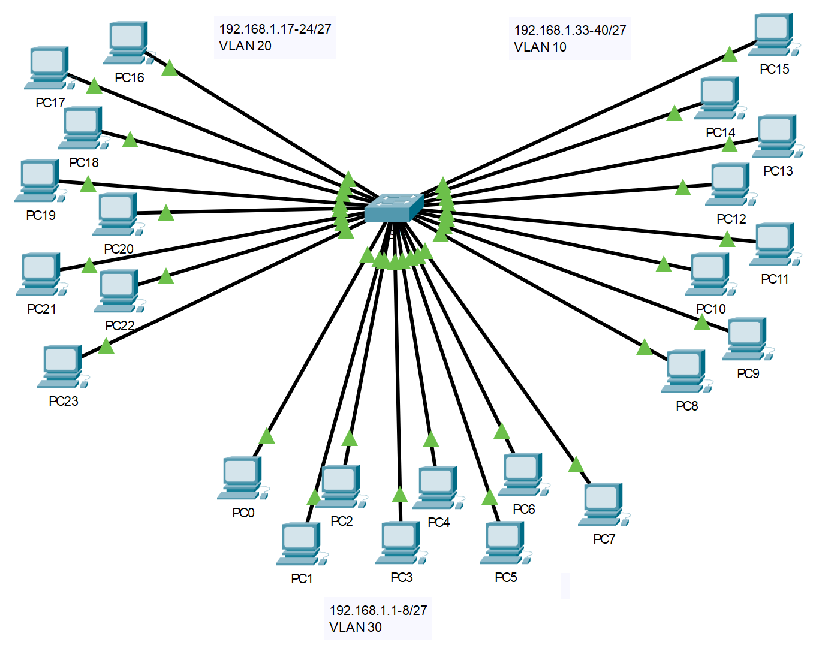

## Топология

## Задачи

Часть 1. Наблюдение за трафиком широковещательной рассылки в сети VLAN

Часть 2. Вопросы на закрепление

## Сценарий

В этом действии 24-портовый коммутатор Catalyst 2960 полностью заполнен. Все порты используются. Вы будете наблюдать широковещательный трафик в реализации VLAN и отвечать на некоторые вопросы.

## Инструкции

### Шаг 1. Используйте эхо-запрос для генерирования трафика.

1.  Нажмите на **PC0** и выберите вкладку Desktop (**Рабочий стол**) \> Command Prompt (**Командная строка**).

2.  Введите команду **ping 192.168.1.8**. Выполнение команды ping должно быть успешным.

    В отличие от сети LAN, сеть VLAN представляет собой домен широковещательной рассылки, создаваемый коммутаторами. В программе Packet Tracer в режиме **Simulation** (Моделирование) с помощью утилиты ping проверьте связь с оконечными устройствами в соответствующих сетях VLAN. Ответьте на вопросы шага 2, основываясь на своих наблюдениях.

### Шаг 2. Наблюдение за трафиком широковещательной рассылки в сети VLAN

1.  Перейдите в режим **моделирования**.

2.  Нажмите кнопку **Edit Filters (Редактировать фильтры)** в Simulation Panel (Панель моделирования). Снимите флажок с пункта Show All/None (**Показывать все/ничего**). Установите флажок в поле **ICMP**.

3.  Выберите средство **Add Complex PDU** (Добавить сложный PDU) — это значок открытого конверта на панели справа.

4.  Наведите указатель мыши на топологию, и курсор примет вид конверта со знаком «плюс» (+).

5.  Нажмите на **PC0**, чтобы он выполнял роль источника для данного тестового сообщения. После этого откроется диалоговое окно Add Complex PDU (**Создать сложный PDU**). Введите следующие значения:

    -   IP-адрес узла-назначения: 255.255.255.255 (широковещательный адрес)

    -   Порядковый номер: 1

    -   Время однократного события: 0

    По умолчанию параметр **Select Application** (Выбрать приложение) в настройках PDU имеет значение PING.

    Вопрос: Назовите не менее трех других доступных приложений.

    **Введите ваш ответ здесь.**

6.  Нажмите **Create PDU** (Создать PDU). Этот тестовый пакет широковещательной рассылки теперь появится в **Simulation Panel Event List** (Список событий панели моделирования). Пакет также появится в окне PDU List (Список PDU). Это первая единица данных протокола (PDU) для Сценария 0.

7.  Дважды нажмите **Capture/Forward** (Захватить/вперед).

    Вопрос: Что произошло с пакетом?

    **Введите ваш ответ здесь.**

8.  Повторите действия для **PC8** и **PC16**.

## Вопросы для повторения

1.  Если компьютер в сети VLAN 10 отправляет широковещательное сообщение, какие устройства его получат?

    **Введите ваш ответ здесь.**

2.  Если компьютер в сети VLAN 20 отправляет широковещательное сообщение, какие устройства его получат?

    **Введите ваш ответ здесь.**

3.  Если компьютер в сети VLAN 30 отправляет широковещательное сообщение, какие устройства его получат?

    **Введите ваш ответ здесь.**

4.  Что происходит с кадром, отправленным с компьютера сети VLAN 10 на компьютер сети VLAN 30?

    **Введите ваш ответ здесь.**

5.  Какие порты включаются на коммутаторе, если компьютер, подключенный к порту 11, отправляет одноадресное сообщение на компьютер, подключенный к порту 13?

    **Введите ваш ответ здесь.**

6.  Какие порты включаются на коммутаторе, если компьютер, подключенный к порту 2, отправляет одноадресное сообщение на компьютер, подключенный к порту 23?

    **Введите ваш ответ здесь.**

7.  Что представляют собой коллизионные домены на коммутаторе применительно к портам?

    **Введите ваш ответ здесь.**

8.  Что представляют собой широковещательные домены на коммутаторе применительно к портам?

    **Введите ваш ответ здесь.**

[Скачать файл Packet Tracer для локального запуска](./assets/3.1.4-lab.pka)
