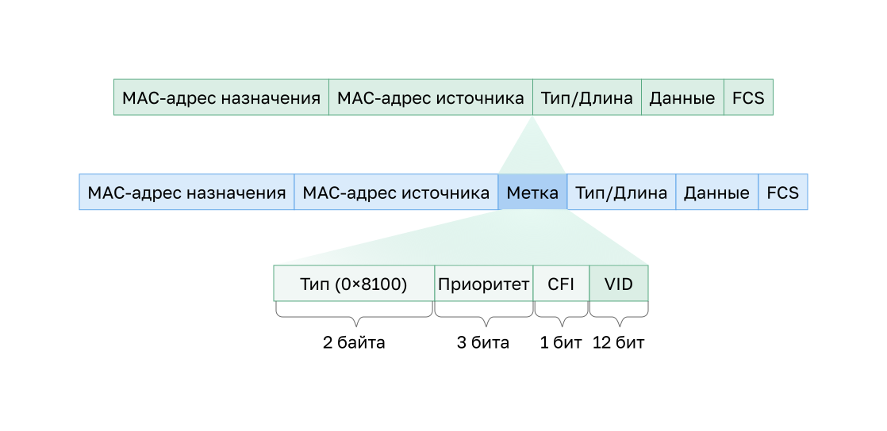

<!-- 3.2.1 -->
## Определение магистральных каналов  VLAN

VLAN не были бы очень полезны без транков. **VLAN-транки** позволяют передавать весь трафик между коммутаторами. За счет этого устройства, подключенные к различным коммутаторам, но в одной и той же VLAN, могут взаимодействовать без прохождения через роутер.

**Магистраль сетей VLAN (транк)** — это двухточечный канал связи, который обслуживает более одной сети. Транк VLAN расширяет сети VLAN. Cisco поддерживает IEEE 802.1Q для координации магистралей на интерфейсах Fast Ethernet, Gigabit Ethernet и 10-Gigabit Ethernet.

Транк VLAN не принадлежит определенной сети. Вместо этого он является каналом для нескольких VLAN между коммутаторами и роутерами. Кроме того, магистраль может использоваться между сетевым устройством и сервером или другим устройством, оснащенным соответствующим сетевым адаптером 802.1Q. По умолчанию на коммутаторе Cisco Catalyst все VLAN поддерживаются на магистральном порту.

На чертеже подвечены линии связи между коммутаторами S1 и S2 и S1 и S3 сконфигурированы для передачи трафика, поступающего из VLAN 10, 20, 30 и 99 (т.е. собственной VLAN) по сети. Данная сеть не сможет работать без магистралей VLAN.


<!-- 3.2.2 -->
## Сеть без VLAN

Когда коммутатор получает широковещательный кадр на одном из своих портов, он перенаправляет его на все остальные, кроме того, на который была получена широковещательная передача. В анимации вся сеть настроена в одной подсети (172.17.40.0/24), а VLAN не настроены. В результате, когда компьютер факультета (PC1) отправляет широковещательный кадр, коммутатор S2 передает его из всех своих портов. В конечном итоге вся сеть получает широковещательную рассылку, поскольку сеть является широковещательным доменом.


<!-- 3.2.3 -->
## Сеть с VLAN

Посмотрите, как одна и та же сеть теперь сегментирована с использованием двух VLAN. Устройства факультета назначаются VLAN 10, а студенческие устройства — VLAN 20. Когда широковещательный кадр отправляется с преподавательского компьютера PC1 для переключения S2, коммутатор перенаправляет его только на те порты коммутатора, которые настроены для поддержки VLAN 10.


Порты, входящие в соединение между коммутаторами S2 и S1 (порты F0/1) и между S1 и S3 (порты F0/3), являются магистральными и настроены на поддержку всех VLAN в сети.

Когда S1 принимает широковещательный кадр через порт F0/1, S1 пересылает его из единственного другого порта, настроенного для поддержки VLAN 10, который является портом F0/3. Получив этот кадр на порте F0/3, коммутатор S3 пересылает его из другого порта, настроенного для поддержки сети VLAN 10, т.е. из порта F0/11. Кадр широковещательной передачи поступает на единственный другой компьютер в сети, настроенный в VLAN 10, который является компьютером преподавательского состава PC4.

Когда VLAN реализованы на коммутаторе, передача одноадресного, многоадресного и широковещательного трафика от хоста в конкретной VLAN ограничивается устройствами, которые в ней находятся.

<!-- 3.2.4 -->
## Идентификация сети VLAN с помощью меток.

Стандартный заголовок фрейма Ethernet не содержит информации о VLAN, к которой принадлежит кадр. Поэтому при размещении кадров Ethernet в магистрали необходимо добавить информацию о VLAN, к которым они принадлежат. Этот процесс, называемый маркировка, выполняется с помощью заголовка IEEE 802.1Q, указанного в стандарте IEEE 802.1Q. Заголовок 802.1Q включает в себя 4-байтовый тег, вставленный в исходный заголовок фрейма Ethernet, определяющий VLAN, к которой принадлежит фрейм.

Когда коммутатор получает кадр на порте, настроенном в режиме доступа с назначенной сетью VLAN, он добавляет в его заголовок тег VLAN, заново вычисляет проверочную последовательность (FCS) и отправляет этот тегированный кадр из магистрального порта.

**Подробнее о поле тега VLAN**

Как показано на рисунке, информационное поле управления тегами VLAN состоит из полей **Type**, **Priority**, **Canonical Format Identifier** и **VLAN ID**.

* **Тип** — это 2-байтовое значение, которое называется значением идентификатора протокола тегирования (TPID). Для Ethernet установлено шестнадцатеричное значение 0x8100.
* **User priority** — 3-битное значение, которое поддерживает реализацию уровня или сервиса.
* **Canonical Format Identifier (CFI)** — 1-битный идентификатор, который обеспечивает передачу кадров Token Ring по каналам Ethernet.
* **VLAN ID (VID)** — 12-разрядный идентификационный номер VLAN, поддерживающий до 4096 идентификаторов VLAN.

После того, как коммутатор вставляет поля информации управления тегами, он пересчитывает значения FCS и вставляет новые в кадр.




<!-- 3.2.5 -->
## VLAN с нетегированным трафиком и тегирование по протоколу 802.1Q

Стандарт IEEE 802.1Q определяет собственную VLAN для магистральных каналов, для которой по умолчанию используется VLAN 1. Когда кадр без тегов поступает на магистральный порт, он назначается собственной VLAN. Кадры управления, отправляемые между коммутаторами, являются примером трафика, который обычно не помечен. Если канал между двумя коммутаторами является магистральным, коммутатор отправляет непомеченный трафик на собственную VLAN.

**Тегированные кадры в сети native VLAN**

Некоторые устройства, поддерживающие транкинг, добавляют тег VLAN в пакеты с нетегированным трафиком. Управляющий трафик, отправляемый в сети Native VLAN, тегировать не следует. Если магистральный порт 802.1Q получает тегированный кадр с таким же идентификатором, как у сети VLAN с нетегированным трафиком, он отбрасывает этот кадр. При настройке порта коммутатора Cisco настраивайте устройства таким образом, чтобы они не отправляли тегированные кадры по сети VLAN с нетегированным трафиком. Устройства других производителей, поддерживающие помеченные кадры в собственной VLAN, включают IP-телефоны, серверы, роутеры и коммутаторы, отличные от Cisco.

**Нетегированные кадры в сети Native VLAN**

Когда магистральный порт коммутатора Cisco получает кадры без тегов (которые являются необычными для хорошо спроектированной сети), он пересылает эти кадры в собственную VLAN. Если нет устройств, связанных с собственной VLAN (что является обычным) и нет других магистральных портов (что тоже является обычным), кадр отбрасывается. Сетью VLAN с нетегированным трафиком по умолчанию является сеть VLAN 1. При настройке магистрального порта 802.1Q значение собственного идентификатора VLAN ID (PVID) назначается по умолчанию. Весь непомеченный трафик, поступающий в порт 802.1Q или исходящий из него, перенаправляется на основе значения PVID. Например, если VLAN 99 настроена как собственная сеть, PVID равно 99 и весь непомеченный трафик перенаправляется в VLAN 99. Если встроенная VLAN не была перенастроена, для параметра PVID устанавливается значение VLAN 1.

На рисунке PC1 подключен концентратором к магистральному каналу 802.1Q.


PC1 отправляет нетегированный трафик, который коммутаторы связывают с сетью VLAN с нетегированным трафиком, настроенной на магистральных портах, и пересылают его соответствующим образом. Отбрасывается трафик с тегами на магистрали, получаемый PC1. Этот сценарий отражает плохое проектирование сети по нескольким причинам: он использует концентратор; у него есть хост, подключенный к магистральному каналу; коммутаторы имеют порты доступа, назначенные собственной VLAN. В этом сценарии также показано, что для поддержки устаревших сценариев необходима спецификация IEEE 802.1Q для VLAN с нетегированным трафиком.

<!-- 3.2.6 -->
## Тегирование голосовой VLAN

Для поддержки передачи голоса по IP (VoIP) требуется отдельная голосовая сеть VLAN. Это позволяет применять к голосовому трафику политики качества обслуживания (QoS) и безопасности.

Каждый IP-телефон необходимо подключать напрямую к порту коммутатора. IP-хост может подключиться к IP-телефону, чтобы получить сетевое соединение. Для порта доступа, к которому подключен IP-телефон Cisco, можно настроить использование двух отдельных сетей VLAN: одна поддерживает голосовой трафик, а другая передает данные VLAN для поддержки трафика хоста. Связь между коммутатором и IP-телефоном имитирует магистральную связь для передачи голосового трафика VLAN и трафика VLAN данных.

IP-телефон содержит встроенный 3-портовый коммутатор 10/100. Порты обеспечивают выделенные подключения к следующим устройствам:

* порт 1 подключается к коммутатору или другому устройству VoIP;
* порт 2 — это внутренний интерфейс 10/100, через который передается трафик IP-телефона;
* порт 3 (порт доступа) подключается к ПК или другому устройству.

Порт доступа коммутатора отправляет пакеты CDP, инструктируя подключенный IP-телефон отправлять голосовой трафик одним из трех способов. Используемый метод варьируется в зависимости от типа трафика:

* в голосовой VLAN, тегированной значением приоритета класса обслуживания (CoS) уровня 2;
* в сети VLAN доступа, тегированной значением приоритета CoS уровня 2;
* в нетегированной VLAN доступа (без значения приоритета CoS уровня 2).

На рисунке студенческий компьютер PC5 подключен к IP-телефону Cisco, а телефон подключен к коммутатору S3. VLAN 150 предназначен для передачи голосового трафика, в то время как PC5 находится в VLAN 20, которая используется для данных студентов.


<!-- 3.2.7 -->
## Пример проверки голосовой VLAN

Приводится пример выходных данных для команды **show interface fa0/18 switchport**. В рамках данного курса не рассматриваются команды Cisco IOS для голосовой связи, но в выделенных областях в примере выводимых данных показан интерфейс F0/18, настроенный с VLAN для данных (VLAN 20) и для голосовой связи (VLAN 150).

```
S1# show interfaces fa0/18 switchport  
Name: Fa0/18
Switchport: Enabled
Administrative Mode: static access
Operational Mode: static access
Administrative Trunking Encapsulation: negotiate
Operational Trunking Encapsulation: native
Negotiation of Trunking: Off
Access Mode VLAN: 20 (student) 
Trunking Native Mode VLAN: 1 (default)
Administrative Native VLAN tagging: enabled
Voice VLAN: 150 (voice) 
```

