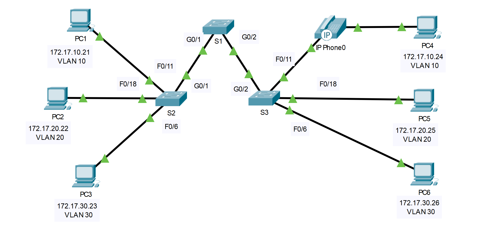

## Топология



## Таблица адресации

| Устройство | Интерфейс | IP-адрес     | Маска подсети | VLAN |
|------------|-----------|--------------|---------------|------|
| PC1        | NIC       | 172.17.10.21 | 255.255.255.0 | 10   |
| PC2        | NIC       | 172.17.20.22 | 255.255.255.0 | 20   |
| PC3        | NIC       | 172.17.30.23 | 255.255.255.0 | 30   |
| PC4        | NIC       | 172.17.10.24 | 255.255.255.0 | 10   |
| PC5        | NIC       | 172.17.20.25 | 255.255.255.0 | 20   |
| PC6        | NIC       | 172.17.30.26 | 255.255.255.0 | 30   |

## Задачи

Часть 1. Проверка конфигурации VLAN, установленной по умолчанию

Часть 2. Настройка сетей VLAN

Часть 3. Назначение сетей VLAN портам

## Общие сведения

Сети VLAN удобны в администрировании логических групп, поскольку позволяют легко перемещать, изменять или добавлять участников группы. Главная цель этого задания — создать сети VLAN, присвоить им имена и назначить порты доступа конкретным сетям VLAN.

### Часть 1. Проверка конфигурации VLAN, установленной по умолчанию

**Шаг 1. Отобразите текущие сети VLAN.**

На коммутаторе S1 выполните команду, с помощью которой отображаются все настроенные сети VLAN. По умолчанию все интерфейсы назначены сети VLAN 1.

**Шаг 2. Проверьте подключение между компьютерами в одной и той же сети.**

Обратите внимание, что c каждого компьютера можно отправлять эхо-запрос на другой компьютер, подключенный к той же сети.

-   Проверка связи с помощью утилиты ping компьютера PC1 с PC4 выполняется успешно.

-   Узел PC2 может получить ответ на ping-запрос узлу PC5.

-   Узел PC3 может получить ответ на ping-запрос узлу PC6.

Эхо-запросы к узлам из других сетей выполнены неудачно.

- ответьте на вопрос №1

### Часть 2. Настройка сетей VLAN

**Шаг 1. Создайте сети VLAN на коммутаторе S1 и присвойте им имена.**

1.  Создайте следующие сети VLAN. Имена чувствительны к регистру и должны точно соответствовать требованию:

    -   VLAN 10: Faculty/Staff

        ```
        S1#(config)# vlan 10
        S1#(config-vlan)# name Faculty/Staff
        ```

2.  Create the remaining VLANS.

    -   VLAN 20: Students

    -   VLAN 30: Guest (по умолчанию)

    -   VLAN 99: Management&Native

    -   VLAN 150: VOICE

**Шаг 2. Проверьте конфигурацию сети VLAN.**

- ответьте на вопрос №2

**Шаг 3. Создайте сети VLAN на коммутаторах S2 и S3.**

С помощью тех же команд, что и в шаге 1, создайте такие же сети VLAN и присвойте им имена на коммутаторах S2 и S3.

**Шаг 4. Проверьте конфигурацию сети VLAN.**

### Часть 3. Назначение сетей VLAN портам

**Шаг 1. Назначьте сети VLAN активным портам на коммутаторе S2.**

1.  Настройте интерфейсы в качестве портов доступа и назначьте сети VLAN следующим образом.

    -   VLAN 10: FastEthernet 0/11

        ```
        S1(config)# interface f0/11
        S2(config-if)# switchport mode access
        S2(config-if)# switchport access vlan 10
        ```

1.  Назначьте оставшиеся порты соответствующей VLAN.

    -   VLAN 20: FastEthernet 0/18

    -   VLAN 30: FastEthernet 0/6

**Шаг 2. Назначьте сети VLAN активным портам на коммутаторе S3.**

На коммутаторе S3 используются те же назначения портов доступа к сети VLAN, что и на коммутаторе S2. Настройте интерфейсы в качестве портов доступа и назначьте сети VLAN следующим образом.

-   VLAN 10: FastEthernet 0/11

-   VLAN 20: FastEthernet 0/18

-   VLAN 30: FastEthernet 0/6

**Шаг 3. Назначьте сеть VOICE VLAN интерфейсу FastEthernet 0/11 на коммутаторе S3.**

Как показано в топологии, интерфейс FastEthernet 0/11 коммутатора S3 подключен к IP-телефону Cisco и компьютеру PC4. IP-телефон содержит встроенный 3-портовый коммутатор 10/100. Один порт на телефоне имеет обозначение Switch (Коммутатор) и подключается к интерфейсу F0/4. Другой порт на телефоне обозначен PC (ПК) и подключается к компьютеру PC4. IP-телефон также имеет внутренний порт, который подключается к функциям IP-телефона.

Интерфейс F0/11 на коммутаторе S3 должен быть настроен для поддержки пользовательского трафика, направленного к компьютеру PC4, с использованием сети VLAN 10 и трафика голосовых данных, направленного на IP-телефон, с использованием сети VLAN 150. На интерфейсе также необходимо включить QoS и поддержку значений класса обслуживания (CoS), назначенных IP-телефоном. Для обеспечения приемлемого качества голосовой связи IP-трафика требуется минимальная пропускная способность. Эта команда помогает коммутатору обеспечить этот минимальный объем пропускной способности.

```
S3(config)# interface f0/11
S3(config-if)# mls qos trust cos
S3(config-if)# switchport voice vlan 150
```

**Шаг 4. Проверьте подключение.**

Ранее PC, находящиеся в одной общей сети, могли успешно отправлять эхо-запросы друг другу.

Изучите выходные данные следующей команды на **S2** и ответьте на следующие вопросы, основываясь на ваших знаниях связи между VLANS. Обратите внимание на назначение порта Gig0/1.

```
S2# show vlan brief
VLAN Name Status Ports
---- -------------------------------- --------- -------------------------------
1 default active Fa0/1, Fa0/2, Fa0/3, Fa0/4
                                                Fa0/5, Fa0/7, Fa0/8, Fa0/9
                                                Fa0/10, Fa0/12, Fa0/13, Fa0/14
                                                Fa0/15, Fa0/16, Fa0/17, Fa0/19
                                                Fa0/20, Fa0/21, Fa0/22, Fa0/23
                                                Fa0/24, Gig0/1, Gig0/2
10 Faculty/Staff active Fa0/11
20 Students active Fa0/18
30 Guest(Default) active Fa0/6
99 Management&Native active
150 VOICE active
```

Попытайтесь отправить эхо-запросы между компьютерами PC1 и PC4.

Вопросы:

- ответьте на вопрос №3

- ответьте на вопрос №4

[Скачать файл Packet Tracer для локального запуска](./assets/3.3.12-lab.pka)
