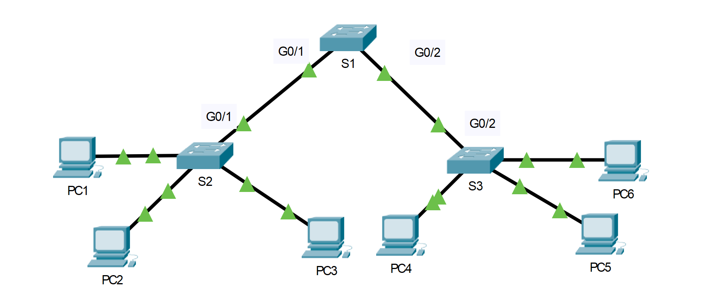

---

> **ВАЖНО**
> 
> Форма для ответов на вопросы будет доступна только при развертывании лабораторной работы 

---

## Топология



## Таблица адресации

| Устройство | Интерфейс       | IP-адрес     | Маска подсети |
|------------|-----------------|--------------|---------------|
| PC1        | NIC             | 192.168.10.1 | 255.255.255.0 |
| PC2        | NIC             | 192.168.20.1 | 255.255.255.0 |
| PC3        | NIC             | 192.168.30.1 | 255.255.255.0 |
| PC4        | NIC             | 192.168.30.2 | 255.255.255.0 |
| PC5        | Сетевой адаптер | 192.168.20.2 | 255.255.255.0 |
| PC6        | Сетевой адаптер | 192.168.10.2 | 255.255.255.0 |
| S1         | VLAN 99         | 192.168.99.1 | 255.255.255.0 |
| S2         | VLAN 99         | 192.168.99.2 | 255.255.255.0 |
| S3         | VLAN 99         | 192.168.99.3 | 255.255.255.0 |

## Цели

-   Настройка статического транкинга

-   Настройка и проверка DTP

## Общие сведения/сценарий

По мере увеличения количества коммутаторов в сети усложняется администрирование и управление сетями VLAN и магистралями. Чтобы упростить некоторые конфигурации VLAN и транкинга, согласование транка между сетевыми устройствами управляется протоколом динамического транкинга (DTP) и автоматически включается на коммутаторах Catalyst 2960 и Catalyst 3650.

В этом задании вы настроите магистральные каналы между коммутаторами. Вы будете назначать порты для VLAN и проверять сквозное соединение между хостами в той же VLAN. Вы настроите магистральные каналы между коммутаторами, а также настроите VLAN 999 как VLAN с нетегированным трафиком.

## Инструкции

### Часть 1. Проверьте конфигурацию сети VLAN.

Проверьте настроенные сети VLAN на коммутаторах.

1.  На S1 перейдите в привилегированный режим EXEC и введите команду **show vlan brief** , чтобы проверить наличие VLAN.

    ```
    S1# show vlan brief
    VLAN Name Status Ports
    ---- -------------------------------- --------- -------------------------------
    1 default active Fa0/1, Fa0/2, Fa0/3, Fa0/4
                                                    Fa0/5, Fa0/6, Fa0/7, Fa0/8
                                                    Fa0/9, Fa0/10, Fa0/11, Fa0/12
                                                    Fa0/13, Fa0/14, Fa0/15, Fa0/16
                                                    Fa0/17, Fa0/18, Fa0/19, Fa0/20
                                                    Fa0/21, Fa0/22, Fa0/23, Fa0/24
                                                    Gig0/1, Gig0/2
    99 Management active
    999 Native active
    1002 fddi-default active
    1003 token-ring-default active
    1004 fddinet-default active
    1005 trnet-default active
    ```

2.  Повторите шаг 1.1 на S2 и S3.

    - ответьте на вопрос №1

### Часть 2. Создайте дополнительные VLAN на S2 и S3.

1.  На S2 создайте сеть VLAN 10 с именем Red.

    ```
    S2(config)# vlan 10
    S2(config-vlan)# name Red
    ```

2.  Создайте сети VLAN 20 и 30 согласно следующей таблице.

    | Номер VLAN | Имя VLAN |
    |------------|----------|
    | 10         | Red      |
    | 20         | Blue     |
    | 30         | Yellow   |

3.  Проверьте успешное добавление новых сетей VLAN. Введите **show vlan brief** в привилегированном режиме EXEC.

    - ответьте на вопрос №2

4.  Повторите предыдущие шаги, чтобы создать дополнительные VLAN на S3.

### Часть 3. Назначение сетей VLAN портам

Используйте команду **switchport mode access**, чтобы задать режим доступа для каналов доступа. Используйте команду **switchport access vlan** *идентификатор-VLAN*, чтобы назначить VLAN для порта доступа.

| Порты | Задания | Сеть |
|---|---|---|
| S2 F0/1 – 8<br>S3 F0/1 – 8 | VLAN 10 (Red) | 192.168.10.0 /24 |
| S2 F0/9 – 16<br>S3 F0/9 – 16 | VLAN 20 (Blue) | 192.168.20.0 /24 |
| S2 F0/17 – 24<br>S3 F0/17 – 24 | VLAN 30 (Yellow) | 192.168.30.0 /24 |

1.  Назначьте сети VLAN портам на S2, используя данную таблицу назначений.

    ```
    S2(config-if)# interface range f0/1 - 8
    S2(config-if-range)# switchport mode access
    S2(config-if-range)# switchport access vlan 10
    S2(config-if-range)# interface range f0/9 -16
    S2(config-if-range)# switchport mode access
    S2(config-if-range)# switchport access vlan 20
    S2(config-if-range)# interface range f0/17 - 24
    S2(config-if-range)# switchport mode access
    S2(config-if-range)# switchport access vlan 30
    ```

2.  Назначьте сети VLAN портам на S3, используя таблицу назначений.

    Теперь, когда у вас есть порты, назначенные VLAN, попробуйте выполнить эхо-запрос с **PC1** на **PC6**.

    - ответьте на вопрос №3

### Часть 4. Настройте транки на коммутаторах S1, S2 и S3.

Динамический протокол транкинга (DTP) управляет магистральными каналами между коммутаторами Cisco. В настоящий момент все коммутационные порты находятся в режиме транкинга по умолчанию, т. е. «dynamic auto». На этом шаге необходимо изменить режим транкинга на «dynamic desirable» для канала между коммутаторами S1 и S2. Для канала между коммутаторами S1 и S3 будет установлен режим статического транка. В этой топологии используйте VLAN 999 в качестве сети VLAN с нетегированным трафиком.

1.  На S1 переведите транк канал в режим «dynamic desirable» на интерфейсе GigabitEthernet 0/1. Конфигурация коммутатора S1 показана ниже.

    ```
    S1(config)# interface g0/1
    S1(config-if)# switchport mode dynamic desirable
    ```

    - ответьте на вопрос №4

2. На коммутаторе S2 убедитесь, что магистраль согласована, введя команду **show interfaces trunk** . Интерфейс GigabitEthernet 0/1 должен появиться на выводе.

    - ответьте на вопрос №5

3. Для магистральной линии связи между S1 и S3 настройте интерфейс GigabitEthernet 0/2 как статический транк до S1. Кроме того, отключите согласование DTP на интерфейсе G0/2 на S1.

    ```
    S1(config)# interface g0/2
    S1(config-if)# switchport mode trunk
    S1(config-if)# switchport nonegotiate
    ```

4. Используйте команду **show dtp** для проверки состояния DTP.

    ```
    S1# show dtp
    Global DTP information
    Sending DTP Hello packets every 30 seconds
    Dynamic Trunk timeout is 300 seconds
    1 interfaces using DTP
    ```

5. Убедитесь, что режим транкинга включен на всех коммутаторах, выполнив команду **show interfaces trunk**.

    ```
    S1# show interfaces trunk
    Port Mode Encapsulation Status Native vlan
    Gig0/1 desirable n-802.1q trunking 1
    Gig0/2 on 802.1q trunking 1

    Port Vlans allowed on trunk
    Gig0/1 1-1005
    Gig0/2 1-1005

    Port Vlans allowed and active in management domain
    Gig0/1 1,99,999
    Gig0/2 1,99,999
    
    Port Vlans in spanning tree forwarding state and not pruned
    Gig0/1 1,99,999
    Gig0/2 1,99,999
    ```

    - ответьте на вопрос №6

6. Настройте VLAN 999 как сеть VLAN с нетегированным трафиком для магистральных каналов на S1.

    ```
    S1(config)# interface range g0/1 - 2
    S1(config-if-range)# switchport trunk native vlan 999
    ```

    - ответьте на вопрос №7

7. На коммутаторах S2 и S3 настройте VLAN 999 как сеть VLAN с нетегированным трафиком.

8. Убедитесь, что режим транкинга успешно настроен на всех коммутаторах. Вы должны успешно отправлять ping-запросы между коммутаторами в топологии, используя IP-адреса, настроенные на интерфейсе SVI.

9. Попытка отправить ping с PC1 на PC6.

    - ответьте на вопрос №8

10. Внесите в конфигурацию необходимые исправления.

### Часть 5. Переконфигурируйте транк на S3.

1. На коммутаторе **S3** выполните команду **show interface trunk**.

    - ответьте на вопрос №9

2. Настройте **G0/2** соответствующий **G0/2** на **S1** .

    - ответьте на вопрос №10

3. Выполните команду «**show interface G0/2 switchport**» на коммутаторе **S3**.

    - ответьте на вопрос №11

### Часть 6. Проверьте сквозное подключение.

1. Из PC1 ping до PC6.

2. Из PC2 ping до PC5.

3. Из PC3 ping до PC4.

[Скачать файл Packet Tracer для локального запуска](./assets/3.5.5-lab.pka)
