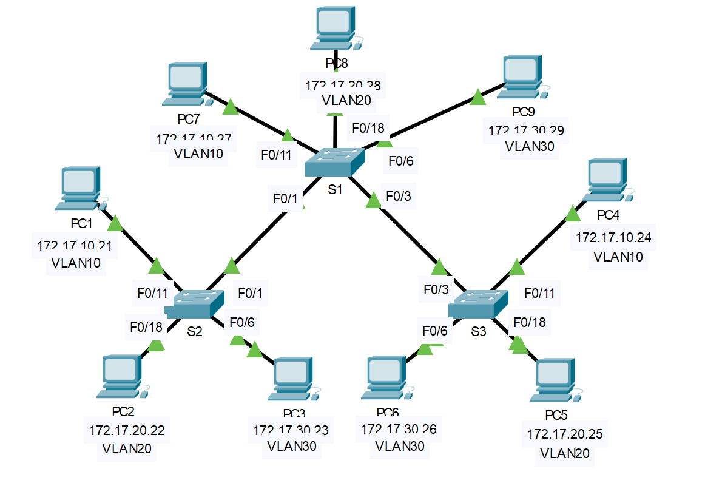

## Топология

## Таблица адресации

| Устройство | Интерфейс | IP-адрес     | Маска подсети | Шлюз по умолчанию |
|------------|-----------|--------------|---------------|-------------------|
| S1         | VLAN 99   | 172.17.99.31 | 255.255.255.0 | —                 |
| S2         | VLAN 99   | 172.17.99.32 | 255.255.255.0 | Н/Д (недоступно)  |
| S3         | VLAN 99   | 172.17.99.33 | 255.255.255.0 | —                 |
| PC1        | NIC       | 172.17.10.21 | 255.255.255.0 | 172.17.10.1       |
| PC2        | NIC       | 172.17.20.22 | 255.255.255.0 | 172.17.20.1       |
| PC3        | NIC       | 172.17.30.23 | 255.255.255.0 | 172.17.30.1       |
| PC4        | NIC       | 172.17.10.24 | 255.255.255.0 | 172.17.10.1       |
| PC5        | NIC       | 172.17.20.25 | 255.255.255.0 | 172.17.20.1       |
| PC6        | NIC       | 172.17.30.26 | 255.255.255.0 | 172.17.30.1       |
| PC7        | NIC       | 172.17.10.27 | 255.255.255.0 | 172.17.10.1       |
| PC8        | NIC       | 172.17.20.28 | 255.255.255.0 | 172.17.20.1       |
| PC9        | NIC       | 172.17.30.29 | 255.255.255.0 | 172.17.30.1       |

## Задачи

Часть 1. Наблюдение за трафиком широковещательной рассылки в сети VLAN

Часть 2. Наблюдение за трафиком широковещательной рассылки без сетей VLAN

## Общие сведения

В этом упражнении необходимо отслеживать пересылку широковещательного трафика через коммутаторы при сконфигурированных и не сконфигурированных VLAN.

## Инструкции

### Часть 1. Наблюдение за трафиком широковещательной рассылки в сети VLAN

**Шаг 1. Отправьте эхо-запрос от PC1 на PC6.**

1.  Дождитесь, когда все индикаторы состояния каналов загорятся зеленым цветом. Для ускорения процесса нажмите кнопку **Fast Forward Time** (Ускорить), расположенную на нижней панели инструментов желтого цвета.

2.  Нажмите на вкладку **Simulation (Симулирование)** и используйте инструмент Add Simple PDU (**Добавить простой PDU**). Нажмите кнопку **PC1**, а затем нажмите кнопку **PC6**.

3.  Нажмите на кнопку **Сapture/Forward (Захват/Вперед)**, чтобы перейти к следующему шагу. Понаблюдайте за прохождением ARP-запросов по сети. При появлении окна Buffer Full (Буфер переполнен) нажмите кнопку **View Previous Events** (Просмотреть предыдущие события).

    Вопросы:

    Успешно ли выполнена проверка связи? Дайте пояснение.

    **Введите ваш ответ здесь.**

    Взгляните на Simulation Panel (Панель моделирования) и скажите, куда коммутатор **S3** отправил пакет после того, как получил его?

    **Введите ваш ответ здесь.**

При нормальной эксплуатации, когда коммутатор получает широковещательный кадр на одном из своих портов, он пересылает кадр из всех портов. Обратите внимание, что коммутатор **S2** отправляет ARP-запрос из интерфейса Fa0/1 на коммутатор **S1**. Также обратите внимание, что коммутатор **S3** отправляет ARP-запрос из интерфейса Fa0/11 на коммутатор **S4**. Узлы **PC1** и **PC4** принадлежат сети VLAN 10. Узел **PC6** принадлежит сети VLAN 30. Поскольку широковещательный трафик находится в пределах сети VLAN, узел **PC6** не может получить ARP-запрос от узла **PC1**. Поскольку узел **PC4** не является пунктом назначения, он отбрасывает ARP-запрос. Эхо-запрос от узла **PC1** не удался, потому что **PC1** не может получить ARP-ответ.

**Шаг 2. Отправьте эхо-запрос от PC1 на PC4.**

1.  Нажмите на кнопку **New (Создать)** под раскрывающейся вкладкой Scenario 0 (Сценарий 0). Теперь щелкните значок **Add Simple PDU** (Добавить простой PDU) в правой части Packet Tracer и с помощью утилиты ping проверьте связь компьютера **PC1** c **PC4**.

2.  Нажмите на кнопку **Сapture/Forward (Захват/Вперед)**, чтобы перейти к следующему шагу. Понаблюдайте за прохождением ARP-запросов по сети. При появлении окна Buffer Full (Буфер переполнен) нажмите кнопку **View Previous Events** (Просмотреть предыдущие события).

    Вопрос: Успешно ли выполнена проверка связи? Дайте пояснение.

    **Введите ваш ответ здесь.**

3.  Изучите Simulation Panel (Панель моделирования).

    Вопрос: Почему коммутатор **S1**, получив пакет, пересылает его на узел **PC7**?

    **Введите ваш ответ здесь.**

### Часть 2. Наблюдение за трафиком широковещательной рассылки без сетей VLAN

**Шаг 1. Очистите настройки на всех трех коммутаторах и удалите базу данных VLAN.**

1.  Вернитесь в режим реального времени (**Realtime**).

2.  Удалите загрузочную конфигурацию на всех трех коммутаторах.

    Вопросы:

    Какая команда используется для удаления загрузочной конфигурации на коммутаторах?

    **Введите ваш ответ здесь.**

    Где на коммутаторах хранится файл сети VLAN?

    **Введите ваш ответ здесь.**

3.  Удалите файл VLAN на всех трех коммутаторах.

    Вопрос: С помощью какой команды можно удалить файл сети VLAN на коммутаторах?

    **Введите ваш ответ здесь.**

**Шаг 2. Перезагрузите коммутаторы.**

Чтобы сбросить все настройки коммутаторов, используйте команду **reload** в исполнительском режиме EXEC. Дождитесь, когда весь канал загорится зеленым цветом. Для ускорения процесса нажмите кнопку **Fast Forward Time** (Ускорить), расположенную на нижней панели инструментов желтого цвета.

**Шаг 3. Нажмите кнопку Capture/Forward (Захват/Вперед), чтобы отправить ARP-запросы и проверить связь с помощью утилиты ping.**

1. После того как коммутаторы перезагрузятся, а индикатор состояния канала загорится зеленым, сеть будет готова к пересылке ваших ARP- и эхо-запросов.

2. Выберите **Scenario 0 (Сценарий 0)** в раскрывающейся вкладке, чтобы вернуться к сценарию 0.

3. В режиме **Simulation (Моделирование)** нажмите на кнопку **Capture/Forward (Захват/Вперед)**, чтобы перейти к следующему шагу. Обратите внимание, что теперь коммутаторы пересылают ARP-запросы из всех портов, кроме порта, на котором ARP-запрос был получен. Подобное поведение коммутаторов демонстрирует, каким образом сети VLAN могут повышать производительность сети. Широковещательный трафик находится в пределах каждой сети VLAN. При появлении окна **Buffer Full** (Буфер заполнен) нажмите на кнопку **View Previous Events** (Просмотреть предыдущие события).

## Вопросы для повторения

1.  Если компьютер в сети VLAN 10 отправляет широковещательное сообщение, какие устройства его получат?

    **Введите ваш ответ здесь.**

2.  Если компьютер в сети VLAN 20 отправляет широковещательное сообщение, какие устройства его получат?

    **Введите ваш ответ здесь.**

3.  Если компьютер в сети VLAN 30 отправляет широковещательное сообщение, какие устройства его получат?

    **Введите ваш ответ здесь.**

4.  Что происходит с кадром, отправленным с компьютера сети VLAN 10 на компьютер сети VLAN 30?

    **Введите ваш ответ здесь.**

5.  Что представляют собой коллизионные домены на коммутаторе применительно к портам?

    **Введите ваш ответ здесь.**

6.  Что представляют собой широковещательные домены на коммутаторе применительно к портам?

    **Введите ваш ответ здесь.**

[Скачать файл Packet Tracer для локального запуска](./assets/3.2.8-packet-tracer---investigate-a-vlan-implementation_ru-RU.pka)
