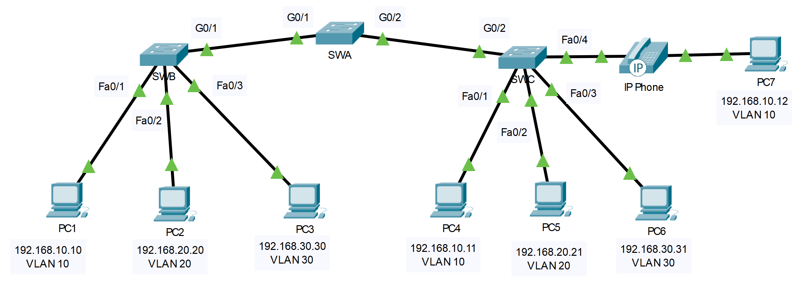

## Топология

## Таблица адресации

| Устройство | Интерфейс | IP-адрес | Маска подсети | Порт коммутатора | VLAN |
|---|---|---|---|---|---|
| PC1 | NIC | 192.168.10.10 | 255.255.255.0 | SWB F0/1 | VLAN 10 |
| PC2 | NIC | 192.168.20.20 | 255.255.255.0 | SWB F0/2 | VLAN 20 |
| PC3 | NIC | 192.168.30.30 | 255.255.255.0 | SWB F0/3 | VLAN 30 |
| PC4 | NIC | 192.168.10.11 | 255.255.255.0 | SWC F0/1 | VLAN 10 |
| PC5 | Сетевой адаптер | 192.168.20.21 | 255.255.255.0 | SWC F0/2 | VLAN 20 |
| PC6 | Сетевой адаптер | 192.168.30.31 | 255.255.255.0 | SWC F0/3 | VLAN 30 |
| PC7 | NIC | 192.168.10.12 | 255.255.255.0 | SWC F0/4 | VLAN 10 VLAN 40 (Voice) |
| SWA | SVI | 192.168.99.252 | 255.255.255.0 | — | VLAN 99 |
| SWB | SVI | 192.168.99.253 | 255.255.255.0 | — | VLAN 99 |
| SWC | SVI | 192.168.99.254 | 255.255.255.0 | — | VLAN 99 |

## Задачи

Часть 1. Настройка сетей VLAN

Часть 2. Назначение сетей VLAN портам

Часть 3. Настройка статического транкинга

Часть 4. Настройка динамического транкинга

## Общие сведения

Вы работаете в компании, которая готовится к развертыванию набора новых коммутаторов 2960 в филиале. В лаборатории вы работаете над тестированием планируемых конфигураций VLAN и магистральных каналов. Настройка и тестирование VLAN и магистральных соединений.

## Инструкции

### Часть 1. Настройка сетей VLAN

Настройте VLAN на всех трех коммутаторах. См. таблицу VLAN. Обратите внимание, что имена VLAN должны точно соответствовать значениям в таблице.

**Таблица VLAN**

| Номер VLAN | Имя VLAN   |
|------------|------------|
| 10         | Admin      |
| 20         | Accounts   |
| 30         | HR         |
| 40         | Voice      |
| 99         | Management |
| 100        | Native     |

### Часть 2. Назначение портов сетям VLAN

**Шаг 1. Назначение портов доступа VLAN**

На SWB и SWC назначьте порты соответствующим VLAN. См. таблицу адресации.

**Шаг 2. Настройка порта голосовой VLAN**

Настройте соответствующий порт на коммутаторе SWC для функции голосовой VLAN.

**Шаг 3. Настройте виртуальный интерфейс управления на коммутаторе.**

1.  Создайте виртуальные интерфейсы управления на всех трех коммутаторах.

2.  Адресация интерфейсов виртуального управления в соответствии с таблицей адресации.

3.  Коммутаторы не должны иметь возможности осуществлять эхо-запрос друг другу.

### Часть 3. Настройка статического транкинга

1.  Настройте статический магистральный канал между SWA и SWB. Отключите динамический транкинг на этом порту.

2.  Отключите DTP на порту коммутатора на обоих концах магистрального канала.

3.  Настройте транк с помощью native VLAN и решите вопросы с native VLAN, если таковые имеются.

### Часть 4. Выполнить настройку протокола DTP (Dynamic Trunking Protocol).

1.  Предположим, что для магистрального порта SWC установлен режим DTP по умолчанию для коммутаторов 2960. Настройте G0/2 на SWA таким образом, чтобы он успешно согласовывал транк с SWC.

2.  Настройте транк с помощью native VLAN и решите вопросы с native VLAN, если таковые имеются.

[Скачать файл Packet Tracer для локального запуска](./assets/3.6.1-packet-tracer---implement-vlans-and-trunking_ru-RU.pka)
