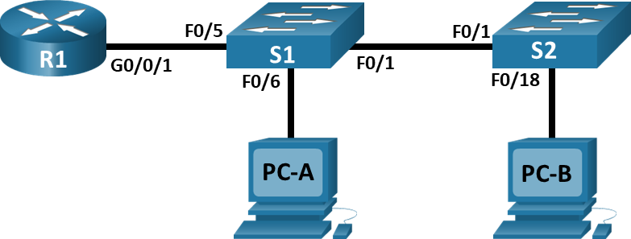

## Топология

## Таблица адресации

| Устройство | Интерфейс | IP-адрес     | Маска подсети | Шлюз по умолчанию |
|------------|-----------|--------------|---------------|-------------------|
| R1         | G0/0/1.3  | 192.168.3.1  | 255.255.255.0 | —                 |
| R1         | G0/0/1.4  | 192.168.4.1  | 255.255.255.0 | —                 |
| R1         | G0/0/1.8  | —            | —             | —                 |
| S1         | VLAN 3    | 192.168.3.11 | 255.255.255.0 | 192.168.3.1       |
| S2         | VLAN 3    | 192.168.3.12 | 255.255.255.0 | 192.168.3.1       |
| PC-A       | NIC       | 192.168.3.3  | 255.255.255.0 | 192.168.3.1       |
| PC-B       | NIC       | 192.168.4.3  | 255.255.255.0 | 192.168.4.1       |

## Таблица VLAN

| VLAN | Имя        | Назначенный интерфейс                                       |
|------|------------|-------------------------------------------------------------|
| 3    | Management | S1: VLAN 3 S2: VLAN 3 S1: F0/6                              |
| 4    | Operations | S2: F0/18                                                   |
| 7    | ParkingLot | S1: F0/2-4, F0/7-24, G0/1-2  S2: F0/2-17, F0/19-24, G0/1-2  |
| 8    | Native     | —                                                           |

## Задачи

**Часть 1. Создание сети и настройка основных параметров устройства**

**Часть 2. Создание сетей VLAN и назначение портов коммутатора**

**Часть 3. Настройка транка 802.1Q между коммутаторами.**

**Часть 4. Настройка маршрутизации между сетями VLAN**

**Часть 5. Проверка работы маршрутизации между VLAN**

## Общие сведения и сценарий

Современные коммутаторы используют виртуальные локальные сети (VLAN) для предоставления услуг сегментации, традиционно предоставляемых маршрутизаторами в конфигурациях LAN. VLAN решают проблемы масштабируемости, безопасности и управления сетью. Сети VLAN облегчают процесс проектирования сети, обеспечивающей помощь в достижении целей организации. Для связи между VLAN требуется устройство, работающее на уровне 3 модели OSI. Маршрутизаторы в топологиях VLAN обеспечивают дополнительную безопасность и управление потоком трафика.

Транковые каналы сети VLAN используются для распространения сетей VLAN по различным устройствам. Транковые каналы разрешают передачу трафика из множества сетей VLAN через один канал, не нанося вред идентификации и сегментации сети VLAN. Особый вид маршрутизации между VLAN, называемый «Router-On-A-Stick», использует магистраль от маршрутизатора к коммутатору, чтобы все VLAN могли переходить к маршрутизатору.

In this lab, you will create VLANs on both switches in the topology, assign VLANs to switch access ports, verify that VLANs are working as expected, create VLAN trunks between the two switches and between S1 and R1, and configure Inter-VLAN routing on R1 to allow hosts in different VLANs to communicate, regardless of which subnet the host resides.

**Примечание:** Маршрутизаторы, используемые в практических лабораторных работах CCNA, - это Cisco 4221 с Cisco IOS XE Release 16.9.4 (образ universalk9). В лабораторных работах используются коммутаторы Cisco Catalyst 2960 с Cisco IOS версии 15.2(2) (образ lanbasek9). Можно использовать другие маршрутизаторы, коммутаторы и версии Cisco IOS. В зависимости от модели устройства и версии Cisco IOS доступные команды и результаты их выполнения могут отличаться от тех, которые показаны в лабораторных работах. Правильные идентификаторы интерфейса см. в сводной таблице по интерфейсам маршрутизаторов в конце лабораторной работы.

**Примечание.** Убедитесь, что у всех маршрутизаторов и коммутаторов была удалена начальная конфигурация. Если вы не уверены, обратитесь к инструктору.

## Необходимые ресурсы

-   1 Маршрутизатор (Cisco 4221 с универсальным образом Cisco IOS XE версии 16.9.4 или аналогичным)
-   2 коммутатора (Cisco 2960 с операционной системой Cisco IOS 15.2(2) (образ lanbasek9) или аналогичная модель)
-   2 ПК (ОС Windows с программой эмуляции терминалов, такой как Tera Term)
-   Консольные кабели для настройки устройств Cisco IOS через консольные порты.
-   Кабели Ethernet, расположенные в соответствии с топологией

## Инструкции

### Часть 1. Создание сети и настройка основных параметров устройства

В первой части лабораторной работы вам предстоит создать топологию сети и настроить базовые параметры для узлов ПК и коммутаторов.

**Шаг 1. Создайте сеть согласно топологии.**

Подключите устройства, как показано в топологии, и подсоедините необходимые кабели.

**Шаг 2. Настройте базовые параметры для маршрутизатора.**

1.  Подключитесь к маршрутизатору с помощью консоли и активируйте привилегированный режим EXEC.
2.  Войдите в режим конфигурации.
3.  Назначьте маршрутизатору имя устройства.
4.  Отключите поиск DNS, чтобы предотвратить попытки маршрутизатора неверно преобразовывать введенные команды таким образом, как будто они являются именами узлов.
5.  Назначьте **class** в качестве зашифрованного пароля привилегированного режима EXEC.
6.  Назначьте **cisco** в качестве пароля консоли и включите вход в систему по паролю.
7.  Назначьте **cisco** в качестве пароля VTY и включите вход в систему по паролю.
8.  Зашифруйте открытые пароли.
9.  Создайте баннер с предупреждением о запрете несанкционированного доступа к устройству.
10. Сохраните текущую конфигурацию в файл загрузочной конфигурации.
11. Настройте на маршрутизаторе время.

**Примечание.** Вопросительный знак (**?**) позволяет открыть справку с правильной последовательностью параметров, необходимых для выполнения этой команды.

**Шаг 3. Настройте базовые параметры каждого коммутатора.**

1.  Подключитесь к коммутатору с помощью консольного подключения и активируйте привилегированный режим EXEC.
2.  Войдите в режим конфигурации.
3.  Присвойте коммутатору имя устройства.
4.  Отключите поиск DNS, чтобы предотвратить попытки маршрутизатора неверно преобразовывать введенные команды таким образом, как будто они являются именами узлов.
5.  Назначьте **class** в качестве зашифрованного пароля привилегированного режима EXEC.
6.  Назначьте **cisco** в качестве пароля консоли и включите вход в систему по паролю.
7.  Установите **cisco** в качестве пароля виртуального терминала и активируйте вход.
8.  Зашифруйте открытые пароли.
9.  Создайте баннер с предупреждением о запрете несанкционированного доступа к устройству.
10. Установите часы на коммутаторе.

**Примечание.** Вопросительный знак (**?**) позволяет открыть справку с правильной последовательностью параметров, необходимых для выполнения этой команды.

11.  Скопируйте текущую конфигурацию в файл загрузочной конфигурации.

**Шаг 4. Настройте узлы ПК.**

Адреса ПК можно посмотреть в таблице адресации.

### Часть 2. Создание сетей VLAN и назначение портов коммутатора

В части 2 на обоих коммутаторах будут созданы VLAN, как указано в таблице выше. Затем вам нужно назначить сети VLAN соответствующему интерфейсу. Для проверки параметров конфигурации используйте команду `show vlan`. Выполните следующие задачи на каждом коммутаторе.

**Шаг 1. Создайте сети VLAN на коммутаторах.**

1.  Создайте необходимые VLAN и назовите их на каждом коммутаторе из приведенной выше таблицы.
2.  Настройте интерфейс управления и шлюз по умолчанию на каждом коммутаторе, используя информацию об IP-адресе в таблице адресации.
3.  Назначьте все неиспользуемые порты на обоих коммутаторах VLAN ParkingLot, настройте их для статического режима доступа и деактивируйте их административно.

**Примечание.** Команда `interface range` полезна для выполнения этой задачи с помощью необходимого количества команд.

**Шаг 2. Назначьте сети VLAN соответствующим интерфейсам коммутатора.**

1.  Назначьте используемые порты соответствующей VLAN (указанной в таблице VLAN выше) и настройте их для режима доступа. Обязательно сделайте это на обоих коммутаторах
2.  Выполните команду `show vlan brief`, чтобы убедиться, что сети VLAN назначены правильным интерфейсам.

### Часть 3. Конфигурация магистрального канала стандарта 802.1Q между коммутаторами

В части 3 вручную настраивается интерфейс F0/1 в качестве магистрального канала.

**Шаг 1. Вручную настройте магистральный интерфейс F0/1.**

1.  Измените режим порта коммутатора на интерфейсе F0/1, чтобы принудительно создать магистральную связь. Не забудьте сделать это на обоих коммутаторах.
2.  В рамках конфигурации магистрали установите для native VLAN значение 8 на обоих коммутаторах. При настройке двух интерфейсов для разных native VLAN сообщения об ошибках могут отображаться временно.
3.  В качестве другой части конфигурации магистрали укажите, что VLAN 3, 4 и 8 могут пересекать магистраль только.
4.  Выполните команду `show interfaces trunk` для проверки портов магистрали, собственной VLAN и разрешенных VLAN через магистраль.

**Шаг 2. Вручную настройте магистральный интерфейс F0/5 на коммутаторе S1.**

1.  Настройте F0/5 на S1 с теми же параметрами магистрали, что и F0/1. Это магистраль к маршрутизатору.
2.  Сохраните текущую конфигурацию в файл стартовой конфигурации на S1 и S2.
3.  Выполните команду `show interfaces trunk`, чтобы убедиться в том, что магистральная линия по-прежнему находится на месте

Вопрос:

Почему F0/5 не отображается в списке магистральных каналов?
**Введите ваш ответ здесь.**

### Часть 4. VLAN на маршрутизаторе

1.  Активируйте интерфейс G0/0/1 на маршрутизаторе.
2.  Настройте подинтерфейсы для каждой VLAN, как указано в таблице IP-адресации. Все подинтерфейсы используют инкапсуляцию 802.1Q. Убедитесь, что подинтерфейс для собственной VLAN не имеет назначенного IP-адреса. Включите описание для каждого подинтерфейса.
3.  С помощью команды `show ip interface brief` проверьте конфигурацию подынтерфейса.

### Часть 5. Проверьте, работает ли маршрутизация между VLAN

**Шаг 1. Пройдите следующие тесты от PC-A. Все должно быть успешным.**

**Примечание.** Возможно, вам придется отключить брандмауэр ПК для работы ping

1.  Отправьте эхо-запрос с PC-A на шлюз по умолчанию.
2.  Отправьте эхо-запрос с PC-A на PC-B.
3.  Отправьте команду` ping` с компьютера PC-A на коммутатор S2.

**Шаг 2. Пройдите следующий тест с PC-B.**

Из командной строки на PC-B выполните команду tracert на адрес PC-A.

Вопрос:

Какие промежуточные IP-адреса отображаются в результатах?
**Введите ваш ответ здесь.**
