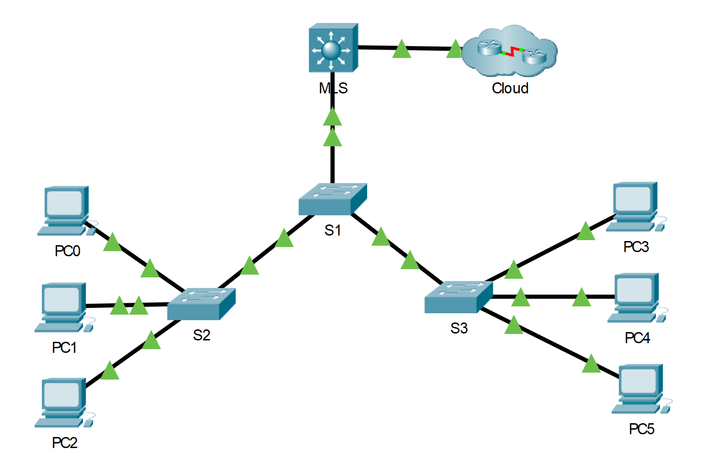

---

> **ВАЖНО**
> 
> Форма для ответов на вопросы будет доступна только при развертывании лабораторной работы 

---

## Топология



## Таблица адресации

| Устройство                | Интерфейс       | IP адрес/префикс       |
|---------------------------|-----------------|------------------------|
| Многоуровневый коммутатор | VLAN 10         | 192.168.10.254/24      |
| Многоуровневый коммутатор | VLAN 10         | 2001:db8:acad:10። 1/64 |
| Многоуровневый коммутатор | VLAN 20         | 192.168.20.254 /24     |
| Многоуровневый коммутатор | VLAN 20         | 2001:db8:acad:20። 1/64 |
| Многоуровневый коммутатор | VLAN 30         | 192.168.30.254/24      |
| Многоуровневый коммутатор | VLAN 30         | 2001:db8:acad:30። 1/64 |
| Многоуровневый коммутатор | VLAN 99         | 192.168.99.254/24      |
| Многоуровневый коммутатор | G0/2            | 209.165.200.225        |
| Многоуровневый коммутатор | G0/2            | 2001:db8:acad:a። 1/64  |
| PC0                       | NIC             | 192.168.10.1           |
| PC1                       | NIC             | 192.168.20.1           |
| PC2                       | NIC             | 192.168.30.1           |
| PC3                       | NIC             | 192.168.10.2/24        |
| PC3                       | NIC             | 2001:db8:acad:10። 2/64 |
| PC4                       | NIC             | 192.168.20.2/24        |
| PC4                       | NIC             | 2001:db8:acad:20። 2/64 |
| PC5                       | Сетевой адаптер | 192.168.30.2           |
| PC5                       | Сетевой адаптер | 2001:db8:acad:10። 2/64 |
| S1                        | VLAN 99         | 192.168.99.1           |
| S2                        | VLAN 99         | 192.168.99.2           |
| S3                        | VLAN 99         | 192.168.99.3           |

## Цели

Часть 1. Настроить коммутацию уровня 3

Часть 2. Настроить маршрутизацию между VLAN

Часть 3. Настроить IPv6-маршрутизацию между VLAN

## Общие сведения и сценарий

Многоуровневый коммутатор, такой как Cisco Catalyst 3650, поддерживает коммутацию второго уровня и маршрутизацию третьего. Одно из преимуществ многоуровневого коммутатора состоит в одновременной поддержке этих двух функций. Для малой или средней компании было бы выгоднее приобрести один многоуровневый коммутатор вместо отдельных сетевых устройств для коммутации и маршрутизации. Возможности многоуровневого коммутатора включают маршрутизацию между сетями VLAN с помощью нескольких коммутируемых виртуальных интерфейсов (SVI), а также преобразование порта коммутации второго уровня в интерфейс третьего.

## Инструкции

### Часть 1. Настройка коммутации уровня 3

В части 1 вам предстоит настроить порт GigabitEthernet 0/2 на многоуровневом коммутаторе как маршрутизируемый и убедиться в получении ответа на **ping**-запрос с другого адреса уровня 3.

1.  На многоуровневом коммутаторе настройте порт G0/2 как маршрутизируемый и назначьте IP-адрес согласно таблице адресации.

    ```
    MLS(config)# interface g0/2
    MLS(config-if)# no switchport
    MLS(config-if)# ip address 209.165.200.225 255.255.255.252
    ```

2.  Проверьте подключение к **Cloud** (облако) путем отправки **ping**-запроса на адрес 209.165.200.226.

    ```
    MLS# ping 209.165.200.226

    Type escape sequence to abort.
    Sending 5, 100-byte ICMP Echos to 209.165.200.226, timeout is 2 seconds:
    !!!!!
    Success rate is 100 percent (5/5), round-trip min/avg/max = 0/0/0 ms
    ```

### Часть 2. Настройка маршрутизации между VLAN

**Шаг 1. Добавьте VLAN**

Добавьте VLAN к многоуровневому коммутатору согласно таблице ниже. При подсчете Packet Tracer учитывается регистр, поэтому введите имена точно так, как показано в таблице.

| Номер VLAN | Имя VLAN |
|------------|----------|
| 10         | Staff    |
| 20         | Student  |
| 30         | Faculty  |

**Шаг 2. Настройте интерфейс SVI на многоуровневом коммутаторе**

Настройте и активируйте интерфейс SVI для сетей VLAN 10, 20, 30 и 99 согласно таблице адресации. Конфигурация для сети VLAN 10 показана ниже.

```
MLS(config)# interface vlan 10
MLS(config-if)# ip address 192.168.10.254 255.255.255.0
```

**Шаг 3. Настройте транк на многоуровневом коммутаторе (MLS)**

Конфигурация транка на коммутаторе уровня 3 немного отличается. Интерфейс магистрального канала должен быть инкапсулирован протоколом **dot1q**, но нет необходимости указывать номера VLAN, как это происходит при работе с роутером и подинтерфейсами.

1.  В MLS настройте интерфейс **g0/1**.

2.  Сделайте интерфейс статическим магистральным портом.

    ```
    MLS(config-if)# switchport mode trunk
    ```

3.  Укажите Native VLAN как **99**.

    ```
    MLS(config-if)# switchport trunk native vlan 99
    ```

4.  Инкапсулируйте связь с протоколом **dot1q**.

    ```
    MLS(config-if)# switchport trunk encapsulation dot1q
    ```

    **Примечание.** Packet Tracer может не оценить инкапсуляцию магистрального соединения.

**Шаг 4. Настройте транковый канал на коммутаторе S1**

1.  Настройте интерфейс **g0/1** S1 в качестве статического транка.

2.  Настройте **Native VLAN** на магистрали.

**Шаг 5. Включите маршрутизацию**

1. Используйте команду **show ip route**.

    - Jтветьте на вопрос №1

2. Введите команду **ip routing**, чтобы включить маршрутизацию в режиме глобальной настройки.

    ```
    MLS(config)# ip routing
    ```

3. Используйте команду **show ip route**, чтобы проверить, включена ли маршрутизация.

    ```
    MLS# show ip route
    Codes: C — connected, S — static, I — IGRP, R — RIP, M — mobile, B — BGP
           D - EIGRP, EX - EIGRP external, O - OSPF, IA - OSPF inter area
           N1 - OSPF NSSA external type 1, N2 - OSPF NSSA external type 2
           E1 - OSPF external type 1, E2 - OSPF external type 2, E - EGP
           i - IS-IS, L1 - IS-IS level-1, L2 - IS-IS level-2, ia - IS-IS inter area
           * - candidate default, U - per-user static route, o - ODR
           P - periodic downloaded static route
    
    Gateway of last resort is not set
    
    C 192.168.10.0/24 is directly connected, Vlan10
    C 192.168.20.0/24 is directly connected, Vlan20
    C 192.168.30.0/24 is directly connected, Vlan30
    C 192.168.99.0/24 is directly connected, Vlan99
         209.165.200.0/30 is subnetted, 1 subnets
    C 209.165.200.224 is directly connected, GigabitEthernet0/2
    ```

**Шаг 6. Проверьте наличие сквозного соединения**

1. Отправьте **ping**-запрос с компьютера PC0 на PC3 или многоуровневый коммутатор, чтобы проверить подключение в VLAN 10.

2. Отправьте **ping**-запрос с компьютера PC1 на PC4 или многоуровневый коммутатор, чтобы проверить подключение в VLAN 20.

3. Отправьте **ping**-запрос с компьютера PC2 на PC5 или многоуровневый коммутатор, чтобы проверить подключение в VLAN 30.

4. Отправьте **ping**-запрос с коммутатора S1 на S2, S3 или многоуровневый коммутатор, чтобы проверить подключение к VLAN 99.

5. Для проверки маршрутизации между VLAN отправьте **ping**-запросы на устройства за пределами сети отправителя.

6. Отправьте **ping**-запрос на адрес 209.165.200.226 внутри **Cloud** (облако) с любого устройства.

Коммутатор уровня 3 теперь работает между VLAN и обеспечивает маршрутизацию подключения к облаку.

### Часть 3. Настройка IPv6-маршрутизации между VLAN

Коммутаторы уровня 3 также могут паршрутизировать между IPv6-сетями.

**Шаг 1. Включите маршрутизацию IPv6**

Команда режима глобальной конфигурации **ipv6 unicast-routing** включает маршрутизацию IPv6 на коммутаторе.

```
MLS(config)# ipv6 unicast-routing
```

**Шаг 2. Настройте интерфейс SVI на многоуровневом коммутаторе**

Настройте IP-адрес в соответствии с таблицей адресации для SVI для VLAN 10 на S1 и S2. Конфигурация для сети VLAN 10 показана ниже.

```
MLS(config)# interface vlan 10
MLS (config-if) # IPv6 address 2001:db8:acad:10::1/64
```

**Шаг 3. Настройте G0/2 с IPv6 на MLS**

1. Настройте адресацию IPv6 на G0/2.

    ```
    MLS(config)# interface G0/2
    MLS(config-if) # IPv6 address 2001:db8:acad:a::1/64
    ```

2. Используйте команду **show ipv6 route** для проверки подключенных IPv6-сетей.

    ```
    MLS# show ipv6 route
    IPv6 Routing Table - 10 entries
    Codes: C - Connected, L - Local, S - Static, R - RIP, B - BGP
           U - Статический маршрут для каждого пользователя, M - MIPv6
           I1 - ISIS L1, I2 - ISIS L2, IA - ISIS interarea, IS - ISIS summary
           O - OSPF intra, OI - OSPF inter, OE1 - OSPF ext 1, OE2 - OSPF ext 2
           ON1 - OSPF NSSA ext 1, ON2 - OSPF NSSA ext 2
           D - EIGRP, EX - EIGRP external
    S ::/0 [1/0]
         via 2001:DB8:ACAD:A::2, GigabitEthernet0/2
    C 2001:DB8:ACAD:A::/64 [0/0]
         via ::, GigabitEthernet0/2
    L 2001:DB8:ACAD:A::1/128 [0/0]
         via ::, GigabitEthernet0/2
    C 2001:DB8:ACAD:10::/64 [0/0]
         via ::, Vlan10
    L 2001:DB8:ACAD:10::1/128 [0/0]
         via ::, Vlan10
    C 2001:DB8:ACAD:20::/64 [0/0]
         via ::, Vlan20
    L 2001:DB8:ACAD:20::1/128 [0/0]
         via ::, Vlan20
    C 2001:DB8:ACAD:30::/64 [0/0]
         via ::, Vlan30
    L 2001:DB8:ACAD:30::1/128 [0/0]
         via ::, Vlan30
    L FF00::/8 [0/0]
         via ::, Null0
    ```

**Шаг 4. Проверьте IPv6-подключение**

Устройства PC3, PC4 и PC5 настроены с IPv6-адресами. Проверьте маршрутизацию IPv6 между VLAN и подключение к облаку.

1. Отправьте **ping**-запрос с компьютера PC3 на многоуровневый коммутатор, чтобы проверить подключение в VLAN 10.

2. Отправьте **ping**-запрос с компьютера PC4 на многоуровневый коммутатор, чтобы проверить подключение в VLAN 20.

3. Отправьте **ping**-запрос с компьютера PC5 на многоуровневый коммутатор, чтобы проверить подключение в VLAN 30.

4. Для проверки маршрутизации между VLAN, введите команду **ping** между устройствами PC3, PC4 и PC5.

5. Из PC3 задайте команду **ping** внутри облака, 2001:db8:acad:a::2.

<!-- [Скачать файл Packet Tracer для локального запуска](./assets/4.3.8-lab.pka) -->
