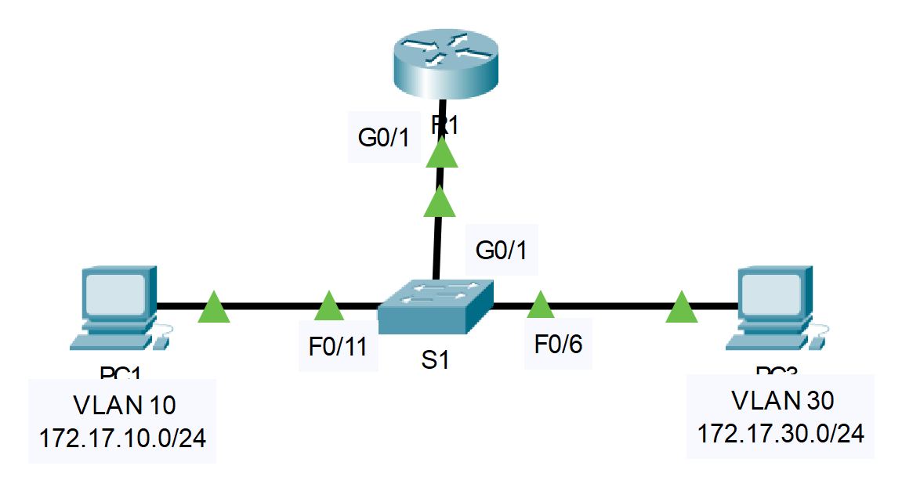

## Топология



## Таблица адресации

| Устройство | Интерфейс | IP-адрес     | Маска подсети | Шлюз по умолчанию | VLAN    |
|------------|-----------|--------------|---------------|-------------------|---------|
| R1         | G0/1.10   | 172.17.10.1  | 255.255.255.0 | —                 | VLAN 10 |
| R1         | G0/1.30   | 172.17.30.1  | 255.255.255.0 | —                 | VLAN 30 |
| PC1        | NIC       | 172.17.10.10 | 255.255.255.0 | 172.17.10.1       | VLAN 10 |
| PC3        | NIC       | 172.17.30.10 | 255.255.255.0 | 172.17.30.1       | VLAN 30 |

## Задачи

Часть 1. Выявление неполадок в сети

Часть 2. Реализация решения

Часть 3. Проверка подключения

## Сценарий

В этом упражнении необходимо найти и устранить неполадки подключения, вызванные неверными конфигурациями сетей VLAN и маршрутизации между VLAN.

## Инструкции

### Часть 1. Выявление неполадок сети

Изучите сеть и локализуйте источник сбоя подключения.

Команды, которые вы можете найти полезными, включают:

```
R1# show ip interface brief
R1# show interface g0/1.10
R1# show interface g0/1.30
S1# show interface trunk
```

-   Проверьте подключение и примените необходимые команды **show** для проверки настроек.

-   Убедитесь, что все настроенные параметры соответствуют требованиям, указанным в таблице адресации.

-   Список всех проблем и возможных решений в **Таблице документации**

**Таблица документации**

| Проблемы | Решения |
|----------|---------|
| &nbsp;   |         |
| &nbsp;   |         |
| &nbsp;   |         |
| &nbsp;   |         |
| &nbsp;   |         |
| &nbsp;   |         |

### Часть 2. Реализация решений

Внедрите рекомендуемые решения.

### Часть 3. Проверка подключения

Убедитесь в том, что компьютеры могут отправлять эхо-запросы другим компьютерам и маршрутизатору R1. В противном случае продолжайте поиск и устранение неполадок, пока компьютеры не начнут получать ответ на ping-запросы.

[Скачать файл Packet Tracer для локального запуска](./assets/4.4.8-packet-tracer---troubleshoot-inter-vlan-routing_ru-RU.pka)
