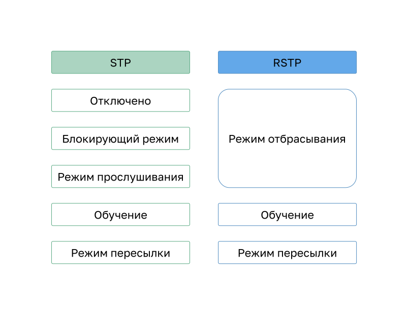
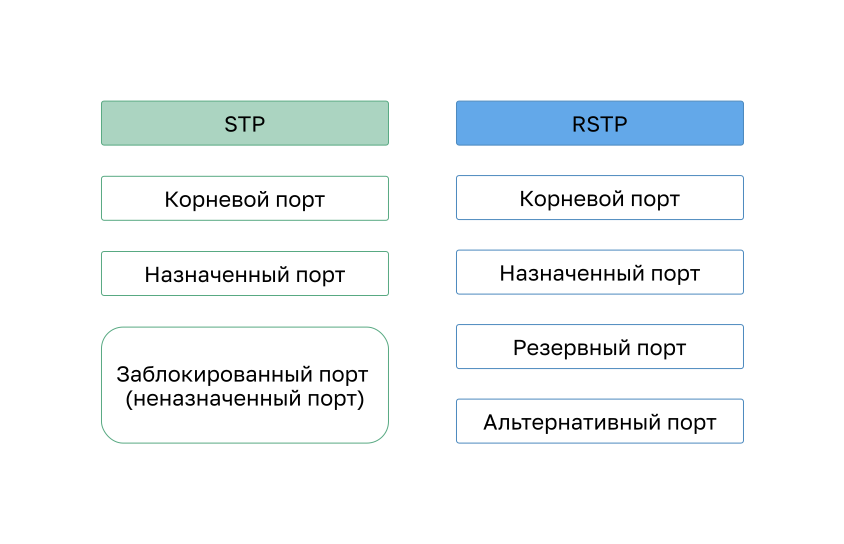

<!-- 5.3.1 -->
## Различные версии STP

В этом разделе подробно описаны различные версии STP и другие варианты предотвращения цикличности в сети.

До сих пор использовался термин Spanning Tree Protocol и аббревиатура STP. Многие специалисты используют их для обозначения различных реализаций данного протокола, например, **Rapid Spanning Tree Protocol** (RSTP) и **Multiple Spanning Tree Protocol** (MSTP). Чтобы правильно объяснять принципы STP, важно понимать, о какой конкретно реализации или стандарте идет речь.

Последний стандарт содержится в IEEE-802-1D-2004, стандарте IEEE для локальных и городских сетей: MAC-мосты. В этой версии стандарта указано, что коммутаторы и мосты, соответствующие стандарту, будут использовать RSTP вместо старого STP, указанного в исходном стандарте 802.1d. В рамках данной программы, если в контексте обсуждения речь идет об исходном STP, во избежание расхождений используется фраза «исходный протокол spanning-tree 802.1D». Так как в этих двух протоколах используется по большей части одинаковая терминология и методы обеспечения пути без петель, основной акцент будет сделан на текущем стандарте и собственных реализациях Cisco дляSTP и RSTP.

С момента создания исходного стандарта IEEE 802.1D было разработано несколько разновидностей STP.

| **Варианты протокола** | **Описание** |
| --- | --- |
| STP | Это исходная версия IEEE 802.1D (802.1D-1998 и более ранних версий), которая предоставляет топологию без петли в сети с резервными каналами. Также называется общим связующим деревом (CST) и предполагает один экземпляр связующего дерева независимо от количества сетей VLAN |
| PVST+ | Per-VLAN Spanning Tree (PVST+) — это усовершенствованная технология STP Cisco, которая предоставляет отдельный экземпляр протокола spanning-tree 802.1D для каждой VLAN, настроенной в сети. Этот вариант протокола поддерживает PortFast, UplinkFast, BPDU guard, BPDU filter, root guard и loop guard |
| 802.1D-2004 | Обновленная версия стандарта STP, в которую входит 802.1w |
| RSTP | Протокол быстрого связующего дерева (RSTP) или IEEE 802.1w представляет собой эволюцию STP, обеспечивающий более высокую сходимость, чем STP |
| Rapid PVST+ | Усовершенствованный корпорацией Cisco протокол RSTP, который использует PVST+, предоставляя отдельный экземпляр 802.1w для каждой сети VLAN. Каждый отдельный экземпляр поддерживает POrtFast, BPDU guard, BPDU filter, root guard и loop guard |
| MSTP | Протокол нескольких связующих деревьев (MSTP) является стандартом IEEE, основанный на более ранней реализации Cisco proprietary Multiple Instance STP (MISTP). MSTP сопоставляет несколько сетей VLAN в пределах одного экземпляра STP |
| MST | Multiple Spanning Tree (MST) представляет собой реализацию Cisco MSTP, которая предоставляет до 16 экземпляров RSTP и объединяет множество VLAN с той же физической и логической топологией в общий экземпляр RSTP. Каждый рассматриваемый вариант STP поддерживает PortFast, BPDU guard, BPDU filter, root guard и loop guard |

Сетевому специалисту, который отвечает за администрирование коммутаторов, может потребоваться принять решение относительно того, какой тип STP необходимо применить.

Коммутаторы Cisco под управлением IOS 15.0 или более поздней версии по умолчанию запускают PVST+. Эта версия содержит множество спецификаций IEEE 802.1D-2004, таких как альтернативные порты вместо бывших неназначенных портов. Однако, чтобы использовать протокол RSTP, коммутаторы должны быть настроены на RSTP.

<!-- 5.3.2 -->
## Принципы STP

Протокол RSTP (802.1w) заменяет собой исходный стандарт 802.1D, поддерживая при этом функции обратной совместимости. Терминология, относящаяся к STP 802.1w, остается в основном той же, что и для исходного стандарта STP IEEE 802.1D. Большинство параметров остались без изменений. Пользователи, знакомые с исходным стандартом STP, могут легко настроить RSTP. Один и тот же алгоритм используется для STP и RSTP для определения ролей портов и топологии.

Протокол RSTP ускоряет повторный расчет RSTP в случае изменения топологии сети второго уровня. В правильно настроенной сети RSTP может достичь состояния соответствия гораздо быстрее, иногда всего за несколько сот миллисекунд. Если порт настроен альтернативным или резервным путем, он может немедленно перейти в состояние пересылки без ожидания совместимости.

**Примечание.** Rapid PVST+ представляет собой реализацию RSTP Cisco на основе отдельных VLAN. Для каждой VLAN запускается независимый экземпляр RSTP.

<!-- 5.3.3 -->
## RSTP состояния и роли портов

Состояния и роли портов между STP и RSTP схожи.

**Состояния портов STP и RSTP**

Как показано на рисунке, в RSTP есть только три состояния порта, которые соответствуют трем возможным рабочим состояниям STP. Состояние отключения, блокировки и прослушивания 802.1D объединяются в уникальное состояние отказа 802.1w.

**Роли портов STP и RSTP**

Как показано на рисунке, корневые и назначенные порты одинаковы для STP и RSTP. Тем не менее существует две роли порта RSTP, которые соответствуют состоянию блокировки STP. В STP заблокированный порт определяется как не являющийся назначенным или корневым портом.

**Альтернативные и резервные порты RSTP**

Как показано на рисунке, альтернативный порт имеет альтернативный путь к корневому мосту. Резервный порт является резервным к общей среде, напимер, концентратору (hub), и менее распространен, поскольку концентраторы в настоящее время считаются устаревшими устройствами.

<!-- 5.3.4 -->
## PortFast и BPDU Guard

Когда устройство подключено к порту коммутатора или когда коммутатор включается, порт коммутатора проходит как прослушивание, так и обучение, каждый раз ожидая истечения срока действия таймера задержки. Эта задержка составляет 15 секунд для каждого состояния (в общей сложности 30 секунд). Эта задержка может вызвать проблему для DHCP-клиентов, пытающихся обнаружить DHCP-сервер. Сообщения DHCP от подключенного узла не будут пересылаться в течение 30 секунд и процесс DHCP может задержаться. В результате IPv4-клиент не получит действительный IPv4-адрес.

**Примечание.** Хотя это может произойти при отправке клиентами сообщений ICMPv6 Router Solicitation, роутер будет продолжать отправлять сообщения ICMPv6 Router Advertisement, чтобы устройство узнало, как получить информацию об адресе.

Если порт коммутатора настроен с помощью функции PortFast, он сразу переходит из состояния блокировки в состояние пересылки, минуя стандартные состояния перехода STP 802.1D (состояния прослушивания и получения данных). Вместо того, чтобы ожидать соответствия протокола STP IEEE 802.1D в каждой VLAN, PortFast можно использовать на портах доступа для обеспечения немедленного подключения этих устройств к сети. Поскольку PortFast предназначен для минимизации времени ожидания портами доступа соответствия STP, эту функцию рекомендуется использовать только на портах доступа. Если функция PortFast включена на порте, соединенном с другим коммутатором, появляется риск возникновения петли STP. PortFast предназначен только для портов коммутатора, подключенных к оконечным устройствам.

В допустимой конфигурации PortFast прием кадров BPDU никогда не допускается, поскольку это указывало бы на то, что к порту подключен другой мост или коммутатор, а это может привести к возникновению петли STP. Чтобы предотвратить возникновение такого типа сценариев, коммутаторы Cisco поддерживают функцию, называемую **BPDU guard**. Когда она включена, при получении блока BPDU она переводит порт в состояние **errdisabled** (error-disabled — отключение из-за ошибки). Это защищает от потенциальных петель, эффективно отключив порт. Функция BPDU guard обеспечивает безопасный отклик на недопустимые конфигурации, чтобы вы могли вручную повторно подключить интерфейс.

<!-- 5.3.5 -->
## Альтернативы STP

STP был и остается протоколом предотвращения петель Ethernet. С годами организациям требовалась повышенная устойчивость к сбоям и доступность локальной сети. Сети Ethernet перешли от нескольких взаимосвязанных коммутаторов, подключенных к одному роутеру, к сложной иерархической структуре сети, включающей коммутаторы доступа, распределения и основного уровня, как показано на рисунке.

В зависимости от реализации уровень 2 может включать не только уровень доступа, но и распределение или даже уровни ядра. Эти топологии могут содержать сотни коммутаторов с сотнями или даже тысячами VLAN. STP адаптировалась к дополнительному резерву и сложностям благодаря таким усовершенствованиям, как часть RSTP и MSTP.

Важным аспектом проектирования сети является быстрое и предсказуемое соединение при сбое или изменении топологии. Связующее дерево не обеспечивает такую же эффективность и предсказуемость, которая как делают это протоколы маршрутизации на уровне 3. На рисунке показана традиционная иерархическая структура сети с распределением и основными многоуровневыми коммутаторами, выполняющими маршрутизацию.

Маршрутизация уровня 3 позволяет создавать резервные пути и петли в топологии без блокировки портов. По этой причине некоторые среды переходят на уровень 3 везде, за исключением тех случаев, когда устройства подключаются к коммутатору уровня доступа. Другими словами, соединения между коммутаторами уровня доступа и коммутаторами распределения будут иметь третий, а не второй уровень, как показано на следующем рисунке.

Хотя STP, скорее всего, будет и впредь использоваться в качестве механизма предотвращения возникновения петель, на коммутаторах уровня доступа используются и другие технологии, в том числе:

* агрегация многосистемных связей (Multi System Link Aggregation, MLAG);
* мостовое соединение по кратчайшему пути (Shortest Path Bridging, SPB);
* прозрачное соединение множества каналов друг с другом (Transparent Interconnect of Lots of Links, TRILL).

**Примечание.** Эти технологии выходят за рамки данного курса.

<!-- 5.3.6 -->
<!-- quiz -->
