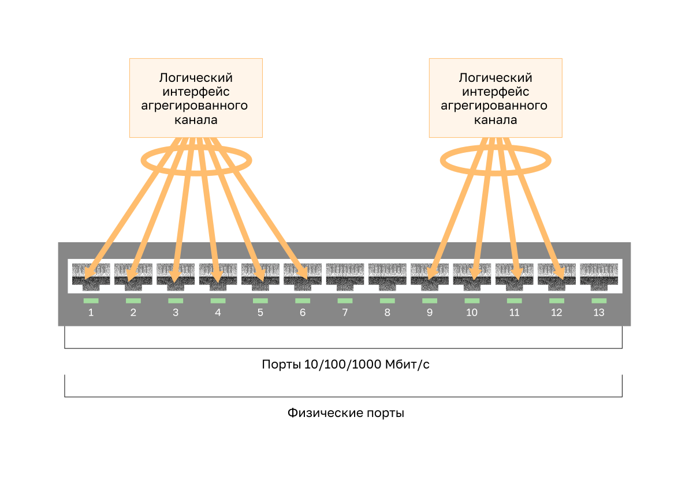

<!-- 6.1.1 -->
## Агрегирование каналов

Существуют сценарии, в которых требуется большая пропускная способность или избыточность между устройствами, что может быть обеспечено одним каналом. Множественные каналы могут быть соединены между устройствами для увеличения пропускной способности. Однако протокол STP, который по умолчанию включен на устройствах уровня 2, таких как коммутаторы Cisco, блокирует избыточные каналы, чтобы предотвратить петли коммутации, как показано на рисунке.

Необходима технология агрегации каналов, позволяющая создавать избыточные связи между устройствами, которые не будут блокироваться STP. Эта технология известна как EtherChannel.

EtherChannel — это технология агрегации каналов, которая группирует несколько физических каналов Ethernet вместе в один логический канал. Он используется для обеспечения отказоустойчивости, распределения нагрузки, увеличения пропускной способности и избыточности между коммутаторами, маршрутизаторами и серверами.

Технология EtherChannel может объединить несколько физических каналов между коммутаторами, что позволит увеличить общую скорость обмена данными между коммутаторами.

По умолчанию протокол STP блокирует избыточные каналы.

<!-- 6.1.2 -->
## EtherChannel

Технология EtherChannel изначально была разработана компанией Cisco как технология LAN типа «коммутатор-коммутатор» для объединения нескольких портов Fast Ethernet или Gigabit Ethernet в один логический канал. При настройке EtherChannel создаётся виртуальный интерфейс, который называется агрегированный канал (port channel). Физические интерфейсы объединяются в интерфейс агрегированного канала, как показано на рисунке.

<!-- 6.1.3 -->
## Преимущества EtherChannel

Технология EtherChannel имеет много достоинств:

* Большинство задач конфигурации выполняется на интерфейсе EtherChannel, а не на отдельных портах. Это обеспечивает согласованную конфигурацию на всех каналах.
* EtherChannel использует существующие порты коммутатора. Для обеспечения более высокой пропускной способности не требуется дорогостоящая замена канала на более быстрый.
* Между каналами, которые являются частью одного и того же EtherChannel, происходит распределение нагрузки. В зависимости от используемого оборудования может быть реализован один или несколько методов балансировки нагрузки. К этим методам относятся, например, распределение нагрузки по физическим каналам на основе МАС-адреса источника и МАС-адреса назначения или на основе IP-адреса источника и IP-адреса назначения.
* EtherChannel создает объединение, которое рассматривается, как один логический канал. Если между двумя коммутаторами существует несколько объединений EtherChannel, протокол STP может блокировать одно из объединений во избежание петель коммутации. Если протокол STP блокирует один из избыточных каналов, он блокирует весь EtherChannel. При этом блокируются все порты, относящиеся к этому каналу EtherChannel. Если существует только один канал EtherChannel, все физические каналы в EtherChannel активны, поскольку STP видит только один (логический) канал.
* EtherChannel предоставляет функции избыточности, поскольку общий канал считается одним логическим соединением. Кроме того, потеря одного физического соединения в пределах канала не приводит к изменению в топологии. Поэтому перерасчет STP не требуется. При условии, что имеется хотя бы одно физическое соединение, EtherChannel продолжает работать даже в том случае, если общая пропускная способность снижается из-за потери соединения в пределах EtherChannel.

<!-- 6.1.4 -->
## Ограничения использования

EtherChannel имеет определенные ограничения реализации, в том числе следующие:

* Нельзя одновременно использовать разные типы интерфейсов. Например, нельзя смешивать Fast Ethernet и Gigabit Ethernet в пределах одного канала EtherChannel.
* В настоящее время все каналы EtherChannel могут содержать до восьми совместимо настроенных Ethernet-портов. EtherChannel предоставляет полнодуплексную полосу пропускания до 800 Мбит/с (Fast EtherChannel) или 8 Гбит/с (Gigabit EtherChannel) между двумя коммутаторами или между коммутатором и узлом.
* Коммутатор Cisco Catalyst 2960 уровня 2 в настоящее время поддерживает до шести каналов EtherChannel . Тем не менее с появлением новых версий IOS и изменением платформ некоторые карты и платформы могут получить возможность поддерживать большее количество портов в пределах одного канала EtherChannel, а также большее количество каналов Gigabit EtherChannel.
* Конфигурация порта отдельного участника группы EtherChannel должна выполняться согласованно на обоих устройствах. Если физические порты на одной стороне настроены в качестве транковых, то физические порты на другой стороне также должны быть настроены в качестве транковых с тем же самым native VLAN. Кроме того, все порты в каждом канале EtherChannel должны быть настроены как порты 2-го уровня.
* Каждый EtherChannel имеет логический интерфейс агрегированного канала. Настройка интерфейса агрегированного канала применяется на все физические интерфейсы, связанные с этим логическим интерфейсом.

<!-- 6.1.5 -->
## Протоколы автосогласования

Etherchannel можно образовать путем согласования с использованием одного из двух протоколов, Port Aggregation Protocol (PAgP) или Link Aggregation Control Protocol (LACP). Данные протоколы позволяют портам со сходными характеристиками образовывать каналы путем динамического согласования со смежными коммутаторами.

**Примечание**: Также возможна настройка статического или безусловного канала EtherChannel без использования PAgP или LACP.

<!-- 6.1.6 -->
## Функции PAgP

PAgP — это проприетарный протокол Cisco, который предназначен для автоматизации создания каналов EtherChannel. Когда канал EtherChannel настраивается с помощью PAgP, пакеты PAgP пересылаются между портами с поддержкой EtherChannel в целях согласования создания канала. Когда PAgP определяет совпадающие соединения Ethernet, он группирует их в канал EtherChannel. Далее EtherChannel добавляется в дерево кратчайших путей как один порт.

Если включён протокол PAgP, он также участвует в управлении EtherChannel. Отправка пакетов PAgP выполняется с интервалом в 30 секунд. PAgP проверяет согласованность конфигурации и обрабатывает добавление и выход из строя каналов между двумя коммутаторами. Таким образом обеспечивается использование согласованной конфигурации для всех портов при создании EtherChannel.

**Примечание**: В EtherChannel все порты обязательно должны иметь одинаковую скорость, одинаковые настройки дуплекса и одинаковые настройки VLAN. При любом изменении порта после создания канала также изменяются все остальные порты канала.

Протокол PAgP позволяет создать канал EtherChannel путем обнаружения конфигурации на каждой из сторон и обеспечения совместимости каналов, чтобы канал EtherChannel мог быть включён в случае необходимости. Режимы PAgP:

* **On (Включено)** — этот режим принудительно назначает интерфейс в канал без использования PAgP. Интерфейсы, настроенные в режиме On (Вкл), не обмениваются пакетами PAgP.
* **PAgP desirable (рекомендуемый)** — этот режим PAgP помещает интерфейс в активное состояние согласования, в котором интерфейс инициирует согласование с другими интерфейсами путем отправки пакетов PAgP.
* **PAgP auto (автоматический)** — этот режим PAgP помещает интерфейс в пассивное состояние согласования, в котором интерфейс отвечает на полученные пакеты PAgP, но не инициирует согласование PAgP.

Режимы должны быть совместимыми на каждой из сторон. Если одна из сторон настроена в автоматическом режиме, она помещается в пассивное состояние, ожидая инициации согласования EtherChannel другой стороной. Если для другой стороны также задан автоматический режим, то согласование не начнётся и EtherChannel не образуется. Если все режимы отключены с помощью команды **no** или ни один из режимов не настроен, EtherChannel отключается.

Режим Вкл помещает интерфейс в канал EtherChannel без выполнения согласования. Этот режим работает только в том случае, если для другой стороны также задан режим Вкл. Если для другой стороны параметры согласования заданы с помощью PAgP, образование EtherChannel не выполняется, поскольку та сторона, для которой задан режим Вкл, не выполняет согласование.

Отсутствие согласования между двумя коммутаторами означает отсутствие проверки, что все каналы в EtherChannel завершаются на другой стороне или что на другом коммутаторе используются совместимые параметры PAgP.

<!-- 6.1.7 -->
## Пример настроек режима PAgP

Рассмотрим два коммутатора на рисунке. Установит ли S1 и S2 EtherChannel с помощью PAgP, зависит от настроек режима на каждой стороне канала.

В таблице показаны различные сочетания режимов PAgP на S1 и S2 и результат создания канала.

| **S1** | **S2** | **Формирование канала** |
| --- | --- | --- |
| Включено | Включено | Да |
| Вкл. | Рекомендуемый/Автоматический | Нет |
| Рекомендуемый | Рекомендуемый | Да |
| Рекомендуемый | Авто | Да |
| Автоматически | Рекомендуемый | Да |
| Автоматически | Автоматически | Нет |

<!-- 6.1.8 -->
## Функции LACP

LACP определяется стандартом IEEE (802.3ad), который обеспечивает возможность объединения нескольких физических портов для создания единого логического канала. LACP обеспечивает возможность согласования коммутатором автоматического объединения путем отправки пакетов LACP на другой коммутатор. Он выполняет функцию, сходную с функциями PAgP для Cisco EtherChannel. Поскольку протокол LACP относится к стандарту IEEE, его можно использовать для упрощения работы с каналами EtherChannel в неоднородных средах. На устройствах Cisco поддерживаются оба протокола.

**Примечание**: LACP изначально определён как стандарт IEEE 802.3ad. Тем не менее теперь протокол LACP определяется более новой версией, стандартом IEEE 802.1AX для локальных и городских сетей.

Протокол LACP предоставляет те же преимущества при согласовании, что и протокол PAgP. Протокол LACP позволяет создать канал EtherChannel путем обнаружения конфигурации на каждой из сторон и обеспечения совместимости каналов, чтобы канал EtherChannel мог быть включён в случае необходимости. Режимы LACP:

* **On (Вкл)** — этот режим принудительно помещает интерфейс в канал без использования LACP. Интерфейсы, настроенные в режиме On, не обмениваются пакетами LACP.
* **LACP active (активный)** — в этом режиме LACP порт помещается в активное состояние согласования. В этом состоянии порт инициирует согласование с другими портами путем отправки пакетов LACP.
* **LACP passive (пассивный)** — в этом режиме LACP порт помещается в пассивное состояние согласования. В этом состоянии порт отвечает на полученные пакеты LACP, но не инициирует согласование пакетов LACP.

Как и в случае с PAgP, для формирования канала EtherChannel режимы должны быть совместимы на обеих сторонах. Режим Вкл повторяется, поскольку он создает конфигурацию EtherChannel безусловно, без динамического согласования PAgP или LACP.

LACP позволяет создать восемь активных каналов, а также восемь резервных каналов. Резервный канал становится активным при сбое одного из текущих активных каналов.

<!-- 6.1.9 -->
## Пример настроек режима LACP

Рассмотрим два коммутатора на рисунке. Установит ли S1 и S2 EtherChannel с помощью LACP, зависит от настроек режима на каждой стороне канала.

В таблице показаны различные комбинации режимов LACP на S1 и S2 и полученные результаты создания канала.

| **S1** | **S2** | **Формирование канала** |
| --- | --- | --- |
| Включено | Включено | Да |
| Вкл. | Активный/Пассивный | Нет |
| Активный | Active | Да |
| Активный | Пассивный | Да |
| Пассивный | Active | Да |
| Пассивный | Пассивный | Нет |

<!-- 6.1.10 -->
<!-- quiz -->

