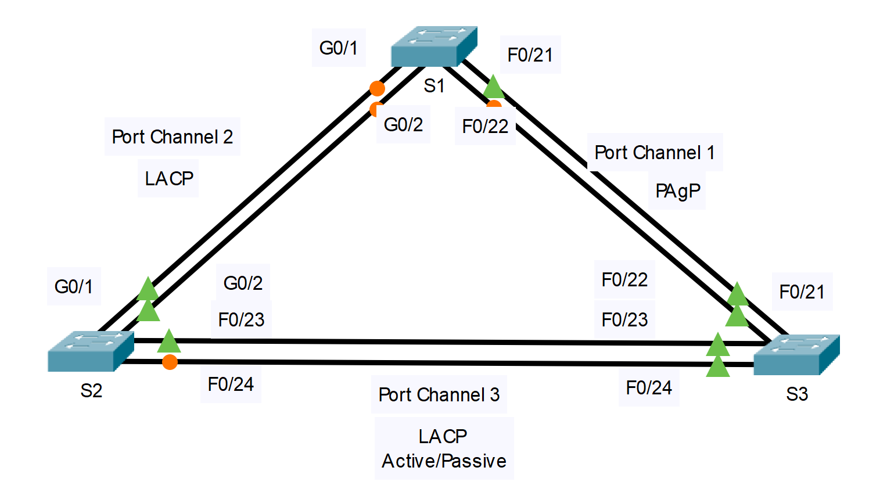

---

> **ВАЖНО**
> 
> Форма для ответов на вопросы будет доступна только при развертывании лабораторной работы 

---

## Топология



## Задачи

Часть 1. Настроить базовые параметры коммутатора

Часть 2. Настроить EtherChannel с протоколом агрегирования портов Cisco (PAgP)

Часть 3. Настроить EtherChannel с протоколом управления агрегированием каналов (LACP) 802.3ad

Часть 4. Настроить резервный EtherChannel

## Общие сведения

Только что были установлены три коммутатора. Между ними настроены резервные каналы. Обычно можно использовать лишь один из них, иначе может возникнуть петля на втором уровне модели OSI. Однако при эксплуатации одного канала используется только половина доступной пропускной способности. EtherChannel позволяет объединять до восьми резервных каналов в один логический. В этой лабораторной работе вам предстоит настроить протокол агрегирования портов (PAgP), протокол Cisco EtherChannel и протокол управления агрегированием каналов (LACP), версию EtherChannel открытого стандарта IEEE 802.3ad.

Перед началом настройки ознакомьтесь с рекомендациями по настройке EtherChannel и ограничениями, перечисленными в конце этого задания.

## Таблица каналов портов

| **Группа каналов** | **Порты** | **Протокол** |
|---|---|---|
| 1 | S1 F0/21. F0/22<br>S3 F0/21, F0/22 | PAgP |
| 2 | S1 G0/1, G0/2<br>S2 G0/1, G0/2 | LACP |
| 3 | S2 F0/23, F0/24<br>S3 F0/23, F0/24 | Negotiated LACP |

## Инструкции

### Часть 1. Настройка основных параметров коммутатора

1.  Назначьте каждому коммутатору имя узла в соответствии с диаграммой топологии.

2.  Перед началом объединения каналов между коммутаторами проверьте существующую конфигурацию портов, которые соединяют коммутаторы, чтобы убедиться, что они успешно присоединяются к EtherChannels. Команды, предоставляющие сведения о состоянии портов коммутатора, включают:

    ```
    S1# show interfaces | include Ethernet
    S1# show interface status
    S1# show interfaces trunk
    ```

3.  Настройте все порты, необходимые для EtherChannels, в качестве статических магистральных портов.

    **Примечание.** Если порты настроены в динамическом автоматическом режиме, а вы не настроили режим портов на транковую связь, каналы не сформируют транки и останутся портами доступа. По умолчанию на коммутаторе 2960 настроен динамический автоматический режим (dynamic auto). DTP можно отключить на интерфейсах с помощью команды **switchport nonegotiate**.

### Часть 2. Настройте EtherChannel с помощью протокола Cisco PAgP

**Примечание.** При настройке ЕtherСhannel рекомендуется отключить физические порты перед их объединением в группы каналов. В противном случае механизм защиты Etherchannel Misconfig Guard может перевести эти порты в состояние отключения в результате ошибки (err-disabled). По завершении настройки EtherChannel порты и агрегированные каналы можно включить заново.

**Шаг 1. Настройте созданный интерфейс Port Channel 1**

1.  Первый EtherChannel, созданный для этого упражнения, агрегирует порты F0/22 и F0/21 между коммутаторами **S1** и **S3**. Настройте порты G0/1 и G0/2 как статическое магистральное соединение на обоих коммутаторах.

2.  Используйте команду **show interfaces trunk**, чтобы убедиться в наличии активного транкового канала для этих двух каналов.

    ```
    S1# show interfaces trunk

    Port Mode Encapsulation Status Native vlan
    F0/21 on 802.1q trunking 1
    F0/22 on 802.1q trunking 1
    G0/1 on 802.1q trunking 1
    G0/2 on 802.1q trunking 1

    <output omitted>
    ```

3.  На обоих коммутаторах добавьте порты F0/21 и F0/22 к созданному интерфейсу Port Channel 1 с помощью команды **channel-group 1 mode desirable**. Параметр **desirable mode** (рекомендуемый режим) позволяет коммутатору выступать в роли активного участника для создания канала PAgP.
4.  
5.  **Примечание.** Интерфейсы должны быть **выключены** до добавления их в группу каналов.

    ```
    S1(config)# interface range f0/21 – 22
    S1(config-if-range)# shutdown
    S1(config-if-range)# channel-group 1 mode desirable
    S1(config-if-range)# no shutdown

    S3(config)# interface range f0/21 - 22
    S3(config-if-range)# shutdown
    S3(config-if-range)# channel-group 1 mode desirable
    S3(config-if-range)# no shutdown
    ```

    Сообщение «Creating a port-channel interface Port-channel 1» (создание интерфейса порта-канала Port-channel 1) должно появиться на обоих коммутаторах при настройке группы каналов. Это обозначение интерфейса будет отображаться как **Po1** в выводе команды.

4.  Настройте логический интерфейс в качестве транка. Для этого сначала введите команду **interface port-channel _number_**, а затем команду **switchport mode trunk**. Настройте таким образом оба коммутатора.

    ```
    S1(config)# interface port-channel 1
    S1(config-if)# switchport mode trunk

    S3(config)# interface port-channel 1
    S3(config-if)# switchport mode trunk
    ```

**Шаг 2. Проверьте состояние созданного интерфейса Port Channel 1**

1.  Чтобы проверить работоспособность EtherChannel на обоих коммутаторах, выполните команду **show etherchannel summary**. Эта команда отображает тип EtherChannel, используемые порты и состояния портов. Вывод команды показан для S1.

    ```
    S1# show etherchannel summary
    Flags: D - down P - in port-channel
           I - stand-alone s - suspended
           H - Hot-standby (LACP only)
           R - Layer3 S - Layer2
           U - in use f - failed to allocate aggregator
           u - unsuitable for bundling
           w - waiting to be aggregated
           d - default port
    
    Number of channel-groups in use: 1
    Number of aggregators: 1

    Group Port-channel Protocol Ports
    ------+-------------+-----------+----------------------------------------
    1 Po1(SU) PAgP F0/21(P) F0/22(P)
    ```

2.  Если EtherChannel не включен, отключите физические интерфейсы на обоих концах EtherChannel и включите их снова. Команды **show interfaces trunk** и **show spanning-tree** также отображают агрегированные порты как один логический канал.

### Часть 3. Настройте EtherChannel LACP 802.3ad

**Шаг 1. Настройте созданный интерфейс Port Channel 2**

1. В 2000 году IEEE выпустил 802.3ad — версию EtherChannel открытого стандарта. Его обычно называют LACP. Используя предыдущие команды, настройте канал между коммутаторами **S1** и **S2** на портах G0/1 и G0/2 в качестве EtherChannel по протоколу LACP. На коммутаторе **S1** не следует использовать номер агрегированного канала Port Channel 1, поскольку вы использовали этот номер на предыдущем шаге. Для настройки агрегирования портов по протоколу LACP используйте команду режима конфигурации интерфейса **channel-group 2 mode active**. Активный режим (active) означает, что коммутатор активно пытается согласовать этот канал, как LACP в противоположность к PAgP. Конфигурация коммутатора **S1** показана ниже.

    ```
    S1(config)# interface range g0/1 - 2
    S1(config-if-range)# shutdown
    S1(config-if-range)# channel-group 2 mode active
    S1(config-if-range)# no shutdown
    S1(config-if-range)# interface port-channel 2
    S1(config-if)# switchport mode trunk
    ```

**Шаг 2. Проверьте состояние созданного интерфейса Port Channel 2**

Используйте команду **show** из шага 2 части 1, чтобы проверить состояние Port Channel 2. Определите протокол, используемый каждым портом.

### Часть 4. Настройка избыточного канала EtherChannel

**Шаг 1. Настройте созданный интерфейс Port Channel 3**

Ввести команду **channel-group _number_ mode** можно по-разному.

```
S2(config)# interface range f0/23 - 24
S2(config-if-range)# channel-group 3 mode ?
  active Enable LACP unconditionally
  auto Enable PAgP only if a PAgP device is detected
  desirable Enable PAgP unconditionally
  on Enable Etherchannel only
  passive Enable LACP only if a LACP device is detected
```

1. На коммутаторе **S2** добавьте порты F0/23 и F0/24 к созданному интерфейсу Port Channel 3 с помощью команды **channel-group 3 mode desirable**. Параметр **passive** означает, что вам нужно, чтобы коммутатор использовал LACP только в том случае, если обнаружено другое устройство. Статически настройте созданный интерфейс Port Channel 3 в качестве транкового интерфейса.

    ```
    S2(config)# interface range f0/23 - 24
    S2(config-if-range)# shutdown
    S2(config-if-range)# channel-group 3 mode passive
    S2(config-if-range)# no shutdown
    S2(config-if-range)# interface port-channel 3
    S2(config-if)# switchport mode trunk
    ```

2. На коммутаторе **S3** добавьте порты F0/23 и F0/24 к созданному интерфейсу Port Channel 3 с помощью команды **channel-group 3 mode active**. Параметр **active** означает, что вам нужно, чтобы коммутатор использовал LACP без условий. Статически настройте созданный интерфейс Port Channel 3 в качестве транкового интерфейса.

**Шаг 2. Проверьте состояние созданного интерфейса Port Channel 3**

1. Используйте команду **show** из шага 2 части 1, чтобы проверить состояние созданного интерфейса Port Channel 3. Определите протокол, используемый каждым портом.

2. Создание каналов EtherChannel не мешает связующим деревом обнаруживать коммутируемые петли. Просмотр состояния связующего дерева активных портов на **S1**.

    ```
    S1# show spanning-tree active
    VLAN0001
      Spanning tree enabled protocol ieee
      Root ID Priority 32769
                 Address 0001.436E.8494
                 Cost 9
                 Port 27(Port-channel1)
                 Hello Time 2 sec Max Age 20 sec Forward Delay 15 sec
      Bridge ID Priority 32769 (priority 32768 sys-id-ext 1)
                 Address 000A.F313.2395
                 Hello Time 2 sec Max Age 20 sec Forward Delay 15 sec
                 Aging Time 20
    
    Interface Role Sts Cost Prio.Nbr Type
    ---------------- ---- --- --------- -------- --------------------------------
    Po1 Root FWD 9 128.27 Shr
    Port 27(Port-channel1)
    ```

    Созданный интерфейс Port Channel 2 не работает, поскольку STP перевел некоторые порты в режим блокировки (blocking). К сожалению, ими оказались гигабитные порты. В этой топологии можно восстановить эти порты, установив **S1** в качестве **основного** корня для VLAN 1. Вы также можете установить приоритет **24576**.

    ```
    S1(config)# spanning-tree vlan 1 root primary
    ```

    или

    ```
    S1(config)# spanning-tree vlan 1 priority 24576
    ```

    Возможно, придется подождать, пока STP пересчитает топологию дерева. При необходимости нажмите кнопку **fast-forward**. Используйте команду **show spanning-tree active** для проверки того, что гигабитные порты находятся в состоянии пересылки.

## Рекомендации по настройке EtherChannel и ограничения

EtherChannel имеет некоторые конкретные рекомендации, которые должны соблюдаться, чтобы избежать проблем с конфигурацией.

1.  Все интерфейсы Ethernet поддерживают EtherChannel максимум до восьми интерфейсов без требования, чтобы интерфейсы были в одном интерфейсном модуле.

2.  Все интерфейсы EtherChannel должны работать с одинаковой скоростью и в дуплексном режиме.

3.  EtherChannel могут функционировать как отдельные порты доступа VLAN, так и магистральные каналы между коммутаторами.

4.  Все интерфейсы EtherChannel уровня 2 должны быть членами одной и той же VLAN или быть настрены в качестве магистралей.

5.  При настройке в качестве магистральных EtherChannel уровня 2 должен иметь одну и ту же Native VLAN и одинаковый диапазон VLAN, разрешенные на обоих коммутаторах, подключенных к транку.

6.  При настройке EtherChannel все интерфейсы должны быть отключены до начала настройки EtherChannel. После завершения настройки каналы могут быть повторно включены.

7.  После настройки EtherChannel убедитесь, что все интерфейсы находятся в состоянии вверх/вверх.

8.  Можно настроить EtherChannel как статический, либо использовать PAgP или LACP для согласования подключения EtherChannel. Определение способа настройки EtherChannel является значением команды **channel-group _number_ mode**. Возможные значения:

    **active** — включение LACP без условий;

    **passive** — LACP включается только в том случае, если подключено другое устройство, поддерживающее LACP;

    **desirable** — включение PAgP без условий;

    **auto** — PAgP активируется только в том случае, если подключено другое устройство, поддерживающее PAgP;

    **on** — EtherChannel включен, но без LACP или PAgP.

9.  Порты LAN могут образовывать EtherChannel с помощью PAgP, если режимы совместимы. Совместимые режимы PAgP:

    **desirable =\> desirable**;

    **desirable =\> auto**.

    Если оба интерфейса находятся в **auto**-режиме, Etherchannel не будет сформирован.

10. Порты LAN могут образовывать EtherChannel с помощью LACP, если режимы совместимы. Совместимые режимы LACP:

    **active =\> active**;

    **active =\> passive**.

    Если оба интерфейса находятся в режиме **passive**, EtherChannel не может сформироваться с помощью LACP.

11. Номера групп каналов являются локальными для отдельного коммутатора. Хотя в этом действии используется один и тот же номер группы каналов на обоих концах соединения EtherChannel, это не является обязательным. Channel-group 1 (интерфейс Po1) на одном коммутаторе может образовывать EtherChannel с Channel-group 5 (интерфейс Po5) на другом коммутаторе.

[Скачать файл Packet Tracer для локального запуска](./assets/6.2.4-lab.pka)
