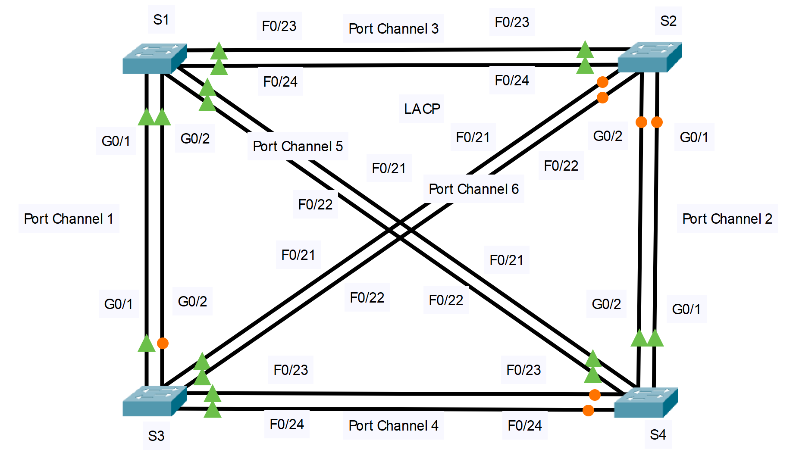

---

> **ВАЖНО**
> 
> Форма для ответов на вопросы будет доступна только при развертывании лабораторной работы 

---

## Топология

## Задачи

Часть 1. Проверка физического уровня и устранение неполадок режима порта коммутатора

Часть 2. Выявление и устранение неполадок при назначении каналов портов

Часть 3. Выявление и устранение неполадок с протоколами каналов портов

## Общие сведения

Недавно младший специалист настроил четыре коммутатора. Пользователи были недовольны медленной работой сети и попросили вас найти проблему.

**Таблица каналов портов**

| Группа каналов | Порты | Протокол |
|---|---|---|
| 1 | S1: G0/1, G0/2 S2: G0/1, G0/2 | LACP active |
| 2 | S2: G0/1, G0/2 S4: G0/1, G0/2 | LACP active |
| 3 | S1: F0/23, F0/24 S2: F0/23, F0/24 | LACP active |
| 4 | S3: F0/23, F0/24 С4: F0/23, F0/24 | LACP active |
| 5 | S1: F0/21, F0/22 С4: F0/21, F0/22 | LACP active |
| 6 | S2: F0/21, F0/22 S3: F0/21, F0/22 | LACP active |

**Таблица Типы устройств**

| Устройство | Группа | Порты        |
|------------|--------|--------------|
| S1         | 1      | G0/1, G0/2   |
| S1         | 3      | F0/23, F0/24 |
| S1         | 5      | F0/21, F0/22 |
| S2         | 2      | G0/1, G0/2   |
| S2         | 3      | F0/23, F0/24 |
| S2         | 6      | F0/21, F0/22 |
| S3         | 1      | G0/1, G0/2   |
| S3         | 4      | F0/23, F0/24 |
| S3         | 6      | F0/21, F0/22 |
| S4         | 2      | G0/1, G0/2   |
| S4         | 4      | F0/23, F0/24 |
| S4         | 5      | F0/21, F0/22 |

## Инструкции

### Часть 1. Проверка физического уровня и устранение неполадок, связанных с режимами портов коммутатора

**Шаг 1. Найдите порты доступа.**

Изучите конфигурации коммутаторов. Когда два или более избыточных канала соединяют одни и те же коммутаторы, протокол Spanning Tree переводит только один порт в режим пересылки, чтобы предотвратить коммутационные петли. Это можно увидеть в Packet Tracer. Когда физические порты связанны в EtherChannel, они работают, как один логический порт. Каждая пара портов может быть либо включена, либо выключена.

**Шаг 2. Убедитесь, что порты находятся в режиме транка.**

1.  Убедитесь, что физические порты настроены в соответствии с топологией как транки. Исправьте все порты, которые находятся в режиме доступа.

2.  Если какие-либо порты EtherChannel не настроены на транковый режим, исправьте это.

### Часть 2. Выявление и устранение неполадок, связанных с настройками Port Channel

**Шаг 1. Изучите настройки Port Channel.**

Топология Packet Tracer и таблицы Port Channel и Устройства содержат подробные сведения о физических портах и их назначениях EtherChannel. Используйте команду **show etherchannel summary** , чтобы узнать, как сконфигурированы каналы EtherChannel. Убедитесь, что коммутаторы настроены, как показано в документации.

**Шаг 2. Внесите корректировки в настройки Port Channel.**

Проведите корректировку настроек портов для исправления ошибок, связанных с принадлежностью физического порта соответствующему EtherChannel.

### Часть 3. Выявление и устранение проблем с протоколом

**Шаг 1. Выявите проблемы с протоколом.**

В 2000 году IEEE выпустил 802.3ad (LACP) — версию EtherChannel открытого стандарта. Для обеспечения совместимости команда проектировщиков решила использовать LACP по всей сети. Команда разработчиков поставила требование, чтобы все порты, участвующие в EtherChannel, активно согласовывали канал как LACP. Убедитесь, что физические порты настроены так, как указано в топологии и в таблице Port Channel.

**Шаг 2. Устраните проблемы с протоколом.**

1.  Если какие-либо порты коммутатора не согласованы с использованием LACP, исправьте это.

2.  Перезапустите команду **show etherchannel summary** , чтобы убедиться, что все каналы EtherChannel настроены правильно.

[Скачать файл Packet Tracer для локального запуска](./assets/6.3.4-lab.pka)
