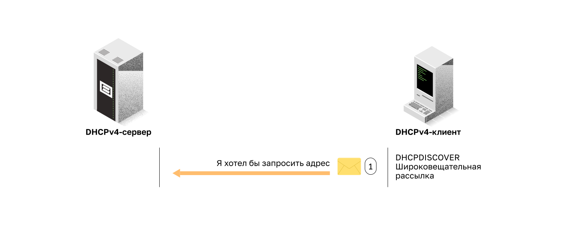
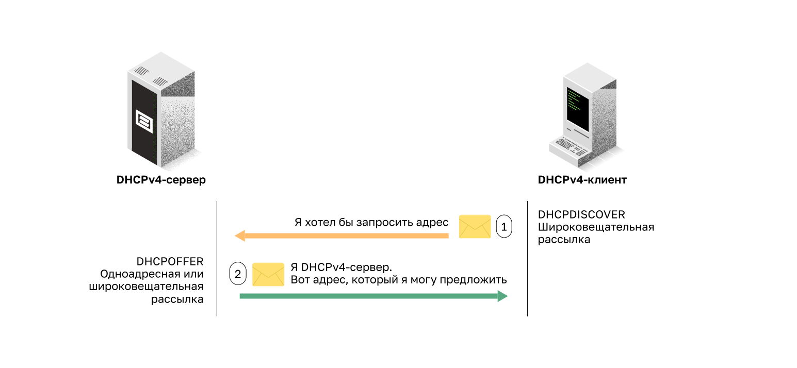
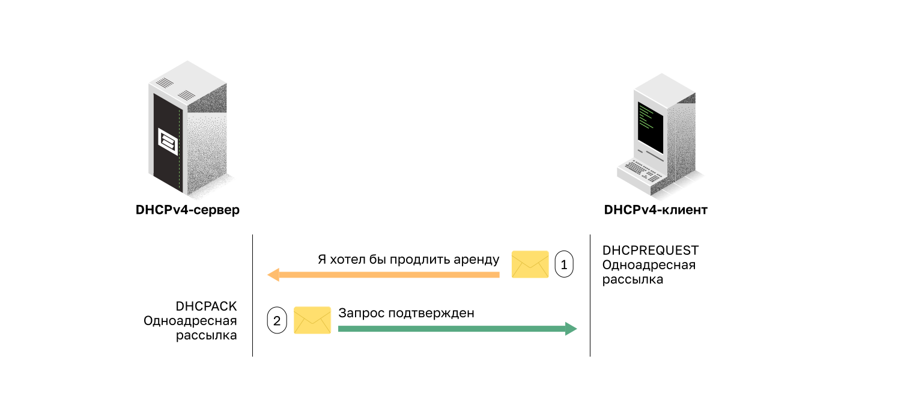

<!-- 7.1.1 -->
## Серверы и клиенты DHCPv4

DHCPv4 динамически назначает IPv4-адреса и другую информацию о конфигурации сети. Поскольку стационарные ПК обычно составляют основную часть сетевых узлов, DHCPv4 является крайне полезным инструментом, позволяющим сетевым администраторам значительно экономить время.

Выделенный DHCPv4-сервер масштабируется и относительно легок в управлении. Однако в небольшом филиале или домашнем офисе (SOHO) роутер Cisco можно настроить для обеспечения DHCPv4-служб без необходимости в выделенном сервере. ПО Cisco IOS поддерживает дополнительный полнофункциональный сервер DHCPv4.

Сервер DHCPv4 динамически назначает или выдает в аренду IPv4-адрес из пула адресов на ограниченный период времени по выбору сервера или до тех пор, пока у клиента есть необходимость в адресе.

Клиенты арендуют данные у сервера на период, определенный администратором. Администраторы настраивают серверы DHCPv4 таким образом, чтобы срок аренды истекал в разное время. Обычно он составляет от 24 часов до недели или более. По истечении срока аренды клиент должен запросить другой адрес, хотя в большинстве случаев ему повторно назначается тот же адрес.

1. Процесс аренды DHCPv4 начинается с отправки клиентом сообщения с запросом служб DHCP-сервера.
2. Если есть DHCPv4-сервер, который получает сообщение, он будет отвечать IPv4-адрес и возможные другие сведения о конфигурации сети.

<!-- 7.1.2 -->
## Принципы работы DHCPv4

DHCPv4 работает по модели «клиент-сервер». Когда клиент подключается к серверу DHCPv4, сервер присваивает или сдает ему в аренду IPv4-адрес. Клиент с арендованным IP-адресом подключается к сети до истечения срока аренды. Периодически клиент должен связываться с DHCP-сервером для продления срока аренды. Благодаря подобному механизму «переехавшие» или отключившиеся клиенты не занимают адреса, в которых они больше не нуждаются. По истечении срока аренды сервер DHCP возвращает адрес в пул, из которого адрес может быть повторно получен при необходимости.

<!-- 7.1.3 -->
## Шаги для получения аренды

При начальной загрузке клиента (или ином способе подключения к сети) начинается 4-шаговый процесс получения адреса в аренду.

1. Обнаружение DHCP (DHCPDISCOVER).
2. Предложение DHCP (DHCPOFFER).
3. Запрос DHCP (DHCPREQUEST).
4. Подтверждение DHCP (DHCPACK).

**Шаг 1. DHCP Discover (обнаружение)**

Клиент начинает процесс с сообщения **DHCPDISCOVER** широковещательной рассылки со своего MAC-адреса с целью обнаружения доступных DHCPv4-серверов. Поскольку во время загрузки у клиента нет верной IPv4-информации, для связи с сервером используются широковещательные адреса второго и третьего уровней. Цель сообщения **DHCPDISCOVER** – найти серверы DHCPv4 в сети.

**Шаг 2. DHCP Offer (предложение)**

Когда сервер DHCPv4 получает сообщение **DHCPDISCOVER**, он резервирует доступные IPv4-адреса для выдачи в аренду клиенту. Сервер также создает запись ARP, состоящую из MAC-адреса запрашивающего клиента и выданного клиенту IPv4-адреса. DHCPv4-сервер посылает сообщение привязки DHCPOFFER запрашивающему клиенту.

**Шаг 3. DHCP Request (запрос)**

Когда клиент получает от сервера сообщение **DHCPOFFER**, он отправляет в ответ **DHCPREQUEST**. Это сообщение используется как для первоначальной аренды адреса, так и для ее продления. Когда оно используется при первоначальной аренде, **DHCPREQUEST** служит уведомлением о принятии от сервера предложения привязки к параметрам и косвенным отклонением для всех других серверов, которые могли предоставить клиенту подобное предложение.

В корпоративных сетях часто используется несколько DHCPv4-серверов. Сообщение **DHCPREQUEST** отправляется в форме широковещательной рассылки, чтобы поставить DHCPv4-серверы в известность о том, какое предложение было принято.

**Шаг 4. Подтверждение DHCP (DHCPACK)**

При получении сообщения **DHCPREQUEST** сервер проверяет информацию об аренде с помощью **ping**-запроса ICMP на этот адрес, чтобы убедиться, что он еще не используется, создает новую запись ARP для клиентской аренды и отвечает сообщением одноадресной рассылки **DHCPACK**. Оно является копией сообщения **DHCPOFFER**, за исключением изменения в поле типа сообщения. При получении сообщения **DHCPACK** клиент загружает информацию о конфигурации и выполняет ARP-проверку присвоенного адреса. Если ARP-ответа нет, значит, IPv4-адрес доступен, а клиент начинает использовать его в качестве собственного адреса.

<!-- 7.1.4 -->
## Шаги, чтобы возобновить аренду

До истечения срока аренды клиент начинает двухэтапный процесс продления аренды с сервером DHCPv4, как показано на рисунке.

**Шаг 1. DHCP Request (DHCPREQUEST)**

Перед окончанием аренды клиент отправляет сообщение **DHCPREQUEST** непосредственно DHCPv4-серверу, который первоначально предложил IPv4-адрес. Если сообщение **DHCPACK** не получено за определенный период времени, клиент отправляет повторный **DHCPREQUEST** широковещательной рассылкой, чтобы другой DHCPv4-сервер мог продлить срок аренды.

**Шаг 2. DHCP Acknowledgment (DHCPACK)**

При получении сообщения **DHCPREQUEST** сервер подтверждает информацию об аренде ответным **DHCPACK**.

**Примечание.** Эти сообщения (в первую очередь DHCPOFFER и DHCPACK) могут отправляться в виде одноадресной рассылки или широковещательной рассылки в соответствии с IETF RFC 2131.

<!-- 7.1.5 -->
<!-- quiz -->
