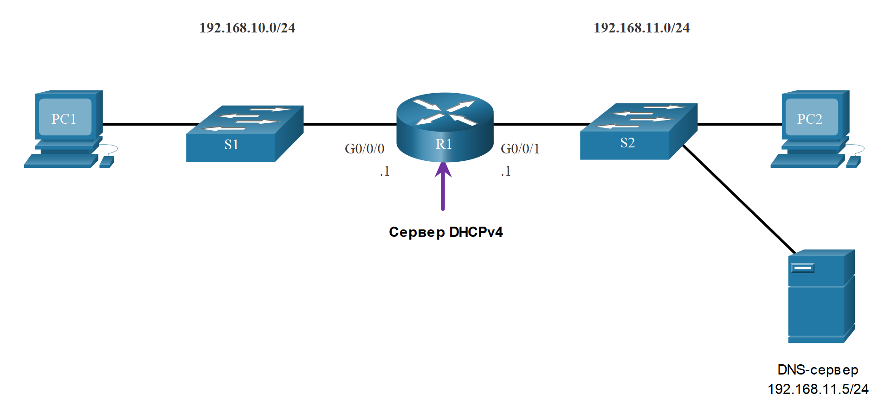

<!-- 7.2.1 -->
## Настройка сервера DHCPv4 в Cisco IOS

Теперь у вас есть общее представление о том, как работает DHCPv4 и как это может сделать вашу работу немного проще. Если у вас нет отдельного сервера DHCPv4, в этом разделе будет показано, как настроить маршрутизатор Cisco IOS. Маршрутизатор Cisco под управлением ОС Cisco IOS можно настроить в качестве DHCPv4-сервера. DHCPv4-сервер под управлением Cisco IOS присваивает DHCPv4-клиентам IPv4-адреса из заданного пула адресов маршрутизатора и управляет этими адресами.




<!-- 7.2.2 -->
## Действия по настройке сервера DHCPv4 Cisco IOS

Для настройки сервера DHCPv4 Cisco IOS выполните следующие действия:

**Шаг 1**. Исключение IPv4-адресов

**Шаг 2**. Определение имени пула DHCPv4.

**Шаг 3**. Создание пула DHCPv4

**Шаг 1. Исключение IPv4-адресов**

Маршрутизатор, выполняющий функцию DHCPv4-сервера, присваивает все IPv4-адреса из пула DHCPv4-адресов, если конфигурацией не предусмотрено исключение отдельных адресов. Как правило, некоторые IPv4-адреса из пула присваиваются сетевым устройствам для постоянного использования. Следовательно, эти IPv4-адреса не должны присваиваться другим устройствам. Для исключения адресов IPv4 используется следующий синтаксис команды:

```
Router(config)# ip dhcp excluded-address low-address [high-address]
```

Можно исключить один адрес или диапазон адресов, задав адреса нижнего и верхнего пределов диапазона. В число исключенных адресов должны входить адреса, присвоенные маршрутизаторам, серверам, принтерам и другим устройствам, которые были или будут настроены вручную. Можно также ввести команду несколько раз.

**Шаг 2. Определение имени пула DHCPv4.**

При выполнении настройки DHCPv4-сервера задается пул адресов, предназначенных для распределения.

Как показано в примере, команда **ip dhcp pool** _pool-name_ создает пул с указанным именем и переводит маршрутизатор в режим конфигурации DHCPv4, который определяется приглашением Router (dhcp-config) #.

Для определения пула используется следующий синтаксис команды:

```
Router(config)# ip dhcp pool pool-name
Router(dhcp-config)# 
```

**Шаг 3. Создание пула DHCPv4**

В таблице перечислены задачи для завершения настройки пула DHCPv4.

Пул адресов и основной шлюз маршрутизатора должны быть настроены. Используйте команду **network** для определения диапазона доступных адресов. Используйте команду **default-router**, чтобы задать основной шлюз маршрутизатора. Шлюзом обычно выступает интерфейс LAN маршрутизатора, ближайшего к клиентским устройствам. Требуется только один шлюз, но при наличии нескольких шлюзов можно перечислить вплоть до восьми адресов.

Остальные команды DHCPv4-пула являются дополнительными. Например, IPv4-адрес DNS-сервера, доступный DHCPv4-клиенту, настраивается с помощью команды **dns-server**. Команда **domain-name** используется, чтобы задать доменное имя. Продолжительность аренды протокола DHCPv4 изменяется командой **lease**. По умолчанию продолжительность аренды равна одному дню. Чтобы задать сервер NetBIOS WINS, используется команда **netbios-name-server**.

| **Задача** | **Команда IOS** |
| --- | --- |
| Определение пула адресов. | `network network-number [mask \| / prefix-length]` |
| Определение маршрутизатора или шлюза по умолчанию. | `default-router address [address2…address8]` |
| Назначение DNS-сервера. | `dns-server address [address2…address8]` |
| Назначение доменного имени. | `domain-name domain` |
| Определение срока DHCP-аренды. | `lease {days [hours [minutes]] \| infinite}` |
| Определение сервера NetBIOS WINS. | `netbios-name-server address [address2…address8]` |

**Примечание**: Корпорация Майкрософт рекомендует не развертывать WINS, вместо этого настроить DNS для разрешения имен Windows и вывода из эксплуатации WINS.

<!-- 7.2.3 -->
## Пример конфигурации

Для примера настройки используется топология, показанная на рисунке.


В примере показано, как сделать R1 сервером DHCPv4 для локальной сети 192.168.10.0/24.

```
R1(config)# ip dhcp excluded-address 192.168.10.1 192.168.10.9
R1(config)# ip dhcp excluded-address 192.168.10.254
R1(config)# ip dhcp pool LAN-POOL-1
R1(dhcp-config)# network 192.168.10.0 255.255.255.0
R1(dhcp-config)# default-router 192.168.10.1
R1(dhcp-config)# dns-server 192.168.11.5
R1(dhcp-config)# domain-name example.com
R1(dhcp-config)# end
R1#
```

<!-- 7.2.4 -->
## Команды проверки DHCPv4 сервера

Используйте команды, приведенные в таблице, чтобы проверить работоспособность сервера Cisco IOS DHCPv4.

| **Команда** | **Описание** |
| --- | --- |
| `show running-config \| section dhcp` | Отображает команды DHCPv4, настроенные на маршрутизаторе. |
| `show ip dhcp binding` | Отображает список всех привязок IPv4 к MAC-адресам, предоставляемых сервисом DHCPv4. |
| `show ip dhcp server statistics` | Данная команда отображает информацию о количестве принятых и отправленных сообщений DHCPv4. |

<!-- 7.2.5 -->
## Убедитесь, что DHCPv4 работает

Топология, изображенная на рисунке, используется в примере выходных данных. В этом примере маршрутизатор R1 настроен на предоставление служб DHCPv4. Питание PC1 не включено, следовательно, у PC1 нет IP-адреса.


В выходных данных для следующих команд предполагается, что PC1 получил информацию об адресации IPv4 от сервера DHCPv4. Возможно, вам потребуется ввести ipconfig /renew на ПК с Windows, чтобы заставить его отправить сообщение DHCPDISCOVER. Нажмите каждую кнопку, чтобы увидеть вывод команды, подтверждающий, что DHCPv4 работает.


**Проверка конфигурации DHCPv4**

Выходные данные команды **show running-config | section dhcp** отображают текущую конфигурацию DHCPv4, выполненную на маршрутизаторе R1. Параметр **| section** отображает только те команды, которые связаны с настройкой DHCPv4.

```
R1# show running-config | section dhcp
ip dhcp excluded-address 192.168.10.1 192.168.10.9
ip dhcp excluded-address 192.168.10.254
ip dhcp pool LAN-POOL-1 
 network 192.168.10.0 255.255.255.0
 default-router 192.168.10.1
 dns-server 192.168.11.5
 domain-name example.com
```

**Проверка связи MAC- и IP-адресов в DHCPv4**

Как показано на примере, работу DHCPv4 можно проверить, используя команду **show ip dhcp binding**. Команда выводит список всех привязок адресов IPv4 к MAC-адресам, предоставленных службой DHCPv4.

```
R1# show ip dhcp binding 
Bindings from all pools not associated with VRF:
IP address Client-ID/ Lease expiration Type State Interface 
                Hardware address/
                User name
192.168.10.10 0100.5056.b3ed.d8 Sep 15 2019 8:42 AM Automatic Active GigabitEthernet0/0/0
```

**Проверка статистики DHCPv4**

Выходные данные команды **show ip dhcp server statistics** используются для проверки того, что сообщения принимаются или отправляются маршрутизатором. Данная команда отображает информацию о количестве принятых и отправленных сообщений DHCPv4.

```
R1# show ip dhcp server statistics 
Memory usage 19465
Address pools 1
Database agents 0
Automatic bindings 2
Manual bindings 0
Expired bindings 0
Malformed messages 0
Secure arp entries 0
Renew messages 0
Workspace timeouts 0
Static routes 0
Relay bindings 0
Relay bindings active 0
Relay bindings terminated 0
Relay bindings selecting 0
Message Received
BOOTREQUEST 0
DHCPDISCOVER 4
DHCPREQUEST 2
DHCPDECLINE 0
DHCPRELEASE 0
DHCPINFORM 0
```

**Убедитесь, что клиент DHCPv4 получил адресацию IPv4**

Команда **ipconfig /all**, запущенная на PC1, отображает параметры TCP/IP. Поскольку PC1 подключен к сегменту сети 192.168.10.0/24, он автоматически получает суффикс DNS, IPv4-адрес, маску подсети, шлюз по умолчанию и адрес сервера DNS из этого пула. Специальная настройка интерфейса маршрутизатора для DHCP не требуется. В случае если компьютер подключен к сегменту сети с доступным пулом DHCPv4, он может получить IPv4-адрес из пула автоматически.

```
C:\Users\Student> ipconfig /all
Windows IP Configuration
   Host Name . . . . . . . . . . . . : ciscolab
   Primary Dns Suffix . . . . . . . :
   Node Type . . . . . . . . . . . . : Hybrid
   IP Routing Enabled. . . . . . . . : No
   WINS Proxy Enabled. . . . . . . . : No
Ethernet adapter Ethernet0:
   Connection-specific DNS Suffix . : example.com
   Description . . . . . . . . . . . : Realtek PCIe GBE Family Controller
   Physical Address. . . . . . . . . : 00-05-9A-3C-7A-00
   DHCP Enabled. . . . . . . . . . . : Yes
   Autoconfiguration Enabled . . . . : Yes
   IPv4 Address. . . . . . . . . . . : 192.168.10.10
   Subnet Mask . . . . . . . . . . . : 255.255.255.0
   Lease Obtained . . . . . . . . . : Saturday, September 14, 2019 8:42:22AM
   Lease Expires . . . . . . . . . : Sunday, September 15, 2019 8:42:22AM
   Default Gateway . . . . . . . . . : 192.168.10.1
   DHCP Server . . . . . . . .. . .  : 192.168.10.1
   DNS Servers . . . . . . . .. . .  : 192.168.11.5
```

<!-- 7.2.6 -->
<!-- syntax -->

<!-- 7.2.7 -->
## Отключение сервера DHCPv4 Cisco IOS

Служба DHCPv4 включена по умолчанию. Для того чтобы отключить службу, введите команду в режиме глобальной конфигурации **no service dhcp**. Для возобновления работы DHCPv4-сервера используйте команду в режиме глобальной конфигурации **service dhcp**. В случае, если параметры не настроены, активация службы не имеет эффекта.

**Примечание**: Очистка привязок DHCP или остановка и перезапуск службы DHCP может привести к временному назначенному дублированию IP-адресов в сети.

```
R1(config)# no service dhcp
R1(config)# service dhcp
R1(config)#
```

<!-- 7.2.8 -->
## DHCPv4-ретрансляция

В сложной иерархической сети корпоративные серверы обычно располагаются в серверной ферме. Данные серверы могут предоставлять службы DHCP, DNS, TFTP и FTP. Клиенты сети и серверы, как правило, находятся в разных подсетях. Для определения местоположения серверов и получения услуг клиенты часто используют сообщения широковещательной рассылки.

На рисунке показана попытка PC1 получить IPv4-адрес от DHCP-сервера при помощи сообщения широковещательной рассылки. В этом сценарии маршрутизатор R1 не настроен в качестве DHCPv4-сервера и не отправляет сообщения широковещательной рассылки. Поскольку DHCPv4-сервер расположен в другой сети, PC1 не может получить IP-адрес через DHCP. R1 должен быть настроен на ретрансляцию сообщений DHCPv4 на сервер DHCPv4.


**ipconfig /release**

PC1 — это компьютер с ОС Windows. Администратор сети сбрасывает всю текущую информацию об IPv4-адресации с помощью команды **ipconfig /release**. Обратите внимание, что IPv4-адрес освобождается. Отображаемый адрес должен выглядеть как 0.0.0.0.

```
C:\Users\Student> ipconfig /release
Windows IP Configuration
Ethernet adapter Ethernet0:
   Connection-specific DNS Suffix . :
   Default Gateway . . . . . . . . . : 
```

**ipconfig /renew**

Затем администратор сети пытается обновить сведения об адресации IPv4 с помощью  команды **ipconfig /renew**. Команда инициирует отправку сообщения DHCPDISCOVER широковещательной рассылки устройством PC1. Выходные данные указывают, что PC1 не смог найти DHCPv4-сервер. Запрос не выполнен, поскольку маршрутизаторы не пересылают сообщения широковещательной рассылки.

Администратор сети может добавить DHCPv4 серверы на R1 для всех подсетей. Однако это повлечет за собой дополнительные расходы и административные накладные расходы.

```
C:\Users\Student> ipconfig /renew  
Windows IP Configuration
An error occurred while renewing interface Ethernet0 : unable to connect to your DHCP server. Request has timed out.
```

**ip helper-address**

Лучше всего настроить R1 с помощью команды конфигурации интерфейса **ip helper-address** _address_. Это приведет к тому, что R1 будет ретранслировать широковещательные рассылки DHCPv4 на сервер DHCPv4. Как показано в примере, интерфейс R1, принимающий широковещательную рассылку от PC1, настроен на ретрансляцию DHCPv4 на сервер DHCPv4 по адресу 192.168.11.6.

```
R1(config)# interface g0/0/0
R1(config-if)# ip helper-address 192.168.11.6
R1(config-if)# end
R1#
```

**show ip interface**

Когда маршрутизатор R1 сконфигурирован как агент DHCPv4-ретрансляции, он принимает широковещательные запросы, а затем отправляет эти запросы как одноадресную рассылку на IPv4-адрес 192.168.11.6. Администратор сети может использовать  эту команду **show ip interface** для проверки конфигурации.

```
R1# show ip interface g0/0/0
GigabitEthernet0/0/0 is up, line protocol is up
  Internet address is 192.168.10.1/24
  Broadcast address is 255.255.255.255
  Address determined by setup command
  MTU is 1500 bytes
  Helper address is 192.168.11.6 
(дальше выходные данные опущены)
```

**ipconfig /all**

Как показано в выходных данных, PC1 теперь может получить адрес IPv4 с сервера DHCPv4, как это было подтверждено с помощью  команды **ipconfig /all**.

```
C:\Users\Student> ipconfig /all
Настройка IP для Windows
  
Ethernet adapter Ethernet0:
   Connection-specific DNS Suffix . : example.com
   IPv4 Address. . . . . . . . . . . : 192.168.10.10
   Subnet Mask . . . . . . . . . . . : 255.255.255.0
   Default Gateway . . . . . . . . . : 192.168.10.1
```

<!-- 7.2.9 -->
## Ретрансляция других сервисов

DHCPv4 — не единственная служба, на ретрансляцию которой может быть сконфигурирован маршрутизатор. По умолчанию команда **ip helper-address** переадресовывает следующие восемь служб UDP:

* Port 37: Время
* Port 49: TACACS
* Port 53: DNS
* Port 67: DHCP/BOOTP server
* Port 68: DHCP/BOOTP client
* Port 69: TFTP
* Port 137: NetBIOS name service
* Port 138: NetBIOS datagram service


