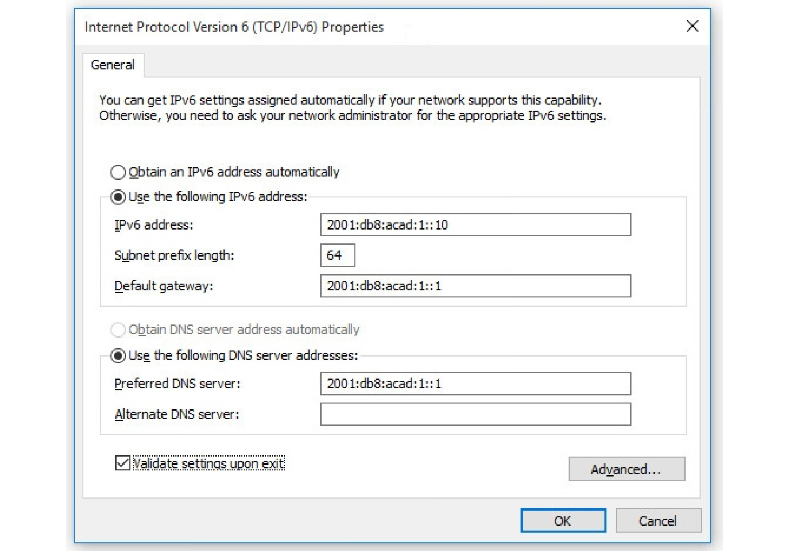

<!-- 8.1.1 -->
## Конфигурация узла IPv6

Начнем с главного. Чтобы использовать автоконфигурацию адресов без состояния (SLAAC) или DHCPv6, необходимо просмотреть глобальные одноадресные адреса (GUA) и локальные адреса канала (LLA). Этот раздел охватывает и то, и другое.

На маршрутизаторе глобальный одноадресный адрес IPv6 настраивается вручную с помощью команды конфигурации интерфейса **ipv6 address** _ipv6-address/prefix-length_.

Узел Windows также может быть настроен вручную с помощью конфигурации адреса GUA IPv6, как показано на рисунке.




Ввод GUA IPv6 вручную может занять много времени и несколько подвержен ошибкам. Таким образом, большинство хостов Windows имеют возможность динамически приобретать конфигурацию GUA IPv6, как показано на рисунке.


<!-- 8.1.2 -->
## IPv6 Локальный адрес канала хоста

Если выбрана автоматическая адресация IPv6, хост попытается автоматически получить и настроить информацию об адресах IPv6 на интерфейсе. Хост будет использовать один из трех методов, определенных в сообщении Router Advertisement (RA), полученном на интерфейсе протокола управления сообщениями (Internet Control Message Protocol версии 6 (ICMPv6). Маршрутизатор IPv6, находящийся по той же ссылке, что и хост, отправляет сообщения RA, которые предлагают хостам, как получить информацию об адресации IPv6. Локальный адрес канала IPv6 автоматически создается хостом при загрузке и активном интерфейсе Ethernet. Пример **ipconfig** выходных данных показывает автоматически сгенерированный адрес связи (LLA) на интерфейсе.

На рисунке обратите внимание, что интерфейс не создал GUA IPv6. Причина заключается в том, что в данном примере сегмент сети не имеет маршрутизатора для предоставления инструкций по настройке сети для узла.

**Примечание:** Операционные системы иногда показывают локальный адрес связи, добавляемый «%» и числом. Это называется идентификатором зоны или идентификатором области. Он используется ОС для связывания LLA с определенным интерфейсом.

**Примечание**: Протокол DHCPv6 определяется в RFC 3315.

```
C:\PC1> ipconfig
Windows IP Configuration
Ethernet adapter Ethernet0:
   Connection-specific DNS Suffix  . : 
   IPv6 Address. . . . . . . . . . . : 
   Link-local IPv6 Address . . . . . : fe80::fb:1d54:839f:f595%21
   IPv4 Address. . . . . . . . . . . : 169.254.202.140
   Subnet Mask . . . . . . . . . . . : 255.255.0.0
   Default Gateway . . . . . . . . . : 
C:\PC1>
```

<!-- 8.1.3 -->
## Назначение GUA IPv6

IPv6 был разработан, чтобы упростить способ получения хостом конфигурации IPv6. По умолчанию маршрутизатор с поддержкой IPv6 объявляет информацию IPv6. Это позволяет хосту динамически создавать или получать конфигурацию IPv6.

GUA IPv6 может быть назначен динамически с помощью служб без состояния и с отслеживанием состояния, как показано на рисунке.

Все методы без состояния и с отслеживанием состояния в этом модуле используют ICMPv6 RA сообщения, чтобы предложить хосту, как создать или получить его конфигурацию IPv6. Хотя операционные системы следуют предложению RA, фактическое решение в конечном итоге зависит от хоста.


<!-- 8.1.4 -->
## Три флага сообщений RA

Решение о том, как клиент получит GUA IPv6, зависит от настроек в сообщении RA.

Сообщение ICMPv6 RA содержит три флага для определения динамических параметров, доступных узлу:

* **Флаг А** - это флаг автонастройки адреса. Автоматическая конфигурация адреса без сохранения состояния (Stateless Address Autoconfiguration, SLAAC) для создания IPv6 GUA.
* **Флаг Other Configuration (флаг O)** - это флаг конфигурации Other. Другая информация доступна с сервера DHCPv6 без состояния.
* **Флаг Managed Address Configuration (флаг M)** -это флаг настройки управляемого (managed) адреса. Используйте сервер DHCPv6 с сохранением состояния для получения GUA IPv6.

Используя различные комбинации флагов A, O и M, сообщения RA информируют хост о доступных динамических параметрах.

На рисунке показаны эти три метода.


<!-- 8.1.5 -->
<!-- quiz -->