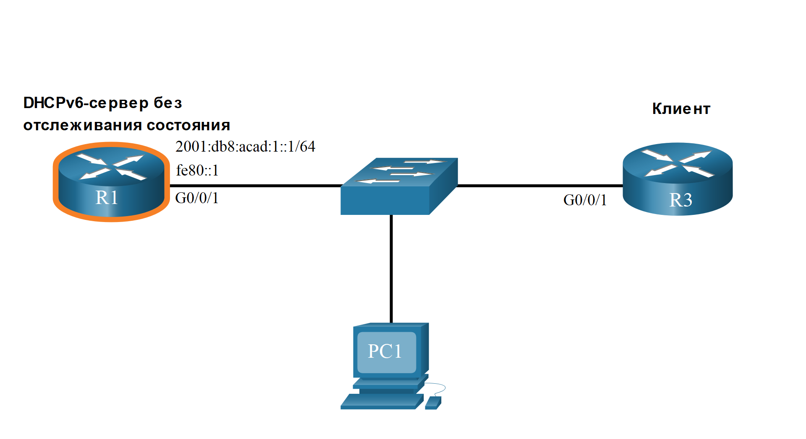

<!-- 8.4.1 -->
## Роли маршрутизатора DHCPv6

Маршрутизаторы Cisco IOS являются мощными устройствами. В небольших сетях нет необходимости иметь отдельные устройства, чтобы иметь DHCPv6 сервер, клиент или агент ретрансляции. Маршрутизатор Cisco можно настроить для предоставления служб DHCPv6.

В частности, он может быть настроен следующим образом:

* **DHCPv6 сервер** - Маршрутизатор предоставляет службы DHCPv6 без сохранения состояния или с сохранением состояния.
* **DHCPv6-клиент** - Интерфейс маршрутизатора получает конфигурацию IPv6 IP с сервера DHCPv6.
* **DHCPv6 Relay Agent** - Маршрутизатор предоставляет услуги переадресации DHCPv6, когда клиент и сервер находятся в разных сетях.

<!-- 8.4.2 -->
## Настройка маршрутизатора в качестве DHCPv6-сервера без отслеживания состояния

Параметр DHCPv6 сервера без учета состояния требует, чтобы маршрутизатор объявлял информацию о сетевой адресации IPv6 в сообщениях RA. Тем не менее клиент должен обратиться к DHCPv6 сервер для получения дополнительных сведений.

Обратитесь к примеру топологии, чтобы узнать, как настроить метод сервера DHCPv6 без сохранения состояния.




В этом примере R1 предоставляет службы SLAAC для конфигурации узла IPv6 и служб DHCPv6.

Для настройки и проверки маршрутизатора как DHCPv6 без состояния сервера DHCPv6 необходимо выполнить пять шагов:

**Шаг 1**. Включите маршрутизацию IPv6.  
**Шаг 2**. Определите имя пула DHCPv6.  
**Шаг 3**. Создайте DHCPv6-пула  
**Шаг 4**. Привяжите пул DHCPv6 к интерфейсу.  
**Шаг 5**. Убедитесь, что узлы получили сведения об IPv6-адресации. 

**Шаг 1. Включите маршрутизацию IPv6.**

Для активации IPv6-маршрутизации необходимо выполнить команду **ipv6 unicast-routing**. Выполнение этой команды не является необходимым для настройки маршрутизатора в качестве DHCPv6-сервера без отслеживания состояния, но требуется для маршрутизатора, чтобы отправлять сообщения RA по протоколу ICMPv6.

```
R1(config)# ipv6 unicast-routing
R1(config)# 
```

**Шаг 2. Определите имя пула DHCPv6.**

Создайте пул DHCPv6 с помощью команды глобальной конфигурации **ipv6 dhcp pool** _POOL-NAME_. Это входит в режим подконфигурации пула DHCPv6, как указано в приглашении **Router(config-dhcpv6)#** .

**Примечание:** Имя пула не обязательно должно быть прописным буквами. Однако использование имени в верхнем регистре облегчает его просмотр в конфигурации.

```
R1(config)# ipv6 dhcp pool IPV6-STATELESS
R1(config-dhcpv6)#
```

**Шаг 3. Создайте DHCPv6-пула.**

R1 будет настроен на предоставление дополнительной информации DHCP, включая адрес DNS-сервера и имя домена, как показано в выходных данных команды.

```
R1(config-dhcpv6)# dns-server 2001:db8:acad:1::254 
R1(config-dhcpv6)# domain-name example.com
R1(config-dhcpv6)# exit
R1(config)#
```

**Шаг 4. Привяжите пул DHCPv6 к интерфейсу.**

Пул DHCPv6 должен быть привязан к интерфейсу с помощью команды конфигурации интерфейса **ipv6 dhcp server** _POOL-NAME_, как показано в выходных данных.

Маршрутизатор отвечает на DHCPv6-запросы на этом интерфейсе информацией, содержащейся в пуле. Значение флага O необходимо изменить с 0 на 1, используя команду интерфейса **ipv6 nd other-config-flag**. Сообщения RA, отправленные на этот интерфейс, указывают, что дополнительная информация доступна на DHCPv6-сервере без отслеживания состояния. Флаг A по умолчанию равен 1, что указывает клиентам использовать SLAAC для создания собственного GUA.

```
R1(config)# interface GigabitEthernet0/0/1
R1(config-if)# description Link to LAN
R1(config-if)# ipv6 address fe80::1 link-local
R1(config-if)# ipv6 address 2001:db8:acad:1::1/64
R1(config-if)# ipv6 nd other-config-flag
R1(config-if)# ipv6 dhcp server IPV6-STATELESS
R1(config-if)# no shut
R1(config-if)# end
R1#
```

**Шаг 5. Убедитесь, что узлы получили сведения об IPv6-адресации.**

Чтобы проверить состояние DHCP на узле Windows, используйте эту команду **ipconfig /all**. В примере выходных данных отображаются настройки на PC1.

Обратите внимание на вывод, что PC1 создал свой GUA IPv6 с помощью префикса 2001:db8:acad:1::/64. Также обратите внимание, что шлюзом по умолчанию является локальный адрес канала IPv6 R1. Это подтверждает, что PC1 получает конфигурацию IPv6 из RA R1.

Выделенные выходные данные подтверждают, что PC1 узнал имя домена и адрес DNS-сервера с сервера DHCPv6 без состояния.

```
C:\PC1> ipconfig /all
Windows IP Configuration
Ethernet adapter Ethernet0:
   Connection-specific DNS Suffix . : example.com
   Description . . . . . . . . . . . : Intel(R) 82574L Gigabit Network Connection
   Physical Address. . . . . . . . . : 00-05-9A-3C-7A-00
   DHCP Enabled. . . . . . . . . . . : Yes
   Autoconfiguration Enabled . . . . : Yes
   IPv6 Address. . . . . . . . . . . : 2001:db8:acad:1:1dd:a2ea:66e7 Preferred)
   Локальный адрес канала IPv6. . . . . : fe80::fb:1d54:839f:f595%21(Preferred)
   IPv4 Address. . . . . . . . . . . : 169.254.102.23 (Preferred)
   Subnet Mask . . . . . . . . . . . : 255.255.0.0
   Default Gateway . . . . . . . . .: fe80።1%6
   DHCPv6 IAID . . . . . . . . . . . : 318768538
   DHCPv6 Client DUID. . . . . . . . : 00-01-00-01-21-F3-76-54-E1-AD-DA-9A
   DNS Servers . . . . . . . . . . . : 2001:db8:acad:1። 1
   NetBIOS over Tcpip. . . . . . . . : Enabled
C:\PC1>
```

<!-- 8.4.3 -->
## Настройка маршрутизатора в качестве DHCPv6-сервера без отслеживания состояния

Маршрутизатор также может быть клиентом DHCPv6 и получать конфигурацию IPv6 с сервера DHCPv6, например маршрутизатор, функционирующий в качестве сервера DHCPv6. На рисунке R1 в качестве DHCPv6-сервера без отслеживания состояния.


Для настройки и проверки маршрутизатора как DHCPv6 без сохранения состояния сервера DHCPv6 необходимо выполнить пять шагов.

**Шаг 1**. Включите маршрутизацию IPv6.  
**Шаг 2**. Настройте клиентский маршрутизатор для создания LLA.  
**Шаг 3**. Настройте клиентский маршрутизатор на использование SLAAC.  
**Шаг 4**. Убедитесь, что клиентскому маршрутизатору назначен GUA.  
**Шаг 5**. Убедитесь, что клиентский маршрутизатор получил другую необходимую информацию DHCPv6.

**Шаг 1. Включите маршрутизацию IPv6.**

На клиентском маршрутизаторе DHCPv6 должно быть включена команда **ipv6 unicast-routing**.

```
R3(config)# ipv6 unicast-routing
R3(config)#
```

**Шаг 2. Настройте клиентский маршрутизатор для создания LLA.**

Клиентский маршрутизатор должен иметь локальный адрес канала. Локальный адрес канала IPv6 создается на интерфейсе маршрутизатора при настройке глобального одноадресного адреса. Он также может быть создан без GUA с помощью команды конфигурации интерфейса **ipv6 enable**. Cisco IOS использует EUI-64 для создания случайного идентификатора интерфейса.

В примере команда **ipv6 enable** настраивается на интерфейсе Gigabit Ethernet 0/0/1 клиентского маршрутизатора R3.

```
R3(config)# interface g0/0/1
R3(config-if)# ipv6 enable
R3(config-if)# 
```

**Шаг 3. Настройте клиентский маршрутизатор на использование SLAAC.**

Клиентский маршрутизатор должен быть настроен на использование SLAAC для создания конфигурации IPv6. Команда **ipv6 address autoconfig** включает автоматическую настройку IPv6-адресации с использованием SLAAC.

```
R3(config-if)# ipv6 address autoconfig
R3(config-if)# end
R3#
```

**Шаг 4. Убедитесь, что клиентскому маршрутизатору назначен GUA.**

Используйте эту команду **show ipv6 interface brief** для проверки конфигурации узла, как показано на иллюстрации. Выходные данные подтверждают, что интерфейсу G0/0/1 на R3 был назначен допустимый GUA.

**Примечание**: интерфейсу может потребоваться несколько секунд для завершения процесса.

```
R3# show ipv6 interface brief
GigabitEthernet0/0/0   [up/up]
    unassigned
GigabitEthernet0/0/1   [up/up]
    FE80::2FC:BAFF:FE94:29B1
    2001:DB8:ACAD:1:2FC:BAFF:FE94:29B1
Serial0/1/0            [up/up]
    unassigned
Serial0/1/1            [up/up]
    unassigned
R3#
```

**Шаг 5. Убедитесь, что клиентский маршрутизатор получил другую необходимую информацию DHCPv6.**

 Команда **show ipv6 dhcp interface g0/0/1** подтверждает, что DNS-имена и доменные имена также были изучены маршрутизатором R3.

```
R3# show ipv6 dhcp interface g0/0/1
GigabitEthernet0/0/1 is in client mode
  Prefix State is IDLE (0)
  Information refresh timer expires in 23:56:06
  Address State is IDLE
  List of known servers:
    Reachable via address: FE80::1
    DUID: 000300017079B3923640
    Preference: 0
    Configuration parameters:
      DNS server: 2001:DB8:ACAD:1::254
      Domain name: example.com
      Information refresh time: 0
  Prefix Rapid-Commit: disabled
  Address Rapid-Commit: disabled
R3#
```

<!-- 8.4.4 -->
## Настройка маршрутизатора в качестве сервера DHCPv6 с отслеживанием состояния

Параметр DHCP-сервер с отслеживанием состояния требует, чтобы маршрутизатор с поддержкой IPv6 сообщил узлу связаться с сервером DHCPv6 для получения всех необходимых сведений о сетевой адресации IPv6.

На рисунке R1 будет предоставлять службы DHCPv6 с сохранением состояния для всех узлов в локальной сети. Настройка DHCPv6-сервера с отслеживанием состояния аналогична настройке сервера без отслеживания состояния. Наиболее значительным отличием является то, что сервер с отслеживанием состояния также является источником информации об IPv6-адресации, как и сервер DHCPv4.


Для настройки и проверки маршрутизатора как DHCPv6 без состояния сервера DHCPv6 необходимо выполнить пять шагов:

**Шаг 1**. Включите маршрутизацию IPv6.  
**Шаг 2**. Определите имя пула DHCPv6.  
**Шаг 3**. Создайте DHCPv6-пул  
**Шаг 4**. Привяжите пул DHCPv6 к интерфейсу.  
**Шаг 5**. Убедитесь, что узлы получили сведения об IPv6-адресации. 

**Шаг 1. Включите маршрутизацию IPv6.**

Для активации IPv6-маршрутизации необходимо выполнить команду **ipv6 unicast-routing**.

```
R1(config)# ipv6 unicast-routing
R1(config)# 
```

**Шаг 2. Определите имя пула DHCPv6.**

Создайте пул DHCPv6 с помощью команды глобальной конфигурации **ipv6 dhcp pool** _POOL-NAME_.

```
R1(config)# ipv6 dhcp pool IPV6-STATEFUL
R1(config-dhcpv6)#
```

**Шаг 3. Создайте DHCPv6-пул.**

R1 будет настроен на предоставление IPv6 адресации, адреса DNS-сервера и имени домена, как показано в выходных данных команды. При использовании DHCPv6 с отслеживанием состояния все параметры адресации и другие параметры конфигурации должны назначаться сервером DHCPv6. Команда **address prefix** используется для обозначения адресного пула, из которого сервер будет выделять адреса. Другая информация, предоставленная DHCPv6-сервером с отслеживанием состояния, обычно включает адрес DNS-сервера и доменное имя.

**Примечание**: В этом примере устанавливается DNS-сервер на общедоступный DNS-сервер Google.

```
R1(config-dhcpv6)# address prefix 2001:db8:acad:1::/64
R1(config-dhcpv6)# dns-server 2001:4860:4860::8888
R1(config-dhcpv6)# domain-name example.com
R1(config-dhcpv6)#
```

**Шаг 4. Привяжите пул DHCPv6 к интерфейсу.**

В примере показана полная конфигурация интерфейса GigabitEthernet 0/0/1 на R1.

Пул DHCPv6 должен быть привязан к интерфейсу с помощью команды конфигурации интерфейса **ipv6 dhcp server** _POOL-NAME_.

* Вручную измените флаг M с 0 на 1, используя интерфейс команды **ipv6 nd managed-config-flag**.  
* Вручную измените флаг A с 1 на 0, используя интерфейс команды **ipv6 nd prefix default no-autoconfig**. Флаг A можно оставить на отметке 1, но некоторые клиентские операционные системы, такие как Windows, создадут GUA с помощью SLAAC и получат GUA с сервера DHCPv6 с сохранением состояния. Установка флага A на 0 указывает клиенту не использовать SLAAC для создания GUA.  
* **ipv6 dhcp server** привязывает пул DHCPv6 к интерфейсу. Теперь R1 будет отвечать информацией, содержащейся в пуле, когда он получает запросы DHCPv6 с сохранением состояния на этом интерфейсе.

**Примечание:** Вы можете использовать **no ipv6 nd managed-config-flag**, чтобы установить для флага M значение по умолчанию, равное 0. Команда **no ipv6 nd prefix default no-autoconfig** команда присваивает флаг A обратно его значение по умолчанию 1.

```
R1(config)# интерфейс GigabitEthernet0/0/1
R1(config-if)# description Link to LAN
R1(config-if)# ipv6 address fe80::1 link-local
R1(config-if)# ipv6 address 2001:db8:acad:1::1/64
R1(config-if)# ipv6 nd managed-config-flag
R1(config-if)# ipv6 nd prefix default no-autoconfig
R1(config-if)# ipv6 dhcp server IPV6-STATEFUL
R1(config-if)# no shut
R1(config-if)# end
R1#
```

**Шаг 5. Убедитесь, что узлы получили сведения об IPv6-адресации.**

Чтобы проверить на узле Windows, используйте команду **ipconfig /all** для проверки метода DHCP без сохранения состояний. Выходные данные отображают настройки на PC1. Выделенные выходные данные показывают, что PC1 получил свой IPv6 GUA от сервера DHCPv6 с сохранением состояния.

```
C:\PC1> ipconfig /all
Windows IP Configuration
Ethernet adapter Ethernet0:
   Connection-specific DNS Suffix . : example.com
   Description . . . . . . . . . . . : IntelI 82574L Gigabit Network Connection
   Physical Address. . . . . . . . . : 00-05-9A-3C-7A-00
   DHCP Enabled. . . . . . . . . . . : Yes
   Autoconfiguration Enabled . . . . : Yes
   IPv6 Address. . . . . . . . . . . : 2001:db8:acad:1a43c:fd28:9d79:9e42 (Preferred)
   Lease Obtained. . . . . . . . . . : Saturday, September 27, 2019, 10:45:30 AM
   Lease Expires . . . . . . . . . . : Monday, September 29, 2019 10:05:04 AM
   Локальный адрес канала IPv6. . . . . : fe80::192f:6fbc:9db:b749%6(Preferred)
   Autoconfiguration IPv4 Address. . : 169.254.102.73 (Preferred)
   Subnet Mask . . . . . . . . . . . : 255.255.0.0
   Default Gateway . . . . . . . . .: fe80።1%6
   DHCPv6 IAID . . . . . . . . . . . : 318768538
   DHCPv6 Client DUID. . . . . . . . : 00-01-00-01-21-F3-76-54-E1-AD-DA-9A
   DNS Servers . . . . . . . . . . . : 2001:4860:4860። 8888
   NetBIOS over Tcpip. . . . . . . . : Включен
C:\PC1>
```

<!-- 8.4.5 -->
## Конфигурация клиента DHCPv6 с сохранением состояния

Маршрутизатор также может быть клиентом DHCPv6. Клиентский маршрутизатор должен включить **ipv6 unicast-routing** и локальный адрес канала IPv6 для отправки и получения сообщений IPv6.

Обратитесь к примеру топологии, чтобы узнать, как настроить клиент DHCPv6 с сохранением состояния.


Для настройки и проверки маршрутизатора как DHCPv6 без сохранения состояния сервера DHCPv6 необходимо выполнить пять шагов.

**Шаг 1**. Включите маршрутизацию IPv6.   
**Шаг 2**. Настройте клиентский маршрутизатор для создания LLA.   
**Шаг 3**. Настройте клиентский маршрутизатор на использование DHCPv6.   
**Шаг 4**. Убедитесь, что клиентскому маршрутизатору назначен GUA.   
**Шаг 5**. Убедитесь, что клиентский маршрутизатор получил другую необходимую информацию DHCPv6.  

**Шаг 1. Включите маршрутизацию IPv6.**

На клиентском маршрутизаторе DHCPv6 должно быть включена команда **ipv6 unicast-routing**.

```
R3(config)# ipv6 unicast-routing
R3(config)#
```

**Шаг 2. Настройте клиентский маршрутизатор для создания LLA.**

В выходных данных **ipv6 enable** команда настраивается на интерфейсе R3 Gigabit Ethernet 0/0/1. Это позволяет маршрутизатору создавать протокол LLA IPv6 без необходимости GUA.

```
R3(config)# interface g0/0/1
R3(config-if)# ipv6 enable
R3(config-if)# 
```

**Шаг 3. Настройте клиентский маршрутизатор на использование DHCPv6.**

Команда **ipv6 address dhcp** настраивает R3 для получения информации об адресации IPv6 с сервера DHCPv6.

```
R3(config-if)# ipv6 address dhcp
R3(config-if)# end
R3#
```

**Шаг 4. Убедитесь, что клиентскому маршрутизатору назначен GUA.**

Используйте эту команду **show ipv6 interface brief** для проверки конфигурации узла, как показано на иллюстрации.

```
R3# show ipv6 interface brief
GigabitEthernet0/0/0   [up/up]
    unassigned
GigabitEthernet0/0/1   [up/up]
    FE80::2FC:BAFF:FE94:29B1
    2001:DB8:ACAD:1:B4CB:25FA:3C9:747C
Serial0/1/0            [up/up]
    unassigned
Serial0/1/1            [up/up]
    unassigned
R3#
```

**Шаг 5. Убедитесь, что клиентский маршрутизатор получил другую необходимую информацию DHCPv6.**

Команда **show ipv6 dhcp interface g0/0/1** подтверждает, что DNS-имена и доменные имена также были изучены маршрутизатором R3.

```
R3# show ipv6 dhcp interface g0/0/1
GigabitEthernet0/0/1 is in client mode
  Prefix State is IDLE
  Address State is OPEN
  Renew for address will be sent in 11:56:33
  List of known servers:
    Reachable via address: FE80::1
    DUID: 000300017079B3923640
    Preference: 0
    Configuration parameters:
      IA NA: IA ID 0x00060001, T1 43200, T2 69120
        Address: 2001:DB8:ACAD:1:B4CB:25FA:3C9:747C/128
                preferred lifetime 86400, valid lifetime 172800
                expires at Sep 29 2019 11:52 AM (172593 seconds)
      DNS server: 2001:4860:4860::8888
      Domain name: example.com
      Information refresh time: 0
  Prefix Rapid-Commit: disabled
  Address Rapid-Commit: disabled
R3#
```

<!-- 8.4.6 -->
## Команды проверки DHCPv6 сервера 

Используйте команды **show ipv6 dhcp pool** и **show ipv6 dhcp binding** для проверки работы DHCPv6 на маршрутизаторе.

**show ipv6 dhcp pool**

Спомощью команды **show ipv6 dhcp pool** можно проверить имя DHCPv6-пула и его параметры. Команда также определяет количество активных клиентов. В этом примере пул IPV6-STATEFUL в настоящее время имеет 2 клиента, что отражает получение PC1 и R3 их глобального одноадресного адреса IPv6 с этого сервера.

Когда маршрутизатор предоставляет службы DHCPv6 с сохранением состояния, он также поддерживает базу данных назначенных адресов IPv6.

```
R1# show ipv6 dhcp pool
DHCPv6 pool: IPV6-STATEFUL
  Address allocation prefix: 2001:DB8:ACAD:1::/64 valid 172800 preferred 86400 (2 in use,  0 conflicts)
  DNS server: 2001:4860:4860::8888 Domain name: example.com Active clients: 2
R1#
```

**show ipv6 dhcp binding**

Выходные данные команды **show ipv6 dhcp binding** используются для отображения локального адреса канала IPv6 клиента и глобального одноадресного адреса, назначенного сервером.

Выходные данные отображают текущую привязку с состоянием на R1. Первым клиентом на выходе является PC1, а вторым — R3.

Данная информация обеспечивается DHCPv6-сервером с отслеживанием состояния и не поддерживается DHCPv6-сервером без отслеживания состояния. Сервер DHCPv6 без состояния не будет поддерживать эту информацию.

```
R1# show ipv6 dhcp binding Client: FE80::192F:6FBC:9DB:B749
  DUID: 0001000125148183005056B327D6
  Username : unassigned
  VRF : default
  IA NA: IA ID 0x03000C29, T1 43200, T2 69120
    Адрес: 2001:DB8:ACAD:1:A43C:FD 28:9 D 79:9 E42
            preferred lifetime 86400, valid lifetime 172800
            expires at Sep 27 2019 09:10 AM (171192 seconds)
Client: FE80::2FC:BAFF:FE94:29B1
  DUID: 0003000100FCBA9429B0
  Username : unassigned
  VRF : default
  IA NA: IA ID 0x00060001, T1 43200, T2 69120
    Address: 2001:DB8:ACAD:1:B4CB:25FA:3C9:747C
            preferred lifetime 86400, valid lifetime 172800
            expires at Sep 27 2019 09:29 AM (172339 seconds)
R1#
```

<!-- 8.4.7 -->
## Настройка маршрутизатора в качестве агента ретрансляции DHCPv6

В случае если DHCPv6-сервер расположен с клиентом в разных сетях, в качестве агента DHCPv6-ретрансляции можно настроить маршрутизатор IPv6. Настройка агента DHCPv6-ретрансляции аналогична настройке IPv4-маршрутизатора в качестве агента DHCPv4-ретрансляции.

На рисунке R3 настроен как сервер DHCPv6 с сохранением состояния. PC1 находится в сети 2001:db8:acad:2::/64 и требует службы DHCPv6 сервера с сохранением состояния для получения конфигурации IPv6. R1 должен быть настроен как агент ретрансляции DHCPv6.


Синтаксис команды для настройки маршрутизатора в качестве агента ретрансляции DHCPv6 выглядит следующим образом:

```
Router(config-if)# ipv6 dhcp relay destination ipv6-address [interface-type interface-number]
```

Эта команда настраивается на интерфейсе, обращенном к клиентам DHCPv6, и указывает адрес сервера DHCPv6 и исходящий интерфейс для доступа к серверу, как показано в выходных данных. Исходящего интерфейса требуется только в том случае, если адрес следующего перехода является LLA.

```
R1(config)# interface gigabitethernet 0/0/1
R1(config-if)# ipv6 dhcp relay destination 2001:db8:acad:1::2 G0/0/0
R1(config-if)# exit
R1(config)#
```

<!-- 8.4.8 -->
## Проверка агента ретрансляции DHCPv6

Убедитесь, что агент ретрансляции DHCPv6 работает командами **show ipv6 dhcp interface** и **show ipv6 dhcp binding**. Проверьте, что хосты Windows получили информацию об адресации IPv6 с помощью команды **ipconfig /all**. 

**show ipv6 dhcp interface**

Настройку агента ретрансляции DHCPv6 можно проверить с помощью  команды **show ipv6 dhcp interface**. Это позволит проверить, что интерфейс G0/0/1 находится в режиме ретрансляции.

```
R1# show ipv6 dhcp  interface   GigabitEthernet0/0/1 is in relay mode
  Relay destinations:
    2001:DB8:ACAD:1። 2
    2001:DB8:ACAD:1::2 via GigabitEthernet0/0/0
R1#
```

**show ipv6 dhcp binding**

На R3 используйте команду **show ipv6 dhcp binding command** чтобы проверить, была ли какимлибо узлам назначена конфигурация IPv6.

Обратите внимание, что локальный адрес клиентского канала был назначен GUA IPv6. Можно предположить, что это PC1.

```
R3# show ipv6 dhcp binding
Client: FE80::5C43:EE7C:2959:DA68
  DUID: 0001000124F5CEA2005056B36D
  Username : unassigned
  VRF : default
  IA NA: IA ID 0x03000C29, T1 43200, T2 69120
    Address: 2001:DB8:ACAD:2:9C3C:64DE:AADA:7857
            preferred lifetime 86400, valid lifetime 172800
            expires at Sep 29 2019 08:26 PM (172710 seconds)
R3#
```

**ipconfig /all**

Наконец, используйте **ipconfig /all** на PC1 для подтверждения того, что ему назначена конфигурация IPv6. Как вы можете видеть, PC1 действительно получил конфигурацию IPv6 от DHCPv6 сервера.

```
C:\PC1> ipconfig /all
Windows IP Configuration
Ethernet adapter Ethernet0:
   Connection-specific DNS Suffix . : example.com
   Description . . . . . . . . . . . : Intel(R) 82574L Gigabit Network Connection
   Physical Address. . . . . . . . . : 00-05-9A-3C-7A-00
   DHCP Enabled. . . . . . . . . . . : Yes
   Autoconfiguration Enabled . . . . : Yes
   IPv6 Address. . . . . . . . . . . : 2001:db8:acad:2:9c3c:64de:aada:7857 (Preferred)
   Локальный адрес канала IPv6 . . . . .:fe80::5c43:ee7c:2959:da68%6(Preferred)
   Lease Obtained . . . . . . . . . : Saturday, September 27, 2019, 11:45:30 AM
   Lease Expires . . . . . . . . . . : Monday, September 29, 2019 11:05:04 AM
   IPv4 Address. . . . . . . . . . . : 169.254.102.73 (Preferred)
   Subnet Mask . . . . . . . . . . . : 255.255.0.0
   Default Gateway . . . . . . . . .: fe80።1%6
   DHCPv6 IAID . . . . . . . . . . . : 318768538
   DHCPv6 Client DUID. . . . . . . . : 00-01-00-01-21-F3-76-54-E1-AD-DA-9A
   DNS Servers . . . . . . . . . . . : 2001:4860:4860። 8888
   NetBIOS over Tcpip. . . . . . . . : Enabled
C:\PC1>
```

<!-- 8.4.9 -->
<!-- quiz -->