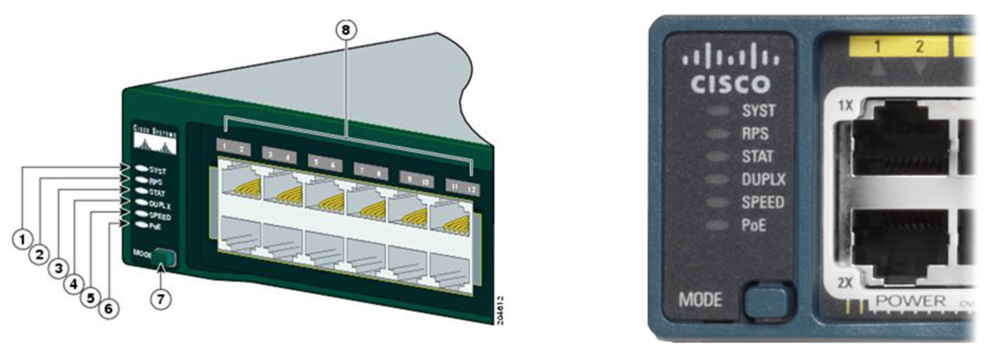
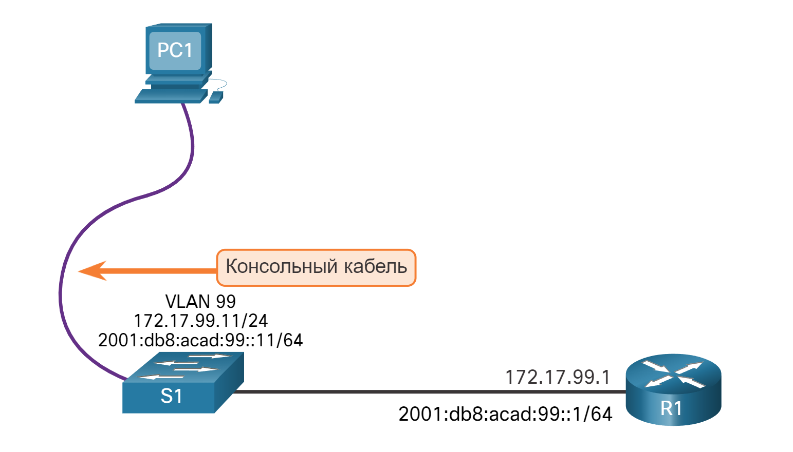

# Первоначальная настройка коммутатора

<!-- 1.1.1 -->
## Последовательность загрузки коммутатора
Перед настройкой коммутатора необходимо включить его и разрешить ему пройти через пять шагов последовательности загрузки. Этот раздел посвящен основам настройки коммутатора и включает в себя лабораторную работу в конце.

После включения коммутатор Cisco проходит следующие стадии загрузки:

**Шаг 1**: Во-первых, коммутатор загружает программу самопроверки питания (POST), хранящуюся в ПЗУ. POST проверяет подсистему CPU. Он проверяет процессор, DRAM и часть флэш-устройства, которая составляет файловую систему флэш-памяти.
**Шаг 2**: После этого на коммутаторе запускается программное обеспечение начального загрузчика. Начальный загрузчик — это небольшая программа, которая хранится в ПЗУ и запускается сразу после успешного завершения проверки POST.
**Шаг 3**: Начальный загрузчик выполняет низкоуровневую инициализацию центрального процессора. Он инициализирует регистры ЦП, которые контролируют место отображения физической памяти, количество памяти и ее скорость.
**Шаг 4**: Затем программа запускает файловую систему флеш-памяти на материнской плате.
**Шаг 5**: Наконец, начальный загрузчик находит и загружает образ операционной системы IOS по умолчанию и передает ей управление коммутатором.


<!-- 1.1.2 -->
## Команда "boot system"

Он пытается выполнить автоматическую загрузку, используя информацию из переменной для среды BOOT. Если эта переменная не установлена, коммутатор пытается загрузить и выполнить первый исполняемый файл, который он может найти. На коммутаторах Catalyst серии 2960 файл образа обычно содержится в каталоге с тем же именем, что и файл образа (за исключением расширения.bin).

Затем операционная система IOS инициализирует интерфейсы, используя команды Cisco IOS из файла загрузочной конфигурации, который хранится в энергонезависимом ОЗУ (NVRAM). Файл startup-config называется **config.text** и находится во флэш-памяти.

В примере переменная среды BOOT задается с помощью команды режима глобальной конфигурации **boot system**. Обратите внимание, что IOS находится в отдельной папке и указан путь к папке. Используйте команду **show boot**, чтобы узнать, как настроен файл текущей загрузки IOS.

```S1(config)# boot system flash:/c2960-lanbasek9-mz.150-2.SE/c2960-lanbasek9-mz.150-2.SE.bin```

Таблица определяет каждую часть команды **boot system**.

| Команда | Определение |
| --- | --- |
| **boot system** | Основная команда |
| **flash:** | Устройство хранения |
| **c2960-lanbasek9-mz.150-2.SE/** | Путь к файловой системе |
| **c2960-lanbasek9-mz.150-2.SE.bin** | Имя файла IOS |


<!-- 1.1.3 -->
## Светодиодные индикаторы коммутатора
Коммутаторы Cisco Catalyst оснащены несколькими индикаторами состояния. Индикаторы коммутатора позволяют быстро оценить активность и производительность коммутатора. Коммутаторы различных моделей и наборов характеристик имеют разные светодиоды, и их размещение на передней панели коммутатора также может отличаться.

На рисунке показаны светодиоды коммутатора и кнопка Mode для коммутатора Cisco Catalyst 2960.



Кнопка Mode (7 на рисунке) используется для переключения состояния порта, дуплексного режима порта, скорости порта и, если поддерживается, состояния Power over Ethernet (PoE) светодиодов порта (8 на рисунке).

### 1 SYST

Системный индикатор показывает, есть ли питание системы и функционирует ли она должным образом. Если светодиод выключен, это означает, что система не включена. Если индикатор горит зеленым цветом, то вентиляторы работают нормально. Если индикатор горит желтым, система получает питание, но работает с перебоями.

### 2 RPS

Показывает статус RPS. Если этот индикатор не горит, то система RPS выключена или подключена неправильно. Если индикатор горит зеленым, то резервный источник питания подключен и готов к обеспечению резервного питания. Если индикатор мигает зеленым, то RPS подключена, но недоступна, поскольку обеспечивает питание другому устройству. Если индикатор горит желтым, то резервный источник питания находится в режиме ожидания или неисправен. Если индикатор мигает желтым, произошел сбой внутреннего блока питания коммутатора и резервный источник питания обеспечивает питание коммутатора.

### 3 STAT

Указывает, что режим статуса порта выбран при зеленом светодиоде. Данный режим является режимом по умолчанию. Если выбран этот параметр, светодиоды портов будут отображать цвета с различным значением. Не светится — нет связи или порт отключен администратором. Если светодиод зеленый, то канал активный. Если светодиод мигает зеленым цветом, есть активность на порту и порт отправляет или принимает данные. Если светодиод чередуется зелено-янтарный, указывает, что есть ошибка соединения. Если индикатор горит желтым, то порт заблокирован, чтобы гарантировать отсутствие петли в домене пересылки (обычно порты находятся в этом состоянии в течение первых 30 секунд после активации). Если светодиод мигает желтым, порт блокируется для предотвращения возможной петли в широковещательном домене.

### 4 DUPLX

Указывает, что режим дуплексного порта выбран при зеленом светодиоде. Если выбран этот параметр, отключаемые светодиоды портов находятся в полудуплексном режиме. Если светодиод порта зеленый, порт находится в полнодуплексном режиме.

### 5 SPEED

Индикатор скорости порта указывает выбранный режим скорости порта. Если выбран этот параметр, светодиоды портов будут отображать цвета с различным значением. Если индикатор не горит, порт работает на скорости 10 Мбит/с. Если индикатор горит зелёным, то порт работает на скорости 100 Мбит/с. Если индикатор мигает зелёным, то порт работает на скорости 1000 Мбит/с.

### 6 PoE

Если на устройстве поддерживается PoE, будет присутствовать светодиод режима PoE. Если светодиод выключен, он указывает, что режим PoE не выбран и что ни один из портов не был отключен или не был помещен в аварийное состояние. Если светодиод мигает желтым, режим PoE не выбран, но по крайней мере один из портов отключен или имеет сбой PoE. Если светодиод зеленый, он указывает, что выбран режим PoE, а светодиоды порта будут отображать цвета с разными значениями. Если светодиод порта выключен, PoE выключен. Если светодиод порта зеленый, PoE работает. Если индикатор порта мигает с зеленым и желтым, в PoE отказано, поскольку подача питания на устройство с питанием превысит выходную мощность коммутатора. Если светодиод мигает желтым, PoE выключен из-за неисправности. Если индикатор горит желтым, PoE для порта отключен.

<!-- 1.1.4 -->
## Восстановление после системного сбоя

Загрузчик предоставляет доступ к коммутатору, если операционная система не может быть использована из-за отсутствия или повреждения системных файлов. Загрузчик имеет командную строку, которая обеспечивает доступ к файлам, хранящимся во флэш-памяти.

Доступ в начальный загрузчик можно получить через консольное подключение, выполнив следующие действия:

**Шаг 1.** Подключите ПК через консольный кабель к консольному порту коммутатора. Настройте на ПК программу эмуляции терминалов для подключения к коммутатору.
**Шаг 2.** Отсоедините кабель питания коммутатора.
**Шаг 3.** Подключите шнур питания к коммутатору и в течение 15 секунд нажмите и удерживайте кнопку **Mode**, пока системный индикатор все еще мигает зеленым.
**Шаг 4.** Продолжайте удерживать **Mode** кнопку до тех пор, пока светодиод System не станет на мгновение желтым, а затем постояннм зеленым, а затем отпустите **Mode** кнопку.
**Шаг 5.** The boot loader **switch:** В эмуляторе терминала на ПК появится запрос **switch:** от начального загрузчика.

Введите **help** или **?** в командной строке загрузчика, чтобы просмотреть список доступных команд.

Он пытается выполнить автоматическую загрузку, используя информацию из переменной для среды BOOT. Для просмотра пути к переменным среды BOOT коммутатора введите команду **set**. Затем инициализируйте файловую систему флэш-памяти с помощью команды **flash_init** для просмотра текущих файлов во флэш-памяти, как показано на выходных данных.

```
switch: set
BOOT=flash:/c2960-lanbasek9-mz.122-55.SE7/c2960-lanbasek9-mz.122-55.SE7.bin
(output omitted)
switch: flash_init
Initializing Flash...
flashfs[0]: 2 files, 1 directories
flashfs[0]: 0 orphaned files, 0 orphaned directories
flashfs[0]: Total bytes: 32514048
flashfs[0]: Bytes used: 11838464
flashfs[0]: Bytes available: 20675584
flashfs[0]: flashfs fsck took 10 seconds.
...done Initializing Flash.
```

После завершения инициализации флэш-памяти вы можете ввести команду **dir flash:** для просмотра каталогов и файлов во флэш-памяти, как показано в выходных данных.

```
switch: dir flash: 
Directory of flash:/
    2  -rwx  11834846                 c2960-lanbasek9-mz.150-2.SE8.bin
    3  -rwx  2072                     multiple-fs
```

Введите команду **BOOT=flash**, чтобы изменить путь переменной среды **BOOT**, используемый коммутатором для загрузки нового IOS во флэш-памяти. Чтобы проверить путь к новой переменной среды **BOOT**, выполните **set** команду еще раз. Наконец, для загрузки нового IOS введите команду **boot** без каких-либо аргументов, как показано в выходных данных.

```
switch: BOOT=flash:c2960-lanbasek9-mz.150-2.SE8.bin
switch: set
BOOT=flash:c2960-lanbasek9-mz.150-2.SE8.bin
(output omitted)
switch: boot
```

Команды загрузчика поддерживают инициализацию флэш-памяти, форматирование флэш-памяти, установку нового IOS, изменение переменной среды BOOT и восстановление потерянных или забытых паролей.

<!-- 1.1.5 -->
## Доступ к управлению коммутатором

Чтобы подготовить коммутатор для доступа к удаленному управлению, он должен быть настроен с IP-адресом и маской подсети. Имейте в виду, что для управления коммутатором из удаленной сети на коммутаторе должен быть настроен на шлюз по умолчанию. Это очень похоже на настройку IP-адресов на хост-устройствах. На рисунке виртуальный интерфейс коммутатора (SVI) на S1 должен быть назначен IP-адрес. SVI — это виртуальный интерфейс, а не физический порт коммутатора. Кабель консоли используется для подключения к ПК, так что коммутатор может быть изначально настроен.



<!-- 1.1.6 -->
## Пример конфигурации коммутатора SVI

По умолчанию управляющий виртуальный интерфейс коммутатора управляется и настраивается через VLAN 1. По умолчанию все порты назначены во VLAN 1. В целях безопасности рекомендуется использовать VLAN, отличную от VLAN 1, для управляющей VLAN, , в данном примере VLAN 99.

### Шаг 1

**Настройка интерфейса управления**

Из режима конфигурации интерфейса VLAN IPv4-адрес и маска подсети применяются к управляющему SVI коммутатора.

**Примечание:** SVI для VLAN 99 не будет отображаться как «up/up», пока не будет создана VLAN 99 и не будет подключено устройство к порту коммутатора, связанному с VLAN 99 .

**Примечание:** Коммутатор можно настроить для IPv6. Например, перед настройкой адресации IPv6 на Cisco Catalyst 2960 под управлением IOS версии 15.0 необходимо ввести команду глобальной конфигурации, **sdm prefer dual-ipv4-and-ipv6 default** а затем **reload** коммутатор.

| Задача | Команды IOS |
| --- | --- |
| Войдите в режим глобальной настройки. | S1# **configure terminal** |
| Войдите в режим интерфейсной конфигурации для SVI. | S1(config)# **interface vlan 99** |
| Настройте IPv4-адрес интерфейса управления. | S1(config-if)# **ip address 172.17.99.11 255.255.255.0** |
| Настройте IPv6-адрес интерфейса управления. | S1(config-if)# **ipv6 address 2001:db8:acad:99::1/64** |
| Включите интерфейс управления. | S1(config-if)# **no shutdown** |
| Вернитесь в привилегированный исполнительский режим. | S1(config-if)# **end** |
| Сохраните текущую конфигурацию в качестве загрузочной конфигурации. | S1# **copy running-config startup-config** |

### Шаг 2

**Настройте шлюз по умолчанию**

Если требуется удаленное управление коммутатором из сетей без прямого подключения, на коммутаторе следует настроить шлюз по умолчанию.

**Примечание:** Поскольку он получит информацию о шлюзе по умолчанию из сообщения объявления маршрутизатора (RA), коммутатор не требует шлюза по умолчанию IPv6.

| Задача | Команды IOS |
| --- | --- |
| Войдите в режим глобальной настройки. | S1# **configure terminal** |
| Настройте шлюз по умолчанию для коммутатора. | S1(config)# **ip default-gateway 172.17.99.1** |
| Вернитесь в привилегированный исполнительский режим. | S1(config-if)# **end** |
| Сохраните текущую конфигурацию в качестве загрузочной конфигурации. | S1# **copy running-config startup-config** |

### Шаг 3

**Проверка настроек**

Команды **show ip interface brief** и **show ipv6 interface brief** полезны для определения состояния как физического, так и виртуального интерфейсов. Приведенные выходные данные подтверждают, что интерфейс VLAN 99 настроен с IPv4-адресом и маской подсети.

**Примечание:** IP-адрес, применяемый к SVI, предназначен только для удаленного управления доступом к коммутатору; это не позволяет коммутатору маршрутизировать пакеты уровня 3 .
```
S1# show ip interface brief 
Interface IP-Address OK? Method Status Protocol
Vlan99 172.17.99.11 YES manual down down 
(дальше выходные данные опущены)
S1# show ipv6 interface brief
Vlan99 [вниз/вниз]
    FE80።C27B:BCFF:FEC4:A9C1
    2001:DB8:ACAD:99።1
(дальше выходные данные опущены)
```

<!-- 1.1.7 -->
## Лабораторная работа. Базовая настройка коммутатора

Возможности практических навыков
У вас есть возможность попрактиковаться в следующих навыках:

Part 1: Создание сети и проверка настроек коммутатора по умолчанию
Part 2: Настройка базовых параметров сетевых устройств
Part 3: Проверка сетевых подключений
Вы можете практиковать эти навыки, используя Packet Tracer или лабораторное оборудование, если таковое имеется.

**Packet Tracer в режиме симуляции физического оборудования (PTPM)**


**Лабораторное оборудование**
