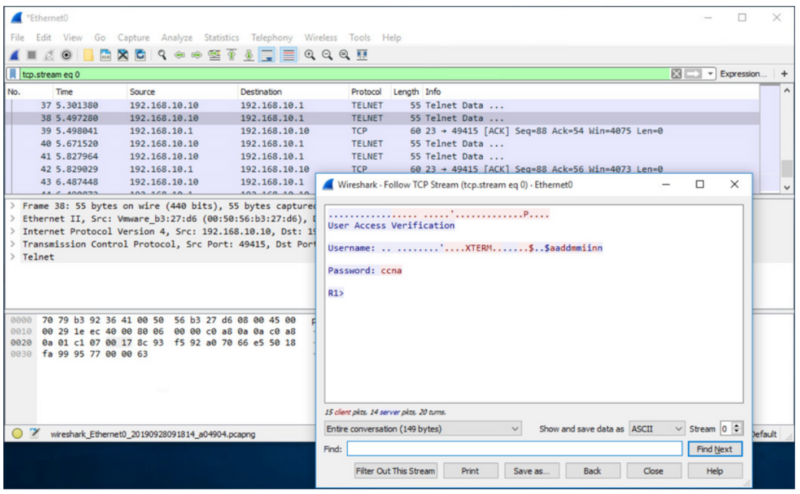
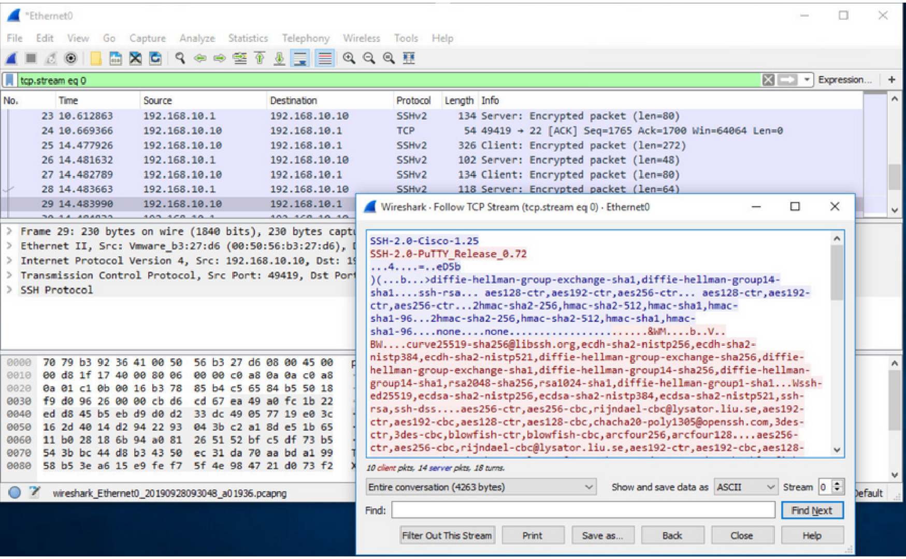
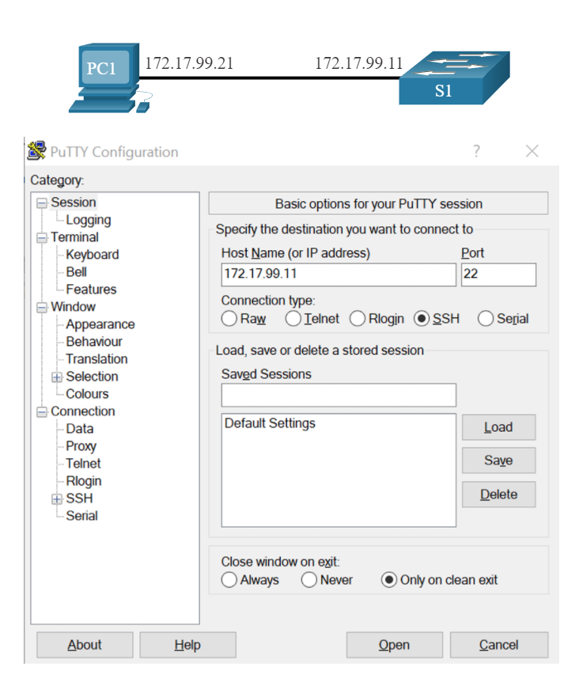

# Защищенный удаленный доступ

<!-- 1.3.1 -->
## Принцп работы Telnet

Вы не всегда можете иметь прямой доступ к коммутатору при необходимости его настройки. Вы должны иметь возможность удаленного доступа к нему, и очень важно, чтобы ваш доступ был безопасным. В этом разделе описывается настройка Secure Shell (SSH) для удаленного доступа. Задание в Packet Tracer дает вам возможность попробовать это самостоятельно.

Telnet использует TCP-порт 23. Telnet является более ранним протоколом, использующим небезопасную незашифрованную передачу как данных, так и идентификационной информации (имя пользователя и пароль) между взаимодействующими устройствами. Злоумышленник может отслеживать пакеты с помощью Wireshark. Например, на рисунке злоумышленник записал имя пользователя **admin** и пароль **ccna** из сеанса Telnet.



<!-- 1.3.2 -->
## Принцип работы SSH

Secure Shell (SSH) — это безопасный протокол, который использует TCP-порт 22. Протокол Secure shell (SSH) — это протокол, который обеспечивает безопасное (зашифрованное) подключение для управления удаленным устройством. Для безопасного управления удаленными подключениями Cisco рекомендует заменить протокол Telnet протоколом SSH. SSH обеспечивает защиту удаленных подключений, предоставляя надежное шифрование данных аутентификации устройства (имя пользователя и пароль), а также данных, передаваемых между устройствами.

Например, на рисунке показан захват с помощью Wireshark сеанса SSH. Злоумышленник может отслеживать сеанс, используя IP-адрес устройства администратора. Однако, в отличие от Telnet, с SSH имя пользователя и пароль шифруются.



<!-- 1.3.3 -->
## Убедитесь, что коммутатор поддерживает SSH

Для использования протокола SSH на коммутаторах Catalyst 2960 требуется версия операционной системы Cisco IOS с функциями и возможностями криптографии (шифрования). Используйте команду **show version** на коммутаторе, чтобы увидеть, какое IOS работает коммутатор в данный момент. Имя файла IOS, которое включает комбинацию «k9» поддерживает криптографические (зашифрованные) функции и возможности. В примере показаны выходные данные команды **show version**.

```
S1# show version
Cisco IOS Software, C2960 Software (C2960-LANBASEK9-M), Version 15.0(2)SE7, RELEASE SOFTWARE (fc1)
```

<!-- 1.3.4 -->
## Конфигурация SSH

Перед настройкой протокола SSH на коммутаторе нужно настроить уникальное имя хоста и соответствующие параметры сетевого подключения.

### Шаг 1

**Проверка поддержки SSH.**

Используйте команду **show ip ssh**, чтобы убедиться, что коммутатор поддерживает SSH. Если на коммутаторе не работает IOS, поддерживающая криптографические функции, эта команда не распознается.

```S1# show ip ssh ```

### Шаг 2

**Настройка IP-домена.**

Настройте имя IP-домена сети с помощью команды режима глобальной конфигурации **ip domain-name** . На рисунке значение domain-name равно **cisco.com.**

```S1(config)# ip domain-name cisco.com```

### Шаг 3

**Создание пары ключей RSA.**

Не все версии IOS по умолчанию SSH версии 2 и SSH версии 1 имеют известные недостатки безопасности. Чтобы настроить SSH версии 2, выполните команду **ip ssh version 2** режима глобальной конфигурации. При создании пары ключей RSA автоматически включается SSH. Используйте команду **crypto key generate rsa**, чтобы включить SSH-сервер на коммутаторе и создать пару ключей RSA. При создании ключей RSA администратору предлагается ввести длину модуля. В примере конфигурации используется размер модуля 1024 бита. Более длинная длина модуля более безопасна, но для генерации и использования требуется больше времени.

**Примечание:** Чтобы удалить пару ключей RSA, используйте команду **crypto key zeroize rsa** режима глобальной конфигурации. После удаления пары ключей RSA сервер SSH автоматически отключается.

```
S1(config)# crypto key generate rsa
How many bits in the modulus [512]: 1024
```

### Шаг 4

**Настройка аутентификации пользователей.**

Сервер SSH может аутентифицировать пользователей локально или с помощью сервера аутентификации. Для использования метода локальной аутентификации создайте имя пользователя и пароль с помощью команды режима глобальной настройки **username** username **secret** password. В этом примере администратору пользователя присваивается пароль ccna.

```S1(config)# username admin secret ccna```

### Шаг 5

**Настройка vty-линий**

Включите протокол SSH на линиях vty с помощью команды режима конфигурации линии **transport input ssh**. Catalyst 2960 имеет линии vty в диапазоне от 0 до 15. Эта конфигурация предотвращает подключения, отличные от SSH (например, Telnet), и ограничивает коммутатор принимать только SSH соединения. Используйте команду **line vty**, а затем команду **login local**, чтобы активировать локальную аутентификацию для SSH-соединений из локальной базы данных имени пользователя.

```
S1(config)# line vty 0 15
S1(config-line)# transport input ssh
S1(config-line)# login local
S1(config-line)# exit
```

### Шаг 6

**Включение SSHv2**

По умолчанию SSH поддерживает обе версии 1 и 2. При поддержке обеих версий это отображается в выходных данных **show ip ssh** как поддерживающая версия 2. Включите версию SSH с помощью команды глобальной конфигурации **ip ssh version 2**.

```S1(config)# ip ssh version 2```

<!-- 1.3.5 -->
## Убедитесь, что SSH работает

Для подключения к серверу SSH на ПК используется SSH-клиент, например PuTTY. Например, предположим следующее:

- SSH включен на коммутаторе S1
- На коммутаторе S1 интерфейсу VLAN 99 (SVI) присвоен IPv4-адрес 172.17.99.11;
- Компьютеру PC1 присвоен IPv4-адрес 172.17.99.21.

На рисунке PC инициирует SSH-подключение по IPv4-адресу VLAN SVI коммутатора S1.

На рисунке показан хост, подключенный к коммутатору, и настройки PuTTY для инициирования SSH подключения к SVI коммутатора. Узел PC1 с адресом 172.17.99.21 имеет сетевое подключение к коммутатору S1 с адресом 172.17.99.11. Скриншот конфигурации PuTTY на PC1 показывает адрес 172.17.99.11, введенный в поле Имя узла (или IP-адрес), и 22, введенный в поле Порт. В качестве типа подключения выбран SSH.



При подключении пользователю будет предложено ввести имя пользователя и пароль, как показано в примере. Используя конфигурацию, приведенную в предыдущем примере, вводятся имя пользователя **admin** и пароль **ccna**. После ввода правильной комбинации пользователь подключается через SSH к интерфейсу командной строки (CLI) коммутатора Catalyst 2960.

```
Login as: admin
Using keyboard-interactive
Authentication.
Password:
S1> enable
Password: 
S1#
```

Для отображения используемой версии и конфигурации для протокола SSH на устройстве, который вы настроили в качестве сервера SSH, используйте команду **show ip ssh**. В примере включена версия SSH 2.

```
S1# show ip ssh
SSH Enabled - version 2.0
Authentication timeout: 120 secs; Authentication retries: 3
To check the SSH connections to the device, use the show ssh command as shown.
S1# show ssh
%No SSHv1 server connections running.
Connection Version Mode Encryption  Hmac                State          Username
0          2.0     IN   aes256-cbc  hmac-sha1    Session started       admin
0          2.0     OUT  aes256-cbc  hmac-sha1    Session started       admin
S1#
```

<!-- 1.3.6 -->
## Packet Tracer. Настройка протокола SSH

Для безопасного управления удаленными подключениями Cisco рекомендует заменить протокол Telnet протоколом SSH. В Telnet используется открытый незашифрованный текстовый обмен. Протокол SSH обеспечивает безопасность удалённых соединений, предоставляя надёжное шифрование всех данных, передаваемых между устройствами. В этом упражнении необходимо обеспечить безопасность удалённого коммутатора с использованием зашифрованного пароля и протокола SSH.

[Конфигурация SSH - PDF](./assets/1.3.6-packet-tracer---configure-ssh_ru-RU.pdf)

[Конфигурация SSH - PKA](./assets/1.3.6-packet-tracer---configure-ssh_ru-RU.pka)