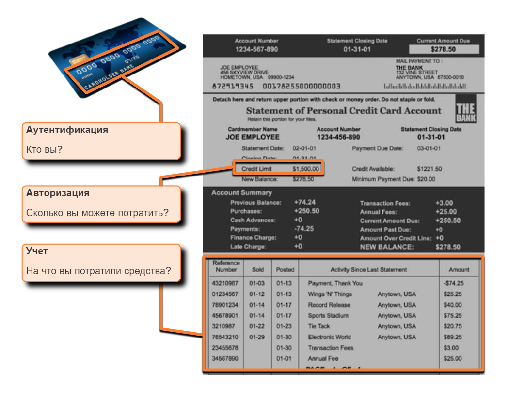
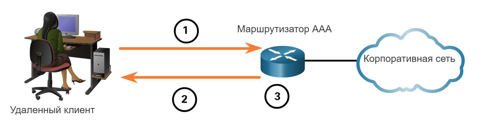
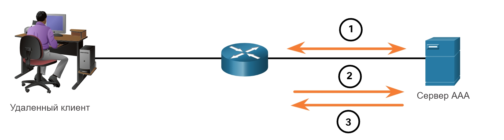
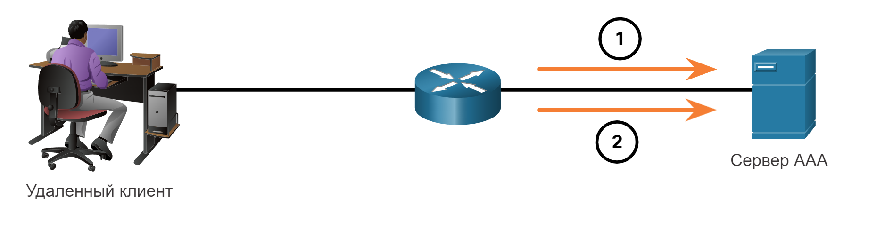
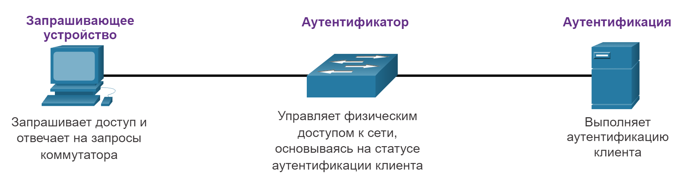

# Контроль доступа

<!-- 10.2.1-->
## Аутентификация с локальным паролем

В предыдущем разделе вы узнали, что устройство NAC предоставляет сервисы AAA. В этом разделе вы узнаете больше об AAA и способах контроля доступа.

Многие типы аутентификации могут быть выполнены на сетевых устройствах, и каждый метод предлагает различные уровни безопасности. Самый простой метод аутентификации удаленного доступа - это настройка комбинации логина и пароля на консоли, линиях vty и вспомогательных портах, как показано в строках vty в следующем примере. Этот метод проще всего реализовать, но он также самый слабый и наименее безопасный. Этот метод не обеспечивает нужного уровня безопасности, и пароль отправляется в виде открытого текста. Любой с паролем может получить доступ к устройству.

```
R1(config)# line vty 0 4
R1(config-line)# password ci5c0
R1(config-line)# login
```

SSH — это наиболее безопасный протокол для удаленного доступа.

- Он требует имя пользователя и пароль, которые шифруются во время передачи.
- Имя пользователя и пароль могут быть аутентифицированы методом локальной базы данных.
- Этот способ предполагает большую контролируемость, поскольку имя пользователя регистрируется при его входе в систему.

В следующем примере показаны методы удаленного доступа по SSH и локальной базе данных.

```
R1(config)# ip domain-name example.com
R1(config)# crypto key generate rsa general-keys modulus 2048
R1(config)# username Admin secret Str0ng3rPa55w0rd
R1(config)# ssh version 2
R1(config)# line vty 0 4
R1(config-line)# transport input ssh
R1(config-line)# login local
```

Метод локальной базы данных имеет некоторые ограничения:

- Учетные записи пользователей должны быть настроены локально на каждом устройстве. В крупной корпоративной среде с несколькими маршрутизаторами и коммутаторами для управления может потребоваться время для внедрения и изменения локальных баз данных на каждом устройстве.
- В системе с локальной базой данных не предусмотрен метод восстановления аутентификации. Например, что делать, если администратор забудет имя пользователя и пароль для этого устройства? Если нет резервного варианта аутентификации, единственный вариант — процедура восстановления пароля.


Более эффективным является решение, предполагающее, что все устройства обращаются к базе данных имен пользователей и паролей, размещенных на центральном сервере.

<!-- 10.2.2-->
## Компоненты AAA

ААА — сокращение от Authentication, Authorization, Accounting, что означает аутентификация, авторизация и учет. Эта концепция похожа на использование кредитной карты, как показано на рисунке. Кредитная карта определяет, кто может ею пользоваться, какую сумму может потратить пользователь, а также ведет учет товаров и услуг, которые приобретает пользователь.

AAA предоставляет основную инфраструктуру для настройки управления доступом на сетевом устройстве. ААА позволяет контролировать, какие пользователи имеют право доступа к сети (аутентификация), какие действия они могут выполнять, находясь в сети (авторизация), а также позволяет следить за их действиями во время доступа к сети (учет).



<!-- 10.2.3-->
## Аутентификация

Локальный и серверный являются двумя распространенными методами реализации аутентификации AAA.

**Локальная аутентификация (ААА)**

Local AAA хранит имена пользователей и пароли локально в сетевом устройстве, таком как маршрутизатор Cisco. Пользователи проходят аутентификацию в локальной базе данных, как показано на рисунке. Локальная аутентификация AAA лучше всего подходит для сетей небольшого размера.



- Клиент устанавливает соединение с маршрутизатором.
- Маршрутизатор аутентификации AAA запрашивает имя пользователя и пароль.
- Маршрутизатор выполняет аутентификацию имени пользователя и пароля, используя локальную базу данных, и пользователю предоставляется доступ к сети на основе информации в этой базе данных.

**Серверная аутентификация (AAA)**

При использовании серверного метода маршрутизатор обращается к центральному серверу аутентификации AAA, как показано на рисунке. AAA-сервер содержит имена пользователей и пароли для всех пользователей. Маршрутизатор аутентификации AAA использует для связи с сервером аутентификации AAA протокол Terminal Access Controller Access Control System (TACACS+) или протокол Remote Authentication Dial-In User Service (RADIUS). Когда есть несколько маршрутизаторов и коммутаторов, AAA на основе сервера является более подходящим решением.


- Клиент устанавливает соединение с маршрутизатором.
- Маршрутизатор аутентификации AAA запрашивает имя пользователя и пароль.
- Маршрутизатор выполняет аутентификацию имени пользователя и пароля, используя удаленный сервер аутентификации AAA.
- Пользователю предоставляется доступ к сети на основе сведений, содержащихся на удаленном сервере AAA.

<!-- 10.2.4-->
## Авторизация

Авторизация выполняется автоматически и не требует от пользователей дополнительных действий после аутентификации. Средства контроля авторизации определяют, что пользователь может и чего не может делать в сети после успешной аутентификации.

При авторизации используется набор атрибутов, описывающий доступ пользователя к сетевой инфраструктуре. Эти атрибуты используются сервером AAA для определения привилегий и ограничений для этого пользователя, как показано на рисунке.



- Когда пользователь прошел аутентификацию, между маршрутизатором и сервером AAA устанавливается сеанс.
- Маршрутизатор запрашивает авторизацию у AAA-сервера для запрашиваемой услуги клиента.
- Сервер AAA возвращает ответ PASS/FAIL для авторизации.

<!-- 10.2.5-->
## Учет

Учет AAA собирает данные об использовании в журналах AAA и формирует отчеты. Организация может использовать такие данные, например, в целях аудита или выставления счетов. Собираться могут такие данные, как время начала и остановки подключения, выполненные команды, количество пакетов и количество байтов.

Учет широко используется в сочетании с аутентификацией AAA. Серверы AAA ведут журналы с подробной информацией о том, какие действия прошедший аутентификацию пользователь выполнял на данном устройстве, как показано на рисунке. Сюда входят все команды EXEC и команды настройки конфигурации, поданные пользователем. Журнал содержит множество полей данных, включая имя пользователя, дату и время, когда команда была введена пользователем. Эта информация полезна при поиске и устранении неполадок устройств. Она также предоставляет улики в борьбе с лицами, предпринимающими вредоносные действия.



- После аутентификации пользователя процесс учета AAA создает сообщение о начале, чтобы начать процесс учета.
- По окончании работы пользователя записывается сообщение об остановке и процесс учета завершается.

<!-- 10.2.6-->
## 802.1X

Стандарт IEEE 802.1X определяет правила управления доступом на основе портов и протокол аутентификации. Протокол ограничивает подключение неавторизованных рабочих станций к локальной сети через общедоступные порты коммутатора. Сервер аутентификации аутентифицирует все рабочие станции, которые подключаются к порту коммутатора, перед тем, как предоставить им доступ к службам коммутатора или ЛВС.

При использовании аутентификации 802.1X на уровне портов устройства в сети получают особые роли, как показано на рисунке.



- **Запрашивающее устройство** - это устройство, на котором выполняется совместимое с 802.1X клиентское программное обеспечение, доступное для проводных или беспроводных устройств.
- **Коммутатор (Аутентификатор)** – коммутатор выступает в роли посредника (прокси) между клиентом и сервером аутентификации. Он запрашивает идентификационные данные у клиента, проверяет эту информацию на сервере аутентификации и передает ответ клиенту. Другим устройством, которое может действовать как аутентификатор, является беспроводная точка доступа.
- **Сервер аутентификации** – сервер проверяет подлинность клиента и уведомляет коммутатор или беспроводную точку доступа о том, что клиент имеет или не авторизован для доступа к локальной сети и услугам коммутатора.
