<!-- 10.5.1 -->
## Видео - VLAN и DHCP-атаки

В этом разделе рассматриваются различные типы атак на локальные сети и способы их устранения. Как и в предыдущих темах, эти атаки обычно относятся к коммутаторам и уровню 2.

После нажатия на рисунок, вы будете перенаправлены на YouTube для просмотра видео о атаках VLAN и DHCP.

[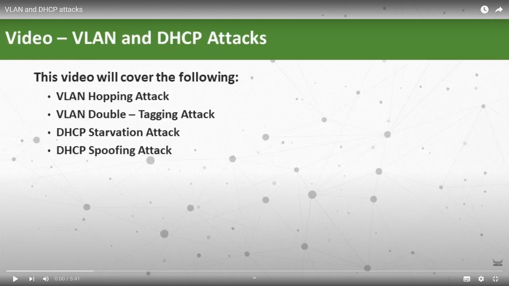](https://www.youtube.com/watch?v=ye_f86EfTl8 "VLAN и DHCP-атаки")

<!-- 10.5.2 -->
## Атака VLAN Hopping

VLAN hopping позволяет видеть трафик из одной VLAN в другой VLAN без помощи маршрутизатора. В базовой атаке VLAN hopping, атакующий настраивает узел так, чтобы он действовал как коммутатор, чтобы использовать функцию автоматического согласования магистрального порта включенную по умолчанию на большинстве портов коммутатора.

Злоумышленник настраивает хост на подделку сигналов 802.1Q и проприетарной сигнализации DTP-протокола Cisco для магистрального канала между коммутаторами. В случае успеха коммутатор устанавливает магистральную связь с хостом, как показано на рисунке. Теперь злоумышленник может получить доступ ко всем VLAN на коммутаторе. Хакер может отправлять и получать трафик в любой VLAN, эффективно переключаясь между VLAN.

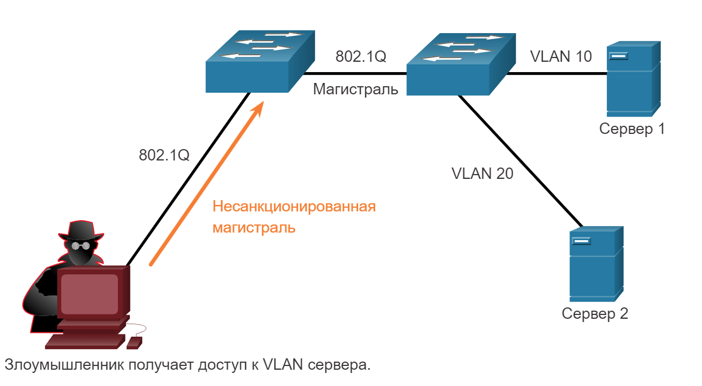
<!-- /courses/srwe-dl/af9ece9c-34fe-11eb-b1b2-9b1b0c1f7e0d/afb71180-34fe-11eb-b1b2-9b1b0c1f7e0d/assets/ca4b82b2-1c27-11ea-af09-3b2e6521927c.svg -->

<!--
Злоумышленник подключен к коммутатору, который подключен к другому коммутатору через транк 802.1Q. Второй коммутатор имеет соединение с сервером 1 в VLAN 10 и соединение с сервером 2 в VLAN 20. Злоумышленник установил несанкционированный магистральный канал 802.1Q с коммутатором, чтобы получить доступ к VLAN-серверу.
-->

<!-- 10.5.3 -->
## Атака с двойным тегированием (Double-Tagging) VLAN

Благодаря этому в некоторых случаях злоумышленник может встроить внутрь кадра скрытый тег 802.1Q в кадр который уже имеет 802.1Q тег. Этот тег позволяет кадру попасть во VLAN, которую не определяет исходный тег 802.1Q

**Шаг 1**

Злоумышленник передает коммутатору кадр 802.1Q с двойным тегированием. Внешний заголовок имеет тег принадлежащей злоумышленнику сети VLAN, которая совпадает с нативной VLAN магистрального порта. В рамках рассматриваемого примера примем, что это VLAN 10. Внутренний тег указывает на VLAN-жертву, в данном примере VLAN 20.

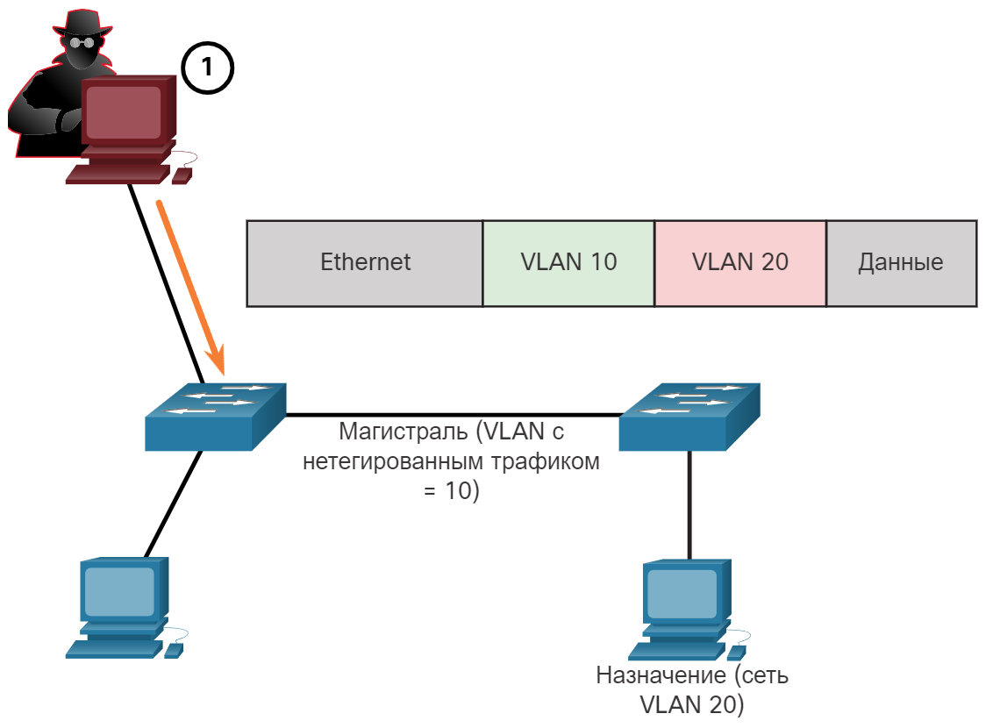
<!-- /courses/srwe-dl/af9ece9c-34fe-11eb-b1b2-9b1b0c1f7e0d/afb71180-34fe-11eb-b1b2-9b1b0c1f7e0d/assets/ca4c1ef2-1c27-11ea-af09-3b2e6521927c.svg -->

**Шаг 2**

Кадр поступает в первый коммутатор, который видит первый 4-байтовый тег 802.1Q. Коммутатор видит, что кадр предназначен для VLAN 10, которая является сетью native VLAN. Коммутатор рассылает пакет через все порты VLAN 10, отбросив тег VLAN 10. В магистральном порте тег VLAN 10 отброшен, но новый тег не присваивается, поскольку это часть сети native VLAN. В это время метка сети VLAN 20 по-прежнему нетронута и не проверяется первым коммутатором.

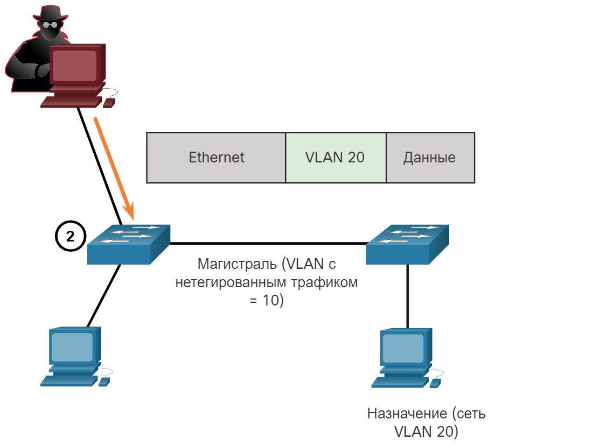
<!-- /courses/srwe-dl/af9ece9c-34fe-11eb-b1b2-9b1b0c1f7e0d/afb71180-34fe-11eb-b1b2-9b1b0c1f7e0d/assets/ca4c9422-1c27-11ea-af09-3b2e6521927c.svg -->

**Шаг 3**

Кадр поступает во второй коммутатор, но он не имеет информации о том, что он предназначен для VLAN 10. Трафик native VLAN не тегируется передающим коммутатором в соответствии со спецификацией протокола 802.1Q. Второй коммутатор видит только внутренний тег 802.1Q, который передал злоумышленник, и понимает, что кадр адресован сети VLAN 20, или целевой VLAN. Второй коммутатор пересылает кадр в порт-жертву или рассылает его по всем портам в зависимости от того, существует ли запись в таблице MAC-адресов для хоста-жертвы.

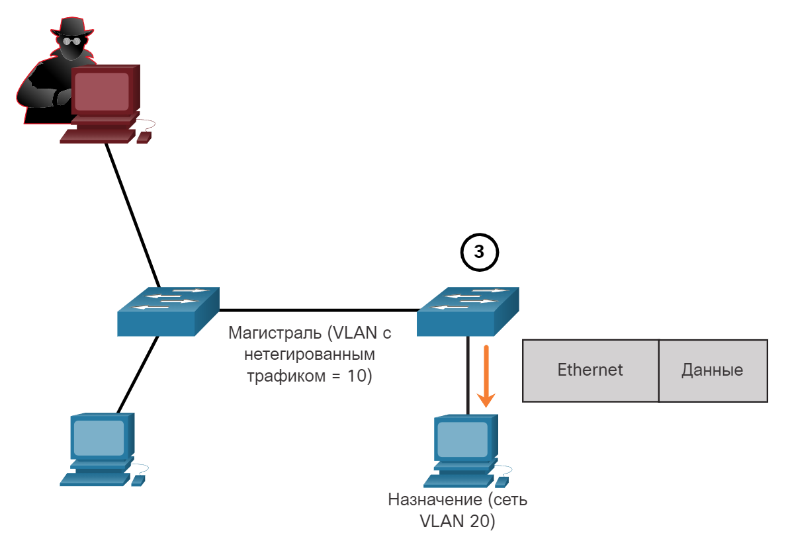
<!-- /courses/srwe-dl/af9ece9c-34fe-11eb-b1b2-9b1b0c1f7e0d/afb71180-34fe-11eb-b1b2-9b1b0c1f7e0d/assets/ca4d0950-1c27-11ea-af09-3b2e6521927c.svg -->

Этот вид атаки является однонаправленным и работает, только если злоумышленник подключён к порту, находящимся в той же VLAN, что и сеть native VLAN транкового порта. Идея состоит в том, что двойная маркировка позволяет злоумышленнику отправлять данные на хосты или серверы в VLAN, которые в противном случае были бы заблокированы каким-либо типом конфигурации контроля доступа. Предположительно, обратный трафик также будет разрешен, что дает злоумышленнику возможность общаться с устройствами в нормально заблокированной VLAN.

**Нейтрализация атаки VLAN**

Атаки VLAN hopping и двойной маркировкой VLAN могут быть предотвращены путем реализации следующих рекомендаций по безопасности магистральных каналов, как обсуждалось в предыдущем модуле:

* Отключить транкинг на всех портах доступа.
* Отключить автоматический транкинг на магистральных каналах, чтобы транки включались только вручную.
* Убедитесь, что native VLAN используется только для магистральных каналов.

<!-- 10.5.4 -->
## Сообщения DHCP

Серверы DHCP динамически предоставляют клиентам сведения о конфигурации IP, включая IP-адрес, маску подсети, шлюз по умолчанию, DNS-серверы и так далее. Обзор последовательности DHCP сообщений между клиентом и сервером показан на рисунке.

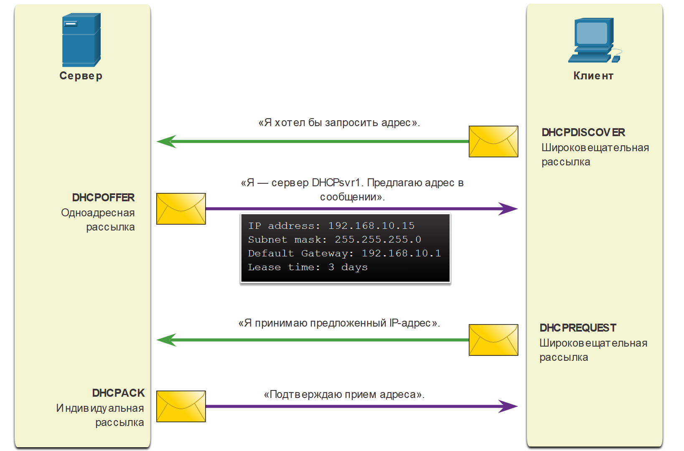
<!-- /courses/srwe-dl/af9ece9c-34fe-11eb-b1b2-9b1b0c1f7e0d/afb71180-34fe-11eb-b1b2-9b1b0c1f7e0d/assets/ca4d7e82-1c27-11ea-af09-3b2e6521927c.svg -->

<!-- 10.5.5 -->
## Атаки, связанные с DHCP

Два типа атак DHCP - это истощение DHCP и DHCP spoofing. Обе атаки нейтрализуются за счет реализации DHCP snooping.

**Атака истощением DHCP-пула**

Цель этой атаки — привести к отказу в обслуживании (DoS) при подключении клиентов. Для атаки путем истощения ресурсов DHCP необходим специальный инструмент, например Gobbler.

Gobbler способен искать все доступные для аренды IP-адреса и пытается все их арендовать. В частности, он создает сообщения DHCP Discovery с поддельными MAC-адресами.

**DHCP-спуфинг.**

Атака типа «DHCP-спуфинг» состоит в том, что к сети подключается мошеннический DHCP-сервер и предоставляет ложные параметры настройки IP легитимным клиентам. Подставной сервер может предоставлять различные неправильные сведения.

* **Неправильный шлюз по умолчанию.** Злоумышленник предоставляет неправильный шлюз или IP-адрес своего хоста для создания атаки через посредника. Это может пройти полностью незамеченным, поскольку злоумышленник перехватывает поток данных в сети.
* **Неправильный DNS-сервер.** Хакер предоставляет неправильный адрес DNS-сервера, направляя пользователя на вредоносный веб-сайт.
* **Неправильный IP-адрес.** Злоумышленник сообщает неправильный IP-адрес шлюза по умолчанию и создает DoS-атаку на DHCP-клиента.

**Шаг 1:** Злоумышленник подключает подставной DHCP-сервер

Злоумышленник успешно подключает подставной DHCP-сервер к порту коммутатора в той же подсети, где находятся клиенты. Цель подставного сервера — предоставить клиентам неправильную информацию о настройке IP.

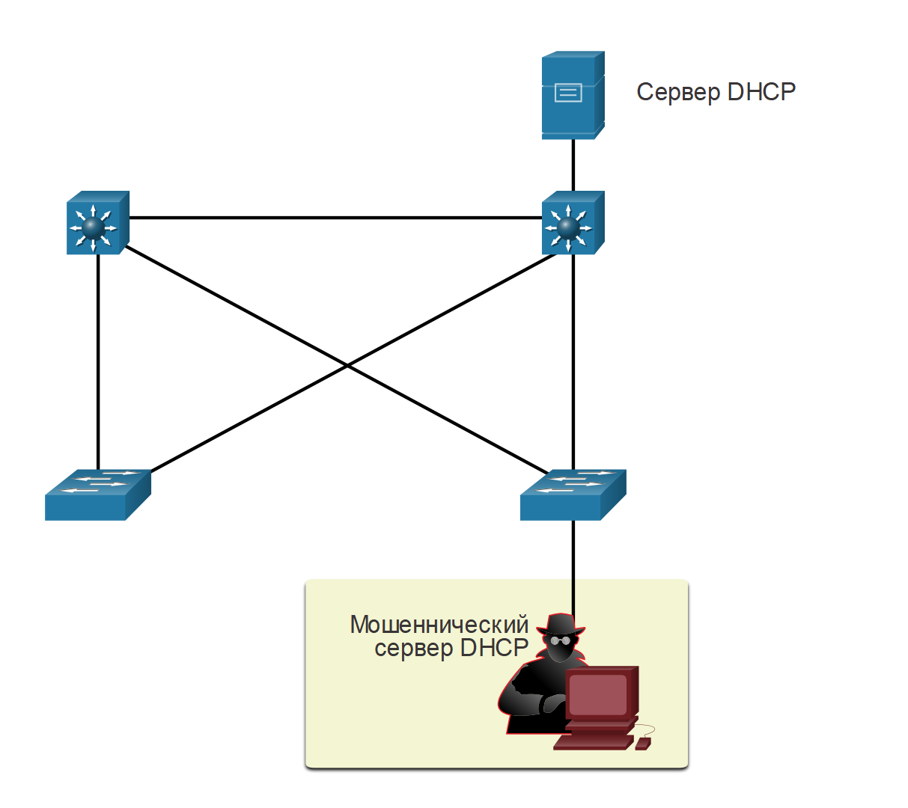
<!-- /courses/srwe-dl/af9ece9c-34fe-11eb-b1b2-9b1b0c1f7e0d/afb71180-34fe-11eb-b1b2-9b1b0c1f7e0d/assets/ca4e68e0-1c27-11ea-af09-3b2e6521927c.svg -->

**Шаг 2:** Клиент делает широковещательную рассылку сообщений об обнаружении DHCP

Легитимный клиент подключается к сети и запрашивает параметры конфигурации IP-сети. Для этого клиент отправляет широковещательный запрос обнаружения DHCP, ожидая ответа от DHCP-сервера. Оба сервера получают сообщение.

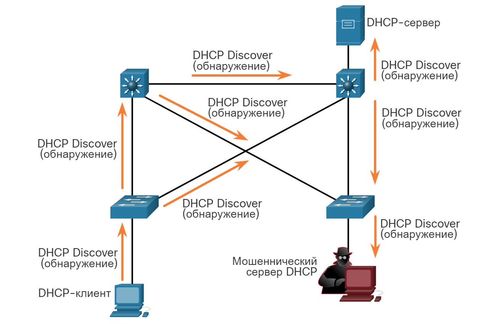
<!-- /courses/srwe-dl/af9ece9c-34fe-11eb-b1b2-9b1b0c1f7e0d/afb71180-34fe-11eb-b1b2-9b1b0c1f7e0d/assets/ca4eb701-1c27-11ea-af09-3b2e6521927c.svg -->

**Шаг 3:** Законный и мошеннический ответ DHCP

Легитимный DHCP сервер отвечает, сообщая действительные параметры конфигурации IP-сети. Однако подставной сервер также отвечает на запрос, высылая сообщения предложения DHCP Offer с параметрами конфигурации IP-сети, заданными злоумышленником. Клиент ответит на первое полученное предложение.

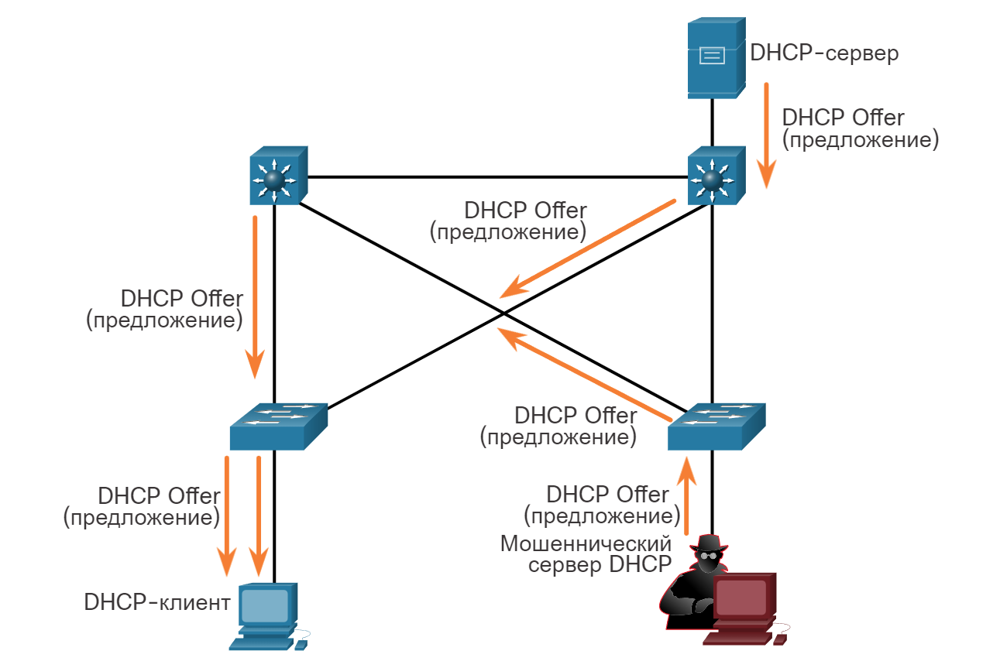
<!-- /courses/srwe-dl/af9ece9c-34fe-11eb-b1b2-9b1b0c1f7e0d/afb71180-34fe-11eb-b1b2-9b1b0c1f7e0d/assets/ca4f5340-1c27-11ea-af09-3b2e6521927c.svg -->

**Шаг 4:** Клиент принимает мошенническое предложение DHCP

Первым поступает предложение от подставного сервера, поэтому клиент рассылает широковещательное сообщение запроса DHCP Request, которым подтверждает прием заданных злоумышленником параметров от подставного сервера. Этот запрос получат и законный и подставной серверы.

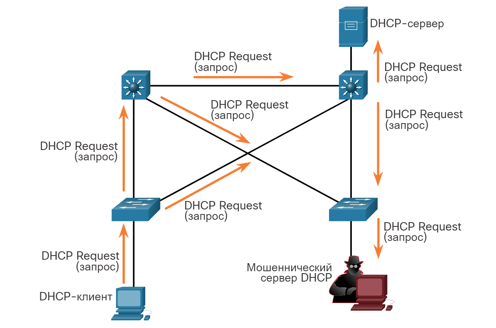
<!-- /courses/srwe-dl/af9ece9c-34fe-11eb-b1b2-9b1b0c1f7e0d/afb71180-34fe-11eb-b1b2-9b1b0c1f7e0d/assets/ca4fc871-1c27-11ea-af09-3b2e6521927c.svg -->

**Шаг 5:** Подставной сервер подтверждает запрос

Подставной сервер направляет клиенту индивидуальный ответ с подтверждением запроса. Законный сервер прекращает обмен данными с этим клиентом.

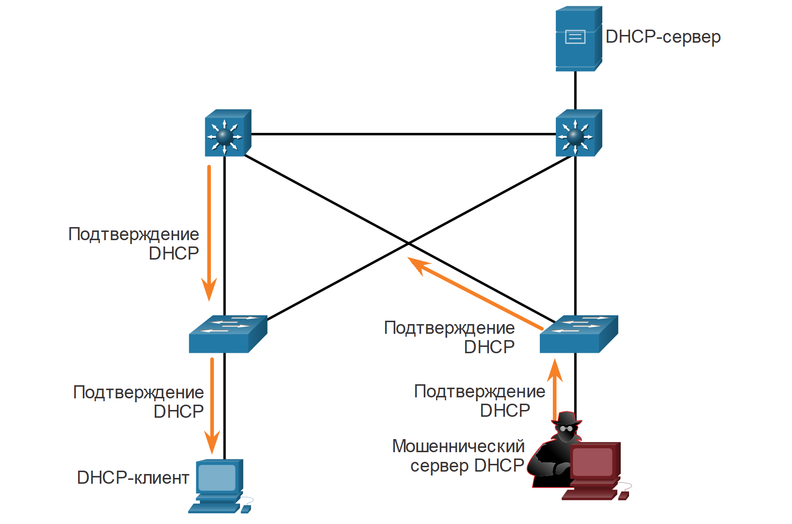
<!-- /courses/srwe-dl/af9ece9c-34fe-11eb-b1b2-9b1b0c1f7e0d/afb71180-34fe-11eb-b1b2-9b1b0c1f7e0d/assets/ca503da2-1c27-11ea-af09-3b2e6521927c.svg -->

<!-- 10.5.6 -->
## Видео - ARP-атаки, STP-атаки и CDP-зондирование

После нажатия на рисунок, вы будете перенаправлены на YouTube для просмотра видео о ARP-атаках, STP-атаках и CDP-зондировании.

<!-- 10.5.7 -->
## ARP атаки

Памятуя о том, что хосты передают ARP-запрос в широковещательном режиме другим хостам в сегменте, чтобы определить MAC-адрес хоста с конкретным IP-адресом. Обычно это делается для обнаружения MAC-адреса шлюза по умолчанию. Все хосты в подсети получают и обрабатывают этот ARP-запрос. Хост с IP-адресом, соответствующим ARP-запросу, отправляет ARP-ответ.

В соответствии с ARP RFC, любой клиент может отправить незапрашиваемый ARP-ответ, который называется gratuitous ARP (самообращенный ARP). Когда хост отправляет самообращенный ARP, другие хосты в подсети сохраняют в своих ARP-таблицах MAC-адрес и IP-адрес, содержащиеся в этом ответе.

Проблема заключается в том, что злоумышленник может отправить коммутатору сообщение gratuitous ARP, содержащее поддельный MAC-адрес, и коммутатор соответствующим образом обновит свою таблицу MAC-адресов. Таким образом, любой хост может заявить, что он является владельцем любой комбинации IP и MAC-адресов, которую выберет. В типичной атаке субъект угрозы может отправлять незапрошенные ответы ARP другим узлам в подсети с MAC-адресом субъекта угрозы и IP-адресом шлюза по умолчанию.

В Интернете доступно множество инструментов для организации атак через посредника с использованием ARP, включая dsniff, Cain & Abel, ettercap, Yersinia и другие. IPv6 использует протокол обнаружения соседей ICMPv6 для разрешения адресов уровня 2. IPv6 включает в себя стратегии по нейтрализации подмены объявления соседей (Neighbor Advertissement), подобным образом IPv6 предотвращает поддельный ARP-ответ.

Атаки ARP спуфинга и «отравление» ARP-кэша нейтрализуются путем внедрения DAI.

**Шаг 1:** Нормальное состояние с конвергентными таблицами MAC

Каждое устройство имеет точную таблицу MAC-адресов с правильными IP-адресами и MAC-адресами для других устройств в локальной сети.

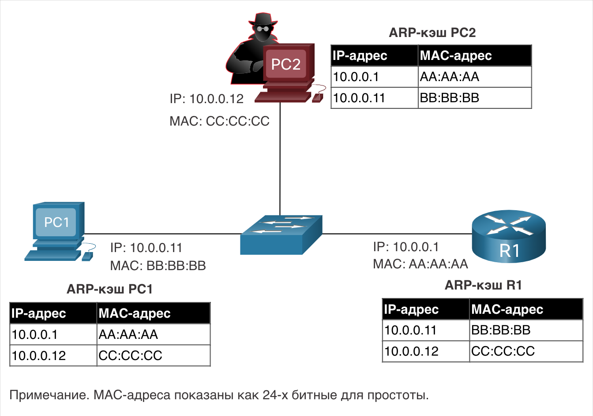
<!-- /courses/srwe-dl/af9ece9c-34fe-11eb-b1b2-9b1b0c1f7e0d/afb71180-34fe-11eb-b1b2-9b1b0c1f7e0d/assets/ca514f10-1c27-11ea-af09-3b2e6521927c.svg -->

**Шаг 2:** Атаки ARP спуфинга

Злоумышленник отправляет два поддельных ответа gratuitous ARP, пытаясь заменить R1 в качестве шлюза по умолчанию:

1. Первый информирует все устройства в локальной сети о том, что MAC-адрес злоумышленника (CC: CC: CC) сопоставляется с IP-адресом R1, 10.0.0.1.
2. Второй информирует все устройства в локальной сети о том, что MAC-адрес злоумышленника (CC: CC: CC) сопоставляется с IP-адресом ПК1, 10.0.0.11.

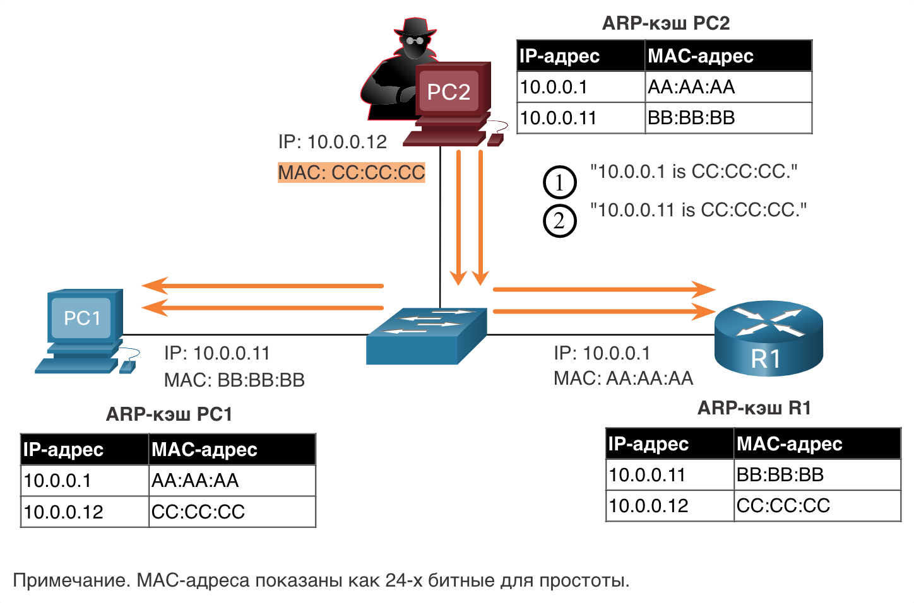
<!-- /courses/srwe-dl/af9ece9c-34fe-11eb-b1b2-9b1b0c1f7e0d/afb71180-34fe-11eb-b1b2-9b1b0c1f7e0d/assets/ca51eb52-1c27-11ea-af09-3b2e6521927c.svg -->

**Шаг 3:** Атака «отравление» ARP-кэша с атакой "человек посередине"

R1 и PC1 удаляют правильную запись для MAC-адреса друг друга и заменяют ее на MAC-адрес PC2. Исполнитель угрозы теперь «отравил» кэши ARP всех устройств в подсети. "Отравление" ARP кэша приводит к различным атакам «человек посередине», создавая серьезную угрозу безопасности сети.

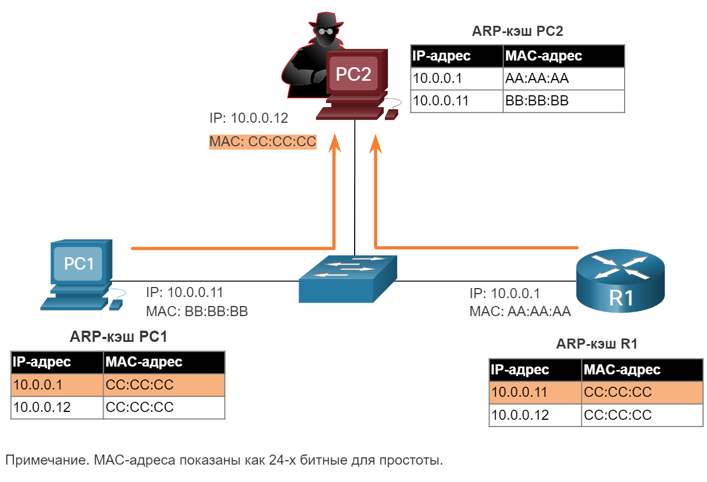
<!-- /courses/srwe-dl/af9ece9c-34fe-11eb-b1b2-9b1b0c1f7e0d/afb71180-34fe-11eb-b1b2-9b1b0c1f7e0d/assets/ca528790-1c27-11ea-af09-3b2e6521927c.svg -->

<!-- 10.5.8 -->
## Атака с подменой адреса

IP-адреса и MAC-адреса могут быть подделаны по разным причинам. Подмена IP-адреса - это действие, когда злоумышленник перехватывает действительный IP-адрес другого устройства в подсети или использует случайный IP-адрес. Подмену IP-адреса трудно нейтрализовать, особенно когда он используется внутри подсети, которой принадлежит IP-адрес.

Злоумышленники изменяют MAC-адрес своего хоста в соответствии с другим известным MAC-адресом целевого хоста. Затем атакующий хост отправляет по сети кадр с только что заданным MAC-адресом. Когда коммутатор получает кадр, он проверяет MAC-адрес источника. Коммутатор перезаписывает текущую запись в таблице CAM и назначает MAC-адрес новому порту, как показано на рисунке. Затем он пересылает кадры, предназначенные для целевого хоста, на атакующий хост.

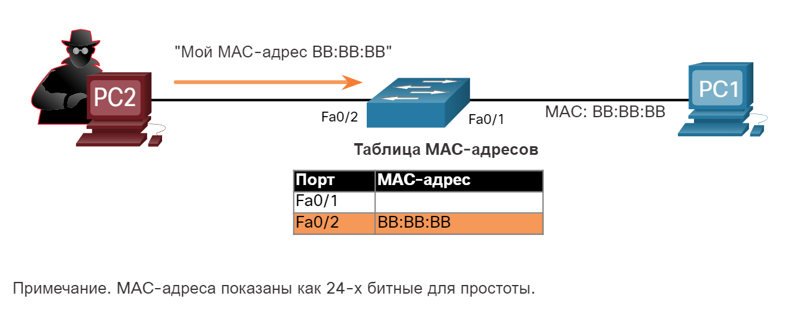
<!-- /courses/srwe-dl/af9ece9c-34fe-11eb-b1b2-9b1b0c1f7e0d/afb71180-34fe-11eb-b1b2-9b1b0c1f7e0d/assets/ca5323d2-1c27-11ea-af09-3b2e6521927c.svg -->

Когда целевой хост отправляет трафик, коммутатор исправит ошибку, переназначив MAC-адрес на исходный порт. Чтобы не дать коммутатору вернуть назначение порта в правильное состояние, злоумышленник может создать программу или сценарий, который будет постоянно отправлять кадры коммутатору, чтобы коммутатор сохранял неверную или поддельную информацию. На уровне 2 нет механизма безопасности, который позволял бы коммутатору проверять источник MAC-адресов, что делает его таким уязвимым для атак спуфинга.

Атаки подмены IP и MAC-адресов может быть уменьшена путем внедрения IPSG.

<!-- 10.5.9 -->
## Атака STP

Сетевые злоумышленники могут манипулировать протоколом связующего дерева (STP) для проведения атаки путем подмены корневого моста и изменения топологии сети. Злоумышленники могут сделать так, чтобы их хосты выглядели как корневые мосты, и в результате перехватить весь трафик ближайшего коммутируемого домена.

Для проведения атак путем манипуляций STP хост злоумышленника передает широковещательные пакеты BPDU с информацией об изменении конфигурации и топологии STP, чтобы вызвать перерасчет связующего дерева. Передаваемые хостом злоумышленника пакеты BPDU объявляют о более низком значении приоритета моста для попытки избрания хоста корневым мостом.

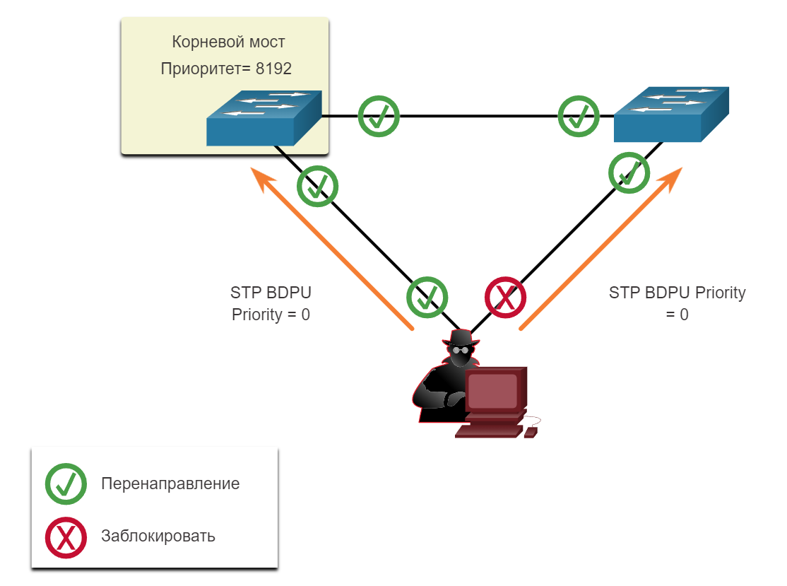
<!-- /courses/srwe-dl/af9ece9c-34fe-11eb-b1b2-9b1b0c1f7e0d/afb71180-34fe-11eb-b1b2-9b1b0c1f7e0d/assets/ca53c011-1c27-11ea-af09-3b2e6521927c.svg -->

В случае успеха, хост злоумышленника становится корневым мостом и получает доступ к множеству кадров, которые в противном случае были бы ему недоступны.

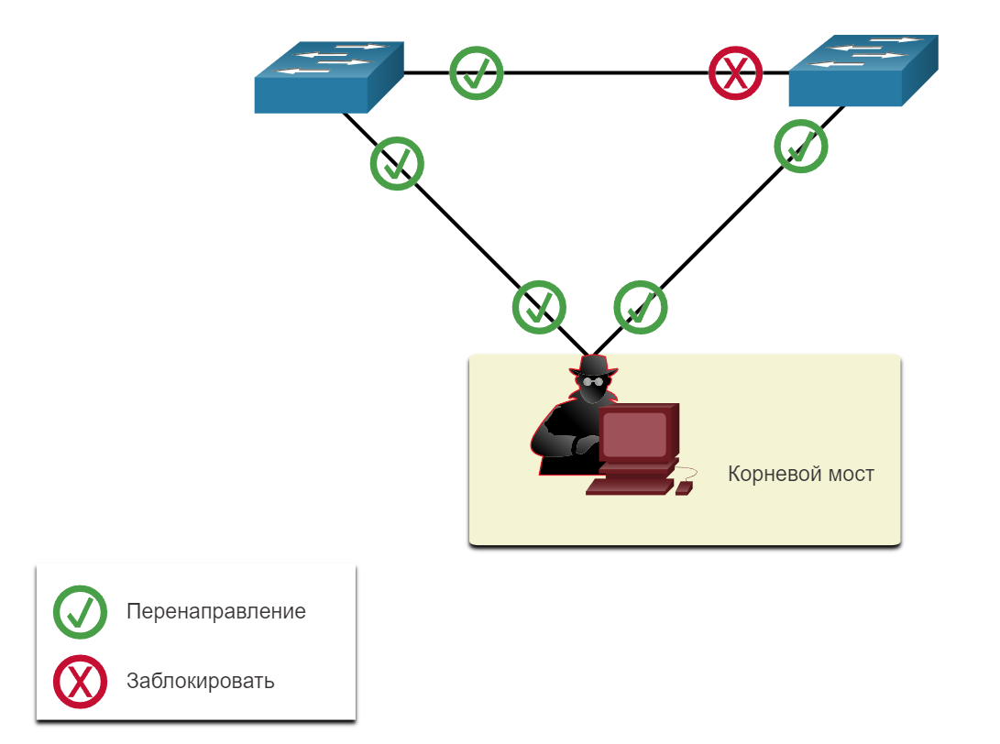
<!-- /courses/srwe-dl/af9ece9c-34fe-11eb-b1b2-9b1b0c1f7e0d/afb71180-34fe-11eb-b1b2-9b1b0c1f7e0d/assets/ca543540-1c27-11ea-af09-3b2e6521927c.svg -->

Эта STP-атака нейтрализуется за счет реализации BPDU Guard на всех портах доступа. BPDU Guard обсуждается более подробно позже в курсе.

<!-- 10.5.10 -->
## Разведывательная атака CDP

Протокол Cisco Discovery Protocol (CDP) — это проприетарный протокол обнаружения канала уровня 2. Он включен на всех устройствах Cisco по умолчанию. Протокол CDP может автоматически обнаруживать другие устройства с поддержкой CDP и помогает автоматически настраивать их подключение. Сетевые администраторы также используют протокол CDP для настройки сетевых устройств и для поиска и устранения их неполадок.

Информация протокола CDP отправляется через порты с поддержкой CDP в периодических незашифрованных широковещательных рассылках. Данные протокола CDP включают IP-адрес устройства, версию ОС IOS, а также сведения о платформе, возможностях и VLAN с нетегированным трафиком. Устройство, получившее сообщение CDP, обновляет свою базу данных CDP.

Данные протокола CDP чрезвычайно полезны при поиске и устранении неполадок сети. Например, протокол CDP можно использовать для проверки подключения уровней 1 и 2. Если администратор не может выполнить ping-запрос в непосредственно подключенный интерфейс, но по-прежнему получает информацию протокола CDP, то проблема, вероятнее всего, связана с конфигурацией уровня 3.

Однако информацией протокола CDP может также воспользоваться и злоумышленник, который ищет уязвимости в сетевой инфраструктуре.

На рисунке показан пример захвата программой Wireshark содержимого пакета CDP. Злоумышленник может определить версию операционной системы Cisco IOS, используемую устройством. Это позволяет злоумышленнику использовать какие-либо известные уязвимости данной версии IOS.

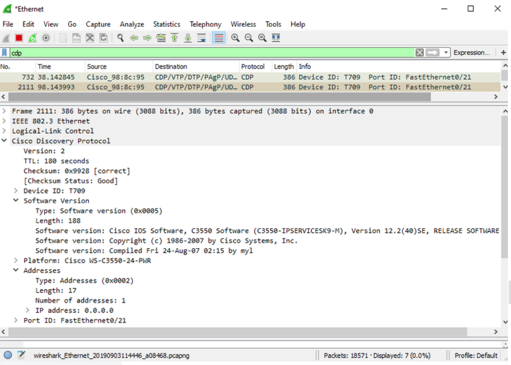

Широковещательные рассылки CDP передаются в незашифрованном виде и без аутентификации. Поэтому злоумышленник может вмешаться в работу сетевой инфраструктуры, отправляя в напрямую подключенные устройства Cisco поддельные кадры CDP с информацией о фиктивных устройствах.

Чтобы минимизировать вероятность использования CDP злоумышленниками, ограничьте использование протокола CDP на устройствах или портах. Например, отключите CDP на пограничных портах, которые подключаются к недоверенным устройствам.

Чтобы полностью отключить протокол CDP на устройстве, используйте команду **no cdp run** режима глобальной конфигурации. Чтобы полностью включить протокол CDP, используйте команду **cdp run** режима глобальной настройки.

Чтобы отключить CDP для порта, используйте команду конфигурации интерфейса **no cdp enable**. Чтобы включить CDP для порта, используйте команду конфигурации интерфейса **cdp enable**.

**Примечание**: Протокол LLDP тоже уязвим к разведывательным атакам. Чтобы полностью отключить протокол LLDP, настройте режим **no lldp run**. Чтобы отключить протокол LLDP на интерфейсе, настройте режимы **no lldp transmit** и **no lldp receive**.

<!-- 10.5.11 -->
<!-- quiz -->
