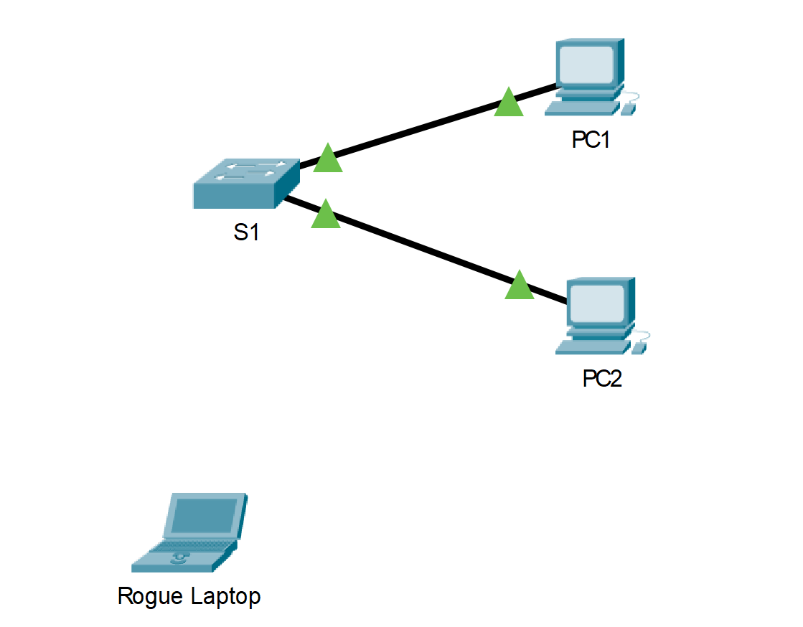

---

> **ВАЖНО**
> 
> Форма для ответов на вопросы будет доступна только при развертывании лабораторной работы 

---

## Топология



## Таблица адресации

| **Устройство**              | **Интерфейс** | **IP-адрес**    | **Маска подсети** |
|-------------------------|-----------|-------------|---------------|
| S1                      | VLAN 1    | 10.10.10.2  | 255.255.255.0 |
| PC1                     | NIC       | 10.10.10.10 | 255.255.255.0 |
| PC2                     | NIC       | 10.10.10.11 | 255.255.255.0 |
| Постороннее подключение | NIC       | 10.10.10.12 | 255.255.255.0 |

## Задача

Часть 1. Настроить функцию безопасности портов.

Часть 2. Проверить работу функции безопасности портов.

## Общие сведения

В рамках этого задания вам предстоит настроить и проверить функцию безопасности порта на коммутаторе. Функция безопасности порта позволяет ограничить входящий трафик порта за счёт ограничения числа MAC-адресов, которые могут посылать трафик через этот порт.

### Часть 1. Настройка функции безопасности порта

1.  Перейдите в командную строку **S1** и включите функцию безопасности на портах 0/1 и 0/2 интерфейса Fast Ethernet.

    ```
    S1(config)# interface range fa0/1 – 2
    S1(config-if-range)# switchport port-security
    ```

2.  Укажите только одно устройство в качестве максимума для доступа к портам 0/1 и 0/2 интерфейса Fast Ethernet.

    ```
    S1(config-if-range)# switchport port-security maximum 1
    ```

3.  Настройте функцию безопасности портов таким образом, чтобы MAC-адрес устройства распознавался динамически и добавлялся в текущую конфигурацию.

    ```
    S1(config-if-range)# switchport port-security mac-address sticky
    ```

4.  Настройте параметры реакции на нарушения таким образом, чтобы порты Fast Ethernet 0/1 и 0/2 не отключались при нарушении, но создавалось уведомление о нарушении безопасности и пакеты из неизвестного источника удалялись.

    ```
    S1(config-if-range)# switchport port-security violation restrict
    ```

5.  Отключите все неиспользуемые порты.

**Совет.** Чтобы данную конфигурацию можно было применить одновременно на всех портах, используйте ключевое слово **range**.

    ```
    S1(config-if-range)# interface range fa0/3 - 24 , gi1/1 - 2
    S1(config-if-range)# shutdown
    ```

### Часть 2. Проверка функции безопасности портов

1.  Отправьте эхо-запрос от узла **PC1** на **PC2**.

2.  Убедитесь, что функция обеспечения безопасности портов включена, а MAC-адреса компьютеров **PC1** и **PC2** добавлены в текущую конфигурацию.

    ```
    S1# show run | begin interface
    ```

3.  Используйте команду **show port security** для отображения информации о конфигурации.

    ```
    S1# show port-security
    S1# show port-security address
    ```

4.  Подключите компьютер злоумышленника (**Rogue Laptop**) к любому неиспользуемому порту коммутатора и обратите внимание на индикаторы состояния канала. Они должны гореть красным.

5.  Включите порт и убедитесь, что **постороннее подключение** может отправлять эхо-запросы на узлы **PC1** и **PC2**. После проверки выключите порт, используемый **посторонним подключением**.

6.  Отключите **PC2** и подключите **Rogue Laptop** к F0/2, который является портом, к которому **PC2** был первоначально подключен. Убедитесь, что **постороннее подключение** не может отправлять эхо-запросы на узел **PC1**.

7.  Отобразите нарушения безопасности порта, подключенного к **Rogue Laptop**.

    ```
    S1# show port-security interface f0/5
    ```

    - Ответьте на вопрос №1

8.  Отключите **постороннее подключение** и снова подключите узел **PC2**. Проверьте, может ли узел **PC2** отправлять эхо-запросы на узел **PC1**.

    - Ответьте на вопрос №2

[Скачать файл Packet Tracer для локального запуска](./assets/11.1.10-lab.pka)
