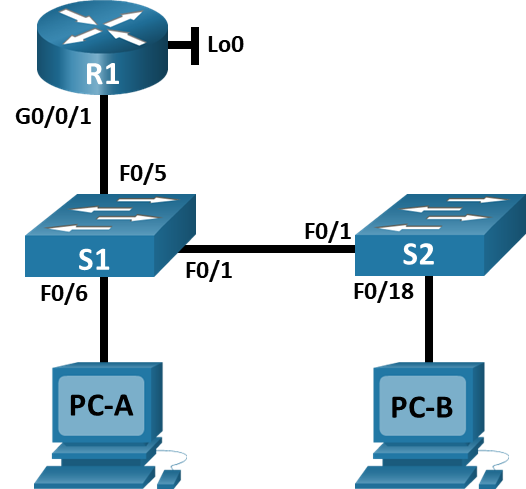

---

> **ВАЖНО**
> 
> Форма для ответов на вопросы будет доступна только при развертывании лабораторной работы 

---

## Топология



## Таблица адресации

| Устройство | interface/vlan | IP-адрес       | Маска подсети |
|------------|----------------|----------------|---------------|
| R1         | G0/0/1         | 192.168.10.1   | 255.255.255.0 |
| R1         | Loopback 0     | 10.10.1.1      | 255.255.255.0 |
| S1         | VLAN 10        | 192.168.10.201 | 255.255.255.0 |
| S2         | VLAN 10        | 192.168.10.202 | 255.255.255.0 |
| PC A       | NIC            | DHCP           | 255.255.255.0 |
| PC B       | NIC            | DHCP           | 255.255.255.0 |

## Задачи

**Часть 1. Настройка основного сетевого устройства**

**Часть 2. Настройка сетей VLAN**

**Часть 3: Настройки безопасности коммутатора.**

## Общие сведения и сценарий

Это комплексная лабораторная работа, нацеленная на повторение ранее изученных функций безопасности уровня 2.

**Примечание**: Маршрутизаторы, используемые в практических лабораторных работах CCNA, - это Cisco 4221 с Cisco IOS XE Release 16.9.3 (образ universalk9). В лабораторных работах используются коммутаторы Cisco Catalyst 2960 с Cisco IOS версии 15.0(2) (образ lanbasek9). Можно использовать другие маршрутизаторы, коммутаторы и версии Cisco IOS. В зависимости от модели устройства и версии Cisco IOS доступные команды и результаты их выполнения могут отличаться от тех, которые показаны в лабораторных работах. Правильные идентификаторы интерфейса см. в сводной таблице по интерфейсам маршрутизаторов в конце лабораторной работы.

**Примечание**: Убедитесь, что все настройки коммутатора удалены и загрузочная конфигурация отсутствует. Если вы не уверены, обратитесь к инструктору.

## Необходимые ресурсы

- 1 Маршрутизатор (Cisco 4221 с универсальным образом Cisco IOS XE версии 16.9.3 или аналогичным)
- 2 коммутатора (Cisco 2960 с операционной системой Cisco IOS 15.0(2) (образ lanbasek9) или аналогичная модель)
- 2 ПК (ОС Windows с программой эмуляции терминалов, такой как Tera Term)
- Консольные кабели для настройки устройств Cisco IOS через консольные порты.
- Кабели Ethernet, расположенные в соответствии с топологией

## Инструкции

### Часть 1. Настройка основного сетевого устройства

**Шаг 1. Создайте сеть.**

1.  Создайте сеть согласно топологии.
2.  Инициализируйте устройства

**Шаг 2. Настройте маршрутизатор R1.**

1.  Загрузите следующий конфигурационный скрипт на R1.

```
enable
configure terminal
hostname R1
no ip domain lookup
ip dhcp excluded-address 192.168.10.1 192.168.10.9
ip dhcp excluded-address 192.168.10.201 192.168.10.202
!
ip dhcp pool Students
 network 192.168.10.0 255.255.255.0
 default-router 192.168.10.1
 domain-name CCNA2.Lab-11.6.1
!
interface Loopback0
 ip address 10.10.1.1 255.255.255.0
!
interface GigabitEthernet0/0/1
 description Link to S1
 ip dhcp relay information trusted
 ip address 192.168.10.1 255.255.255.0
 no shutdown
!
line con 0
 logging synchronous
 exec-timeout 0 0
```

2.  Проверьте текущую конфигурацию на R1, используя следующую команду:

`R1# show ip interface brief`

3.  Убедитесь, что IP-адресация и интерфейсы находятся в состоянии up / up (при необходимости устраните неполадки).

**Шаг 3. Настройка и проверка основных параметров коммутатора**

1.  Настройте имя хоста для коммутаторов S1 и S2.
2.  Запретите нежелательный поиск в DNS.
3.  Настройте описания интерфейса для портов, которые используются в S1 и S2.
4.  Установите для шлюза по умолчанию для VLAN управления значение 192.168.10.1 на обоих коммутаторах.

### Часть 2. Настройка сетей VLAN на коммутаторах.

**Шаг 1. Сконфигурируйте VLAN 10.**

Добавьте VLAN 10 на S1 и S2 и назовите VLAN - **Management.**

**Шаг 2. Сконфигурируйте SVI для VLAN 10.**

Настройте IP-адрес в соответствии с таблицей адресации для SVI для VLAN 10 на S1 и S2. Включите интерфейсы SVI и предоставьте описание для интерфейса.

**Шаг 3. Настройте VLAN 333 с именем Native на S1 и S2.**

**Шаг 4. Настройте VLAN 999 с именем ParkingLot на S1 и S2.**

### Часть 3. Настройки безопасности коммутатора.

**Шаг 1. Реализация магистральных соединений 802.1Q.**

1.  Настройте все магистральные порты Fa0/1 на обоих коммутаторах для использования VLAN 333 в качестве native VLAN.
2.  Убедитесь, что режим транкинга успешно настроен на всех коммутаторах.

```
S1# show interface trunk

Port Mode Encapsulation Status Native vlan
Fa0/1 on 802.1q trunking 333

Port Vlans allowed on trunk
Fa0/1 1-4094

Port Vlans allowed and active in management domain
Fa0/1 1,10,333,999

Port Vlans in spanning tree forwarding state and not pruned
Fa0/1 1,10,333,999

S2# show interface trunk

Port Mode Encapsulation Status Native vlan
Fa0/1 on 802.1q trunking 333

Port Vlans allowed on trunk
Fa0/1 1-4094

Port Vlans allowed and active in management domain
Fa0/1 1,10,333,999

Port Vlans in spanning tree forwarding state and not pruned
Fa0/1 1,10,333,999
```

3.  Отключите согласование DTP F0/1 на S1 и S2.
4.  Проверьте с помощью команды `show interfaces`.

```
S1# show interfaces f0/1 switchport | include Negotiation
Negotiation of Trunking: Off

S1# show interfaces f0/1 switchport | include Negotiation
Negotiation of Trunking: Off
```

**Шаг 2. Настройка портов доступа**

1.  На S1 настройте F0/5 и F0/6 в качестве портов доступа и свяжите их с VLAN 10.
2.  На S2 настройте порт доступа Fa0/18 и свяжите его с VLAN 10.

**Шаг 3. Безопасность неиспользуемых портов коммутатора**

1.  На S1 и S2 переместите неиспользуемые порты из VLAN 1 в VLAN 999 и отключите неиспользуемые порты.
2.  Убедитесь, что неиспользуемые порты отключены и связаны с VLAN 999, введя команду show.

```
S1# show interfaces status

Port Name Status Vlan Duplex Speed Type
Fa0/1 Link to S2 connected trunk a-full a-100 10/100BaseTX
Fa0/2 disabled 999 auto auto 10/100BaseTX
Fa0/3 disabled 999 auto auto 10/100BaseTX
Fa0/4 disabled 999 auto auto 10/100BaseTX
Fa0/5 Link to R1 connected 10 a-full a-100 10/100BaseTX
Fa0/6 Link to PC-A connected 10 a-full a-100 10/100BaseTX
Fa0/7 disabled 999 auto auto 10/100BaseTX
Fa0/8 disabled 999 auto auto 10/100BaseTX
Fa0/9 disabled 999 auto auto 10/100BaseTX
Fa0/10 disabled 999 auto auto 10/100BaseTX
<output omitted>
S2# show interfaces status

Port Name Status Vlan Duplex Speed Type
Fa0/1 Link to S1 connected trunk a-full a-100 10/100BaseTX
Fa0/2 disabled 999 auto auto 10/100BaseTX
Fa0/3 disabled 999 auto auto 10/100BaseTX
<output omitted>
Fa0/14 disabled 999 auto auto 10/100BaseTX
Fa0/15 disabled 999 auto auto 10/100BaseTX
Fa0/16 disabled 999 auto auto 10/100BaseTX
Fa0/17 disabled 999 auto auto 10/100BaseTX
Fa0/18 Link to PC-B connected 10 a-full a-100 10/100BaseTX
Fa0/19 disabled 999 auto auto 10/100BaseTX
Fa0/20 disabled 999 auto auto 10/100BaseTX
Fa0/21 disabled 999 auto auto 10/100BaseTX
Fa0/22 disabled 999 auto auto 10/100BaseTX
Fa0/23 disabled 999 auto auto 10/100BaseTX
Fa0/24 disabled 999 auto auto 10/100BaseTX
Gi0/1 disabled 999 auto auto 10/100/1000BaseTX
Gi0/2 disabled 999 auto auto 10/100/1000BaseTX
```

**Шаг 4. Документирование и реализация функций безопасности порта.**

Интерфейсы F0/6 на S1 и F0/18 на S2 настроены как порты доступа. На этом шаге вы также настроите безопасность портов на этих двух портах доступа.

1.  На S1, введите команду show port-security interface f0/6 для отображения настроек по умолчанию безопасности порта для интерфейса F0/6. Запишите свои ответы ниже.

| Конфигурация безопасности порта по умолчанию |                             |
|----------------------------------------------|-----------------------------|
| Функция                                      | Настройка по умолчанию      |
| Защита портов                                | **Введите ваш ответ здесь** |
| Максимальное количество записей MAC-адресов  | **Введите ваш ответ здесь** |
| Режим проверки на нарушение безопасности     | **Введите ваш ответ здесь** |
| Aging Time                                   | **Введите ваш ответ здесь** |
| Aging Type                                   | **Введите ваш ответ здесь** |
| Secure Static Address Aging                  | **Введите ваш ответ здесь** |
| Sticky MAC Address                           | **Введите ваш ответ здесь** |

2.  На S1 включите защиту порта на F0 / 6 со следующими настройками:

    -   Максимальное количество записей MAC-адресов: 3
    -   Режим безопасности: restrict
    -   Aging time: 60 мин.
    -   Aging type: неактивный

3.  Проверьте параметры port security на S1 F0/6.

```
S1# show port-security interface f0/6
Port Security : Enabled
Port Status : Secure-up
Violation Mode : Restrict
Aging Time : 60 mins
Aging Type : Inactivity
SecureStatic Address Aging : Disabled
Maximum MAC Addresses : 3
Total MAC Addresses : 1
Configured MAC Addresses : 0
Sticky MAC Addresses : 0
Last Source Address:Vlan : 0022.5646.3411:10
Security Violation Count : 0

S1# show port-security address
               Secure Mac Address Table
-----------------------------------------------------------------------------
Vlan Mac Address Type Ports Remaining Age
                                                                   (mins)
---- ----------- ---- ----- -------------
  10 0022.5646.3411 SecureDynamic Fa0/6 60 (I)
-----------------------------------------------------------------------------
Total Addresses in System (excluding one mac per port) : 0
Max Addresses limit in System (excluding one mac per port) : 8192
```

4.  Включите безопасность порта для F0 / 18 на S2. Настройте каждый активный порт доступа таким образом, чтобы он автоматически добавлял адреса МАС, изученные на этом порту, в текущую конфигурацию.
5.  Настройте следующие параметры безопасности порта на S2 F / 18:

    -   Максимальное количество записей MAC-адресов: 2
    -   Тип безопасности: Protect
    -   Aging time: 60 мин.

6.  Проверка функции безопасности портов на S2 F0/18.

```
S2# show port-security interface f0/18
Port Security : Enabled
Port Status : Secure-up
Violation Mode : Protect
Aging Time : 60 mins
Aging Type : Absolute
SecureStatic Address Aging : Disabled
Maximum MAC Addresses : 2
Total MAC Addresses : 1
Configured MAC Addresses : 0
Sticky MAC Addresses : 0
Last Source Address:Vlan : 0022.5646.3413:10
Security Violation Count : 0

S2# show port-security address
               Secure Mac Address Table
-----------------------------------------------------------------------------
Vlan Mac Address Type Ports Remaining Age
                                                                   (mins)
---- ----------- ---- ----- -------------
  10 0022.5646.3413 SecureSticky Fa0/18 -
-----------------------------------------------------------------------------
Total Addresses in System (excluding one mac per port) : 0
Max Addresses limit in System (excluding one mac per port) : 8192
```

**Шаг 5. Реализовать безопасность DHCP snooping.**

1.  На S2 включите DHCP snooping и настройте DHCP snooping во VLAN 10.
2.  Настройте магистральные порты на S2 как доверенные порты.
3.  Ограничьте ненадежный порт Fa0/18 на S2 пятью DHCP-пакетами в секунду.
4.  Проверка DHCP Snooping на S2.

```
S2# show ip dhcp snooping
Switch DHCP snooping is enabled
DHCP snooping is configured on following VLANs:
10
DHCP snooping is operational on following VLANs:
10
DHCP snooping is configured on the following L3 Interfaces:
Insertion of option 82 is enabled
   circuit-id default format: vlan-mod-port
   remote-id: 0cd9.96d2.3f80 (MAC)
Option 82 on untrusted port is not allowed
Verification of hwaddr field is enabled
Verification of giaddr field is enabled
DHCP snooping trust/rate is configured on the following Interfaces:

Interface Trusted Allow option Rate limit (pps)
----------------------- ------- ------------ ----------------
FastEthernet0/1 yes yes unlimited
  Custom circuit-ids:
FastEthernet0/18 no no 5
  Custom circuit-ids:
```

5.  В командной строке на PC-B освободите, а затем обновите IP-адрес.

```
C:\Users\Student> ipconfig /release
C:\Users\Student> ipconfig /renew
```

6.  Проверьте привязку отслеживания DHCP с помощью команды `show ip dhcp snooping binding`.

```
S2# show ip dhcp snooping binding 
MacIp адресAddress Lease(sec) Type VLAN Interface
------------------ --------------- ---------- ------------- ---- --------------------
00:50:56:90:D0:8E 192.168.10.11 86213 dhcp-snooping 10 FastEthernet0/18
Total number of bindings: 1
```

**Шаг 6. Реализация PortFast и BPDU Guard**

1.  Настройте PortFast на всех портах доступа, которые используются на обоих коммутаторах.
2.  Включите защиту BPDU на портах доступа VLAN 10 S1 и S2, подключенных к PC-A и PC-B.
3.  Убедитесь, что защита BPDU и PortFast включены на соответствующих портах.

```
S1# show spanning-tree interface f0/6 detail
 Port 8 (FastEthernet0/6) of VLAN0010 is designated forwarding
   Port path cost 19, Port priority 128, Port Identifier 128.6.
   <output omitted for brevity>
   Number of transitions to forwarding state: 1
   The port is in the portfast mode
   Link type is point-to-point by default
   Bpdu guard is enabled
   BPDU: sent 128, received 0
```

**Шаг 7. Проверьте наличие сквозного подключения.**

Проверьте PING связь между всеми устройствами в таблице IP-адресации. В случае сбоя проверки связи может потребоваться отключить брандмауэр на хостах.

## Вопросы для повторения

1.  С точки зрения безопасности порта на S2, почему нет значения таймера для оставшегося возраста в минутах, когда было сконфигурировано динамическое обучение - sticky?

**Введите ваш ответ здесь**
2.  Что касается безопасности порта на S2, если вы загружаете скрипт текущей конфигурации на S2, почему порту 18 на PC-B никогда не получит IP-адрес через DHCP?

**Введите ваш ответ здесь**
3.  Что касается безопасности порта, в чем разница между типом абсолютного устаревания и типом устаревание по неактивности?

**Введите ваш ответ здесь**
