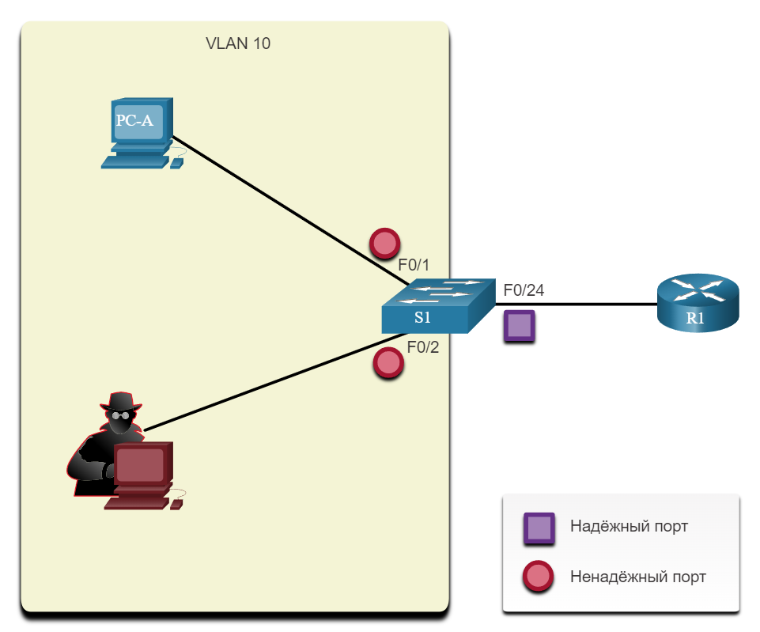

# Отражение атак через ARP

<!-- 11.4.1-->
## Динамический анализ ARP

В типичной атаке ARP злоумышленник может отправлять незапрошенные ответы ARP другим узлам в подсети с MAC-адресом субъекта угрозы и IP-адресом шлюза по умолчанию. Чтобы предотвратить подделку ARP и вызванное ею отравление ARP, коммутатор должен обеспечить передачу только действительных запросов и ответов ARP.

Динамическая проверка ARP (DAI) требует отслеживания DHCP и помогает предотвратить атаки ARP путем:

- Не ретранслирует недопустимые или незапрошенные ответы ARP на другие порты в той же VLAN.
- Перехват всех ARP-запросов и ответов на ненадежных портах.
- Проверка каждого перехваченного пакета на предмет правильной привязки IP-к-MAC.
- Удаление и регистрация ARP Ответы, поступающие из недействительных, чтобы предотвратить отравление ARP.
- Ошибка отключения интерфейса, если настроенное число DAI пакетов ARP превышено.

<!-- 11.4.2-->
## Руководство по внедрению DAI

Чтобы снизить вероятность подделки ARP и отравления ARP, выполните следующие рекомендации по внедрению DAI:

- Включить отслеживание DHCP на глобальном уровне.
- Включите отслеживание DHCP на выбранных VLAN.
- Включите DAI на выбранных VLAN.
- Настроить доверенные интерфейсы для отслеживания DHCP и проверки ARP.

Как правило, рекомендуется настроить все порты коммутатора доступа как ненадежные и настроить все порты связывающие с вышестоящими устройствами, как доверенные.

Пример топологии на рисунке идентифицирует доверенные и ненадежные порты.



<!-- 11.4.3-->
## Пример конфигурации DAI

В предыдущей топологии S1 соединяет двух пользователей в VLAN 10. DAI будет настроен для защиты от спуфинга ARP и атак отравления ARP.

Как показано в примере, отслеживание DHCP включено, поскольку DAI требует для работы таблицы привязки отслеживания DHCP. Далее, отслеживание DHCP и проверка ARP включены для ПК в VLAN10. Порт аплинк связи с маршрутизатором является доверенным, и поэтому он настроен как доверенный для отслеживания DHCP и проверки ARP.

```
S1(config)# ip dhcp snooping
S1(config)# ip dhcp snooping vlan 10
S1(config)# ip arp inspection vlan 10
S1(config)# interface fa0/24
S1(config-if)# ip dhcp snooping trust
S1(config-if)# ip arp inspection trust
```

DAI также можно настроить для проверки MAC-адресов и IP-адресов назначения или источника:

- **Destination MAC** - Проверяет MAC-адрес назначения в заголовке Ethernet по отношению к целевому MAC-адресу в теле ARP.
- **Source MAC** - Проверяет MAC-адрес источника в заголовке Ethernet на соответствие MAC-адреса отправителя в теле ARP.
- **IP address** - Проверяет тело ARP на наличие недопустимых и неожиданных IP-адресов, включая адреса 0.0.0.0, 255.255.255.255 и все IP-адреса многоадресной рассылки.

Команда глобальной конфигурации ```ip arp inspection validate {[src-mac] [dst-mac] [ip]}``` используется для настройки DAI для отбрасывания пакетов ARP, когда IP-адреса недопустимы. Он может использоваться, когда MAC-адреса в теле пакетов ARP не совпадают с адресами, указанными в заголовке Ethernet. Обратите внимание, что в следующем примере можно настроить только одну команду. Поэтому при вводе нескольких команд проверки **ip arp inspection validate** проверяет предыдущую команду. Чтобы включить более одного метода проверки, введите их в той же командной строке, как показано и проверено в следующих выходных данных.

```
S1(config)# ip arp inspection validate ?
dst-mac  Validate destination MAC address
  ip       Validate IP addresses
  src-mac  Validate source MAC address
S1(config)# ip arp inspection validate src-mac
S1(config)# ip arp inspection validate dst-mac
S1(config)# ip arp inspection validate ip
S1(config)# do show run | include validate
ip arp inspection validate ip 
S1(config)# ip arp inspection validate src-mac dst-mac ip
S1(config)# do show run | include validate
ip arp inspection validate src-mac dst-mac ip 
S1(config)#
```