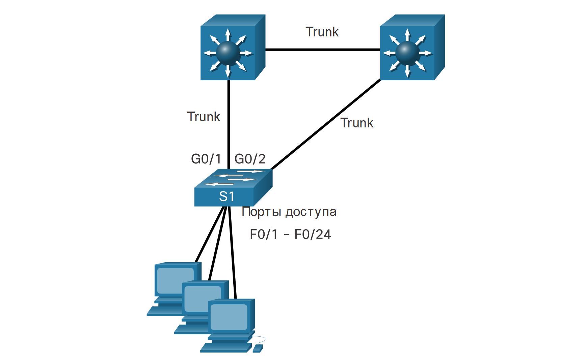

# Отражение атак через STP

<!-- 11.5.1-->
## PortFast и BPDU Guard

Напомним, что сетевые злоумышленники могут манипулировать протоколом Spanning Tree Protocol (STP) для проведения атаки путем подмены корневого моста и изменения топологии сети. Чтобы нейтрализовать атаки манипуляций с протоколом STP, используйте средства защиты PortFast и Bridge Protocol Data Unit (BPDU):

- PortFast - PortFast немедленно переводит интерфейс, настроенный как порт доступа или магистральный порт, в состояние пересылки из состояния блокировки, минуя состояния прослушивания и обучения. Применить ко всем портам конечного пользователя. PortFast следует настраивать только на портах, подключенных к конечным устройствам.
- BPDU Guard - защита BPDU немедленно при ошибке отключает порт, который получает BPDU. Как и PortFast, защита BPDU должна быть настроена только на интерфейсах, подключенных к конечным устройствам.

На рисунке порты доступа для S1 должны быть настроены с PortFast и BPDU Guard.



<!-- 11.5.2-->
## Настройка PortFast

PortFast обходит состояния прослушивания и обучения STP, чтобы минимизировать время, в течение которого порты доступа должны ожидать конвергенции STP. Если PortFast включен на порту, подключенном к другому коммутатору, существует риск создания цикла связующего дерева.

PortFast можно включить на интерфейсе с помощью команды настройки интерфейса **spanning-tree portfast**. В качестве альтернативы Portfast можно настроить глобально на всех портах доступа с помощью команды глобальной конфигурации **spanning-tree portfast default**.

Чтобы проверить, включен ли PortFast глобально, вы можете использовать либо **show running-config | begin span** или сводную команду **show spanning-tree summary**. Чтобы проверить, включен ли PortFast для интерфейса, используйте команду **show running-config interface** type/number, как показано в следующем примере. Команда проверки типа/номера интерфейса **show spanning-tree interface** type/number **detail** также может использоваться для проверки.

Обратите внимание, что когда PortFast включен, отображаются предупреждающие сообщения.

```
S1(config)# interface fa0/1
S1(config-if)# switchport mode access
S1(config-if)# spanning-tree portfast
%Warning: portfast should only be enabled on ports connected to a single
 host. Connecting hubs, concentrators, switches, bridges, etc... to this
 interface when portfast is enabled, can cause temporary bridging loops.
 Use with CAUTION
%Portfast has been configured on FastEthernet0/1 but will only
 have effect when the interface is in a non-trunking mode.
S1(config-if)# exit
S1(config)# spanning-tree portfast default
%Warning: this command enables portfast by default on all interfaces. You
 should now disable portfast explicitly on switched ports leading to hubs,
 switches and bridges as they may create temporary bridging loops.
S1(config)# exit
S1# show running-config | begin span
spanning-tree mode pvst
spanning-tree portfast default
spanning-tree extend system-id
!
interface FastEthernet0/1
 switchport mode access
 spanning-tree portfast
!
interface FastEthernet0/2
!
interface FastEthernet0/3
!
interface FastEthernet0/4
!
interface FastEthernet0/5
! 
(output omitted)
S1#
```

<!-- 11.5.3-->
## Настройка BPDU Guard

Даже если PortFast включен, интерфейс все равно будет прослушивать BPDU. Неожиданные BPDU могут быть случайными или частью несанкционированной попытки добавить коммутатор в сеть.

Если какие-либо BPDU получены на порте с поддержкой BPDU Guard, этот порт переводится в состояние с ошибками. Это означает, что порт отключен и должен быть повторно включен вручную или автоматически восстановлен с помощью глобальной команды **errdisable recovery cause psecure_violation**.

BPDU Guard можно включить в порту с помощью команды **spanning-tree bpduguard enable**. Либо используйте команду глобальной конфигурации **spanning-tree portfast bpduguard default**, чтобы глобально включить защиту BPDU на всех портах с включенной PortFast.

Чтобы отобразить информацию о состоянии связующего дерева, используйте **show spanning-tree summary**. В этом примере PortFast default и BPDU Guard включены как состояние по умолчанию для портов, настроенных как режим доступа.

**Примечание:** Всегда включайте BPDU Guard на всех портах с поддержкой PortFast.

```
S1(config)# interface fa0/1
S1(config-if)# spanning-tree bpduguard enable
S1(config-if)# exit
S1(config)# spanning-tree portfast bpduguard default
S1(config)# end
S1# show spanning-tree summary
Switch is in pvst mode
Root bridge for: none
Extended system ID           is enabled
Portfast Default             is enabled
PortFast BPDU Guard Default  is enabled
Portfast BPDU Filter Default is disabled
Loopguard Default            is disabled
EtherChannel misconfig guard is enabled
UplinkFast                   is disabled
BackboneFast                 is disabled
Configured Pathcost method used is short
(output omitted)
S1#
```