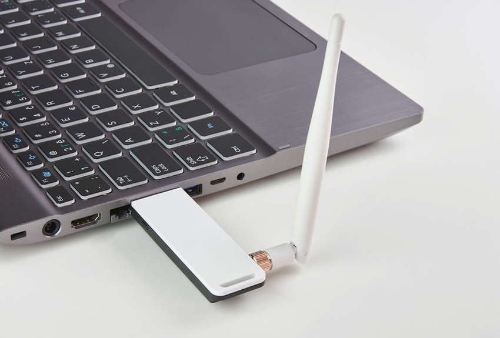
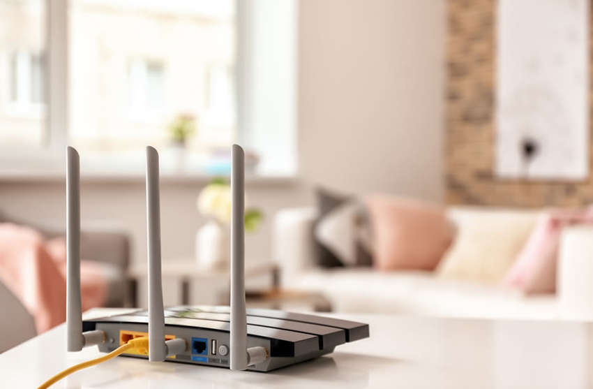
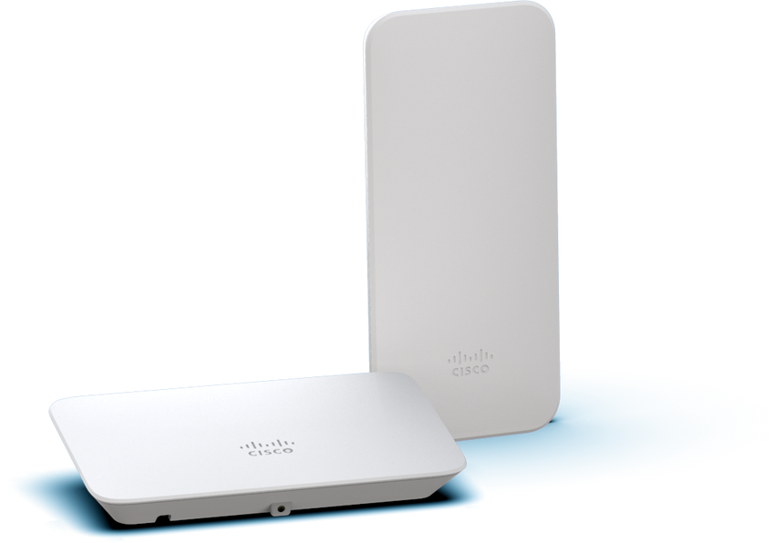
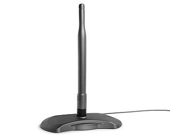

<!-- 12.2.1 -->
## Видео: компоненты беспроводных локальных сетей

В предыдущей теме вы узнали о преимуществах беспроводной связи, типах беспроводных сетей, стандартах 802.11 и радиочастотах. Здесь пойдет речь о компонентах WLAN.

Посмотрите видео о компонентах WLAN.

<!-- 12.2.2 -->
## Беспроводные сетевые адаптеры

Для беспроводного развертывания требуется как минимум два устройства, которые имеют радиопередатчик и радиоприемник, настроенные на одни и те же радиочастоты:

* оконечные устройства, оснащенные беспроводными сетевыми адаптерами
* сетевое устройство, такое как беспроводной роутер или беспроводная точка доступа.

Для беспроводной связи ноутбуки, планшеты, смартфоны и даже новейшие автомобили оснащены встроенными беспроводными сетевыми картами, которые включают в себя радиопередатчик/приемник. Однако, если устройство не имеет встроенного беспроводного сетевого адаптера, можно использовать устройство для USB, как показано на рисунке.

**Примечание.** Многие знакомые вам беспроводные устройства не имеют видимых антенн. Они встроены в смартфоны, ноутбуки и беспроводные домашние роутеры.

<!-- 12.2.3 -->
## Домашний беспроводной роутер

Тип устройства инфраструктуры, с которым конечное устройство связывается и аутентифицируется, зависит от размера и требований WLAN.

Например, домашний пользователь обычно подключает беспроводные устройства с помощью небольшого роутера, как показано на рисунке. Беспроводной роутер служит как:

* **точка доступа** (обеспечивает беспроводной доступ 802.11a/b/g/n/ac);
* **коммутатор** (обеспечивает четырехпортовый полнодуплексный Ethernet-коммутатор 10/100/1000 для подключения проводных устройств);
* **роутер** (обеспечивает шлюз по умолчанию для подключения к другим сетевым инфраструктурам, таким как Интернет).

Беспроводной роутер обычно реализуется как устройство беспроводного доступа для небольших предприятий или жилых помещений. Он объявляет о своих услугах, отправляя маяки, содержащие идентификатор общего набора услуг (SSID). Устройства беспроводным способом обнаруживают SSID и пытаются подключиться и аутентифицироваться с ним для доступа к локальной сети и Интернету.

Большинство беспроводных роутеров также предоставляют расширенные функции, такие как высокоскоростной доступ, поддержка потокового видео, адресация IPv6, качество обслуживания (QoS), утилиты настройки и порты USB для подключения принтеров или флешек.

Кроме того, домашние пользователи, которые хотят расширить свои сетевые услуги, могут реализовать расширители диапазона Wi-Fi. Устройство может подключаться к расширителю по беспроводной связи, что повышает скорость его обмена данными с беспроводным роутером.

<!-- 12.2.4 -->
## Беспроводные точки доступа

Хотя расширители диапазона просты в настройке, лучшим решением будет установка другой точки беспроводного доступа для пользовательских устройств. В таких случаях клиенты используют свои беспроводные сетевые адаптеры для обнаружения ближайших точек доступа, объявивших свой идентификатор SSID. Затем они пытаются связаться и аутентифицироваться с AP. После ее прохождения пользователи получают доступ к ресурсам сети. Точки доступа Cisco Meraki Go показаны на рисунке.

<!-- 12.2.5 -->
## Категории АР

Точки доступа могут быть автономными и управляемыми контроллером.

**Автономные точки доступа**

Эти автономные устройства настроены с использованием интерфейса командной строки или графического, как показано на рисунке. Автономные AP полезны в ситуациях, когда в организации требуется только пара AP. Домашний роутер является примером автономной точки доступа, поскольку вся ее конфигурация находится на устройстве. С увеличением спроса на ресурсы беспроводной сети может возникнуть потребность в большем количестве точек доступа. Каждая из них будет работать независимо от других, и каждая точка доступа потребует ручной настройки и управления. Это стало бы очень трудно настраиваемо, если бы понадобилось много точек доступа.

**AP на основе контроллера**

Эти устройства не требуют начальной настройки и часто называются облегченными точками доступа (LAP). LAP используют протокол облегченной точки доступа (LWAPP) для связи с контроллером WLAN (WLC), как показано на следующем рисунке. Точки доступа, управляемые контроллером, рекомендуется использовать в случаях, когда в сети требуется много точек доступа. Поскольку больше AP добавлено, каждый AP автоматически настраивается и управляется WLC.

Обратите внимание на рисунок, что WLC имеет четыре порта, подключенных к инфраструктуре коммутации. Эти четыре порта настроены как группа агрегации каналов (LAG) для объединения их вместе. Подобно тому, как работает EtherChannel, LAG обеспечивает избыточность и распределение нагрузки. Все порты на коммутаторе, которые связаны с WLC, должны быть транкингом и настроены с включенным EtherChannel. Однако LAG не работает точно так же, как EtherChannel. WLC не поддерживает протокол агрегирования портов (PaGP) или протокол управления агрегированием каналов (LACP).

<!-- 12.2.6 -->
## Антенны для беспроводных устройств

Большинству точек доступа бизнес-класса требуются внешние антенны, чтобы сделать их полностью функционирующими единицами.

**Всенаправленная антенна**

Всенаправленные антенны, такие как антенна, показанная на рисунке, обеспечивают 360-градусный охват и идеальны в домах, открытых офисных помещениях, конференц-залах и вне помещений.

**Направленная антенна**

Направленные антенны фокусируют радиосигнал в заданном направлении. Это усиливает сигнал к и от точки доступа в направлении, на которое указывает антенна, что обеспечивает более сильный уровень сигнала в одном направлении и пониженный во всех других направлениях. Примеры направленных антенн Wi-Fi включают в себя антенны Yagi и параболические тарелки.

**MIMO антенна**

Несколько выходов (MIMO) использует несколько антенн для увеличения доступной полосы пропускания для беспроводных сетей IEEE 802.11n/ac/ax. Увеличить пропускную способность, можно используя до восьми передающих и принимающих антенн.

<!-- 12.2.7 -->
<!-- quiz -->
