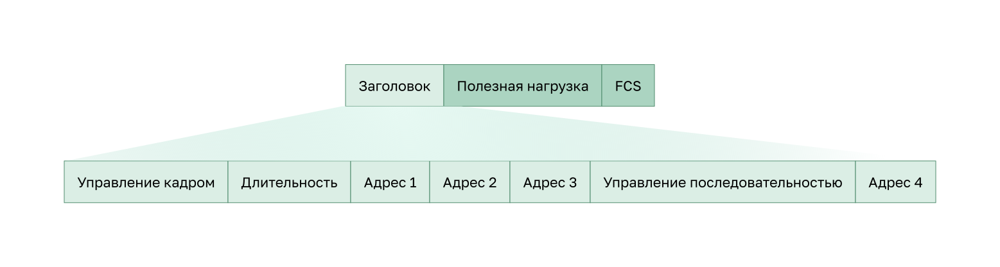

<!-- 12.3.1 -->
## Видео: принципы работы беспроводной локальной сети

Предыдущая тема охватывала компоненты WLAN. Эта тема будет охватывать принципы работы такой сети.

Посмотрите видео о принципах работы WLAN.

<!-- 12.3.2 -->
## Режимы топологии беспроводной сети 802.11

Беспроводные сети LAN могут использовать различные топологии сети. Стандарт 802.11 определяет два основных режима: **режим Ad hoc** и **режим инфраструктуры**. Модем также является режимом, который иногда используется для обеспечения быстрого беспроводного доступа.

**Режим Ad hoc** используется, когда два устройства подключаются по беспроводной сети в одноранговой (P2P) манере без использования точек доступа или беспроводных роутеров. Примерами могут служить беспроводные клиенты, подключающиеся напрямую друг к другу через Bluetooth или Wi-Fi Direct. Стандарт IEEE 802.11 ссылается на специальную сеть как независимый базовый набор услуг (IBSS).

**Инфраструктурный режим** – когда беспроводные клиенты соединяются через беспроводной роутер или точку доступа, например, в WLAN. Точки доступа подключаются к сетевой инфраструктуре с помощью проводной системы распределения, например, Ethernet.

**Использование мобильного телефона в качестве точки доступа в Интернет.** Смартфон или планшет с сотовым доступом к данным включен для создания личной точки доступа. Эта функция иногда упоминается как привязывание. Точка беспроводного доступа, как правило, является временным краткосрочным решением, благодаря которому смартфон может обеспечивать сервисы беспроводной связи Wi-Fi-роутера. Другие устройства могут подключаться и проверять подлинность со смартфоном для использования интернет-соединения.

<!-- 12.3.3 -->
## BSS и ESS

Режим инфраструктуры определяет два строительных блока топологии: базовый набор услуг (BSS) и расширенный набор услуг (ESS).

**Базовый набор сервисов**

BSS состоит из одной точки доступа, которая взаимодействует со всеми связанными беспроводными клиентами. Два BSS показаны на рисунке. Круги изображают зону покрытия, которая называется базовой зоной обслуживания (BSA). Если беспроводной клиент выходит из зоны основного обслуживания, он больше не может напрямую связываться с другими беспроводными устройствами в пределах зоны BSA.

MAC-адрес 2 уровня используется для уникальной идентификации каждого набора BSS, который называется идентификатором базового набора сервисов (BSSID). Таким образом, идентификатор BSSID является формальным именем BSS и всегда связан только с одной точкой доступа.

**Расширенный набор сервисов**

Когда одна BSS обеспечивает недостаточное покрытие, две или более BSS могут быть объединены через общую систему распределения (DS) в ESS. **ESS** – это объединение двух или более BSS, связанных между собой проводным DS. Каждая ESS идентифицируется по SSID, а каждая BSS – по BSSID.

Теперь беспроводные клиенты в одной зоне BSA могут обмениваться данными с беспроводными клиентами в другой в пределах одного набора ESS. Перемещающиеся мобильные беспроводные клиенты в роуминге могут переходить из одной зоны BSA в другую (с тем же набором ESS) и без проблем выполнять подключение.

Прямоугольная область на рисунке изображает зону покрытия, в пределах которой могут общаться члены ESS. Эта область называется зоной расширенного обслуживания (ESA).

<!-- 12.3.4 -->
## Структура кадра 802.11

Напомним, что все кадры уровня 2 состоят из раздела заголовка, полезной нагрузки и последовательности проверки кадра (FCS). Формат кадра 802.11 аналогичен формату кадра Ethernet, за исключением того, что он содержит больше полей, как показано на рисунке.

Все кадры беспроводной сети 802.11 содержат нижеперечисленные поля.

* **Frame Control** (управление кадром) определяет тип кадра беспроводной сети и содержит вложенные поля для версии протокола, типов кадра и адреса, настроек управления питанием и безопасности.
* **Duration** (продолжительность) используется, как правило, для указания оставшегося времени, необходимого для приема следующего передаваемого кадра.
* **Address1** (адрес 1) обычно содержит MAC-адрес принимающего беспроводного устройства или точки доступа.
* **Address2** (адрес 2) обычно содержит MAC-адрес передающего беспроводного устройства или точки доступа.
* **Address3** (адрес 3) в отдельных случаях содержит MAC-адрес назначения, например, интерфейса роутера (шлюза по умолчанию), к которому подключена точка доступа.
* **Управление последовательностью** содержит информацию для контроля последовательности и фрагментированных кадров.
* **Address4** (адрес 4) обычно отсутствует, так как используется только в режиме прямого соединения.
* **Payload** (полезная нагрузка) содержит данные для передачи.
* **FCS** используется для контроля ошибок на уровне 2.

<!-- 12.3.5 -->
## CSMA/CA

WLAN является полудуплексной, совместно используемой средой. Полудуплекс означает, что только один клиент может передавать или получать в любой момент. Совместное использование среды означает, что все беспроводные клиенты могут передавать и получать по одному и тому же радиоканалу. Это создает проблему, поскольку беспроводной клиент не может слышать во время отправки, что делает невозможным обнаружение коллизии.

Чтобы решить эту проблему, WLAN используют многостанционный доступ с контролем несущей и предотвращение коллизий (CSMA/CA) в качестве метода определения того, как и когда отправлять данные в сеть. Беспроводной клиент предпринимает ряд шагов.

1. Прослушивает канал, чтобы увидеть, не занят ли он. Это означает, что он чувствует, что в данный момент на канале нет другого трафика. Канал также называется несущей.
2. Отправляет сообщение о готовности к отправке (RTS) в точку доступа для запроса выделенного доступа к сети.
3. Получает сообщение очистки для отправки (CTS) от точки доступа, предоставляющей доступ к отправке.
4. Если беспроводной клиент не получает сообщение CTS, он ожидает случайное количество времени, прежде чем перезапустить процесс.
5. После того, как он получает CTS, он передает данные.
6. Все передачи подтверждены. Если беспроводной клиент не получает подтверждение, он предполагает, что произошло столкновение, и перезапускает процесс.

<!-- 12.3.6 -->
## Ассоциация беспроводных клиентов и точек доступа

Для того, чтобы беспроводные устройства могли осуществлять обмен данными по сети, для них требуется сначала выполнить ассоциацию с точкой доступа или беспроводным роутером. Важным этапом процесса 802.11 является обнаружение WLAN и последующее подключение к ней. Беспроводные устройства завершают следующий трехэтапный процесс, как показано на рисунке:

* обнаружение беспроводной точки доступа;
* аутентификация в этой точке доступа;
* ассоциация с точкой доступа.

Для подключения друг к другу беспроводной клиент и точка доступа должны согласовать специальные параметры. Для того чтобы разрешить согласование этих процессов, эти параметры необходимо настроить на точке доступа, а затем на клиенте.

* Имя **SSID** отображается в списке доступных беспроводных сетей на клиенте. В крупных организациях, которые используют несколько VLAN для сегментации трафика, каждый SSID сопоставляется с одной сетью. В зависимости от конфигурации сети идентификатор SSID может совместно использоваться несколькими точками доступа в ней.
* **Password** (пароль) требуется для аутентификации беспроводного клиента в точке доступа.
* **Network mode** (сетевой режим) относится к стандартам WLAN 802.11a/b/g/n/ac/ad. Точки доступа и беспроводные роутеры могут работать в смешанном режиме, как показано на рисунке 2, т.е. они могут одновременно использовать несколько стандартов.
* **Security mode** (режим безопасности) — это настройки параметров безопасности (WEP, WPA или WPA2). Следует всегда активировать самый высокий из доступных уровней безопасности.
* **Channel settings** (настройки канала) — частотные полосы, которые используются для передачи беспроводных данных. Беспроводные роутеры и точки доступа могут сканировать радиочастотные каналы и автоматически выбирать соответствующую настройку канала. Канал также может быть установлен вручную, если есть помехи с другой точкой доступа или беспроводным устройством.

<!-- 12.3.7 -->
## Пассивный и активный режим обнаружения

Беспроводные устройства должны выполнять обнаружение и подключение к точке доступа или роутеру. Беспроводные клиенты подключаются к точке доступа, используя для этого процесс сканирования (поиска). Он может быть пассивным или активным.

**Пассивный режим**

В пассивном режиме AP открыто объявляет о своей услуге, периодически отправляя кадры широковещательного маяка, содержащие SSID, поддерживаемые стандарты и настройки безопасности. Основная цель маяка состоит в том, чтобы позволить беспроводным клиентам узнавать, какие сети и точки доступа доступны в данной области и выбирать, какую из них использовать.

**Активный режим**

В активном режиме беспроводные клиенты должны знать имя SSID. Они инициируют процесс путем отправки по широковещательной рассылке кадра запроса поиска на несколько каналов. Запрос поиска содержит имя SSID и сведения о поддерживаемых стандартах. AP, настроенные с SSID, отправят ответ на запрос, который включает SSID, поддерживаемые стандарты и параметры безопасности. Активный режим может понадобиться в том случае, если для беспроводного роутера или точки доступа настроен запрет широковещательной рассылки кадров сигнала.

Беспроводной клиент также может отправить пробный запрос без имени SSID для обнаружения близлежащих WLAN. Точки доступа, настроенные для широковещательной рассылки кадров сигнала, отправляют беспроводному клиенту отклик, содержащий отклик по поиску и указание имени SSID. Точки доступа, где отключен компонент передачи SSID по широковещательной рассылке, не отправляют отклик.

<!-- 12.3.8 -->
<!-- quiz -->
