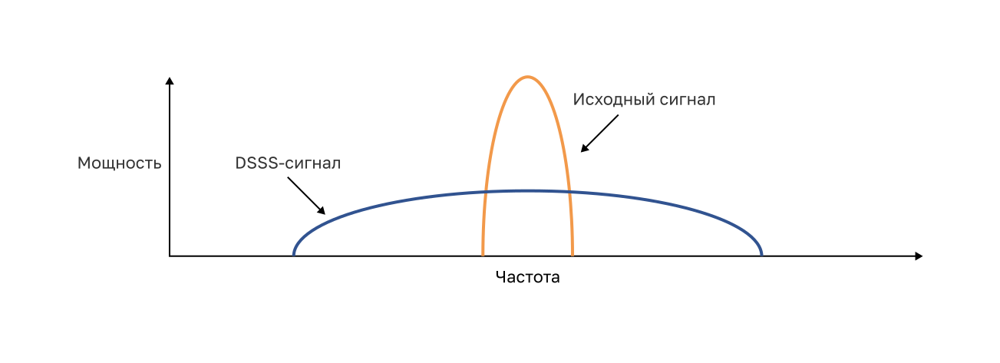
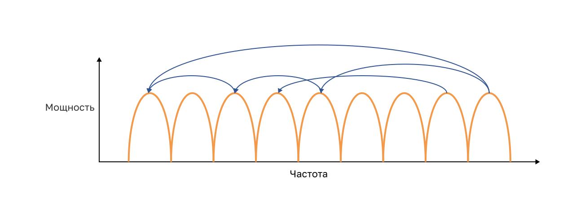
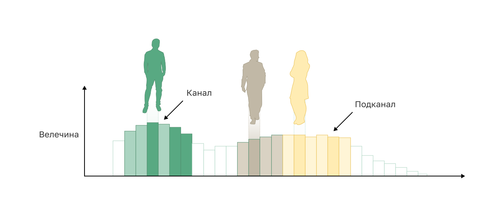
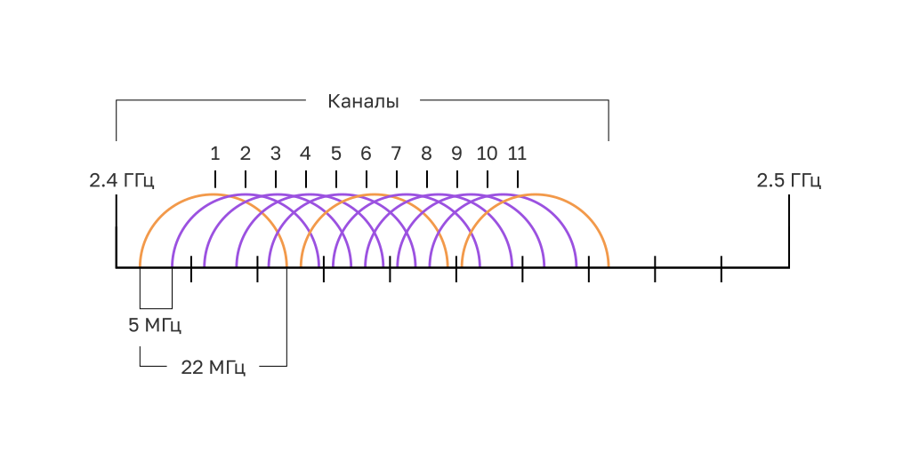
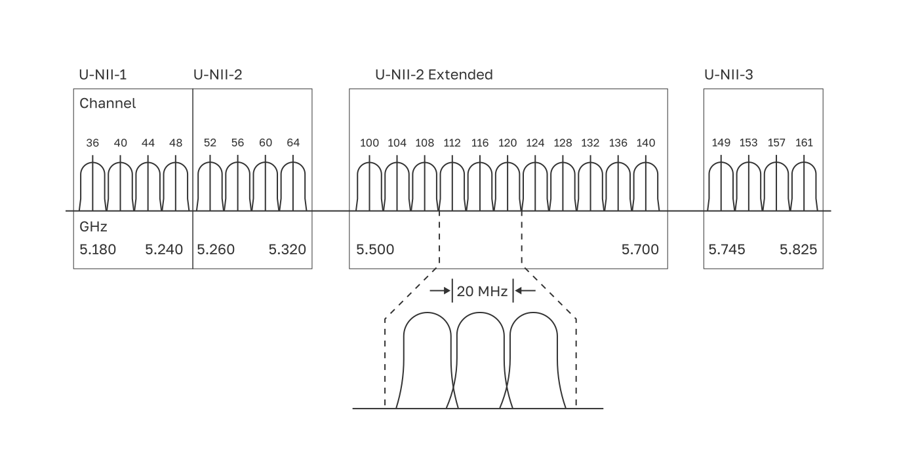
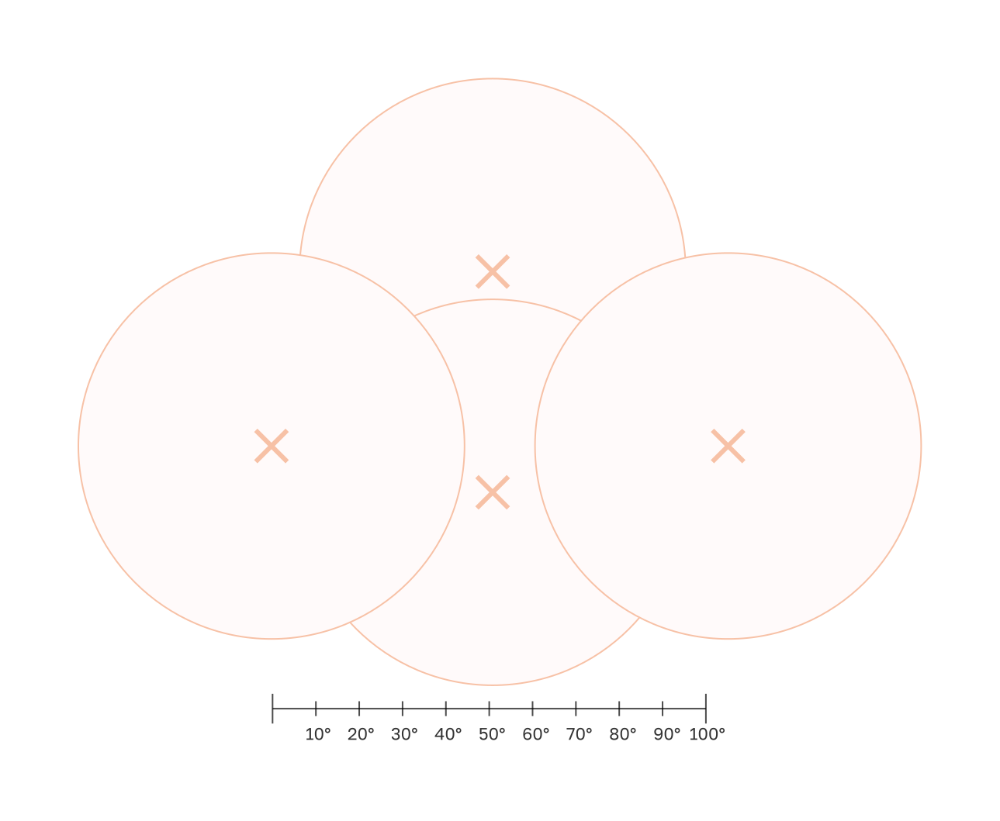

<!-- 12.5.1 -->
## Насыщение частотного канала

Устройства беспроводной локальной сети имеют передатчики и приемники, настроенные на конкретные частоты диапазона радиоволн. Обычно в качестве диапазонов выделяются частоты. Такие диапазоны затем разделяются на меньшие диапазоны — каналы.

Если спрос на конкретный канал слишком высок, этот канал, скорее всего, станет перенасыщенным. Насыщенность среды беспроводной сети снижает качество обмена данными. За последние несколько лет разработаны специальные приемы, которые позволяют улучшить качество обмена данными и снизить насыщенность. Эти методы уменьшают насыщенность канала, используя каналы более эффективным способом.

**Спектр с прямой последовательностью (DSSS)** - это метод модуляции, предназначенный для распространения сигнала по более широкой полосе частот. Методы расширения спектра были разработаны во время войны, чтобы врагам было труднее перехватить или замять коммуникационный сигнал. Это достигается путем распространения сигнала по более широкой частоте, которая эффективно скрывает заметный пик сигнала, как показано на рисунке. Правильно настроенный приемник может обратить модуляцию DSSS и восстановить исходный сигнал. DSSS используется устройствами 802.11b, чтобы избежать помех от других устройств, использующих ту же частоту 2,4 ГГц.

**Распространяющийся спектр со скачкообразной перестройкой частоты (FHSS)** - Он основан на методах расширенного спектра для связи. Он передает радиосигналы путем быстрого переключения несущего сигнала между многими частотными каналами. При использовании FHSS отправитель и получатель должны быть синхронизированы, чтобы «знать», на какой канал перейти. Этот процесс перехода сигнала между каналами обеспечивает более эффективное использование каналов, что снижает их перегрузку. FHSS использовался в оригинальном стандарте 802.11. Портативные рации и радиотелефоны, работающие на частоте 900 МГц, тоже используют FHSS, в то время как Bluetooth полагается на одну из вариаций этой технологии.

**Мультиплексирование с ортогональным частотным разделением (OFDM)** - это подмножество мультиплексирования с частотным разделением, в котором один канал использует несколько подканалов на соседних частотах. Подканалы в системе OFDM точно ортогональны относительно друг друга, что позволяет подканалам перекрываться без взаимных помех. OFDM используется несколькими системами связи, включая стандарт 802.11a/g/n/ac. Новый стандарт 802.11ax использует разновидность OFDM, называемую ортогональным множественным доступом с частотным разделением (OFDMA).

<!-- 12.5.2 -->
## Выбор канала

Для сетей WLAN, для которых требуется несколько точек доступа, рекомендуется использовать неперекрывающиеся каналы. Например, стандарты 802.11b/g/n работают в диапазоне частот от 2,4 ГГц до 2,5 ГГц. Полоса 2,4 ГГц поделена на несколько каналов. Каждому каналу выделена полоса 22 МГц и он отделен от следующего канала на 5 МГц. Стандарт 802.11b определяет 11 каналов для Северной Америки, как показано на рисунке (13 в Европе и 14 в Японии).

**Примечание**: Найдите в Интернете каналы 2,4 ГГц, чтобы узнать больше о вариациях для разных стран.

**Перекрывающиеся каналы 2,4 ГГц в Северной Америке**

Помехи возникают, когда один сигнал перекрывает канал, зарезервированный для другого сигнала, вызывая возможные искажения. Лучшая практика для 2,4 ГГц WLAN, которые требуют нескольких AP, состоит в том, чтобы использовать непересекающиеся каналы, хотя большинство современных AP сделает это автоматически. Если есть три соседние точки доступа, используйте каналы 1, 6 и 11, как показано на рисунке.

**2,4 ГГц неперекрывающиеся каналы для 802.11b/g/n**

<!--
На рисунке показаны три точки доступа с использованием каналов 1, 6 и 11.
-->

Для стандартов 5 ГГц 802.11a/n/ac имеется 24 канала. Полоса 5 ГГц разделена на три секции. Каждый канал отделен от следующего на 20 МГц. На рисунке показан первый из восьми каналов для частоты 5 ГГц Хотя есть небольшое перекрытие, каналы не мешают друг другу. Беспроводная связь 5 ГГц может обеспечить более быструю передачу данных для беспроводных клиентов в густонаселенных беспроводных сетях из-за большого количества непересекающихся беспроводных каналов.

**Примечание**: Найдите в Интернете каналы 5 ГГц, чтобы узнать больше о других 16 доступных каналах и узнать больше о вариациях для разных стран.

**Первые восемь не пересекающихся каналов для 5 ГГц**

Как и в случае сетей WLAN 2,4 ГГц, выбирайте каналы без помех при настройке нескольких точек доступа 5 ГГц, которые расположены рядом друг с другом, как показано на рисунке.

**Не пересекающиеся каналы стандарта 802.11a/n/ac для 5ГГц**

<!-- 12.5.3 -->
## Планирование развертывания беспроводной сети 

Количество пользователей, поддерживаемых WLAN, зависит от географического расположения объекта, включая количество тел и устройств, которые могут поместиться в пространстве, ожидаемые пользователями скорости передачи данных, использование неперекрывающихся каналов несколькими AP в ESS. и настройки мощности передачи.

При планировании местоположения точек доступа важна приблизительная круговая зона покрытия (как показано на рисунке), но есть несколько дополнительных рекомендаций:

* Если точки доступа должны использовать существующие кабельные системы, или присутствуют расположения, где нельзя разместить точки доступа, следует отметить эти места на карте;
* Обратите внимание на все потенциальные источники помех, которые могут включать микроволновые печи, беспроводные видеокамеры, флуоресцентные лампы, детекторы движения или любое другое устройство, использующее диапазон 2,4 ГГц.
* Точки доступа следует размещать выше физических препятствий;
* По возможности размещать точки доступа вертикально рядом с потолком в центре каждой зоны;
* Размещать AP в тех местах, где будут находиться пользователи. Например, конференц-залы, как правило, больше подходят для размещения точки доступа, чем коридор. 
* Если сеть IEEE 802.11 была настроена для смешанного режима, беспроводные клиенты могут работать медленнее, чем обычные скорости, чтобы поддерживать более старые беспроводные стандарты.

Оценивая ожидаемую зону покрытия AP, следует понимать, что это значение варьируется в зависимости от стандарта WLAN или набора развертываемых стандартов, природы средства и мощности передачи, для которой настроена AP. При разработке плана зон покрытия необходимо всегда изучать спецификации используемых точек доступа.

<!-- 12.5.4 -->
<!-- quiz -->