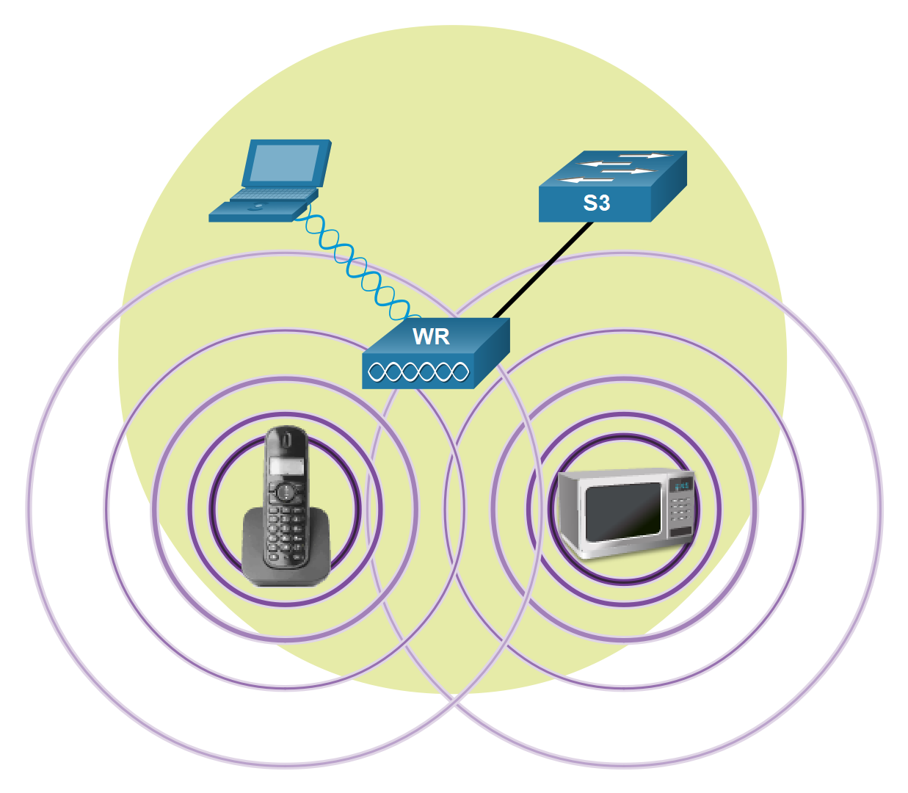
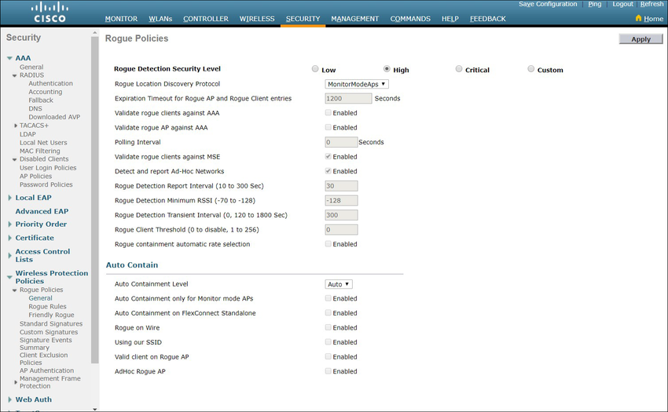

<!-- 12.6.1 -->
## Видео: угрозы безопасности WLAN 

Предыдущие темы охватывали компоненты и конфигурацию WLAN. Здесь вы узнаете об угрозах безопасности WLAN.

Нажмите «Воспроизвести», чтобы просмотреть видео об угрозах безопасности WLAN.

<!-- 12.6.2 -->
## Обзор безопасности беспроводной сети

В диапазоне действия точки доступа сеть WLAN открыта для всех, кто обладает соответствующими учетными данными, посредством которых выполняется ассоциация с точкой доступа. Обладая беспроводным сетевым адаптером и знанием приемов взлома, злоумышленник может не присутствовать физически в том месте, где находится сеть WLAN, чтобы получить к ней доступ.

Атаки могут инициироваться посторонними людьми и недовольными сотрудниками, но помимо подобных недоброжелателей атака может быть ненамеренно спровоцирована любым сотрудником. Беспроводные сети особенно подвержены следующим угрозам:

* **Перехват данных** - Беспроводные данные должны быть зашифрованы для предотвращения их перехвата.
* **Беспроводные нарушители** - неавторизованные пользователи, пытающиеся получить доступ к сетевым ресурсам, могут быть предотвращены с помощью эффективных методов аутентификации.
* **Атаки типа «отказ в обслуживании» (DoS)** - Доступ к услугам WLAN может быть скомпрометирован случайно или злонамеренно. Существуют различные решения в зависимости от источника атаки DoS.
* **Вредоносные точки доступа** - Несанкционированные точки доступа, установленные благонамеренными пользователями или в злонамеренных целях, можно обнаружить с помощью программного обеспечения для управления.

<!-- 12.6.3 -->
## Атаки типа «отказ в обслуживании» (DoS-атаки)

Ниже приведены причины возникновения DoS-атаки на беспроводную сеть.

* **Неправильно настроенные устройства** \- ошибки конфигурации могут отключить WLAN. Например, администратор может случайно изменить конфигурацию и отключить сеть, либо злоумышленник с правами администратора может отключить сеть WLAN намеренно.
* **Злонамеренный пользователь, преднамеренно вмешивающийся в беспроводную связь** \- Его цель - полностью отключить беспроводную сеть или до точки, где никакое законное устройство не может получить доступ к среде.
* **Случайные помехи** \- WLAN подвержены помехам от других беспроводных устройств, включая микроволновые печи, беспроводные телефоны, радионяни и многое другое, как показано на рисунке. Полоса 2,4 ГГц в большей степени подвержена воздействию помех, чем полоса 5 ГГц.

<!-- /courses/srwe-dl/af9ecea0-34fe-11eb-b1b2-9b1b0c1f7e0d/afb786b2-34fe-11eb-b1b2-9b1b0c1f7e0d/assets/ca9053e0-1c27-11ea-af09-3b2e6521927c.svg -->

Чтобы минимизировать риск DoS-атаки из-за неправильно настроенных устройств и злонамеренных атак, укрепите все устройства, сохраните пароли в безопасности, создайте резервные копии и убедитесь, что все изменения конфигурации внесены в нерабочее время.

Контролируйте WLAN на предмет любых случайных помех и устраняйте их по мере их появления. Поскольку полоса 2,4 ГГц используется другими типами устройств, 5 ГГц следует использовать в областях, подверженных помехам.

<!-- 12.6.4 -->
## Вредоносные точки доступа

Вредоносная точка доступа - это точка доступа или беспроводной маршрутизатор, который был подключен к корпоративной сети без явного разрешения и противоречит корпоративной политике. Любой, имеющий доступ к помещению, может установить (злонамеренно или не злонамеренно) недорогой беспроводной маршрутизатор, который потенциально может предоставить доступ к защищенному сетевому ресурсу.

После подключения в точка доступа может использоваться злоумышленником для захвата MAC-адресов, захвата пакетов данных, получения доступа к сетевым ресурсам или запуска атаки «человек посередине».

Точка доступа персональной сети также может использоваться в качестве вредоносной точки доступа. Например, пользователь, имеющий защищённый доступ к сети, настраивает свой авторизованный узел Windows, как точку доступа к сети Wi-Fi. При этом несакционированные устройства обходят меры безопасности и получают доступ к ресурсам сети, как одно общее устройство.

Чтобы предотвратить установку вредоносных AP, организации должны настроить WLC с вредоносными политиками AP, как показано на рисунке, и использовать программное обеспечение для мониторинга для активного мониторинга радиочастотного спектра для неавторизованных AP.

<!-- 12.6.5 -->
## Атака с перехватом

При атаке через посредника злоумышленник располагается между двумя доверяемыми объектами, чтобы читать, изменять или перенаправлять данные, которыми они обмениваются. Существует множество способов создания атаки с перехватом.

Популярная беспроводная атака MITM называется атакой «злой близнец AP», когда злоумышленник вводит мошенническую точку доступа и настраивает ее с тем же SSID, что и у законной точки доступа, как показано на рисунке. Места, предлагающие бесплатный Wi-Fi, такие как аэропорты, кафе и рестораны, являются особенно популярными местами для этого типа атак благодаря открытой аутентификации.

<!-- /courses/srwe-dl/af9ecea0-34fe-11eb-b1b2-9b1b0c1f7e0d/afb786b2-34fe-11eb-b1b2-9b1b0c1f7e0d/assets/ca916551-1c27-11ea-af09-3b2e6521927c.svg -->

Беспроводные клиенты, пытающиеся подключиться к WLAN, увидят две точки доступа с одинаковым SSID, предлагающие беспроводной доступ. Те, кто находится рядом с вредоносной точкой доступа, находят более сильный сигнал и, скорее всего, ассоциируются с ним. Пользовательский трафик теперь отправляется вредоносной точке доступа, которая, в свою очередь, собирает данные и направляет их на легитимную точку доступа, как показано на рисунке. Обратный трафик от законной точки доступа отправляется вредоносной точке доступа, захватывается, а затем пересылается ничего не подозревающему пользователю. Злоумышленник может украсть пароли пользователя, личную информацию, получить доступ к его устройству и поставить под угрозу систему.

<!-- /courses/srwe-dl/af9ecea0-34fe-11eb-b1b2-9b1b0c1f7e0d/afb786b2-34fe-11eb-b1b2-9b1b0c1f7e0d/assets/ca91da80-1c27-11ea-af09-3b2e6521927c.svg -->

Успешность предотвращения атаки с перехватом зависит от сложности инфраструктуры сети WLAN и тщательности мониторинга сети. Процесс начинается с определения санкционированных устройств в сети WLAN. Для этого пользователи должны пройти аутентификацию. После того, как определены все санкционированные устройства, можно выполнить мониторинг сети на предмет наличия подозрительных устройств или трафика.

<!-- 12.6.6 -->
<!-- quiz -->