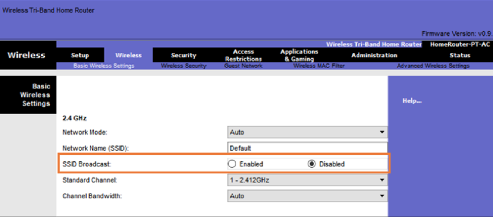
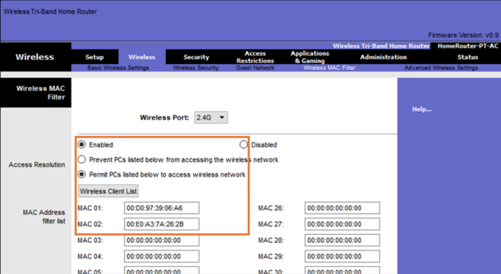
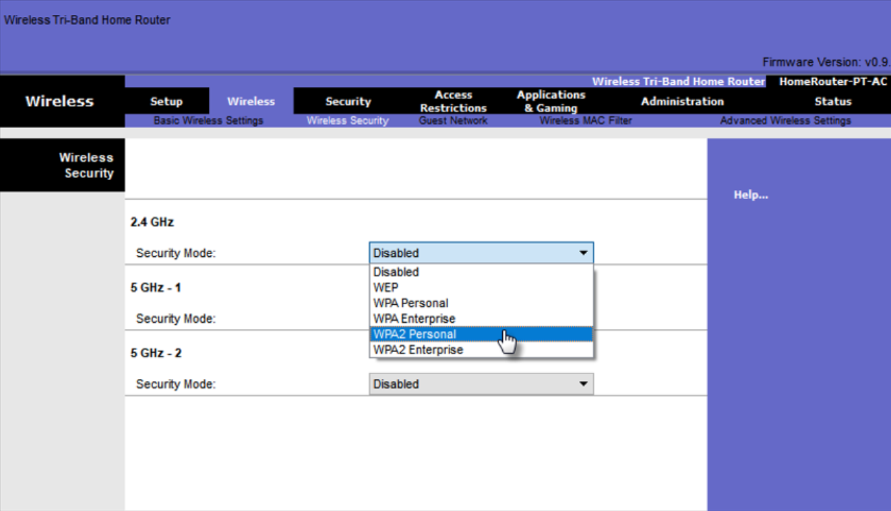
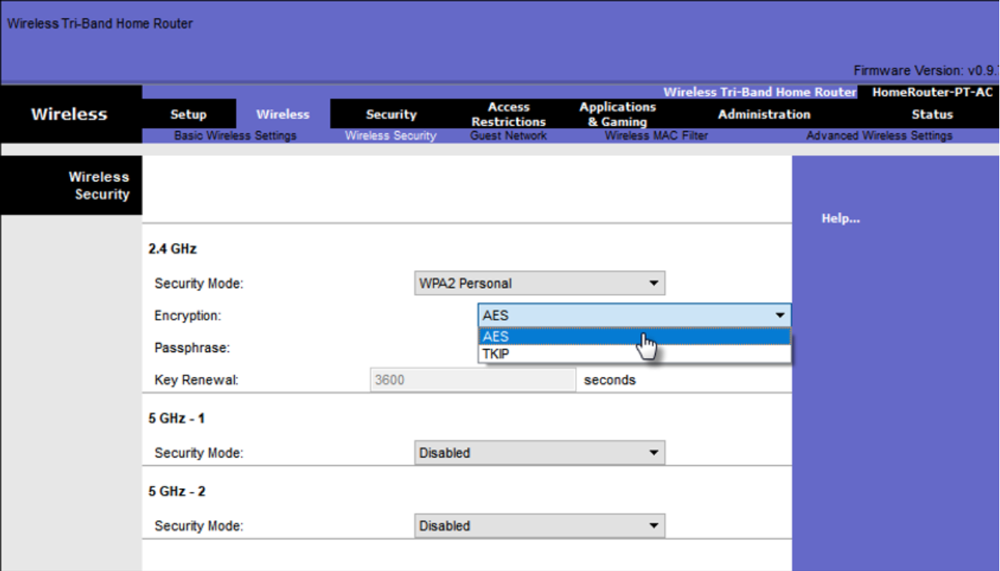
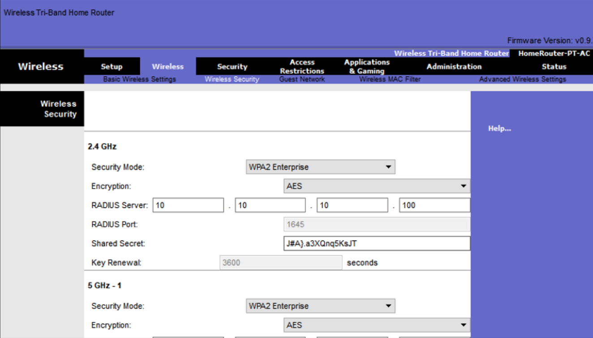

# Безопасность беспроводных локальных сетей

<!-- 12.7.1-->
## Видео - Безопасность беспроводных сетей

В предыдущей теме объяснялись угрозы безопасности WLAN. Что вы можете сделать, чтобы защитить WLAN?

Нажмите «Воспроизвести», чтобы просмотреть видео о методах защиты беспроводных локальных сетей.

<!-- 12.7.2-->
## Сокрытие SSID и фильтрация MAC-адресов

Сигналы беспроводной связи могут передаваться через твердые препятствия — потолки, полы, стены, за пределы дома или офиса. Без строгих мер безопасности установка сети WLAN — сродни повсеместному размещению Ethernet-портов, даже на улице.

Чтобы противостоять угрозам, препятствующим проникновению беспроводных злоумышленников и защите данных, использовались две ранние функции безопасности, которые по-прежнему доступны на большинстве маршрутизаторов и точек доступа: маскирование SSID и фильтрация MAC-адресов.

**Сокрытие SSID**

AP и некоторые беспроводные маршрутизаторы позволяют отключить кадр маяка SSID, как показано на рисунке. Беспроводные клиенты должны вручную настроить SSID для подключения к сети.

**Фильтрация MAC-адресов**

Администратор может вручную разрешить или запретить клиентам беспроводной доступ на основе их физического аппаратного MAC-адреса. На рисунке маршрутизатор настроен на разрешение двух MAC-адресов. Устройства с разными MAC-адресами не смогут подключиться к беспроводной сети 2,4 ГГц.

<!-- 12.7.3-->
## 802.11 Оригинальные методы аутентификации

Хотя эти две функции отсеивают большинство пользователей, на самом деле ни сокрытие идентификатора SSID, ни фильтрация MAC-адресов не помешают умелому взломщику. Имена SSID легко обнаружить даже в том случае, если точки доступа не выполняют их широковещательную рассылку, а MAC-адреса можно подделать. Лучший способ защиты беспроводных сетей — использовать системы аутентификации и шифрования.

В исходном стандарте 802.11 представлено два типа аутентификации:

- **Аутентификация открытой системы** - Любой беспроводной клиент должен легко подключаться и должен использоваться только в ситуациях, когда безопасность не имеет значения, например, в тех случаях, когда предоставляется бесплатный доступ в Интернет, например в кафе, отелях и в удаленных областях. Беспроводной клиент отвечает за обеспечение безопасности, например, использование виртуальной частной сети (VPN) для безопасного подключения. VPN предоставляют услуги аутентификации и шифрования VPN выходит за рамки этой темы.
- **Аутентификация с помощью общего ключа** - Предоставляет механизмы аутентификации и шифрования данных, передаваемых между беспроводным клиентом и точкой доступа или беспроводным маршрутизатором. Однако, для подключения пароль необходимо предварительно согласовать между сторонами.
Следующая таблица обобщает эти методы аутентификации.

<!-- 12.7.4-->
## Методы аутентификации согласованного ключа

Существует четыре метода аутентификации с общим ключом, как описано в таблице. Пока доступность устройств WPA3 не станет повсеместной, беспроводные сети должны использовать стандарт WPA2.

|**Метод аутентификации**|**Описание**|
|---|---|
|**Протокол безопасности, аналогичной защите проводной сети (Wired Equivalent Privacy, WEP)**|Первоначальная спецификация 802.11 предназначена для защиты данных с использованием метода шифрования Rivest Cipher 4 (RC4) со статическим ключом. Однако, ключ никогда не меняется при обмене пакетами. Это позволяет легко взломать. WEP больше не рекомендуется и никогда не должен использоваться|
|**Защищенный доступ к Wi-Fi (WPA)**|Стандарт Wi-Fi Alliance, использующий WEP, но защищающий данные с помощью гораздо более надежного алгоритма шифрования Temporal Key Integrity Protocol (TKIP). TKIP меняет ключ для каждого пакета, что значительно усложняет взлом.|
|**WPA2**|WPA2 является текущим отраслевым стандартом для защиты беспроводных сетей. Он использует расширенный стандарт шифрования (AES) для шифрования. AESAES в настоящее время is считается самым надежным протоколом шифрования.|
|**WPA3**|Следующее поколение безопасности Wi-Fi. Все устройства с поддержкой WPA3 используют новейшие методы обеспечения безопасности, запрещают устаревшие устаревшие протоколы и требуют использования защищенных кадров управления (PMF). Однако устройства с WPA3 пока недоступны.|

<!-- 12.7.5-->
## Аутентификация домашнего пользователя

Домашние маршрутизаторы обычно имеют два варианта аутентификации: WPA и WPA2 WPA2 сильнейший из них. На рисунке показана возможность выбора одного из двух методов аутентификации WPA2:

- **Персональный** - предназначен для домашней или небольшой офисной сети, пользователи проходят аутентификацию с использованием предварительного ключа (PSK). Беспроводные клиенты проходят проверку подлинности с помощью беспроводного маршрутизатора с использованием предварительного общего пароля. Специализированный сервер аутентификации не требуется.
- **Корпоративный** - Предназначен для корпоративных сетей, но для него требуется сервер аутентификации удаленной аутентификации (RADIUS). Хотя этот тип аутентификации более сложен для настройки, он обеспечивает повышенную безопасность. Устройство должно выполнить аутентификацию посредством сервера RADIUS, после чего пользователи должны пройти аутентификацию, используя стандарт 802.1X, который задействует для аутентификации усовершенствованный протокол аутентификации (EAP).
На рисунке администратор настраивает беспроводной маршрутизатор с персональной аутентификацией WPA2 в диапазоне 2,4 ГГц.

<!-- 12.7.6-->
## Методы шифрования

Шифрование используется для защиты данных. Если злоумышленник выполнил захват зашифрованных данных, он не сможет их расшифровать за короткий срок.

Стандарты WPA и WPA2 используют следующие протоколы шифрования:

- **Протокол целостности временного ключа (TKIP)** - TKIP - это метод шифрования, используемый WPA. Он обеспечивает поддержку предыдущих версий оборудования сетей WLAN за счёт устранения исходных уязвимостей, характерных для метода шифрования 802.11 WEP. Он использует WEP, но шифрует полезную нагрузку уровня 2 с помощью TKIP и выполняет проверку целостности сообщения (MIC) в зашифрованном пакете, чтобы убедиться, что сообщение не было изменено.
- **Расширенный стандарт шифрования (AES)** - AES - это метод шифрования, используемый WPA2. Это предпочтительный метод, потому что это гораздо более надежный метод шифрования. Он использует режим счетного шифра с протоколом кода аутентификации сообщений с цепочкой блоков (CCMP), который позволяет узлам назначения распознавать, были ли изменены зашифрованные и незашифрованные биты.

На рисунке администратор настраивает беспроводной маршрутизатор для использования WPA2 с шифрованием AES в диапазоне 2,4 ГГц.

<!-- 12.7.7-->
## Аутентификация на корпоративном уровне

В сетях, к которым предъявляются более строгие требования в отношении безопасности, для предоставления беспроводным клиентам доступа к сети требуется дополнительная аутентификация или вход в систему. Для выбора режима безопасности Enterprise требуется сервер RADIUS для аутентификации, авторизации и учета (AAA).

- **IP-адрес сервера RADIUS** - это доступный адрес сервера RADIUS.
- **Номера портов UDP** - Официально назначенные порты UDP 1812 для аутентификации RADIUS и 1813 для учета RADIUS, но также могут работать с использованием портов UDP 1645 и 1646, как показано на рисунке.
- **Общий ключ** - используется для аутентификации AP на сервере RADIUS.
На рисунке администратор настраивает беспроводной маршрутизатор с аутентификацией WPA2 Enterprise с использованием шифрования AES. IPv4-адрес сервера RADIUS также настроен с использованием надежного пароля, который будет использоваться между беспроводным маршрутизатором и сервером RADIUS.

Общий ключ не является параметром, который должен быть настроен на беспроводном клиенте. Его настройка требуется только на точке доступа, чтобы выполнить аутентификацию с помощью сервера RADIUS. Аутентификация и авторизация пользователей обрабатываются стандартом 802.1X, который обеспечивает централизованную серверную аутентификацию конечных пользователей.

При входе в систему по стандарту 802.1X для обмена данными с точкой доступа и сервером RADIUS используется протокол EAP. EAP представляет собой платформу для аутентификации доступа к сети. Он может обеспечить механизм безопасной аутентификации и согласовать защищенный закрытый ключ, который затем может быть использован для сеанса беспроводного шифрования с использованием шифрования TKIP или AES.

<!-- 12.7.8-->
## WPA3

На момент написания этой статьи, устройства, поддерживающие аутентификацию WPA3, были недоступны. Однако, WPA2 больше не считается безопасным. WPA3, если он доступен, является рекомендуемым методом аутентификации 802.11. WPA3 включает в себя четыре функции:

- WPA3-Personal
- WPA3-Enterprise
- Открытые сети
- Интернет вещей (IoT)

**WPA3-Personal**

В WPA2-Personal субъекты угроз могут прослушивать «рукопожатие» между беспроводным клиентом и точкой доступа и использовать атаку методом грубой силы, чтобы попытаться угадать PSK. WPA3-Personal предотвращает эту атаку с помощью одновременной аутентификации равных (SAE), функции, указанной в IEEE 802.11-2016. PSK никогда не разоблачается, что делает невозможным угадать злоумышленнику.

**WPA3-Enterprise**

WPA3-Enterprise по-прежнему использует аутентификацию 802.1X/EAP Однако это требует использования 192-битного криптографического набора и исключает смешивание протоколов безопасности для предыдущих стандартов 802.11. WPA3-Enterprise придерживается пакета коммерческих алгоритмов национальной безопасности (CNSA), который обычно используется в сетях Wi-Fi с высоким уровнем безопасности.

**Открытые сети**

Открытые сети в WPA2 отправляют пользовательский трафик открытым текстом без проверки подлинности. В WPA3 открытые или общедоступные сети Wi-Fi по-прежнему не используют аутентификацию. Однако они используют Opportunistic Wireless Encryption (OWE) для шифрования всего беспроводного трафика.

**Подготовка к использованию IoT**

Хотя WPA2 включал в себя Wi-Fi Protected Setup (WPS) для быстрой настройки встроенных устройств без предварительной их настройки, WPS уязвим для различных атак и не рекомендуется для использования. Кроме того, устройства IoT, как правило, являются автономными, то есть у них нет встроенного графического интерфейса для настройки, и им необходим любой простой способ подключения к беспроводной сети. Протокол обеспечения устройств (DPP) был разработан для удовлетворения этой потребности. Каждое глупое устройство имеет открытый ключ в жестком виде записанным в коде. Ключ обычно проставляется на внешней стороне устройства или его упаковки в виде кода быстрого ответа (QR). Сетевой администратор может отсканировать QR-код и быстро ввести в сеть устройство. Хотя это и не является строго частью стандарта WPA3, DPP со временем заменит WPS.