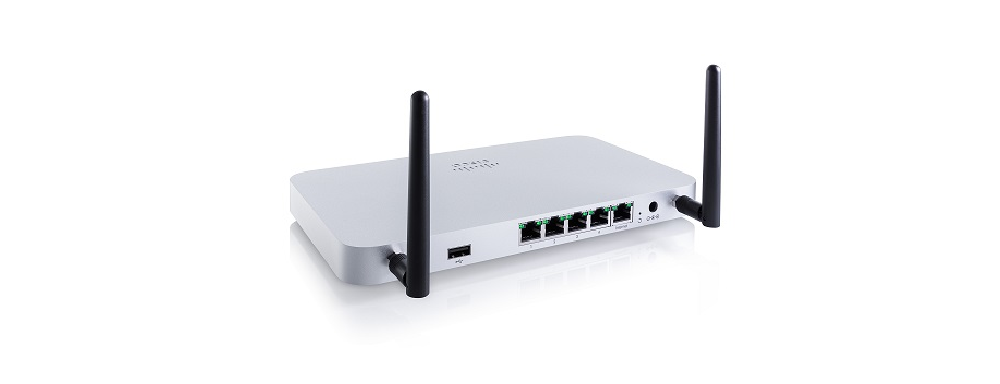
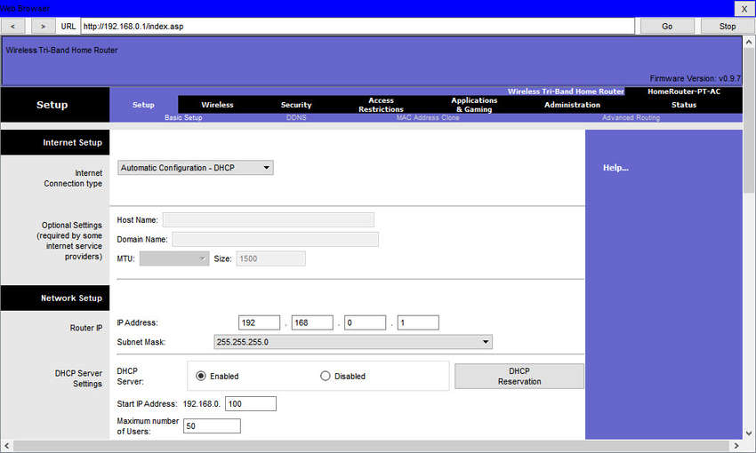
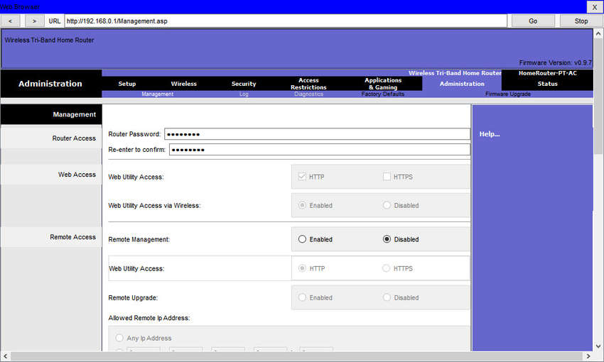
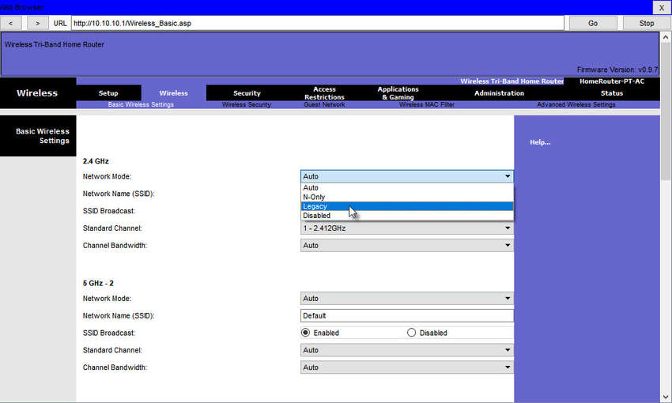
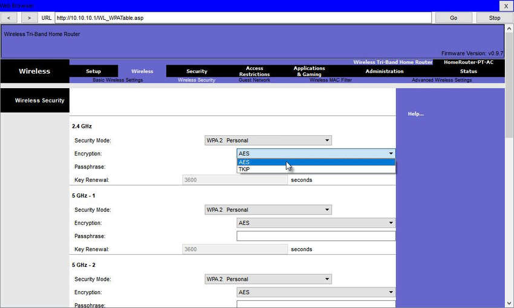

<!-- 13.1.1 -->
## Видео: конфигурация беспроводной сети 

Посмотрите видео, демонстрирующего настройку беспроводной сети.

<!-- 13.1.2 -->
## Беспроводной роутер

Удаленные работники, небольшие филиалы и домашние сети часто используют небольшой офис и домашний роутер. Эти устройства иногда называют маршрутизаторами с интегрированными сервисами, потому что они обычно включают в себя коммутатор для проводных клиентов, порт для подключения к Интернету (иногда помеченный как WAN) и беспроводные компоненты для беспроводного доступа клиентов, как показано для Cisco Meraki MX64W на рисунке. В остальной части этого модуля небольшие офисные и домашние роутеры называются беспроводными.

**Cisco Meraki MX64W**

На следующем рисунке показана топология, изображающая физическое подключение проводного ноутбука к беспроводному роутеру, который затем подключается к кабельному или DSL-модему для подключения к Интернету.

Эти беспроводные роутеры обычно обеспечивают безопасность WLAN, службы DHCP, встроенную трансляцию имен (NAT), качество обслуживания (QoS), а также ряд других функций. Набор функций зависит от модели устройства.

**Примечание.** Конфигурирование кабельного или DSL-модема обычно выполняется представителем поставщика услуг на месте, либо удаленно через пошаговое руководство с вами по телефону. Если вы покупаете модем, он будет поставляться с документацией о том, как подключить его к вашему поставщику услуг, что, скорее всего, будет включать обращение к вашему поставщику услуг для получения дополнительной информации.

<!-- 13.1.3 -->
## Вход на беспроводной роутер

Большинство домашних беспроводных роутеров для небольших офисов готовы к работе сразу «из коробки». Они предварительно настроены для подключения к сети и предоставления услуг. Например, такое устройство использует DHCP для автоматического предоставления адресной информации подключенным компьютерам или смартфонам. Вместе с тем в Интернете легко находятся IP-адреса по умолчанию для беспроводных роутеров, имена пользователей и пароли. Просто введите такую фразу для поиска, как default wireless router ip address (IP-адрес по умолчанию для беспроводного роутера) или default wireless router passwords (пароли по умолчанию для беспроводных роутеров) для отображения списка многих сайтов, которые предоставляют эту информацию. Например, имя пользователя и пароль на рисунке – «admin». Таким образом, первоочередной задачей является изменение этих параметров по умолчанию с целью обеспечения безопасности.

Для доступа к графическому пользовательскому интерфейсу настройки беспроводного роутера откройте браузер. В поле **Address** (адрес) введите частный IP-адрес по умолчанию. IP-адрес по умолчанию можно найти либо в документации, которая поставляется с роутером, либо в Интернете. На рисунке показан IP-адрес 192.168.0.1, который является общим стандартным IP-адресом для некоторых производителей. Окно **Security** (безопасность) запрашивает авторизацию для получения доступа к графическому пользовательскому интерфейсу роутера. Слово «admin» обычно используется в качестве имени пользователя и пароля по умолчанию. Как и в прошлый раз, сверьтесь с документацией к вашему беспроводному роутеру или поищите в Интернете.

<!-- 13.1.4 -->
## Базовая настройка сети

Базовая настройка сети включает в себя следующие шаги:

1. войдите на роутер через браузер;
2. измените пароль администратора, заданный по умолчанию;
3. войдите с новым административным паролем;
4. измените диапазон адресов DHCP по умолчанию;
5. обновите IP-адрес;
6. войдите в роутер с новым IP-адресом.

**1. Войдите на роутер через браузер.**

После входа в систему открывается графический интерфейс. На экране настройки будет присутствовать вкладки или меню, которые помогут переключаться на различные задачи настройки роутера. Часто необходимо сохранять параметры, измененные в одном окне, перед переходом в другое. В такой ситуации рекомендуется вносить изменения в параметры по умолчанию.

**2. Измените пароль администратора, заданный по умолчанию.**

Чтобы изменить пароль для входа по умолчанию, найдите административную часть графического интерфейса роутера. В этом примере была выбрана вкладка **«Администрирование»**. Здесь пароль устройства можно поменять. Иногда, как в примере, вы можете изменить только пароль. Имя пользователя остается admin или любым другим именем пользователя по умолчанию для роутера, который вы настраиваете.

**3. Войдите с новым административным паролем.**

После изменения пароля беспроводной роутер снова запросит авторизацию. Введите имя пользователя и новый пароль, как показано в примере.

**4. Измените диапазон адресов DHCP по умолчанию.**

Измените IPv4-адрес по умолчанию. Рекомендуется использовать частную IP-адресацию внутри своей сети. В примере используется IPv4-адрес 10.10.10.1, но это может быть любой выбранный вами частный адрес.

**5. Обновите IP-адрес.**

Нажатие кнопки **Save** (сохранить) приведет к временной потере доступа к беспроводному роутеру. Откройте окно командной строки и обновите свой IP-адрес с помощью команды **ipconfig/renew**, как показано в примере.

**6. Войдите в роутер с новым IP-адресом.**

Введите новый IP-адрес, чтобы восстановить доступ к графическому интерфейсу конфигурации роутера, как показано в примере. Теперь вы готовы продолжить настройку устройства для беспроводного доступа.

<!-- 13.1.5 -->
## Базовая настройка беспроводной сети

Базовая настройка беспроводной сети включает в себя следующие шаги:

1. просмотр настроек WLAN по умолчанию;
2. изменение режима сети;
3. настройка идентификатора SSID;
4. конфигурация канала;
5. конфигурация режима безопасности;
6. настройка парольной фразы.

**1. Просмотр настроек WLAN по умолчанию.**

Из коробки беспроводной роутер обеспечивает доступ к устройствам, используя имя и пароль сети по умолчанию. Имя беспроводной сети называется ее идентификатором (SSID). Найдите основные параметры этой сети для вашего роутера, чтобы изменить эти значения по умолчанию, как показано в примере.

**2. Изменение режима сети.**

Некоторые беспроводные роутеры позволяют выбирать, какой стандарт 802.11 следует поддерживать. Пример показывает, что был выбран «Legacy». Это означает, что во всех беспроводных устройствах, которые подключаются к роутеру, должны быть установлены сетевые платы. Современные беспроводные роутеры, настроенные для устаревшего или смешанного режима, скорее всего поддерживают сетевые адаптеры 802.11a, 802.11n и 802.11ac.

**3. Настройка идентификатора SSID.**

Назначьте SSID для WLAN. OfficeNet используется в примере для всех трех WLAN (третий WLAN не показан). Беспроводной роутер объявляет о своем присутствии посредством выполнения широковещательной рассылки его SSID. Это позволяет беспроводным узлам автоматически обнаруживать имя сети. Если широковещательная рассылка SSID отключена, на беспроводных устройствах необходимо вводить его вручную.

**4. Конфигруация канала.**

Устройства, настроенные с одним и тем же каналом в диапазоне 2,4 ГГц, могут перекрываться и вызывать искажения, снижая производительность беспроводной связи и потенциально нарушая сетевые подключения. Решение, позволяющее избежать помех, заключается в настройке непересекающихся каналов на беспроводных роутерах и точках доступа, которые находятся рядом друг с другом. В частности, каналы 1, 6 и 11 не перекрываются. В этом примере устройство настроено на использование канала 6.

**5. Конфигурация режима безопасности.**

Изначально на беспроводном роутере может быть не настроена защита WLAN. В этом примере персональная версия защищенного доступа Wi-Fi версии 2 (WPA2 Personal) выбрана для всех трех WLAN. WPA2 с расширенным стандартом шифрования (AES) в настоящее время является самым надежным режимом безопасности.

**6. Настройка парольной фразы.**

Персональный WPA2 использует идентификационную фразу для аутентификации беспроводных клиентов. Его легче использовать в небольшом офисе или дома, поскольку он не требует сервера аутентификации. Более крупные организации внедряют WPA2 для предприятий и требуют, чтобы беспроводные клиенты проходили аутентификацию с использованием имени пользователя и пароля.

<!-- 13.1.6 -->
## Настройка беспроводной ячеистой сети

В небольшом офисе или домашней сети одного беспроводногороутера может быть достаточно для обеспечения доступа ко всем клиентам. Однако, если вы хотите расширить радиус действия примерно на 45 метров в помещении и на 90 метров на улице, вы можете добавить точки доступа. Как показано в беспроводной ячеистой сети на рисунке, две точки доступа настроены с одинаковой конфигурацией WLAN из нашего предыдущего примера. Обратите внимание, что выбраны каналы 1 и 11, чтобы точки доступа не мешали каналу 6, настроенному ранее.

Расширение WLAN в небольшом офисе или дома становится все проще. Производители сделали создание беспроводной ячеистой сети (WMN) простым с помощью приложений для смартфонов. Вы покупаете систему, расставляете точки доступа, подключаете их, загружаете приложение и настраиваете свой WMN за несколько шагов. Поищите в Интернете «лучшую сетевую систему Wi-Fi», чтобы найти обзоры текущих предложений.

<!-- 13.1.7 -->
## NAT для IPv4

На беспроводном роутере, если вы ищете страницу, подобную странице состояния, показанной на рисунке, вы найдете информацию об IPv4-адресации, которую устройство использует для отправки данных в Интернет. Обратите внимание, что IPv4-адрес 209.165.201.11 – это сеть, отличная от адреса 10.10.10.1, назначенного интерфейсу локальной сети роутера. Все устройства в локальной сети получат назначенные адреса с префиксом 10.10.10.

IPv4-адрес 209.165.201.11 общедоступен в Интернете. Любой адрес с цифрой 10 в первом октете является частным и не может быть маршрутизирован в Интернете. Следовательно, роутер будет реализовывать процесс преобразования частных адресов в маршрутизируемые в Интернете адреса. Этот процесс называется преобразованием сетевых адресов (NAT). NAT обеспечивает преобразование частного (локального) IPv4-адреса источника в публичный (глобальный). Входящие пакеты проходят обратный процесс. Используя NAT, роуте может преобразовать многие внутренние IP-адреса в общедоступные.

Некоторые интернет-провайдеры используют частную адресацию для подключения к клиентским устройствам. Однако в итоге ваш трафик покинет сеть провайдера и будет маршрутизироваться через Интернет. Чтобы просмотреть IP-адреса для ваших устройств, введите запрос «какой у меня IP-адрес». Сделайте это для других устройств в той же сети, и вы увидите, что все они используют один и тот же общедоступный IPv4-адрес. NAT делает это возможным, отслеживая номера портов источника для каждого сеанса, установленного устройством. Если у вашего интернет-провайдера включен IPv6, вы увидите уникальный IPv6-адрес для каждого устройства.

<!-- 13.1.8 -->
## Гарантированное качество обслуживания

Многие беспроводные роутеры имеют возможность настройки качества обслуживания (QoS). Можно добавить в сеть инструменты QoS и предоставить некоторым типам трафика, например, голосу и видео, приоритет над трафиком, менее чувствительным к задержкам (электронная почта и просмотр веб-страниц). На некоторых беспроводных роутерах трафик также может быть приоритетным для определенных портов.

На рисунке показан упрощенный макет интерфейса QoS на основе графического интерфейса Netgear. Обычно настройки QoS можно найти в расширенных меню. Если у вас есть беспроводной роутер, проверьте его настройки QoS. Иногда они могут быть перечислены в разделе **«Управление пропускной способностью»** или что-то подобное. Посмотрите документы, прилагавшиеся к устройству при покупке, или поищите в Интернете «параметры qos», чтобы узнать марку и модель вашего роутера.

<!-- 13.1.9 -->
## Перенаправление портов

Беспроводные роутеры обычно блокируют порты TCP и UDP, чтобы предотвратить несанкционированный доступ в локальную сеть и из нее. Однако в некоторых случаях необходимо открыть некоторые порты, чтобы определенные программы и приложения могли связываться с устройствами в других сетях. **Переадресация** (также перенаправление или проброс) **портов** (port forwarding) — это способ направления трафика между устройствами в различных сетях на основе правил.

Когда трафик достигает роутера, он на основе номера порта, найденного в пакете, определяет, нужно ли пересылать его определенному устройству. Например, роутер может быть настроен на перенаправление порта 80, который связан с HTTP. Когда устройство получает пакет с портом назначения 80, он пересылает трафик серверу в сети, обслуживающему веб-страницы. На рисунке показано, что на роутере включено перенаправление для порта 80 на сервер, размещенный по IP-адресу 10.10.10.50.

Включение портов (port triggering) позволяет руотеру временно переадресовывать данные через входящие порты определенному устройству. Включение портов можно использовать для переадресации данных на компьютер, только если назначенный диапазон портов используется для создания исходящего запроса. Например, видеоигра может задействовать порты 27000–27100 для связи с другими игроками. Это запускающие порты. Клиент чата может использовать порт 56 для связи с этими же игроками, чтобы они могли общаться друг с другом. Если в этом примере существует игровой трафик на исходящем порту с диапазоном запускающих портов, входящий трафик чата на порту 56 перенаправляется на компьютер, используемый для видеоигры и общения с друзьями. Когда игра завершается и запускающие порты больше не используются, порту 56 больше не будет разрешено пересылать какой-либо трафик этому компьютеру.
