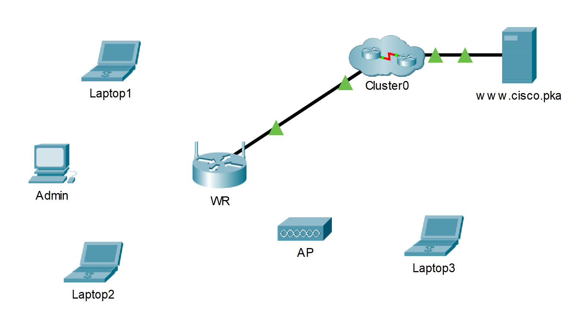

## Топология

## Задачи

-   Подключение к маршрутизатору беспроводной связи

-   Настройка беспроводного маршрутизатора

-   Подключение к маршрутизатору беспроводной связи

-   Подключение к маршрутизатору беспроводной связи

-   Добавьте точку доступа в сеть, чтобы расширить зону покрытия беспроводной сети

-   Обновите настройки маршрутизатора по умолчанию

## Введение

В этом упражнении вы настроите беспроводной маршрутизатор и точку доступа для приема беспроводных клиентов и маршрутизации IP-пакетов. Кроме того, вы также обновите некоторые настройки по умолчанию.

## Инструкции

### Часть 1. Подключение к маршрутизатору беспроводной связи

**Шаг 1. Подключите Admin к WR.**

1.  Подключите **Admin** к **WR** используя прямоу Ethernet кабель соединяя Ethernet порты. В нижнем левом углу программы Packet Tracer выберите значок молнии — пункт **Connections** (Подключения). Выберите тип кабеля **Copper Straight-Through** (Медный прямой), представленный в виде сплошной черной линии.

2.  Когда курсор перейдет в режим подключения, щелкните на **Admin** и выберете **FastEthernet0**. Щелкните на **WR** и выберите Ethernet 1, чтобы подключить другой конец кабеля.

    **WR** будет действовать как коммутатор для устройств, подключенных к локальной сети, и как маршрутизатор к Интернету. **Администратор** теперь подключен к локальной сети (**GigabitEthernet 1**). Когда в окне Packet Tracer появятся зеленые точки на обоих концах подключения между устройствами Admin и **WR, перейдите к следующему шагу.**

    Примечание. **Если зеленые точки не появились, убедитесь в том, что включен режим** Show Link Lights **(Показывать индикаторы соединения) в меню** Options \> Preferences (Сервис \> Параметры) Можно также нажать кнопку изменения масштаба времени **над полем выбора** Connections **(Подключения) на желтой панели.**

**Шаг 2. Настроить Admin на использование DHCP.**

**Admin** должен передавать данные по сети, чтобы зайти на страницу управления **WR** Беспроводной маршрутизатор, как правило, включает сервер DHCP, который по умолчанию включен для внутреннего сегмента маршрутизатора. **Admin** будет получать информацию об IP-адресе от DHCP-сервера на **WR**.

1.  Щелкните **PC0** и выберите вкладку **Desktop** (Рабочий стол).

2.  Щелкните **IP Configuration** (Настройка IP-адреса) и выберите **DHCP**.

    Вопросы:

    Какой IP-адрес у данного компьютера?

    **Введите ваш ответ здесь.**

    Укажите маску подсети данного компьютера.

    **Введите ваш ответ здесь.**

    Укажите шлюз по умолчанию данного компьютера.

    **Введите ваш ответ здесь.**

3.  Откройте окно **IP Configuration** (Настройка IP-адреса).

Примечание. **Значения могут меняться в пределах заданного диапазона сетевых адресов при нормальном режиме работы DHCP.**

**Шаг 3. Подключитесь к веб-интерфейсу WR.**

1.  На вкладке **Desktop** (Рабочий стол) меню **PC0** выберите **Web Browser** (Веб-браузер).

2.  Введите **192.168.0.1** в поле URL-адреса, чтобы открыть страницу веб-настройки беспроводного маршрутизатора.

3.  В качестве имени пользователя и пароля используйте **admin**.

4.  Обратите внимание на диапазон IP-адресов для сервера DHCP под заголовком Network Setup (Настройка сети) на странице **Basic Setup** (Базовая настройка).

    Вопрос: Находится ли IP-адрес **Admin** в этом диапазоне? Можно ли ожидать этого? Поясните свой ответ.

    **Введите ваш ответ здесь.**

**Шаг 4. Настройка порта Internet на WR.**

На этом этапе выполняется настройка **WR** для маршрутизации пакетов между беспроводными клиентами и другими сетями. Будет выполнена настройка порта **Internet** на **WR** для подключения к другим сетям.

1.  В пункте **Internet Setup** (Настройка подключения к Интернету) в верхней части страницы **Basic Setup** (Базовая настройка) измените метод определения IP-адреса интерфейса Интернета с **Automatic Configuration – DHCP** (Автоматическая настройка — DHCP) на **Static IP** (Статический IP-адрес).

2.  Введите IP-адрес, чтобы назначить его интерфейсу Интернета:

    **IP-адрес интерфейса Internet**: 209.165.200.225

    **маска подсети**: 255.255.255.252

    **шлюз по умолчанию**: 209.165.200.226

    **сервер DNS**: 209.165.201.1

3.  Прокрутите страницу вниз и нажмите кнопку **Save Settings** (Сохранить параметры).

    **примечание**: Если вы получите сообщение **Request Timeout**, закройте окно администратора и дождитесь, пока оранжевые огни превратятся в зеленые треугольники. Нажмите кнопку ускорения, чтобы это произошло быстрее. Затем снова подключитесь к **WR** через браузер на **Admin** browser используя инструкцию описанную в Шаге 3.

4.  Чтобы проверить подключение, откройте новый веб-браузер и перейдите к серверу **www.cisco.pka**.

    **примечание**: Для того чтобы сеть сошлась, может потребоваться несколько секунд. Для ускорения процесса **нажмите кнопку** Fast Forward Time **(Ускорить) или Alt+D**

### Часть 2. Выполните настройку беспроводной сети.

В этом упражнении вы будете настраивать параметры беспроводной сети только для 2,4 ГГц.

**Шаг 1. Настройка идентификатора SSID**

1.  Перейдите к графическому интерфейсу **WR** по адресу **192.168.0.1** в веб-браузере **Admin**.

2.  Перейдите по вкладкам **Wireless \> Basic Wireless Settings** (Беспроводная сеть \> Основные параметры беспроводной сети).

3.  Измените **имя сети (SSID)** на **aCompany** тольго для диапазона 2.4 ГГц. Имена сети (SSID) вводятся с учетом регистра.

4.  Измените значение параметра **Standard Channel (Стандартный канал) на. 6 — 2.437GHz.**

5.  Для этого действия отключите обе частоты 5 ГГц. Остальное оставьте без изменений.

6.  Прокрутите страницу вниз до конца и нажмите кнопку **Save Settings** (Сохранить параметры).

**Шаг 2. Выполните настройку беспроводной сети.**

На этом этапе вы настраиваете параметры безопасности беспроводной сети, используя режим безопасности WPA2 с шифрованием и парольной фразой.

1.  Перейдите по вкладкам **Wireless \> Basic Wireless Settings** (Беспроводная сеть \> Основные параметры беспроводной сети).

2.  Под заголовком 2,4 ГГц выберите **WPA2 Personal** для режима безопасности.

3.  Для поля «Шифрование» сохраните настройку **AES** по умолчанию.

4.  В поле Пароль введите **Cisco123!** в качестве ключевой фразы.

5.  Нажмите кнопку **Save Settings** (Сохранить параметры).

6.  Убедитесь, что настройки на страницах **Basic Wireless Settings** и **Wireless Security** правильные и сохранены.

**Шаг 3. Подключение клиента беспроводной сети**

1.  Открыть **Laptop1**. Выберите вкладку **Desktop**. Щелкните **Wireless** (беспроводные технологии)

2.  Выберите вкладку **Connect** . При необходимости нажмите **Refresh**. Выберите Wireless Network Name (Имя беспроводной сети) и введите новое имя SSID:**aCompany**.

3.  Введите пароль настроенные на предыдущем шаге. Введите **Cisco123!** в поле PSK и нажмите **Подключить**. Закройте окно PC Wireless (Беспроводной ПК).

4.  Чтобы проверить подключение, откройте новый веб-браузер и перейдите к серверу **www.cisco.pka**.

5.  Повторите вышеуказанные шаги, чтобы подключить **Laptop2** к беспроводной сети.

### Часть 3. Подключите беспроводных клиентов к точке доступа

Точка доступа (AP) - это устройство, которое расширяет беспроводную локальную сеть. Точка доступа подключается к проводному маршрутизатору с помощью кабеля Ethernet для проецирования сигнала в нужное место.

**Шаг 1. Настройте точку доступа.**

1.  Подключите **Port 0** **AP** к доступному Ethernet порту на **WR** используя прямой Ethernet кабель.

2.  Нажмите **AP**. Выберите вкладку **Config**.

3.  В меню INTERFACE, выбрать **Port 1**.

4.  В поле «SSID» введите **eCompany**.

5.  Выберите **WPA2-PSK**. Введите пароль **Cisco123!** В поле Pass Phrase.

6.  Сохраните **AES** в качестве Типа шифрования по умолчанию.

**Шаг 2. Подключение клиента беспроводной сети**

1.  Открыть **Laptop3**. Выберите вкладку **Desktop**. Щелкните **Wireless** (беспроводные технологии)

2.  Выберите вкладку **Connect** . При необходимости нажмите **Refresh**. Выберите имя беспроводной сети **aCompany** с более сильным сигналом (канал 1) и нажмите **Connect**

3.  Чтобы проверить подключение, откройте новый веб-браузер и перейдите к серверу **www.cisco.pka**.

### Часть 4. Другие административные задачи

**Шаг 1. Изменение пароля для доступа к WR**

1.  Перейдите к графическому интерфейсу **WR** по адресу **192.168.0.1** в веб-браузере Admin.

2.  Перейдите по вкладкам **Administration \> Management** (Администрирование \> Управление) и измените текущий **пароль маршрутизатора** на **cisco**.

3.  Прокрутите страницу вниз до конца и нажмите кнопку **Save Settings** (Сохранить параметры).

4.  При появлении запроса на вход в систему беспроводного маршрутизатора введите **admin** в качестве имени пользователя и **cisco** в качестве нового пароля. Для продолжения нажмите **ОК**.

5.  Нажмите **Continue** (Продолжить) и перейдите к следующему шагу.

**Шаг 2. Изменение диапазона адресов DHCP в WR**

На этом этапе необходимо изменить сетевой адрес внутреннего сегмента сети с 192.168.0.0/24 на 192.168.50.0/24. При изменении сетевого адреса внутреннего сегмента сети необходимо обновить IP-адреса устройств во внутренней сети, чтобы получить новые IP-адреса, не дожидаясь истечения срока аренды.

1.  Нажмите **Setup \> Basic Setup** (Настройка \> Основная настройка).

2.  Прокрутите страницу вниз до раздела **Network Setup** (Настройка сети).

3.  В качестве **IP-адреса маршрутизатора** используется IP-адрес 192.168.0.1. Измените его на 192.168.50.1. Убедитесь, что IP-адрес все еще начинается с .100, и в пуле DHCP есть 50 доступных IP-адресов.

4.  Добавить **209.165.201.1** в качестве DNS-сервера в настройках DHCP.

5.  Прокрутите страницу вниз до конца и нажмите кнопку **Save Settings** (Сохранить параметры).

6.  Обратите внимание, что диапазон адресов DHCP автоматически обновился, отображая изменения IP-адреса интерфейса. Через некоторое время веб-браузер отображает сообщение **Request Timeout** (Время ожидания запроса истекло).

    Вопрос: Почему?

    **Введите ваш ответ здесь.**

7.  Закройте веб-браузер **Admin**.

8.  На вкладке **Desktop** нажмите **Command Prompt**.

9.  Введите команду **ipconfig /renew**, чтобы компьютер **Admin** получил новые сведения об IP-адресе с сервера DHCP.

    Вопрос: Какая информация о новом IP-адресе для **Admin**?

    **Введите ваш ответ здесь.**

10. Чтобы проверить подключение, откройте новый веб-браузер и перейдите к серверу **www.cisco.pka**.

11. После обновления ip адреса, откройте новый веб-браузер и перейдите к серверу **www.cisco.pka**.

12. Обратите внимание, что **Laptop1** подключен к **точке доступа** вместо **WR**.

    Вопрос: Почему?

    **Введите ваш ответ здесь.**

[Скачать файл Packet Tracer для локального запуска](./assets/13.1.10-packet-tracer---configure-a-wireless-network_ru-RU.pka)
