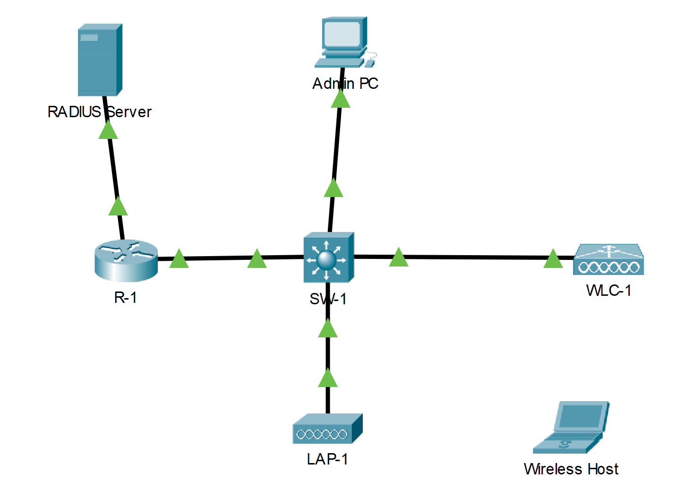

## Топология

## Таблица адресации

| Устройство         | Интерфейс  | IP-адрес           |
|--------------------|------------|--------------------|
| R1                 | G0/0/0.5   | 192.168.5.1/24     |
| R1                 | G0/0/0.200 | 192.168.200.1/24   |
| R1                 | G0/0/1     | 172.31.1.1/24      |
| SW1                | VLAN 200   | 192.168.200.100/24 |
| LAP-1              | G0         | DHCP               |
| WLC-1              | Управление | 192.168.200.254/24 |
| RADIUS/SNMP Сервер | NIC        | 172.31.1.254/2     |
| ПК администратора  | NIC        | 192.168.200.200/2  |

## Цели

В этом упражнении вы настроите новую WLAN на контроллере беспроводной локальной сети (WLC), включая интерфейс VLAN, который он будет использовать. Вы настроите WLAN для использования сервера RADIUS и WPA2-Enterprise для аутентификации пользователей. Вы также настроите WLC для использования сервера SNMP.

-   Настройте новый VLAN интерфейс на WLC.

-   Настройте новый WLAN на WLC.

-   Настройте новую область на внутреннем сервере DHCP WLC.

-   Настройте WLC с параметрами SNMP-прерывания.

-   Настройте контроллер WLAN для использования внешнего сервера RADIUS для аутентификации пользователей WLAN

-   Защитите новый WLAN с помощью WPA2-Enterprise

-   Подключите хосты к новому WLC.

## Общие сведения и сценарий

Вы уже настроили и протестировали WLC с существующим WLAN. Вы настроили WPA2-PSK для использования в сети WLAN небольшого предприятия. Вас попросили настроить и протестировать топологию WLC, которая будет использоваться на более крупном предприятии. Вы знаете, что WPA2-PSK плохо масштабируется и не подходит для использования в корпоративной сети. Вы настроите WLAN для использования сервера RADIUS и WPA2-Enterprise для аутентификации пользователей. Это позволяет администрировать учетные записи пользователей из центрального расположения и обеспечивает повышенную безопасность и прозрачность, поскольку каждая учетная запись имеет свое имя пользователя и пароль. Кроме того, активность пользователя регистрируется на сервере.

В этой лабораторной работе вы создадите новый интерфейс VLAN, используйте этот интерфейс для создания новой WLAN и защитите эту WLAN с помощью WPA2-Enterprise. Вы настроите WLAN для использования сервера RADIUS и WPA2-Enterprise для аутентификации пользователей. Вы также настроите WLC для использования сервера SNMP.

## Инструкции

### Часть 1. Создать новую WLAN.

**Шаг 1. Создайте новый интерфейс VLAN.**

Каждый WLAN требует виртуального интерфейса на WLC. Эти интерфейсы известны как динамические интерфейсы. Виртуальному интерфейсу назначается идентификатор VLAN, и трафик, который использует интерфейс, будет помечен как трафик этой VLAN. Вот почему соединения между AP, WLC и маршрутизатором по магистральным каналам. Для передачи трафика из нескольких WLAN через сеть трафик для VLAN WLAN должен быть передан через магистральное соединение.

1.  Откройте браузер с рабочего стола ПК администратора. Соединитесь с IP-адресом WLC по HTTPS.

2.  Войдите с учетными данными - имя пользователя **admin** и пароль **Cisco123**.

3.  Откройте меню **«Контроллер»** и выберите **«Интерфейсы»** в меню слева. Вы увидите виртуальный интерфейс по умолчанию и интерфейс управления, к которому вы подключены.

4.  Нажмите кнопку **«Новый»** в верхнем правом углу страницы. Возможно, вам придется прокрутить страницу вправо, чтобы увидеть его.

5.  Введите имя нового интерфейса. Назовем его **WLAN-5**. Назначьте VLAN ID - **5**. Это VLAN, которая будет переносить трафик для WLAN, которую мы создадим позже. Нажмите **Применить**. Перейдем к экрану конфигурации для интерфейса VLAN.

6.  Сначала настройте интерфейс с использованием номера физического порта. **1**. Несколько интерфейсов VLAN могут использовать один и тот же физический порт, поскольку физические интерфейсы подобны выделенным магистральным портам.

7.  Настройте параметры интерфейса следующим образом:

    IP-адрес: **192.168.5.254**

    Маска **255.255.255.0**

    шлюз: **192.168.5.1**

    Основной сервер DHCP: **192.168.5.1**

    Пользовательский трафик для WLAN, которая использует этот интерфейс VLAN, будет находиться в сети 192.168.5.0/24. Шлюз по умолчанию - это адрес интерфейса на маршрутизаторе R-1. На маршрутизаторе настроен пул DHCP. Адрес, который мы настраиваем здесь для DHCP, указывает WLC пересылать все запросы DHCP, которые он получает от хостов в WLAN, к серверу DHCP на маршрутизаторе.

8.  Обязательно нажмите **Apply** «Применить», чтобы внести изменения, и нажмите **OK**, чтобы ответить на предупреждающее сообщение. Нажмите **Save Configuration**, чтобы ваша конфигурация вступила в силу после перезапуска WLC.

**Шаг 2. Конфигурация WLC для использования RADIUS сервера**

WPA2-Enterprise использует внешний сервер RADIUS для аутентификации пользователей WLAN. Индивидуальные учетные записи пользователей с уникальными именами пользователей и паролями могут быть настроены на сервере RADIUS. Прежде чем WLC сможет использовать службы сервера RADIUS, WLC должен быть настроен с адресом сервера.

1.  Нажмите меню **Безопасность** на WLC.

2.  Нажмите кнопку **«Создать»** и введите IP-адрес сервера RADIUS в поле «IP-адрес сервера».

3.  Сервер RADIUS будет аутентифицировать WLC, прежде чем он позволит WLC получить доступ к информации учетной записи пользователя, которая находится на сервере. Это требует общего секретного ключа. Используем **Cisco123**. Подтверждаем общий секретный ключ и нажимаем **Применить.**

    **Примечание:** Не рекомендуется повторно использовать пароли при настройке безопасности. В этом упражнении используются пароли только для того, чтобы вам было легче выполнить и просмотреть задание.

**Шаг 3. Создать новую WLAN.**

Создать новую WLAN. Используйте только что созданный интерфейс VLAN для новой WLAN.

1.  Нажмите **WLAN** в строке меню WLC. Найдите раскрывающийся список в правом верхнем углу экрана WLAN. Он скажет Создать новую **Create New**. Нажмите **Go** чтобы создать новую WLAN.

2.  Введите имя профиля **Profile Name**новой WLAN. Используйте имя профиля **Floor 2 Employees.** Назначьте SSID нового WLAN **SSID-5** Измените ID в выпадающем списке на **5**. Клиенты будут использовать этот SSID, чтобы присоединятся к данной сети. Когда вы закончите, нажмите **Apply**, чтобы принять ваши настройки.

    **Примечание:** Идентификатор - это произвольное значение, которое используется в качестве метки для WLAN. В этом случае мы настроили его на 5, чтобы он соответствовал VLAN для WLAN. Это может быть любое доступное значение.

3.  Нажмите **Apply** (Применить), чтобы настройки вступили в силу.

4.  Теперь, когда сеть WLAN создана, вы можете настроить функции сети. Нажмите **Enabled** «Включено», чтобы активировать WLAN. Это распространенная ошибка - случайно пропустить этот шаг.

5.  Выберите интерфейс VLAN, который будет использоваться для WLAN. WLC будет использовать этот интерфейс для трафика пользователя в сети. Нажмите раскрывающийся список для rInterface/Interface Group (G). (интерфейса/Интерфейсная группа (G)) Выберите интерфейс, который мы создали на шаге 1.

6.  Перейдите на вкладку Advanced (Дополнительно). Прокрутите до раздела **FlexConnect** интерфейса.

7.  Включите FlexConnect **Local Switching** и **FlexConnect Local Auth**.

8.  Нажмите **Apply**, чтобы включить новый WLAN. Если вы забудете это сделать, беспроводная локальная сеть не будет работать.

**Шаг 4. Настройте безопасность WLAN.**

Вместо WPA2-PSK мы настроим новый WLAN для использования WPA2-Enterprise.

1.  Щелкните по идентификатору WLAN вновь созданной WLAN, чтобы продолжить его настройку, если это необходимо.

2.  Щелкните вкладку Безопасность. На вкладке Layer 2, выберите **WPA+WPA2** из выпадающего меню Layer 2 Security

3.  В разделе Параметры WPA + WPA2 включите **WPA2 Policy**. Нажмите **802.1X** в разделе Управление ключами аутентификации. Это говорит WLC использовать протокол 802.1X для внешней аутентификации пользователей.

4.  Выберите вкладку **AAA Servers** Откройте раскрывающийся список рядом с Сервером 1 в столбце Серверы аутентификации и выберите сервер, который мы настроили на шаге 2.

5.  Нажмите **Apply**, чтобы активировать эту конфигурацию. Теперь вы настроили WLC для использования сервера RADIUS для аутентификации пользователей, которые пытаются подключиться к WLAN.

### Часть 2. Настройка области DHCP и SNMP

**Шаг 1. Настройка области DHCP**

WLC предлагает свой собственный внутренний сервер DHCP. Cisco рекомендует не использовать DHCP-сервер WLAN для сервисов DHCP большого объема, таких как те, которые требуются для крупных пользовательских WLAN. Однако в небольших сетях DHCP-сервер может использоваться для предоставления IP-адресов LAP, которые подключены к проводной сети управления. На этом шаге мы настроим область DHCP на WLC и используем ее для адресации LAP-1.

1.  Должен быть подключен к графическому интерфейсу WLC с ПК администратора.

2.  Откройте меню **«Контроллер»** и выберите **«Интерфейсы»** в меню слева.

    Вопрос: Какие интерфейсы присутствуют?

    **Введите ваш ответ здесь.**

3.  Нажимаем на интерфейс **management**. Запишите свою адресную информацию здесь.

    Вопросы:

    IP-адрес:

    **Введите ваш ответ здесь.**

    Маска сети:

    **Введите ваш ответ здесь.**

    Шлюз.

    **Введите ваш ответ здесь.**

    Основной сервер DHCP:

    **Введите ваш ответ здесь.**

4.  Мы хотим, чтобы WLC использовал свой собственный сервер DHCP для обеспечения адресации устройств в беспроводной сети управления, таких как облегченные точки доступа. По этой причине введите IP-адрес интерфейса управления WLC как адрес основного сервера DHCP. Нажмите **Применить**. Нажмите кнопку **OK**, чтобы подтвердить появление любых предупреждающих сообщений.

5.  В левом меню разверните раздел **Internal DHCP Server** Нажмите **DHCP Scope.**

6.  Чтобы создать область DHCP, нажмите кнопку **«Новый…».**

7.  Имя области **Wired Management**. Вы настроите эту область DHCP для предоставления адресов проводной инфраструктурной сети, которая соединяет ПК администратора, WLC-1 и LAP-1.

8.  Нажмите **Apply**, чтобы создать новую область DHCP.

9.  Щелкните новую область в таблице «Области DHCP», чтобы настроить адресную информацию для области. Введите следующую информацию.

    Начальный адрес пула: **192.168.200.240**

    Конечный адрес пула: **192.168.200.249**

    Статус: **Enabled**

    Укажите значения для **Network**, **Netmask**, и **Default Routers** из информации, собранной на шаге 1.3.

10. Нажмите **Apply**, чтобы активировать конфигурацию. Нажмите **Сохранить конфигурацию** в верхнем правом углу интерфейса WLC, чтобы сохранить свою работу, чтобы она была доступна при перезапуске WLC.

    Внутренний DHCP-сервер теперь предоставит адрес LAP-1 после небольшой задержки. Когда LAP-1 получит свой IP-адрес, будет установлен туннель CAPWAP, и LAP-1 сможет обеспечить доступ к беспроводной локальной сети сотрудников 2-го этажа (SSID-5). Когда LAP-1 имеет свой IP-адрес, будет установлен туннель CAPWAP, а LAP-1 сможет обеспечить доступ к беспроводной сети сотрудников 2-го этажа (SSID-5).

**Шаг 2. Настройка SNMP**

1.  Нажмите меню **Management** в графическом интерфейсе WLC и раскройте запись для **SNMP** в меню слева.

2.  Нажмите **Trap Receivers** и затем **New…**

3.  Введите community string как **WLAN_SNMP** и IP-адрес сервера в **172.31.1.254**.

4.  Нажмите **Apply**, чтобы завершить конфигурацию.

### Часть 3. Подключите хосты к новому WLC.

**Шаг 1. Настройте хост для подключения к корпоративной сети.**

В клиентском приложении Packet Tracer PC Wireless вы должны настроить профиль WLAN для подключения к WLAN WPA2-Enterprise.

1.  Нажмите Wireless Host и откройте приложение **Wireless для ПК.**

2.  Перейдите на вкладку **Profiles** и нажмите **New**, чтобы создать новый профиль. Имя профиля**WLC NET**.

3.  Выделите имя беспроводной сети для WLAN, которую мы создали ранее, и нажмите **Advanced Setup**.

4.  Убедитесь, что SSID для беспроводной локальной сети присутствует, а затем нажмите **Next**. Wireless Host должен увидеть SSID-5. Если это не так, наведите курсор мыши на LAP-1, чтобы убедиться, что он взаимодействует с WLC. Всплывающее окно должно указывать, что LAP-1 знает о SSID-5. Если это не так, проверьте конфигурацию WLC. Вы также можете вручную ввести SSID.

5.  Убедитесь, что выбран параметр сети DHCP, и нажмите **Next**.

6.  В раскрывающемся списке «Безопасность» выберите **WPA2-Enterprise**. Нажмите **Далее**.

7.  Введите имя пользователя **user1** и пароль **User1Pass** и нажмите **Next**.

8.  Проверьте настройки профиля и нажмите **Save**.

9.  Выберите профиль **WLC NET** и нажмите кнопку **Connect to Network .** После небольшой задержки вы увидите, что беспроводной хост подключен к LAP-1. Вы можете нажать кнопку Fast Forward Time, чтобы ускорить процесс, если кажется, что он занимает слишком много времени.

10. Убедитесь, что беспроводной хост подключен к WLAN. Беспроводной узел должен получить IP-адрес от сервера DHCP, настроенного на R1. Адрес будет в сети 192.168.5.0/24. Нажмите Fast Forward Time (Ускорить), чтобы ускорить процесс.

**Шаг 2. Проверка соединения.**

1.  Закройте окно PC Wireless.

2.  Откройте командную строку и убедитесь, что ноутбук Wireless Host получил IP-адрес из сети WLAN.

    Вопрос: В какой сети должен быть адрес? Дайте пояснение.

    **Введите ваш ответ здесь.**

3.  Проверьте связь со шлюзом по умолчанию, SW1 и сервером RADIUS. Успех указывает на полную связь в этой топологии.

## Вопросы на закрепление

1.  Сервер RADIUS использует механизм двойной аутентификации. Какие две вещи аутентифицируются сервером RADIUS? Почему вы считаете это необходимым?

    **Введите ваш ответ здесь.**

2.  Каковы преимущества WPA2-Enterprise перед WPA2-PSK?

    **Введите ваш ответ здесь.**

[Скачать файл Packet Tracer для локального запуска](./assets/13.3.12-packet-tracer---configure-a-wpa2-enterprise-wlan-on-the-wlc_ru-RU.pka)
