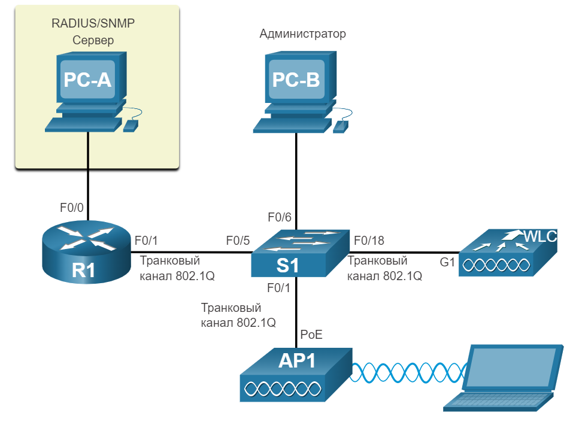
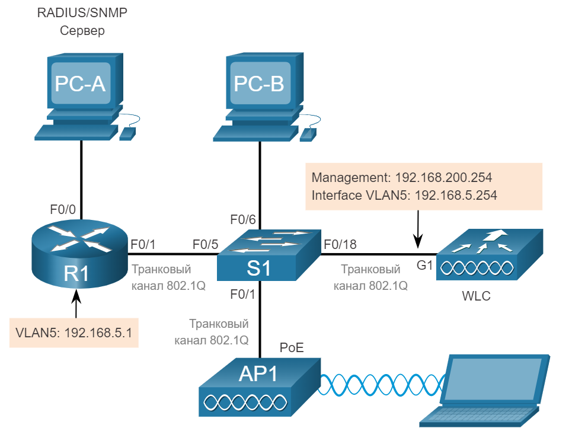
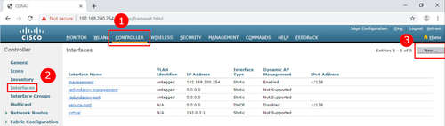
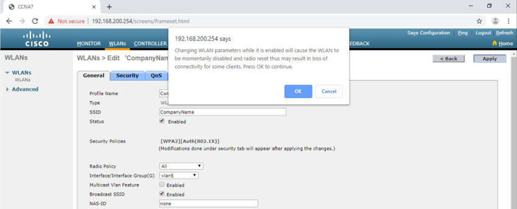
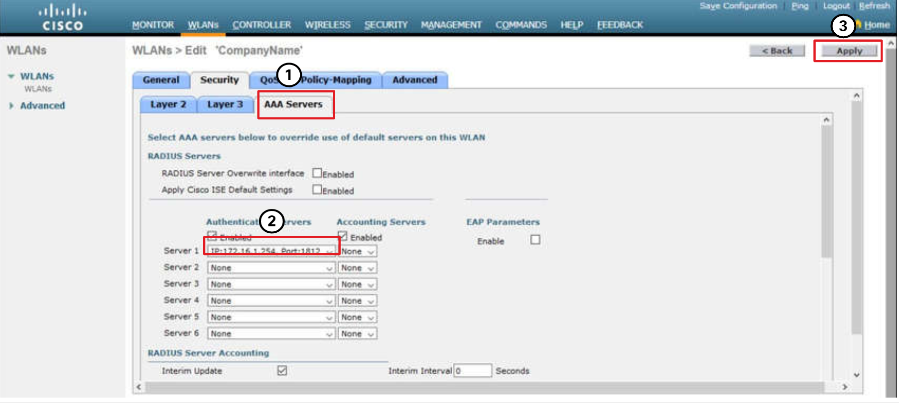
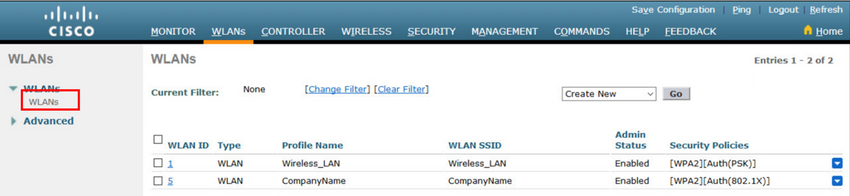

# Конфигурация WPA2 Enterprise WLAN с контроллером беспроводной сети

<!-- 13.3.1 -->
## Видео - установка и конфигурация сервера SNMP и RADIUS на WLC
Предыдущая тема охватывала настройку базовой конфигурации WLAN на WLC. Теперь вы узнаете о настройке WPA2 Enterprise WLAN.

Нажмите Воспроизвести, чтобы просмотреть демонстрацию настройки сервисов SNMP и RADIUS на WLC.

<video width="768" height="432" controls>
  <source src="https://github.com/nsalab-tmn/learn-ccna2/raw/main/13.3-configure-a-wpa2-enterprise-wlan-on-the-wlc/assets/13.3.1.mp4" type='video/mp4; codecs="avc1.42E01E, mp4a.40.2"'>
</video>

<!-- 13.3.2 -->
## SNMP и RADIUS
На рисунке PC-A работает с программным обеспечением сервера протокола удаленного доступа (RADIUS) и протоколом удаленной аутентификации (SNMP). SNMP используется для мониторинга сети. Администратор сети хочет, чтобы WLC пересылал все сообщения журнала SNMP, называемые прерываниями, на сервер SNMP.

Кроме того, для аутентификации пользователя WLAN администратор сети хочет использовать сервер RADIUS для служб аутентификации, авторизации и учета (AAA). Вместо того, чтобы вводить общедоступный предварительный общий ключ для аутентификации, как это происходит с WPA2-PSK, пользователи вводят свои собственные имя пользователя и пароль. Учетные данные будут проверены сервером RADIUS. Таким образом, индивидуальный доступ пользователей может отслеживаться и проверяться при необходимости, а учетные записи пользователей могут быть добавлены или изменены из центрального местоположения. Сервер RADIUS требуется для беспроводных локальных сетей, которые используют аутентификацию WPA2 Enterprise.

**Примечание:** Настройка SNMP-сервера и RADIUS-сервера выходит за рамки этого модуля.

### Топология

На рисунке изображена топология сети. PC-A - это сервер RADIUS/SNMP, подключенный к R1 через интерфейс R1s F0/0. PC-B подключен к S1 через порт F0/6 коммутатора S1. R1 и S1 соединены вместе через интерфейс F0/1 R1 и на F0/5 S1 S1 связан с WLC на порту F0/18. На порту F0/1 коммутатора S1 подключение к точке доступа AP1. Ноутбук подключен к маршрутизатору по беспроводной связи.

<!-- /courses/srwe-dl/af9ef5a0-34fe-11eb-b1b2-9b1b0c1f7e0d/afb7adc8-34fe-11eb-b1b2-9b1b0c1f7e0d/assets/caad51c0-1c27-11ea-af09-3b2e6521927c.svg -->

<!--13.3.3-->
## Настройка информацию о сервере SNMP
Нажмите вкладку "УПРАВЛЕНИЕ" **MANAGEMENT**, чтобы получить доступ к различным функциям управления. SNMP указан в верхней части меню слева. Нажмите **SNMP**, чтобы развернуть подменю, а затем нажмите **Trap Receivers**. Нажмите **New...**, чтобы настроить новый Trap Receivers SNMP, как показано на рисунке.

1. Нажмите **MANAGEMENT**
2. Нажмите **SNMP**
3. Нажмите **Trap Receivers**
4. Нажмите **New...**

Введите имя SNMP Community и IP-адрес (IPv4 или IPv6) для сервера SNMP. Нажмите кнопку **Apply**. Теперь WLC будет пересылать сообщения журнала SNMP на сервер SNMP.

<!--13.3.4-->
## Настройка информации о сервере RADIUS
В нашем примере конфигурации администратор сети хочет настроить WLAN с использованием WPA2 Enterprise, а не WPA2 Personal или WPA2 PSK. Аутентификация будет выполняться сервером RADIUS, работающим на PC-A.

Чтобы настроить WLC с информацией о сервере RADIUS, щелкните вкладку **SECURITY > RADIUS > Authentication**. Серверы RADIUS в настоящее время не настроены. Нажмите **New...**, чтобы добавить PC-A в качестве сервера RADIUS.

1. Нажмите **SECURITY**
2. Нажмите **RADIUS**
3. Нажмите **Authentication**
4. Нажмите **New...**

Введите адрес IPv4 для ПК-А и ключ аутентификации с сервером. Это пароль, используемый между WLC и сервером RADIUS. Это не для пользователей. Нажмите **Apply**, как показано на рисунке.

После нажатия кнопки «Применить» **Apply** список настроенных **серверов аутентификации RADIUS** обновляется, и в списке появляется новый сервер, как показано на рисунке.

<!--13.3.5-->
## Видео - настройка VLAN для новой WLAN
Нажмите Воспроизвести, чтобы просмотреть демонстрацию настройки VLAN на WLC.

<video width="768" height="432" controls>
  <source src="https://github.com/nsalab-tmn/learn-ccna2/raw/main/13.3-configure-a-wpa2-enterprise-wlan-on-the-wlc/assets/13.3.5.mp4" type='video/mp4; codecs="avc1.42E01E, mp4a.40.2"'>
</video>

<!--13.3.6-->
## Топология с адресацией VLAN 5
Каждой WLAN, настроенной на WLC, нужен собственный виртуальный интерфейс. WLC имеет пять физических портов для трафика данных. Каждый физический порт может быть настроен для поддержки нескольких беспроводных локальных сетей, каждая на своем собственном виртуальном интерфейсе. Физические порты также можно объединять для создания каналов с высокой пропускной способностью.

Администратор сети решил, что новый WLAN будет использовать интерфейс VLAN 5 и сеть 192.168.5.0/24. R1 уже имеет настроенный подынтерфейс для VLAN 5, как показано в топологии и показывает **show ip interface brief** вывод.

### Топология
На рисунке изображена топология сети. PC-A - это сервер RADIUS/SNMP, подключенный к R1 через интерфейс R1s F0/0. R1 имеет подынтерфейс, настроенный на VLAN 5 с IP-адресом192.168.5.1. PC-B подключен к S1 через порт F0/6 коммутатора S1. R1 иS1 соединены вместе через интерфейс F0/1 R1 и на F0/5 S1 S1 связан с WLC на его порту F0/18. WLC имеет IP-адрес интерфейса управления 192.168.200.254 и интерфейс во VLAN 5 с IP-адресом 192.168.5.254. На S1s F0/1 порт соединен с точкой доступа AP1. Ноутбук подключен к маршрутизатору по беспроводной связи.

<!-- /courses/srwe-dl/af9ef5a0-34fe-11eb-b1b2-9b1b0c1f7e0d/afb7adc8-34fe-11eb-b1b2-9b1b0c1f7e0d/assets/caafc2c0-1c27-11ea-af09-3b2e6521927c.svg -->

<pre><code>R1# show ip interface brief
Interface                  IP-Address      OK? Method Status                Protocol
FastEthernet0/0            172.16.1.1      YES manual up                    up
FastEthernet0/1            unassigned      YES unset  up                    up
FastEthernet0/1.1          192.168.200.1   YES manual up                    up
FastEthernet0/1.5          192.168.5.254   YES manual up                    up
(output omitted)
R1#</code></pre>

<!--13.3.7-->
## Настройте новый интерфейс
Конфигурация интерфейса VLAN на WLC включает следующие шаги:

1. Создайте новый интерфейс.
2. Настройте имя и идентификатор VLAN.
3. Настройте порт и адрес интерфейса.
4. Настройте адрес DHCP-сервера.
5. Примените и подтвердите.
6. Проверьте состояния интерфейса

**1. Создайте новый интерфейс.**

Чтобы добавить новый интерфейс, нажмите **CONTROLLER > Interfaces > New...**, как показано на рисунке.

1. Нажмите **CONTROLLER**
2. Нажмите **Interfaces**
3. Нажмите **New...**

**2. Настройте имя и идентификатор VLAN.**

На рисунке администратор сети настраивает имя интерфейса как **vlan5** и VLAN ID как **5**. Нажатие **Apply** создаст новый интерфейс.

**3. Настройте порт и адрес интерфейса.**

На странице **Edit** редактирования интерфейса настройте номер физического порта. G1 в топологии - Порт № 1 на WLC. Затем настройте адресацию интерфейса VLAN 5. На рисунке VLAN 5 назначен IPv4-адрес 192.168.5.254/24. R1 - это шлюз по умолчанию на IPv4-адресе 192.168.5.1.

**4. Настройте адрес DHCP-сервера.**

На крупных предприятиях WLC будут настроены для пересылки сообщений DHCP на выделенный сервер DHCP. Прокрутите страницу вниз, чтобы настроить основной DHCP-сервер как IPv4-адрес 192.168.5.1, как показано на рисунке. IP-адрес шлюза (маршрутизатора) по умолчанию. Маршрутизатор настроен с пулом DHCP для сети WLAN. Когда хосты присоединяются к WLAN, которая связана с интерфейсом VLAN 5, они будут получать информацию адресации из этого пула.

**5. Примените и подтвердите.**

Прокрутите вверх и нажмите "Применить" **Apply**, как показано на рисунке. Нажмите **OK** в сообщении предупреждения.

**6. Проверьте состояния интерфейса**

Нажмите Интерфейсы **Interfaces**. Новый интерфейс **vlan5** теперь отображается в списке интерфейсов с его IPv4-адресом, как показано на рисунке.

<!--13.3.8-->
## Видео - настройка области DHCP
Нажмите Воспроизвести, чтобы просмотреть демонстрацию настройки DHCP сервиса.

<video width="768" height="432" controls>
  <source src="https://github.com/nsalab-tmn/learn-ccna2/raw/main/13.3-configure-a-wpa2-enterprise-wlan-on-the-wlc/assets/13.3.8.mp4" type='video/mp4; codecs="avc1.42E01E, mp4a.40.2"'>
</video>

<!--13.3.9-->
## Настройка области DHCP
Настройка области DHCP включает следующие шаги:

1. Создайте новую область DHCP.
2. Назовите область DHCP.
3. Проверьте новую область DHCP.
4. Настройте и включите новую область DHCP.
5. Проверьте включение области DHCP

**1. Создайте новую область DHCP.**

Область DHCP очень похожа на пул DHCP на маршрутизаторе. Он может включать в себя различную информацию, включая пул адресов для назначения клиентам DHCP, информацию о DNS-сервере, время аренды и многое другое. Чтобы настроить новую область DHCP, нажмите **Internal DHCP Server > DHCP Scope > New...**, как показано на рисунке.

1. Нажмите **Internal DHCP Server.**
2. Нажмите **DHCP Scope.**
3. Нажмите **New...**

**2. Назовите область DHCP.**

На следующем экране, имя область. Поскольку эта область будет применяться к беспроводной сети управления, сетевой администратор использует **Wireless_Management** в качестве имени области и нажимает кнопку **Apply**.

**3. Проверьте новую область DHCP.**

Вы вернетесь на страницу «Области DHCP» **DHCP Scopes** и сможете убедиться, что область готова к настройке. Нажмите новое имя области, чтобы настроить область DHCP.

**4. Настройте и включите новую область DHCP.**

На экране «Правка» для области «Беспроводное управление» **Wireless_Management** настройте пул адресов для сети 192.168.200.0/24, начиная с .240 и заканчивая .249. Сетевой адрес и маска подсети настроены. По умолчанию настроен IPv4-адрес маршрутизатора, который является подынтерфейсом для R1 по адресу 192.168.200.1. Для этого примера остальная часть области остается неизменной. Администратор сети выбирает **Enabled** в раскрывающемся списке «Состояние» и нажимает **Apply**.

**5. Проверьте включение области DHCP**

Сетевой администратор возвращается на страницу «Области DHCP» **DHCP Scopes** и может убедиться, что область готова для выделения новой WLAN.

<!--13.3.10-->
## Видео - Конфигурация WPA2 Enterprise WLAN
Нажмите Воспроизвести, чтобы просмотреть демонстрацию настройки WLAN с WPA2 Enterprise.

<video width="768" height="432" controls>
  <source src="https://github.com/nsalab-tmn/learn-ccna2/raw/main/13.3-configure-a-wpa2-enterprise-wlan-on-the-wlc/assets/13.3.10.mp4" type='video/mp4; codecs="avc1.42E01E, mp4a.40.2"'>
</video>

<!--13.3.11-->
## Конфигурация WPA2 Enterprise WLAN
По умолчанию все вновь созданные WLAN на WLC будут использовать WPA2 с Advanced Encryption System (AES). 802.1X - это протокол управления ключами по умолчанию, используемый для связи с сервером RADIUS. Поскольку сетевой администратор уже настроил WLC с IPv4-адресом сервера RADIUS, работающего на PC-A, единственной оставшейся конфигурацией остается создать новую WLAN для использования интерфейса **vlan5**.

Конфигурация новой WLAN на WLC включает следующие шаги:

1. Создание новой WLAN.
2. Настройка имя WLAN и SSID.
3. Включите WLAN для VLAN 5.
4. Проверьте AES и 802.1X по умолчанию.
5. Настройте RADIUS-сервера.
6. Убедитесь, что новая WLAN доступна.

**1. Создание новой WLAN.**

Перейдите на вкладку **WLANs**, а затем "перейдите" **Go**, чтобы создать новую WLAN, как показано на рисунке.

**2. Настройка имя WLAN и SSID.**

Введите имя профиля и SSID. Чтобы соответствовать VLAN, которая была ранее настроена, выберите ID **5**. Однако может использоваться любое доступное значение. Нажрите **Apply**, для создания новой WLAN, как показано на рисунке.

**3. Включите WLAN для VLAN 5.**

WLAN создана, но ее все еще необходимо включить и связать с правильным интерфейсом VLAN. замените статус на **Enabled** и выберите **vlan5** из раскрывающегося списка Интерфейс / Интерфейсная группа (G). Нажмите **Apply** и нажмите **OK**, чтобы принять всплывающее сообщение, как показано на рисунке.

1. Нажмите **Enabled**.
2. Выберите **vlan5**.
3. Нажмите кнопку **Apply**.
4. Нажмите **ОК**.

**4. Проверьте AES и 802.1X по умолчанию.**

Нажмите вкладку "Безопасность" **Security**, чтобы просмотреть конфигурацию безопасности по умолчанию для новой WLAN. WLAN будет использовать безопасность WPA2 с шифрованием AES. Трафик аутентификации обрабатывается 802.1X между WLC и сервером RADIUS.

<!-- /courses/srwe-dl/af9ef5a0-34fe-11eb-b1b2-9b1b0c1f7e0d/afb7adc8-34fe-11eb-b1b2-9b1b0c1f7e0d/assets/cab6c7a0-1c27-11ea-af09-3b2e6521927c.svg -->

1. Перейдите на вкладку **Security (Безопасность)**.
2. Убедитесь, что выбранный механизм шифрования - **AES**.
3. Убедитесь, что **802.1X** является протоколом управления ключами аутентификации.

**5. Настройте RADIUS-сервера.**

Теперь нам нужно выбрать сервер RADIUS, который будет использоваться для аутентификации пользователей для этой WLAN. Выберите вкладку **AAA Servers**. В раскрывающемся списке выберите сервер RADIUS, который был настроен на WLC ранее. Примените изменения.

<!-- /courses/srwe-dl/af9ef5a0-34fe-11eb-b1b2-9b1b0c1f7e0d/afb7adc8-34fe-11eb-b1b2-9b1b0c1f7e0d/assets/cab73cd0-1c27-11ea-af09-3b2e6521927c.svg -->

1. Выберите вкладку **AAA servers**.
2. Выберите сервер RADIUS с IP-адресом **172.16.1.254** из раскрывающегося списка рядом с Сервером 1.
3. **Apply** ("Примените") изменения.

**6. Убедитесь, что новая WLAN доступна.**

Чтобы убедиться, что новый WLAN указан и включен, нажмите кнопку **Back** или подменю **WLANs** слева. В списке указаны как WLAN **Wireless_LAN**, так и WLAN **CompanyName**. Обратите внимание, что на рисунке оба активированы. **Wireless_LAN** использует WPA2 с аутентификацией PSK. **CompanyName** использует безопасность WPA2 с аутентификацией 802.1X.

<!--13.3.12-->
## Packet Tracer - Конфигурация WPA2 Enterprise WLAN с контроллером беспроводной сети
В этом упражнении вы настроите новую WLAN на контроллере беспроводной локальной сети (WLC), включая интерфейс VLAN, который он будет использовать. Вы настроите WLAN для использования сервера RADIUS и WPA2-Enterprise для аутентификации пользователей. Вы также настроите WLC для использования сервера SNMP.

[Открыть описание в PDF](./assets/13.3.12-packet-tracer---configure-a-wpa2-enterprise-wlan-on-the-wlc_ru-RU.pdf)

[Скачать файл для Packet Tracer](./assets/13.3.12-packet-tracer---configure-a-wpa2-enterprise-wlan-on-the-wlc_ru-RU.pka)
