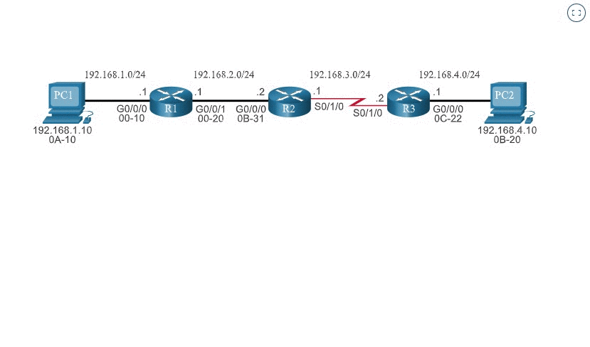
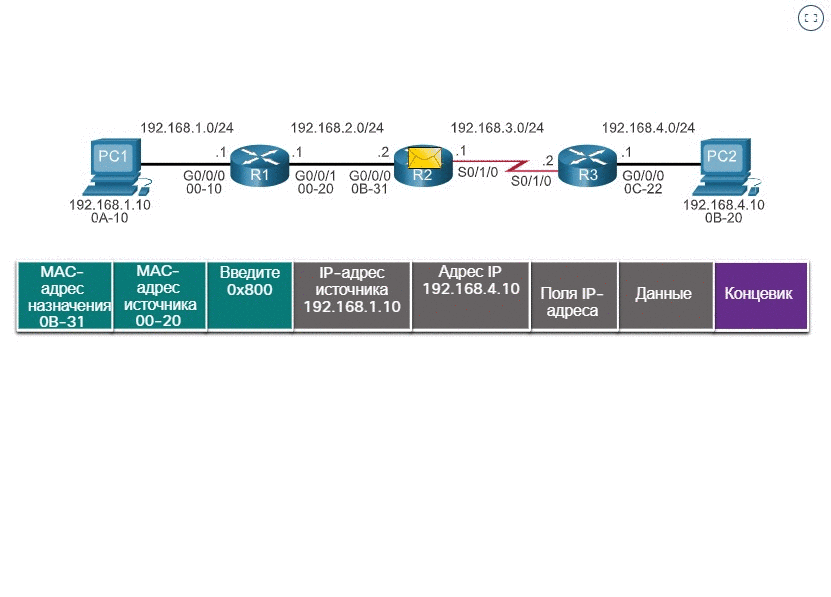
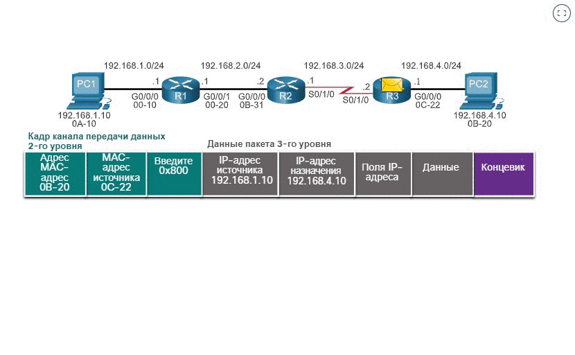

<!-- 14.2.1 -->
## Процесс принятия решения о переадресации пакетов

Теперь, когда маршрутизатор определил наилучший путь для пакета, основанный на самом длинном совпадении, он должен определить, как инкапсулировать пакет и переслать его из правильного исходящего интерфейса.

На рисунке показано, как маршрутизатор сначала определяет оптимальный путь, а затем пересылает пакет.

Следующие шаги описывают процесс пересылки пакетов, показанный на рисунке:

1.  Кадр канального уровня с инкапсулированным IP-пакетом поступает на входной интерфейс.
2.  Маршрутизатор проверяет IP-адрес назначения в заголовке пакета и обращается к своей таблице IP-маршрутизации.
3.  Маршрутизатор находит самый длинный совпадающий префикс в таблице маршрутизации.
4.  Маршрутизатор инкапсулирует пакет во кадр  канального уровня выходного интерфейса  и пересылает его из него. Назначением может быть устройство, подключенное к сети, или маршрутизатор следующего перехода.
5.  Однако если нет соответствующей записи маршрута, пакет отбрасывается.

**Переадресации пакета на устройство в сети с прямым подключением**

Если запись маршрута указывает, что выходным интерфейсом является напрямую подключенная сеть, это означает, что конечный IP-адрес пакета принадлежит устройству непосредственно подключенной сети. Таким образом, пакет может быть перенаправлен непосредственно на устройство назначения. Конечное устройство обычно является конечным устройством в локальной сети Ethernet, что означает, что пакет должен быть инкапсулирован в кадр Ethernet.

Чтобы инкапсулировать пакет в кадр Ethernet, маршрутизатор должен определить MAC-адрес назначения, связанный с IP-адресом назначения пакета. Процесс зависит от того, является ли пакет пакетом IPv4 или IPv6.

* **Пакет IPv4** — маршрутизатор проверяет свою таблицу ARP на наличие адреса IPv4 назначения и связанного MAC-адреса Ethernet. Если совпадение отсутствует, маршрутизатор отправляет запрос ARP. Устройство назначения возвращает ответ ARP с MAC-адресом. Теперь маршрутизатор может пересылать пакет IPv4 в кадр Ethernet с правильным MAC-адресом назначения.
* **Пакет IPv6** — маршрутизатор проверяет свой  кэш соседей на наличие адреса IPv6 назначения и связанного MAC-адреса Ethernet. Если совпадение отсутствует, маршрутизатор отправляет сообщение ICMPv6 Neighbor Solicitation (NS). Устройство назначения возвращает сообщение ICMPv6 Neighbor Advertisement (NA) с MAC-адресом. Теперь маршрутизатор может пересылать пакет IPv6 в кадр Ethernet с правильным MAC-адресом назначения.

**Пересылка пакета на маршрутизатор следующего перехода**

Если запись маршрута указывает, что IP-адрес назначения находится в удаленной сети, это означает, что IP-адрес назначения пакета принадлежит устройству в сети, которое не подключено напрямую. Поэтому пакет должен быть перенаправлен другому маршрутизатору, в частности маршрутизатору следующего перехода. Адрес следующего перехода указывается в записи маршрута.

Если маршрутизатор пересылки и маршрутизатор следующего перехода находятся в сети Ethernet, аналогичный процесс (ARP и ICMPv6 Neighbor Discovery) будет происходить для определения MAC-адреса назначения пакета, как описано выше. Разница заключается в том, что маршрутизатор будет искать IP-адрес маршрутизатора следующего прыжка в таблице ARP или в соседнем кэше вместо IP-адреса назначения пакета.

**Примечание**: Этот процесс будет отличаться для других типов сетей уровня 2.

**Отбрасывает пакет - нет совпадения в таблице маршрутизации**

Если в таблице маршрутизации нет соответствия между IP-адресом назначения и префиксом, и если маршрут по умолчанию отсутствует, пакет будет отброшен.

<!-- 14.2.2 -->
## Сквозная пересылка пакетов

Основной задачей функции пересылки пакетов является инкапсуляция пакетов в соответствующий тип кадра канала передачи данных для исходящего интерфейса. Например, формат кадра канала передачи данных для последовательного канала может быть протоколом точка-точка (PPP), протоколом управления каналом передачи данных высокого уровня (HDLC) или каким-либо другим протоколом уровня 2.

**PC1 отправляет пакет PC2**

В первой анимации PC1 отправляет пакет PC2. Обратите внимание, что если запись ARP не существует в таблице ARP для шлюза по умолчанию 192.168.1.1, PC1 отправляет запрос ARP. Маршрутизатор R1 затем возвращает ответ ARP.

**Маршрутизатор R1 пересылает пакет на компьютер PC2**

R1 теперь пересылает пакет на PC2. Поскольку выходной интерфейс находится в сети Ethernet, маршрутизатор R1 должен преобразовать IPv4-адрес следующего перехода в MAC-адрес места назначения с помощью протокола ARP: Если запись ARP не существует в таблице ARP для интерфейса следующего перехода 192.168.2.2, R1 отправляет запрос ARP. R2 возвращает ответ ARP.

**Маршрутизатор R2 пересылает пакет маршрутизатору R3**

R2 теперь пересылает пакет в R3. Поскольку выходной интерфейс не находится в сети Ethernet, маршрутизатор R2 не должен преобразовывать IPv4-адрес следующего перехода в MAC-адрес места назначения. Если интерфейс представляет собой последовательное одноранговое соединение (p2p), маршрутизатор инкапсулирует пакет IPv4 в соответствующий формат кадра канального уровня, используемый выходным интерфейсом (HDLC, PPP и т. д.). Поскольку на последовательных интерфейсах нет MAC-адресов, маршрутизатор R2 устанавливает канальный адрес назначения равным широковещательному адресу.

**Маршрутизатор R3 пересылает пакет на компьютер PC2**

R3 теперь пересылает пакет на PC2. Поскольку IPv4-адрес назначения находится в сети Ethernet с прямым подключением, R3 должен разрешить IPv4-адрес назначения пакета с соответствующим MAC-адресом. Если в ARP-кэше нет записи, маршрутизатор R3 посылает ARP-запрос через свой интерфейс FastEthernet 0/0.  PC2 отправляет ARP-ответ со своим MAC-адресом.

<!-- 14.2.3 -->
## Механизмы пересылки пакетов

Как упоминалось ранее, основная ответственность функции пересылки пакетов заключается в инкапсуляции пакетов в соответствующий тип кадра канала передачи данных для исходящего интерфейса. Чем эффективнее маршрутизатор может выполнять эту задачу, тем быстрее пакеты будут пересылаться маршрутизатором. Маршрутизаторы поддерживают три механизма пересылки пакетов.

* Процессорная коммутация (Process switching)
* Быстрая коммутация (Fast switching)
* Cisco Express Forwarding (CEF)

**Процессорная коммутация**

Устаревший механизм пересылки пакетов, все еще доступный на маршрутизаторах Cisco. Когда пакет прибывает на интерфейс, он пересылается на уровень управления, где ЦП сопоставляет адрес назначения с записью в таблице маршрутизации, а затем определяет выходной интерфейс и пересылает пакет. Важно понимать, что маршрутизатор совершает это с каждым пакетом, даже если целый поток пакетов предназначен для одного адреса назначения. Механизм процессорной коммутации работает очень медленно и редко реализуется в современных сетях. Сравните данный механизм с механизмом быстрой коммутации.

**Быстрая коммутация**

Быстрая коммутация — это еще один, старый механизм переадресации пакетов, который был преемником процессорной коммутации. Быстрое переключение использует кэш быстрой коммутации для хранения информации следующего перехода. Когда пакет прибывает на интерфейс, он пересылается на уровень управления, где ЦП ищет совпадение в кэше быстрой коммутации. Если совпадение не найдено, пакет проходит программную коммутацию и пересылается на выходной интерфейс. Информация о трафике для пакетов также хранится в кэше быстрой коммутации. Если на интерфейс прибывает другой пакет, адресованный тому же назначению, то из кэш-памяти повторно используется информация о следующем переходе без вмешательства ЦП.

При быстрой коммутации только первый пакет потока проходит программную коммутацию, после чего он добавляется в кэш быстрой коммутации. Следующие четыре пакета быстро обрабатываются, исходя из информации в кэш-памяти.

**Cisco Express Forwarding (CEF)**

CEF является самым новым и используемым по умолчанию механизмом пересылки пакетов Cisco IOS. Как и быстрая коммутация, CEF создает 24-портовую базу данных переадресации (FIB) и таблицу смежности (adjacency table). Однако записи таблицы инициированы не пакетами, как при быстрой коммутации, а изменениями — например изменениями в сетевой топологии. Таким образом, по завершении сходимости сети в базе данных FIB и таблице смежности содержится вся информация, необходимая маршрутизатору при пересылке пакета. Коммутация CEF — это самый быстрый механизм пересылки, наиболее предпочтительный для использования на маршрутизаторах Cisco.

CEF формирует базу данных FIB и таблицу смежности после завершения сходимости сети. Все пять пакетов быстро обрабатываются на уровне данных.

Три механизма пересылки пакетов можно описать, проведя следующую аналогию:

* Программная коммутация делает все расчеты каждый раз, даже в случае решения идентичных проблем.
* Быстрая коммутация делает расчеты один раз, запоминая ответ для последующих идентичных случаев.
* Механизм CEF решает каждую из возможных проблем заранее, внося ее в электронную таблицу.

<!-- 14.2.4 -->
<!-- quiz -->