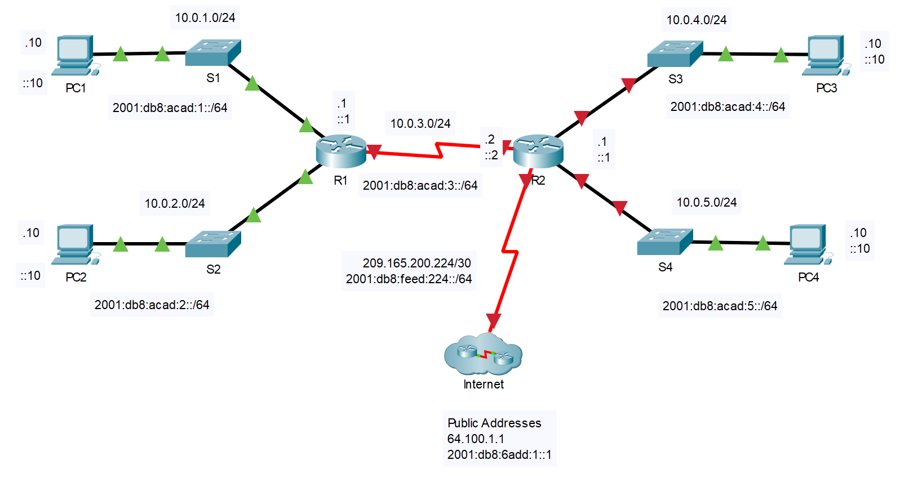

---

> **ВАЖНО**
> 
> Форма для ответов на вопросы будет доступна только при развертывании лабораторной работы 

---

## Топология



## Таблица адресации

| **Устройство** | **Интерфейс** | **IP-адрес / префикс**      | **Шлюз по умолчанию** |
|------------|-----------|-------------------------|-------------------|
| R2         | G0/0/0    | 10.0.4.1 /24            | —                 |
| R2         | G0/0/0    | 2001:db8:acad:4።1 /64   | —                 |
| R2         | G0/0/0    | fe80።2:a                | —                 |
| R2         | G0/0/1    | 10.0.5.1 /24            | —                 |
| R2         | G0/0/1    | 2001:db8:acad:5።1 /64   | —                 |
| R2         | G0/0/1    | fe80።2:b                | —                 |
| R2         | S0/1/0    | 10.0.3.2 /24            | —                 |
| R2         | S0/1/0    | 2001:db8:acad:3።2 /64   | —                 |
| R2         | S0/1/0    | fe80።1:c                | —                 |
| R2         | S0/1/1    | 209.165.200.225/30      | —                 |
| R2         | S0/1/1    | 2001:db8:feed:224::1/64 | —                 |
| R2         | S0/1/1    | fe80።1:d                | —                 |
| PC1        | NIC       | 10.0.1.10 /24           | 10.0.1.1          |
| PC1        | NIC       | 2001:db8:acad:1::10 /64 | fe80።1:a          |
| PC2        | NIC       | 10.0.2.10 /24           | 10.0.2.1          |
| PC2        | NIC       | 2001:db8:acad:2።10 /64  | fe80።1:b          |
| PC3        | NIC       | 10.0.4.10 /24           | 10.0.4.1          |
| PC3        | NIC       | 2001:db8:acad:4። 10 /64 | fe80።2:a          |
| PC4        | NIC       | 10.0.5.10 /24           | 10.0.5.1          |
| PC4        | NIC       | 2001:db8:acad:5።10 /64  | fe80።2:b          |

## Задачи

**Часть 1. Настройка устройств и проверка подключения**

-   Настройте статическую информацию IPv4 на интерфейсах ПК.

-   Настройте базовые параметры роутера.

-   Настройте на роутере протокол SSH.

-   Проверьте подключение к сети.

**Часть 2. Отображение сведений о роутере**

-   Загрузите из роутера данные об аппаратном и программном обеспечении.

-   Интерпретируйте выходные данные загрузочной конфигурации.

-   Интерпретируйте выходные данные таблицы маршрутизации.

-   Проверьте состояние интерфейсов.

## Общие сведения и сценарий

Это задание требует настройки роутера **R2** с использованием параметров из таблицы адресации и перечисленных спецификаций. Роутер **R1** и подключенные к нему устройства настроены. Это комплексная лабораторная работа, нацеленная на повторение ранее изученных команд IOS для роутера. В первой части вам предстоит подключить кабели к оборудованию и выполнить базовую настройку на устройстве. Во второй части вы будете использовать SSH для удаленного подключения к роутеру и использовать команды IOS для получения информации с устройства для ответа на вопросы о нем. В целях повторения в этой лабораторной работе представлены команды, необходимые для определенных конфигураций роутера.

## Инструкции

### Часть 1. Настройка устройств и проверка подключения

**Шаг 1. Настройте интерфейсы ПК.**

1.  Настройте адреса IPv4 и IPv6 на PC3, как указано в таблице адресации.

2.  Настройте адреса IPv4 и IPv6 на PC4, как указано в таблице адресации.

**Шаг 2. Настройте маршрутизатор**

1.  На **R2** откройте терминал. Перейдите в привилегированный режим EXEC.

2.  Войдите в режим конфигурации.

3.  Назначьте роутеру имя **R2**.

4.  Настройте **c1sco1234** как зашифрованный пароль привилегированного режима EXEC.

5.  Измените имя домена на **CCNA-lab.com**

6.  Отключите поиск DNS, чтобы предотвратить попытки роутера неверно преобразовывать введенные команды так, будто они являются именами узлов.

7.  Зашифруйте открытые пароли.

8. Настройте имя пользователя **SSHadmin** с зашифрованным паролем **55Hadm!n**.

9. Создайте набор криптоключей с 1024-битным модулем.

10. Назначьте **cisco** в качестве пароля консоли, настройте сеансы на отключение после шести минут бездействия и включите вход в систему. Чтобы консольные сообщения не прерывали выполнение команд, используйте параметр **logging synchronous**.

11. Назначьте **cisco** в качестве пароля VTY, настройте строки VTY для приема только SSH-подключений, настройте сеансы для отключения после шести минут бездействия и включите вход в систему с помощью локальной базы данных.

12. Создайте баннер с предупреждением о запрете несанкционированного доступа к устройству.

13. Включите IPv6-маршрутизацию.

14. Настройте все четыре интерфейса роутера с информацией адресации IPv4 и IPv6 из таблицы адресации выше. Настройте все четыре интерфейса с описаниями. Включите все четыре интерефейса.

15. Сохраните текущую конфигурацию в файл загрузочной конфигурации.

**Шаг 3. Проверьте подключение к сети**

1. Используя командную строку на **PC3**, пропингуйте адреса IPv4 и IPv6 для **PC4**.

    Успешно ли выполнена проверка связи?

    **Введите ваш ответ здесь**

2. Из интерфейса командной строки на **R2** пропингуйте адрес IPv4 и IPv6 S0/1/1 **R1**. Адреса, назначенные интерфейсу S0/1/1 на R1:

    адрес IPv4 = 10.0.3.1

    адрес IPv6 = 2001:db8:acad:3::1

    Успешно ли выполнена проверка связи?

    **Введите ваш ответ здесь**

    Из командной строки **PC3** пропингуйте адрес поставщика услуг Интернета 209.165.200.226.

    Успешно ли выполнена проверка связи?

    **Введите ваш ответ здесь**

    Из **PC3** попытайтесь пропинговать адрес на ISP для тестирования 64.100.1.1.

    Успешно ли выполнена проверка связи?

    **Введите ваш ответ здесь**

3. Из командной строки **PC3** откройте сеанс SSH на адрес R2 G0/0/0 IPv4 и войдите в систему как **SSHadmin** с паролем **55Hadm!n**.

    ```
    C: > ssh -l SSHadmin 10.0.4.1

    Password:
    ```

    Удаленный доступ был настроен успешно?

    **Введите ваш ответ здесь**

### Часть 2. Отображение сведений о роутере

Во второй части вам предстоит использовать команду **show** в сеансе SSH, чтобы получить информацию из роутера.

**Шаг 1. Установите SSH-подключение к R2**

Из командной строки PC3 откройте сеанс SSH на адрес **R2** G0/0/0 IPv6 и войдите в систему как **SSHadmin** с паролем **55Hadm!n**.

**Шаг 2. Получите основные данные об аппаратном и программном обеспечении**

1. Используйте команду **show version**, чтобы ответить на вопросы о роутере.

    Как называется образ IOS, под управлением которой работает роутер?

    **Введите ваш ответ здесь**

    Какой объем энергонезависимого ОЗУ (NVRAM) имеет роутер?

    **Введите ваш ответ здесь**

    Каким объемом флеш-памяти обладает роутер?

    **Введите ваш ответ здесь**

2. Зачастую команды **show** могут выводить несколько экранов данных. Фильтрация выходных данных позволяет пользователю отображать лишь нужные их разделы. Чтобы включить команду фильтрации, после **show** введите прямую черту (**\|**), а затем добавьте параметр и выражение фильтрации. Чтобы отобразить все строки выходных данных, которые содержат выражение фильтрации, можно согласовать их с оператором фильтрации с помощью ключевого слова **include**. Настройте фильтрацию для команды **show version** и используйте команду **show version \| include register**, чтобы ответить на следующий вопрос.

    Какому процессу загрузки последует маршрутизатор при следующей перезагрузке?

    **Введите ваш ответ здесь**

**Шаг 3. Изучите текущую конфигурацию роутера**

Используйте команду **show running-config** на роутере, чтобы ответить на следующие вопросы, фильтрующие строки, содержащие слово **password**.

Как пароли представлены в выходных данных?

**Введите ваш ответ здесь**

Используйте команду **show running-config \| begin vty**.

Что происходит в результате выполнения этой команды?

**Введите ваш ответ здесь**

**Примечание.** Более конкретной командой будет **show running-config \| section vty**, но текущая версия Packet Tracer не поддерживает команду фильтрации разделов.

**Шаг 4. Отобразите таблицу маршрутизации на роутере**

Выполните команду **show ip route** на роутере, чтобы ответить на следующие вопросы.

Какой код используется в таблице маршрутизации для обозначения сети с прямым подключением?

**Введите ваш ответ здесь**

Сколько записей маршрутов закодированы с символом «C» в таблице маршрутизации?

**Введите ваш ответ здесь**

**Шаг 5. Отобразите нароутере сводный список интерфейсов**

1. Выполните команду **show ip interface brief** на роутере, чтобы ответить на следующий вопрос.

    Какая команда позволяет изменить состояние портов Gigabit Ethernet с DOWN на UP?

    **Введите ваш ответ здесь**

    Какую команду фильтрации вы будете использовать для отображения только интерфейсов с назначенными адресами?

    **Введите ваш ответ здесь**

2.  Чтобы проверить параметры IPv6 на роутере R1 выполните команду **show ipv6 int brief**.

    В чем смысл части \[up/up\]-вывода?

    **Введите ваш ответ здесь**

[Скачать файл Packet Tracer для локального запуска](./assets/14.3.5-lab.pka)
