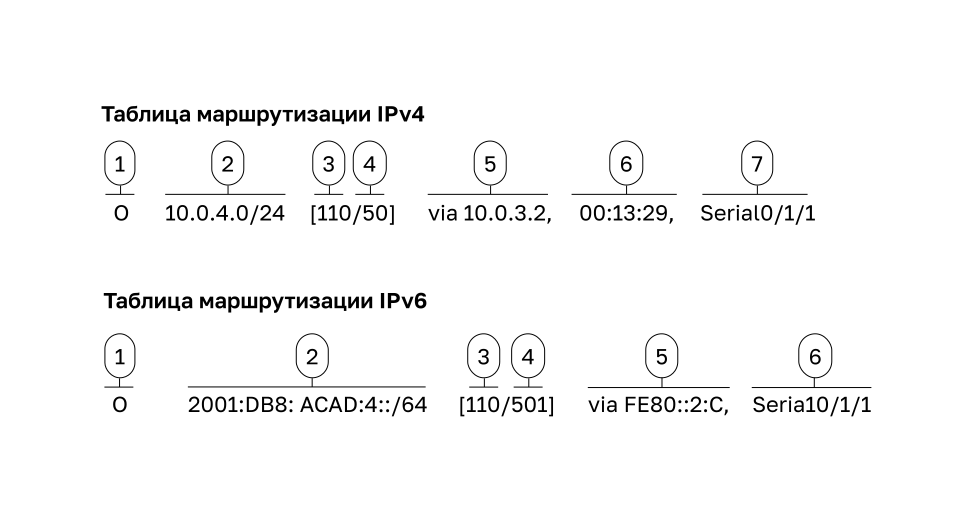

<!-- 14.4.1 -->
## Источник маршрута

Как роутер знает, куда он может отправлять пакеты? Он создает таблицу маршрутизации, основанную на информации о сетях, к которым он подключен.

Таблица маршрутизации содержит список маршрутов к известным сетям (префиксы и длины префикса). Источником этой информации являются:

* непосредственно подключенные сети;
* статические маршруты;
* протоколов динамической маршрутизации.

На рисунке R1 и R2 используют протокол динамической маршрутизации OSPF для совместного использования информации маршрутизации. Кроме того, R2 настроен статический маршрут по умолчанию к поставщику услуг Интернета.


**Таблица маршрутизации R1**

```
R1# show ip route
Codes: L - local, C - connected, S - static, R - RIP, M - mobile, B - BGP
       D - EIGRP, EX - EIGRP external, O - OSPF, IA - OSPF inter area
       N1 - OSPF NSSA external type 1, N2 - OSPF NSSA external type 2
       E1 - OSPF external type 1, E2 - OSPF external type 2
       i - IS-IS, su - IS-IS summary, L1 - IS-IS level-1, L2 - IS-IS level-2
       ia - IS-IS inter area, * - candidate default, U - per-user static route
       o - ODR, P - periodic downloaded static route, H - NHRP, l - LISP
       a - application route
       + - replicated route, % - next hop override, p - overrides from PfR
Gateway of last resort is 10.0.3.2 to network 0.0.0.0 
O*E2 0.0.0.0/0 [110/1] via 10.0.3.2, 00:51:34, Serial0/1/1 
      10.0.0.0/8 is variably subnetted, 8 subnets, 2 masks 
C 10.0.1.0/24 is directly connected, GigabitEthernet0/0/0
L 10.0.1.1/32 is directly connected, GigabitEthernet0/0/0
C 10.0.2.0/24 is directly connected, GigabitEthernet0/0/1
L 10.0.2.1/32 is directly connected, GigabitEthernet0/0/1
C 10.0.3.0/24 is directly connected, Serial0/1/1
L 10.0.3.1/32 is directly connected, Serial0/1/1
O 10.0.4.0/24 [110/50] via 10.0.3.2, 00:24:22, Serial0/1/1
O 10.0.5.0/24 [110/50] via 10.0.3.2, 00:24:15, Serial0/1/1 
R1#
```

**Таблица маршрутизации R2**

```
R2# show ip route
Codes: L - local, C - connected, S - static, R - RIP, M - mobile, B - BGP
       D - EIGRP, EX - EIGRP external, O - OSPF, IA - OSPF inter area
       N1 - OSPF NSSA external type 1, N2 - OSPF NSSA external type 2
       E1 - OSPF external type 1, E2 - OSPF external type 2
       i - IS-IS, su - IS-IS summary, L1 - IS-IS level-1, L2 - IS-IS level-2
       ia - IS-IS inter area, * - candidate default, U - per-user static route
       o - ODR, P - periodic downloaded static route, H - NHRP, l - LISP
       a - application route
       + - replicated route, % - next hop override, p - overrides from PfR
Gateway of last resort is 209.165.200.226 to network 0.0.0.0
S* 0.0.0.0/0 [1/0] via 209.165.200.226 
     10.0.0.0/8 is variably subnetted, 8 subnets, 2 masks 
O 10.0.1.0/24 [110/65] via 10.0.3.1, 00:31:38, Serial0/1/0 
О 10.0.2.0/24 [110/65] via 10.0.3.1, 00:31:38, Serial0/1/0
C 10.0.3.0/24 is directly connected, Serial0/1/0 
L 10.0.3.2/32 is directly connected, Serial0/1/0
C 10.0.4.0/24 is directly connected, GigabitEthernet0/0/0  
L 10.0.4.1/32 is directly connected, GigabitEthernet0/0/0
C 10.0.5.0/24 is directly connected, GigabitEthernet0/0/1 
L 10.0.5.1/32 is directly connected, GigabitEthernet0/0/1 
     209.165.200.0/24 is variably subnetted, 2 subnets, 2 masks
C 209.165.200.224/30 is directly connected, Serial0/1/1
L 209.165.200.225/32 is directly connected, Serial0/1/1
R2#
```

В таблицах маршрутизации для R1 и R2 обратите внимание, что источники для каждого маршрута идентифицируются кодом. Код определяет, каким образом был получен маршрут. К примерам распространенных кодов относятся:

* **L** — указывает адрес, назначенный интерфейсу роутера, который позволяет быстро определить, что полученный пакет предназначен для интерфейса, а не для пересылки;
* **C** — определяет сеть с прямым подключением;
* **S** — определяет статический маршрут, созданный для достижения конкретной сети;
* **O** — определяет сеть, динамически полученную от другого роутера с помощью протокола устройства OSPF;
*  **\*** — маршрут является кандидатом на маршрут по умолчанию.

<!-- 14.4.2 -->
## Принципы таблицы маршрутизации

Существует три принципа таблицы маршрутизации, как описано в таблице. Это проблемы, которые решаются правильной конфигурацией протоколов динамической маршрутизации или статических маршрутов на всех роутерах между устройствами источника и назначения.

| **Принципы таблицы маршрутизации** | **Пример** |
| --- | --- |
| Каждый роутер принимает решение самостоятельно, основываясь на информации, которую он имеет в своей собственной таблице маршрутизации. | <ul><li>R1 может пересылать пакеты только с помощью собственной таблицы маршрутизации. </li><li>R1 не знает, какие маршруты находятся в таблицах маршрутизации других роутеров (например, R2).</li></ul> |
| Информация в таблице маршрутизации одного роутера не обязательно схожа с таблицей другого. | Просто потому, что R1 имеет маршрут в своей таблице маршрутизации к сети в Интернет через R2, это не означает, что R2 знает об этой же сети. |
| Информация о маршруте в одну сторону, не гарантирует информацию о маршруте в обратном направлении. | R1 получает пакет с IP-адресом назначения PC1 и IP-адрес источника PC3. Просто потому, что R1 знает, как переслать пакет из интерфейса G0/0/0, не обязательно означает, что он знает как перенаправлять пакеты, исходящие от PC1, обратно в удаленную сеть PC3. |

<!-- 14.4.3 -->
## Записи таблицы маршрутизации

Сетевому администратору необходимо уметь интерпретировать содержимое таблиц маршрутизации IPv4 и IPv6. На рисунке показаны записи этих таблиц на R1 для маршрута к удаленной сети 10.0.4.0/24 и 2001:db8:acad:4::/64. Оба полученные динамически от другого роутера с помощью протокола маршрутизации OSPF.




<!-- 14.4.4 -->
## Напрямую подключённые сети

Прежде чем роутер сможет узнать о любых удаленных сетях, он должен иметь хотя бы один активный интерфейс, настроенный с IP-адресом и маской подсети (длина префикса). Это называется напрямую подключенной сетью или напрямую подключенным маршрутом. Роутеры добавляют маршрут с прямым подключением, когда интерфейс настроен с IP-адресом и активирован.

Непосредственно подключенная сеть обозначается кодом состояния **C** таблицы маршрутизации. Маршрут содержит префикс сети и длину префикса.

Таблица маршрутизации также содержит локальный маршрут для каждой из непосредственно подключенных сетей, обозначенный кодом состояния **L**. Это IP-адрес, который назначается интерфейсу этой напрямую подключенной сети. Для локальных маршрутов IPv4 длина префикса равна /32, а для IPv6 длина префикса равна /128. Это означает, что IP-адрес назначения пакета должен совпадать со всеми битами локального маршрута, чтобы этот путь соответствовал. Цель локального маршрута состоит в том, чтобы эффективно определить, когда он получает пакет для интерфейса вместо пакета, который должен быть передан.

Непосредственно подключенные сети и локальные маршруты показаны в следующих выходных данных.

```
R1# show ip route
Codes: L - local, C - connected, S - static, R - RIP, M - mobile, B - BGP
(Output omitted)     
C        10.0.1.0/24 is directly connected, GigabitEthernet0/0/0
L        10.0.1.1/32 is directly connected, GigabitEthernet0/0/0
R1# 
R1# show ipv6 route
IPv6 Routing Table - default - 10 entries
Codes: C - Connected, L - Local, S - Static, U - Per-user Static route
(Output omitted)      
       
C   2001:DB8:ACAD:1::/64 [0/0]
     via GigabitEthernet0/0/0, directly connected
L   2001:DB8:ACAD:1::1/128 [0/0]
     via GigabitEthernet0/0/0, receive
R1#
```

<!-- 14.4.5 -->
## Статические маршруты

После настройки и добавления напрямую подключенных интерфейсов в таблицу маршрутизации можно реализовать статическую или динамическую маршрутизацию для доступа к удаленным сетям.

Статические маршруты настраиваются вручную. Они определяют точный маршрут между двумя сетевыми устройствами и, в отличие от протокола динамической маршрутизации, не обновляются автоматически. При изменениях в сетевой топологии их нужно настраивать вручную. К преимуществам использования статических маршрутов относятся высокий уровень безопасности и эффективность расходования ресурсов. Также они используют более узкую полосу пропускания, чем протоколы динамической маршрутизации. Для расчета и связи маршрутов циклы ЦП не используются. Основной недостаток использования статических маршрутов заключается в отсутствии автоматической настройки при изменениях в сетевой топологии.

Статическая маршрутизация используется в трех ситуациях.

* Это обеспечивает простоту обслуживания таблиц маршрутизации в небольших сетях, рост которых не ожидается.
* Использование единого маршрута по умолчанию для представления пути к любой сети, которая не имеет более точного соответствия с другим маршрутом в таблице маршрутизации. Маршруты по умолчанию используются для отправки трафика к любому целевому адресу за пределами следующего вышестоящего роутера.
* Маршрутизация к тупиковым сетям и от них. Тупиковая сеть представляет собой сеть, доступ к которой осуществляется через один маршрут, и роутер имеет только одно соседнее устройство.

На рисунке показан пример тупиковой сети. Обратите внимание, что на рисунке у любой сети, подключенной к R1, будет только один путь для доступа к другим местам назначения (к сетям, подключенным к R2, или к местам назначения за пределами R2). Это означает, что сети 10.0.1.0/24 и 10.0.2.0/24 являются тупиковыми сетями, а R1 — тупиковый роутер.


В этом примере статический маршрут может быть настроен на R2 для достижения сетей R1. Кроме того, поскольку для R1 существует только один способ отправки нелокального трафика, статический маршрут по умолчанию можно настроить на R1 для указания на R2 как на следующий переход для всех остальных сетей.

<!-- 14.4.6 -->
## Статические маршруты в таблице IP-маршрутизации

Для демонстрации статической маршрутизации топология на рисунке упрощена, чтобы показать только одну локальную сеть, подключенную к каждому роутеру. На рисунке показаны статические маршруты IPv4 и IPv6, настроенные на R1 для достижения сетей 10.0.4.0/24 и 2001:db8:acad:4:/64 на R2. Команды конфигурации предназначены только для демонстрации и обсуждаются в другом модуле.


Выходные данные показывают записи статической маршрутизации IPv4 и IPv6 на R1, которые могут достигать сетей 10.0.4.0/24 и 2001:db8:acad:4:/64 на R2. Обратите внимание, что в обеих записях маршрутизации используется код состояния **S**, указывающий, что маршрут был изучен как статический. Обе записи также включают IP-адрес роутера следующего перехода через _ip-address_. Параметр **static** в конце команды отображает только статические маршруты.

```
R1# show ip route static
Codes: L - local, C - connected, S - static, R - RIP, M - mobile, B - BGP
(output omitted)
       
      10.0.0.0/8 is variably subnetted, 8 subnets, 2 masks
S        10.0.4.0/24 [1/0] via 10.0.3.2
R1# show ipv6 route static
IPv6 Routing Table - default - 8 entries
Codes: C - Connected, L - Local, S - Static, U - Per-user Static route
(output omitted)
       
S   2001:DB8:ACAD:4::/64 [1/0]
     via 2001:DB8:ACAD:3::2 
```

<!-- 14.4.7 -->
## Динамические протоколы маршрутизации

Протоколы динамической маршрутизации позволяют роутерам совместно использовать сведения о надежности и состоянии удаленных сетей. Протоколы динамической маршрутизации выполняют ряд операций, включая обнаружение сетей и ведение таблиц маршрутизации.

Важными преимуществами протоколов динамической маршрутизации являются возможность выбора наилучшего пути и возможность автоматического обнаружения нового наилучшего пути при изменении топологии.

Под обнаружением сетей подразумевается способность протокола маршрутизации обмениваться информацией об известных сетях с другими роутерами, использующими тот же протокол. Протокол динамической маршрутизации не зависит от вручную настроенных статических маршрутов до удаленных сетей на каждом роутере, но позволяет устройствам автоматически узнавать об этих сетях от других роутеров. Эти сети, а также наилучшие пути к каждой из них, добавляются в таблицу маршрутизации и указываются в качестве сетей, полученных конкретным протоколом динамической маршрутизации.

На рисунке показаны роутеры R1 и R2, использующие общий протокол маршрутизации для совместного использования сетевой информации.


<!-- 14.4.8 -->
## Динамические маршруты в таблице IP-маршрутизации

В предыдущем примере использовались статические маршруты к сетям 10.0.4.0/24 и 2001:db8:acad:4::/64. Они больше не настроены. Теперь OSPF используется для динамического изучения всех сетей, подключенных к R1 и R2. В следующих примерах показаны записи маршрутизации IPv4 и IPv6 OSPF на R1, которые могут достигать этих сетей на R2. Обратите внимание, что обе записи маршрутизации используют код состояния **O**, чтобы указать, что путь был выучен протоколом маршрутизации OSPF. Обе записи также включают IP-адрес роутера следующего перехода через _ip-address_.

**Примечание.** Протоколы маршрутизации IPv6 используют локальный адрес канала роутера следующего перехода. Настройка маршрутизации OSPF для IPv4 и IPv6 выходит за рамки данного курса.

```
R1# show ip route
Codes: L - local, C - connected, S - static, R - RIP, M - mobile, B - BGP
       D - EIGRP, EX - EIGRP external, O - OSPF, IA - OSPF inter area 
(output omitted for brevity)
O        10.0.4.0/24 [110/50] via 10.0.3.2, 00:24:22, Serial0/1/1
O        10.0.5.0/24 [110/50] via 10.0.3.2, 00:24:15, Serial0/1/1
R1# show ipv6 route
IPv6 Routing Table - default - 10 entries
(Output omitted)
       NDr - Redirect, RL - RPL, O - OSPF Intra, OI - OSPF Inter
O   2001:DB8:ACAD:4::/64 [110/50]
     via FE80::2:C, Serial0/1/1
O   2001:DB8:ACAD:5::/64 [110/50]
     via FE80::2:C, Serial0/1/1
```

<!-- 14.4.9 -->
## Маршрут по умолчанию

Статический маршрут по умолчанию мало чем отличается от шлюза по умолчанию на узле. Он определяет роутер следующего перехода, который будет использоваться, если таблица маршрутизации не содержит определенного пути, соответствующего IP-адресу назначения.

Маршрут по умолчанию может быть либо статическим, либо автоматически извлеченным из протокола динамической маршрутизации. Он имеет запись маршрута IPv4 0.0.0/0 или запись IPv6 ::/0. Это означает, что между целевым IP-адресом и маршрутом по умолчанию должен совпадать ноль или менее битов.

Большинство корпоративных роутеров имеют маршрут по умолчанию в таблице маршрутизации. Это позволяет уменьшить количество данных в этой таблице.

Роутер, такой как домашний или небольшой офисный, имеющий только одну локальную сеть, может достигать всех своих удаленных сетей по маршруту по умолчанию. Это полезно, если устройство имеет только непосредственно подключенные сети и одну точку выхода к роутеру поставщика услуг.

На рисунке R1 и R2 используют OSPF для совместного использования маршрутной информации о своих собственных сетях (сети 10.0.x.x/24 и 2001:db8:acad:x::/64). R2 имеет статический маршрут по умолчанию к роутеру ISP. R2 пересылает все пакеты с IP-адресом назначения, который специально не соответствует одной из сетей в таблице маршрутизации, роутеру ISP. Это будет включать все пакеты, предназначенные для Интернета.


1. R2 имеет статический маршрут по умолчанию к роутеру ISP.
2. Маршрут по умолчанию объявляется R2 в R1 с помощью протокола динамической маршрутизации OSPF.

R2 поделился маршрутом по умолчанию с R1 с помощью OSPF. Теперь R1 будет иметь маршрут по умолчанию в таблице маршрутизации, который он динамически узнал из OSPF. R1 также пересылает все пакеты с IP-адресом назначения, который не соответствует одной из сетей в таблице маршрутизации R2.

В следующих примерах показаны записи таблицы маршрутизации IPv4 и IPv6 для статических маршрутов по умолчанию, настроенных на R2.

```
R2# show ip route
(Output omitted)
S*    0.0.0.0/0 [1/0] via 209.165.200.226  
R2# 
R2# show ipv6 route
(Output omitted)
S   ::/0 [1/0]
     via 2001:DB8:FEED:224::2
R2#
```

<!-- 14.4.10 -->
## Структура таблицы маршрутизации IPv4

IPv4 был стандартизирован в начале 1980-х годов с использованием устаревшей классически архитектуры адресации. Таблица маршрутизации IPv4 организована с использованием той же классной структуры. В выходных данных **show ip route** обратите внимание, что некоторые записи маршрута остаются выровненными, а другие — отступом. Это зависит от того, как процесс маршрутизации ищет наиболее длинное совпадение в таблице маршрутизации IPv4. Это все из-за классной адресации. Хотя процесс поиска больше не использует классы, структура таблицы маршрутизации IPv4 по-прежнему сохраняется в этом формате.

```
Router# show ip route
(Output omitted)
     192.168.1.0/24 is variably subnetted, 2 subnets, 2 masks
C       192.168.1.0/24 is directly connected, GigabitEthernet0/0
L       192.168.1.1/32 is directly connected, GigabitEthernet0/0
O    192.168.2.0/24 [110/65] via 192.168.12.2, 00:32:33, Serial0/0/0
O    192.168.3.0/24 [110/65] via 192.168.13.2, 00:31:48, Serial0/0/1
     192.168.12.0/24 is variably subnetted, 2 subnets, 2 masks
C       192.168.12.0/30 is directly connected, Serial0/0/0
L       192.168.12.1/32 is directly connected, Serial0/0/0
     192.168.13.0/24 is variably subnetted, 2 subnets, 2 masks
C       192.168.13.0/30 is directly connected, Serial0/0/1
L       192.168.13.1/32 is directly connected, Serial0/0/1
     192.168.23.0/30 is subnetted, 1 subnets
O       192.168.23.0/30 [110/128] via 192.168.12.2, 00:31:38, Serial0/0/0
Router#
```

**Примечание.** Таблица маршрутизации IPv4 в примере не относится ни к одному роутеру в топологии, используемой в этом модуле.

Хотя детали структуры выходят за рамки этого модуля, полезно распознать структуру таблицы. Запись с отступом называется дочерним маршрутом. Она имеет отступ, если является подсетью классического адреса (сеть класса A, B или C). Непосредственно подключенные сети всегда будут иметь отступ (дочерние маршруты), так как локальный адрес интерфейса всегда вводится в таблицу маршрутизации как /32. Дочерний маршрут будет включать источник маршрута и всю информацию о пересылке, такую как адрес следующего перехода. Классовый сетевой адрес этой подсети будет показан над записью маршрута, с меньшим отступом и без исходного кода. Подобную запись называют родительским маршрутом.

**Примечание.** Это всего лишь краткое введение в структуру таблицы маршрутизации IPv4 и не охватывает детали или специфику этой архитектуры.

В следующем примере показана таблица маршрутизации IPv4 R1 в топологии. Обратите внимание, что все сети в топологии являются подсетями, которые являются дочерними маршрутами, из сети класса A и родительского 10.0.0.0/8.

```
R1# show ip route
(output omitted for brevity)
O*E2  0.0.0.0/0 [110/1] via 10.0.3.2, 00:51:34, Serial0/1/1
      10.0.0.0/8 is variably subnetted, 8 subnets, 2 masks
C        10.0.1.0/24 is directly connected, GigabitEthernet0/0/0
L        10.0.1.1/32 is directly connected, GigabitEthernet0/0/0
C        10.0.2.0/24 is directly connected, GigabitEthernet0/0/1
L        10.0.2.1/32 is directly connected, GigabitEthernet0/0/1
C        10.0.3.0/24 is directly connected, Serial0/1/1
L        10.0.3.1/32 is directly connected, Serial0/1/1
O        10.0.4.0/24 [110/50] via 10.0.3.2, 00:24:22, Serial0/1/1
O        10.0.5.0/24 [110/50] via 10.0.3.2, 00:24:15, Serial0/1/1
R1#
```

<!-- 14.4.11 -->
## Структура таблицы маршрутизации IPv6

Концепция классической адресации никогда не была частью IPv6, поэтому структура таблицы маршрутизации IPv6 очень прямолинейна. Каждая запись маршрута IPv6 форматируется и выравнивается таким же образом.

```
R1# show ipv6 route
(output omitted for brevity)
OE2 ::/0 [110/1], tag 2
     via FE80::2:C, Serial0/0/1
C   2001:DB8:ACAD:1::/64 [0/0]
     via GigabitEthernet0/0/0, directly connected
L   2001:DB8:ACAD:1::1/128 [0/0]
     via GigabitEthernet0/0/0, receive
C   2001:DB8:ACAD:2::/64 [0/0]
     via GigabitEthernet0/0/1, directly connected
L   2001:DB8:ACAD:2::1/128 [0/0]
     via GigabitEthernet0/0/1, receive
C   2001:DB8:ACAD:3::/64 [0/0]
     via Serial0/1/1, directly connected
L   2001:DB8:ACAD:3::1/128 [0/0]
     via Serial0/1/1, receive
O   2001:DB8:ACAD:4::/64 [110/50]
     via FE80::2:C, Serial0/1/1
O   2001:DB8:ACAD:5::/64 [110/50]
     via FE80::2:C, Serial0/1/1
L   FF00::/8 [0/0]
     via Null0, receive
R1#
```

<!-- 14.4.12 -->
## Административное расстояние

Запись маршрута для определенного сетевого адреса (префикса и длины префикса) может отображаться только один раз в таблице маршрутизации. Однако возможно, что таблица маршрутизации узнает об одном и том же сетевом адресе из нескольких источников.

За исключением особых обстоятельств, на роутере должен быть реализован только один протокол динамической маршрутизации. Однако на устройстве можно настроить как OSPF, так и EIGRP, и оба протокола могут узнать одну и ту же сеть назначения. Каждый протокол маршрутизации может выбирать свой путь для достижения пункта назначения на основе метрики этого протокола.

В связи с этим возникает несколько вопросов.

* Как роутер знает, какой источник использовать?
* Какой путь следует установить в таблице маршрутизации? Маршрут, полученный от OSPF или от EIGRP?

В операционной системе Cisco IOS для определения маршрута и занесения его в таблицу IP-маршрутизации применяется так называемое административное расстояние (AD). Эта величина выражает надежность пути. Чем ниже значение AD, тем выше надежность. Поскольку EIGRP имеет AD 90, а OSPF — 110, запись маршрута EIGRP будет установлена в таблице.

**Примечание.** AD не обязательно представляет, какой протокол динамической маршрутизации лучше всего.

Более распространенным примером является роутер, изучающий один и тот же сетевой адрес из статического маршрута и протокола динамической маршрутизации, например, OSPF. Статический маршрут имеет AD 1, тогда как у обнаруженного OSPF путь этот показатель равен 110. Имея два разных маршрута до одного и того же места назначения, роутер выбирает тот у которого значение AD меньше. При условии выбора между статическим маршрутом и рассчитанным по OSPF, выбирается статический.

**Примечание.** Непосредственно подключенные сети имеют наименьший AD равен 0. Только непосредственно подключенная сеть может иметь AD, равный 0.

В таблице приведены различные протоколы маршрутизации и соответствующие им значения AD.

| **Источник маршрута** | **Административное расстояние** |
| --- | --- |
| Непосредственное подключение | 0 |
| Статический маршрут | 1 |
| Суммарный маршрут EIGRP | 5 |
| Внешний BGP | 20 |
| Внутренний EIGRP | 90 |
| OSPF | 110 |
| IS-IS | 115 |
| RIP | 120 |
| Внешний EIGRP | 170 |
| Внутренний BGP | 200 |

<!-- 14.4.13 -->
<!-- quiz -->
