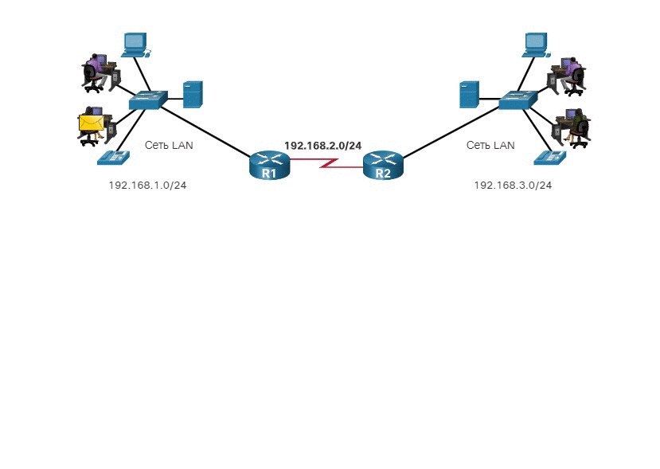
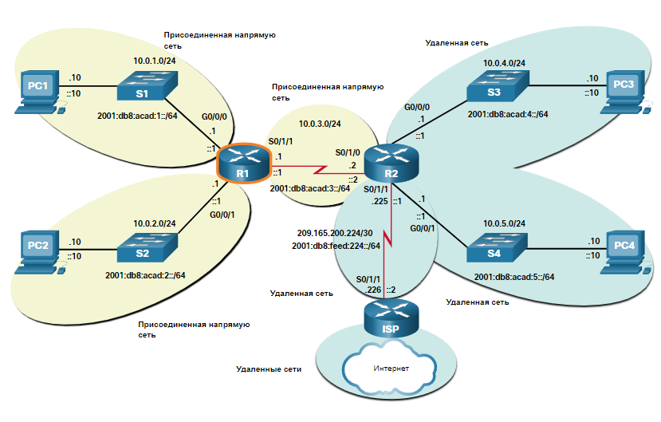

# Определение пути

<!-- 14.1.1-->
## Две функции маршрутизатора

Прежде чем маршрутизатор пересылает пакет в любом месте, он должен определить оптимальный путь для пакета. В этом разделе объясняется, как маршрутизаторы принимают это решение.

Коммутаторы Ethernet используются для подключения конечных устройств и других промежуточных устройств, таких как другие коммутаторы Ethernet, к той же сети. Маршрутизатор соединяет много сетей, и это означает, что он оснащен множеством интерфейсов, каждый из которых принадлежит другой IP-сети.

Когда маршрутизатор получает IP-пакет на одном интерфейсе, он определяет, какой интерфейс следует использовать для пересылки пакета до места назначения. Это называется маршрутизация. Интерфейс, который использует маршрутизатор для пересылки пакета, может быть конечной точкой маршрута, или же сетью, подключенной к другому маршрутизатору, используемому для достижения сети назначения. Каждая сеть, к которой подключается маршрутизатор, обычно требует отдельного интерфейса, но это не всегда так.

Основными функциями маршрутизатора являются определение наилучшего пути для пересылки пакетов на основе информации, содержащейся в таблице маршрутизации, и пересылка пакетов к месту назначения.

<!-- 14.1.2-->
## Пример функций маршрутизатора

Маршрутизатор использует свою таблицу маршрутизации, чтобы найти оптимальный путь для пересылки пакетов. Анимация на рисунке демонстрирует передачу пакета от ПК источника до ПК назначения. Посмотрите, как R1 и R2 используют соответствующие таблицы IP-маршрутизации, чтобы сначала определить оптимальный путь, а затем переслать пакет.

<!-- 14.1.3-->

## Лучший путь - дающий самое длинное совпадение

Что имеется в виду под утверждением «маршрутизатор должен выполнить поиск наилучшего совпадения в таблице маршрутизации»? Наилучший путь в таблице маршрутизации также известен как самое длинное совпадение. Самое длинное совпадение — это процесс, который маршрутизатор использует для поиска соответствия между IP-адресом назначения пакета и записью маршрутов в таблице маршрутизации.

Таблица маршрутизации содержит записи маршрута, состоящие из префикса (сетевого адреса) и длины префикса. Чтобы IPv4-адрес назначения пакета совпал с маршрутом в таблице маршрутизации, требуется минимальное количество совпадений по крайним левым битам в IPv4-адресе пакета и маршрута в таблице маршрутизации. Маска подсети маршрута в таблице маршрутизации используется для определения обязательного минимального числа совпадающих крайних левых битов. Помните, что пакет IP содержит только IP-адрес назначения, а не длину префикса.

Наилучшим совпадением является маршрут в таблице маршрутизации, в котором максимальное число крайних левых битов совпадает с IPv4-адресом назначения пакета. Маршрут с самым большим числом эквивалентных крайних левых битов (самое длинное совпадение) всегда является предпочтительным.

**Примечание**: Термин длина префикса будет использоваться для обозначения сетевой части адресов IPv4 и IPv6.

<!-- 14.1.4-->

## Пример наиболее длинного соответствия адреса IPv4

В таблице пакет IPv4 имеет адрес назначения IPv4 172.16.0.10. Маршрутизатору доступно три возможных маршрута, совпадающих с этим пакетом — 172.16.0.0/12, 172.16.0.0/18 и 172.16.0.0/26. Маршрут 172.16.0.0/26 имеет самое длинное совпадение, поэтому для пересылки пакета выбирается именно этот маршрут. Помните, что для того, чтобы эти маршруты рассматривались как совпадающие, необходимо минимальное количество совпадающих битов, указанное маской подсети маршрута.

IPv4-адрес назначения | Адрес в двоичном формате
----------------------|-------------------------
172.16.0.10 | **10101100.00010000.000000000000.00**001010

Маршрутная запись | Длина префикса/префикс | Адрес в двоичном формате
------------------|------------------------|-------------------------
1 | 172.16.0.0/12 | **10101100.0001**00000000000000.00001010
2 | 172.16.0.0/18 | **10101100.00010000.00**000000.00001010
3 | 172.16.0.0/26 | **10101100.00010000.000000000000.00**001010

<!-- 14.1.5-->
## Пример наиболее длинного соответствия адреса IPv6

В таблице пакет IPv6 имеет адрес назначения IPv6 2001:db8:c000::99. В этом примере показаны три записи маршрута, но только два из них совпадают, причем один из них является самым длинным. Первые две записи маршрута имеют длину префикса, которые имеют необходимое количество совпадающих битов, как указано длиной префикса. Первая запись маршрута с префиксом длиной /40 совпадает с 40 крайними левыми битами в адресе IPv6. Вторая запись маршрута имеет префикс длиной /48 и все 48 бит соответствуют адресу назначения IPv6, и является самым длинным совпадением. Третья запись маршрута не совпадает, поскольку префикс /64 требует 64 совпадающих бита. Чтобы префикс 2001:db8:c 000:5555::/64 совпал, первые 64 бита должны совпасть с адресом назначения IPv6 пакета. Совпадают только первые 48 бит, поэтому запись маршрута не считается совпадающей.

Для пакета IPv6 назначения с адресом **2001:db8:c000**::99 учтите следующие три записи маршрута:

Маршрутная запись | Длина префикса/префикс | Совпадает ли он?
------------------|------------------------|-----------------
1 | **2001:db8:c0**00።/40 | Совпадение 40 бит
2 | **2001:db8:с000።/48** | Совпадение 48 бит **(самое длинное совпадение)**
3 | **2001:db8:c000:5555**።/64 | Не соответствует 64 бита

<!-- 14.1.6-->
## Построение таблицы маршрутизации

Таблица маршрутизации состоит из префиксов и их длины. Но как маршрутизатор узнает об этих сетях? Как R1 на рисунке заполняет свою таблицу маршрутизации?

<!-- /courses/srwe-dl/af9ef5a2-34fe-11eb-b1b2-9b1b0c1f7e0d/afb7d4d4-34fe-11eb-b1b2-9b1b0c1f7e0d/assets/cac127e2-1c27-11ea-af09-3b2e6521927c.svg -->

1. **Напрямую подключённые сети**

Непосредственно подключенные сети — это сети, настроенные на активных интерфейсах маршрутизатора. Непосредственно подключенная сеть добавляется в таблицу маршрутизации, когда интерфейс настроен с IP-адресом и маской подсети (длина префикса) и активен (up и up).

2. **Удаленные сети**

Удаленные сети — это сети, которые напрямую не подключены к маршрутизатору. Маршрутизатор получает сведения об удаленных сетях двумя способами:

**Статические маршруты** - добавляется в таблицу маршрутизации, когда маршрут настраивается вручную.

**Протоколы динамической маршрутизации** - добавляется в таблицу маршрутизации, когда протоколы маршрутизации динамически узнают о удаленной сети. Протоколы динамической маршрутизации включают Enhanced Interior Gateway Routing Protocol (EIGRP), Open Shortest Path First (OSPF) и другие.

3. **Маршрут по умолчанию**

Маршрут по умолчанию определяет маршрутизатор следующего перехода, который будет использоваться, если таблица маршрутизации не содержит определенного маршрута, соответствующего IP-адресу назначения. Маршрут по умолчанию может быть введен вручную как статический маршрут или автоматически изучен через протокол динамической маршрутизации.

Маршрут по умолчанию через IPv4 имеет запись маршрута 0.0.0.0/0, а маршрут по умолчанию через IPv6 имеет запись ::/0. Длина префикса /0 указывает на то, что нулевые биты или нет битов должны соответствовать IP-адресу назначения для этой записи маршрута, которая будет использоваться. Если нет маршрутов с более длинным совпадением, более 0 бит, то для пересылки пакета используется маршрут по умолчанию. Маршрут по умолчанию иногда называют «шлюзом последней надежды».

<!-- 14.1.7 ## Проверьте свое понимание темы - Определение маршрута-->
