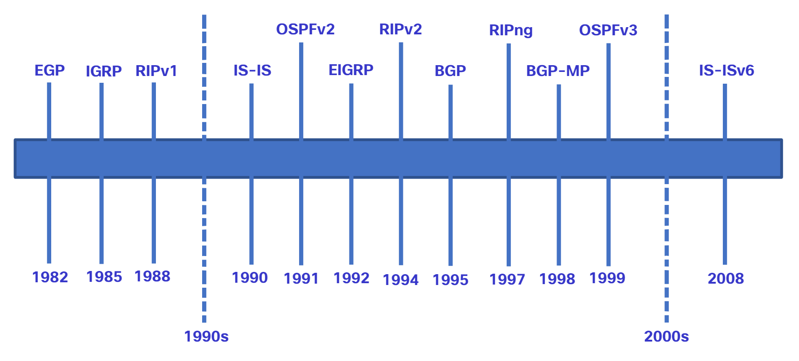
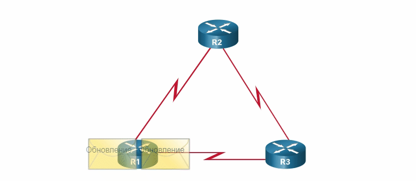
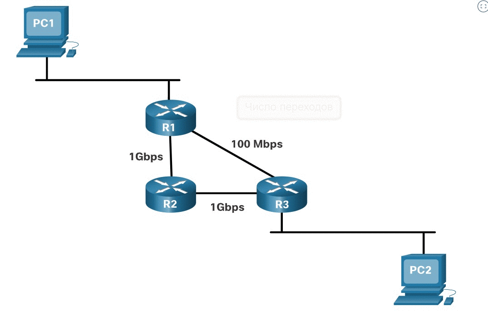
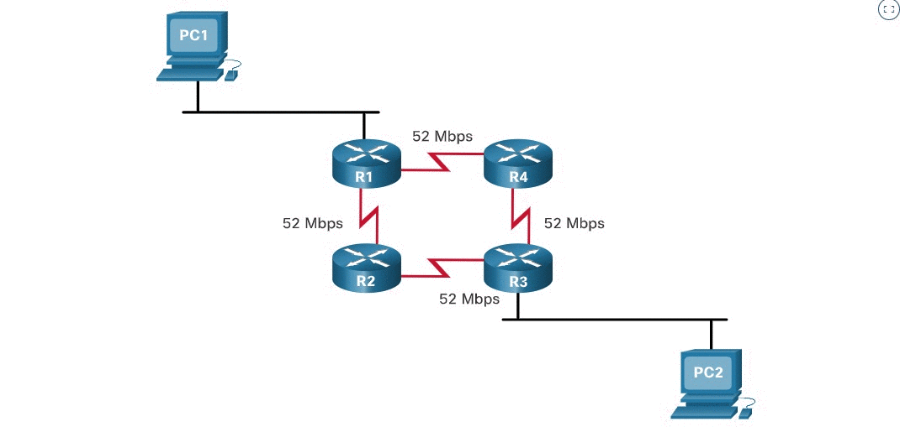

# Статическая и динамическая маршрутизация

<!-- 14.5.1-->
## Динамический или статический
В предыдущем разделе рассматривались способы создания маршрутизатором своей таблицы маршрутизации. Итак, теперь вы знаете, что маршрутизация, как и IP-адресация, может быть либо статической, либо динамической. Следует ли использовать статическую или динамическую маршрутизацию? Ответ - и то, и другое! Важно понимать, что статическая и динамическая маршрутизация не являются взаимоисключающими. В большинстве сетей используется комбинация протоколов динамической маршрутизации и статических маршрутов.

**Статические маршруты**

Статические маршруты обычно используются в следующих сценариях:

- В качестве маршрута по умолчанию для пересылки пакетов поставщику услуг
- Для маршрутов за пределами домена маршрутизации, которые не были изучены протоколом динамической маршрутизации
- Когда сетевой администратор хочет явно определить путь для определенной сети
- Для маршрутизации между тупиковыми сетями

Статические маршруты рекомендуется использовать в небольших сетях, для которых задан только один путь к внешней сети. Они также обеспечивают безопасность в больших сетях с определенным типом трафика или в каналах к другим сетям, для которых требуются расширенные функции контроля.

**Протоколы динамической маршрутизации**

Протоколы динамической маршрутизации позволяют сетевому администратору управлять трудоемкими процессами настройки и обслуживания статических маршрутов. Протоколы динамической маршрутизации реализованы в сетях любого типа, состоящих из нескольких маршрутизаторов. Протоколы динамической маршрутизации являются масштабируемыми и автоматически определяют лучшие маршруты в случае изменения топологии.

Протоколы динамической маршрутизации обычно используются в следующих сценариях:

- В сетях, состоящих из более чем нескольких маршрутизаторов
- Когда изменение топологии сети требует от сети автоматического определения другого пути
- Для масштабируемости. По мере роста сети протокол динамической маршрутизации автоматически узнает о новых сетях.

В таблице показано сравнение некоторых различий между динамической и статической маршрутизацией.

| **Функция** | **Динамическая маршрутизация** | **Статическая маршрутизация**  | 
| --- | --- | --- |
| Сложность конфигурирования | Не зависимость от размера сети | Повышается с увеличением размера сети  | 
| Изменения топологии | Изменяется автоматически в соответствии с изменениями топологии | Требуется участие администратора | 
| Масштабируемость | Подходит для простых и сложных топологий | Подходит для простых топологий | 
| Информационная безопасность | Безопасность должна быть настроена | Безопасность является неотъемлемым элементом | 
| Потребление ресурсов | Использует центральный процессор, память, пропускную способность канала | Никаких дополнительных ресурсов не требуется | 
| Предсказуемость пути | Маршрут зависит от используемой топологии и протокола маршрутизации | Явно определяется администратором | 

<!--14.5.2-->
## Эволюция протоколов динамической маршрутизации
Протоколы динамической маршрутизации используются в сетях с конца 80-х гг. XX в. Протокол RIP стал одним из первых протоколов маршрутизации. Первая версия (RIPv1) появилась в 1988 г., однако отдельные базовые алгоритмы этого протокола применялись еще в сети ARPANET, созданной Агентством Министерства обороны США по перспективным исследованиям в 1969 г.

Наряду с развитием и усложнением сетей возникла необходимость в новых протоколах маршрутизации. Позднее протокол RIP был обновлен до версии RIPv2, которая лучше соответствовала потребностям новых крупных сетей того времени. Однако версия RIPv2 все же не отвечает масштабам современных сетевых решений. В соответствии с требованиями сетей большего размера были разработаны два усовершенствованных протокола маршрутизации: протокол маршрутизации «алгоритм кратчайшего пути» (OSPF) и протокол маршрутизации IS-IS. Компания Cisco разработала внутренний протокол маршрутизации шлюзов (IGRP) и усовершенствованный протокол IGRP (EIGRP), которые также обеспечивают хорошую масштабируемость при реализации сетей большего размера.

Помимо перечисленных требований, возникла необходимость в соединении разных сетей и осуществлении маршрутизации между ними. В настоящее время для связи между сетями интернет-провайдеров используется протокол граничного шлюза (BGP). Протокол BGP также обеспечивает обмен данными маршрутизации между интернет-провайдерами и их крупными частными клиентами.

На рисунке отображена хронология внедрения различных протоколов.

На рисунке отображена хронология внедрения различных протоколов. Начиная с 1982 года EGP, 1985 IGRP, 1988 RIPv1, 1990 IS-IS, 1991 OSPFv2, 1992 EIGRP, 1994 RIPv2, 1995 BGP, 1997 RIPng, 1998 BGP-MP, 1999 OSPFv3, 2000 IS-ISv6.

<!-- /courses/srwe-dl/af9ef5a2-34fe-11eb-b1b2-9b1b0c1f7e0d/afb7fbe4-34fe-11eb-b1b2-9b1b0c1f7e0d/assets/cad65d92-1c27-11ea-af09-3b2e6521927c.svg -->

Для поддержки связи IPv6 были разработаны более новые версии протоколов IP-маршрутизации, как показано в строке IPv6 в таблице.

Таблица классифицирует текущие протоколы маршрутизации. Протоклы внутреннего шлюза (IGP) — это протоколы маршрутизации, используемые для обмена информацией о маршрутизации в домене маршрутизации, управляемом одной организацией. Существует только один EGP и это BGP. BGP используется для обмена информацией о маршрутизации между различными организациями, известными как автономные системы (AS). BGP используется провайдерами для маршрутизации пакетов через Интернет. Протоколы маршрутизации вектора расстояния, состояния канала и векторного пути относятся к типу алгоритма маршрутизации, используемого для определения наилучшего пути.

| |                    **Протоколы внутренней маршрутизации**      |||| **Протоколы внешнего шлюза** |
| --- |---| --- | --- | ---| --- |
| | **Вектор расстояния** || **Состояние канала** || **Вектор пути** |
| **IPv4** | RIPv2 | EIGRP | OSPFv2 | IS-IS | BGP-4 |
| **IPv6** | RIPng | EIGRP для IPv6 | OSPFv3 | IS-IS для IPv6 | BGP-MP |

<!--14.5.3-->
## Принципы динамических протоколов маршрутизации
Протокол маршрутизации представляет собой набор процессов, алгоритмов и сообщений, используемых для обмена данными маршрутизации и наполнения таблицы маршрутизации оптимальными путями. Назначение протоколов динамической маршрутизации состоит в следующем:

- обнаружение удаленных сетей;
- обновление данных маршрутизации;
- выбор оптимального пути к сетям назначения;
- поиск нового оптимального пути в случае, если текущий путь недоступен.

Протоколы динамической маршрутизации включают в себя следующие компоненты:

- **Структуры данных** — протоколы маршрутизации обычно используют для своих операций таблицы или базы данных. Данная информация хранится в ОЗУ.
- **Сообщения протокола маршрутизации** — протоколы маршрутизации используют различные типы сообщений для обнаружения соседних маршрутизаторов, обмена информацией о маршрутах и выполнения других задач, связанных с получением точной информации о сети.
- **Алгоритм** — алгоритм представляет собой определенный список действий, используемых для выполнения задачи. Протоколы маршрутизации используют алгоритмы, упрощающие обмен данных маршрутизации и определение оптимального пути.

При помощи протоколов маршрутизации маршрутизаторы динамически обмениваются информацией об удаленных сетях и автоматически сверяют эту информацию с собственными таблицами маршрутизации. 

На рисунке показана анимация с тремя маршрутизаторами R1, R2 и R3, соединенными в виде треугольника. Анимация показывает, что когда обновление происходит на любом маршрутизаторе, оно выталкивается на другие маршрутизаторы.

Протоколы маршрутизации определяют оптимальный путь или маршрут к каждой сети. Затем маршрут сверяется с таблицей маршрутизации. Этот маршрут будет добавлен в таблицу маршрутизации, если в таблице нет другого источника маршрутизации с меньшим административным расстоянием. Основным преимуществом протоколов динамической маршрутизации является то, что они обеспечивают обмен маршрутизирующей информацией между маршрутизаторами в случаях изменений в топологии. Подобный обмен данными позволяет маршрутизаторам автоматически получать информацию о новых сетях, а также находить альтернативные пути в случае сбоя канала к текущей сети.

<!--14.5.4-->
## Оптимальный путь
Прежде чем путь к удаленной сети будет предложен в таблицу маршрутизации, протокол динамической маршрутизации должен определить оптимальный путь к этой сети. Определение оптимального пути подразумевает оценку нескольких путей в одну и ту же сеть назначения и выбор оптимального или кратчайшего пути для прохождения этого маршрута. Когда существует несколько путей до одной сети, каждый путь использует различный выходной интерфейс маршрутизатора для достижения сети.

Протокол маршрутизации выбирает наилучший путь, исходя из значения или метрики, используемых для определения расстояния до сети. Метрика — это числовое значение, используемое для измерения расстояния до заданной сети. Наиболее оптимальным путем к сети является путь с наименьшей метрикой.

Протоколы динамической маршрутизации обычно используют собственные правила и метрики для построения и обновления таблиц маршрутизации. Алгоритм маршрутизации генерирует значение (или метрику) для каждого пути через сеть. Метрики могут основываться на одной или нескольких характеристиках пути. Некоторые протоколы маршрутизации выбирают маршрут на основе нескольких метрик, объединяя их в одну метрику.

В следующей таблице перечислены общие динамические протоколы и их метрики.

| **Протокол маршрутизации** | **Метрика** |
| --- | --- |
| **Протокол маршрутной информации (RIP)** | - Метрика - «количество переходов».  - Каждый маршрутизатор вдоль пути добавляет единицу к количеству переходов.   - Допустимо максимум 15 прыжков. |
| **Алгоритм выбора кратчайшего пути (OSPF)** | - Метрика - это «стоимость», которая основана на стоимости (на основе совокупной пропускной способности канала от источника до места назначения).  - Более быстрым каналам назначаются более низкие цены по сравнению с более медленными (более высокая стоимость каналов). |
| **Усовершенствованный протокол внутренней маршрутизации между шлюзами (EIGRP)** | - Он вычисляет метрику на основе самой медленной полосы пропускания и задержки.  - Он также может включать нагрузку и надежность в расчет метрики. |

Анимация на рисунке демонстрирует зависимость пути от используемой метрики. Если лучший путь не удается, протокол динамической маршрутизации автоматически выбирает новый лучший путь, если таковой существует.

Рисунок представляет собой анимацию с ПК с надписью PC1, подключенным к маршрутизатору R1. R1 подключается к R2 с подключением 1 Гбит/с, а R2 подключается к R3 с подключением 1 Гбит/с. R3 подключается к R1 с подключением 100 Мбит/с. Маршрутизаторы изображены как правильный треугольник. Другой компьютер, помеченный PC2, подключен к R3. Анимация запускается с изображением решений о маршрутизации на основе количества переходов или пропускной способности.

<!--14.5.5-->
## Распределение нагрузки
Что происходит, когда в таблице маршрутизации содержатся два или более пути с идентичными показателями алгоритмов достижения одной и той же сети назначения?

Если маршрутизатор располагает двумя или более путями к пункту назначения с метриками равной стоимости, он отправляет пакеты по обоим путям. Это называется распределением нагрузки в соответствии с равной стоимостью. Таблица маршрутизации содержит одну сеть назначения, но несколько выходных интерфейсов — по одному для каждого пути с равной стоимостью. Маршрутизатор пересылает пакеты через несколько выходных интерфейсов, указанных в таблице маршрутизации.

При правильной конфигурации распределение нагрузки может повысить эффективность и производительность сети.

Балансировка нагрузки с одинаковой стоимостью реализуется автоматически с помощью протоколов динамической маршрутизации. Он включается для статических маршрутов, когда существует несколько статических маршрутов в одну и ту же сеть назначения с использованием разных маршрутизаторов следующего перехода.

**Примечание:** Только протокол EIGRP поддерживает распределение нагрузки с неравной стоимостью.

Анимация на рисунке демонстрирует пример распределения нагрузки с равной стоимостью.

На рисунке показана анимация с четырьмя маршрутизаторами R1, R2, R3 и R4, соединенными друг с другом с каналами 52 Мбит/с. ПК, помеченный PC1, подключен к R1, а второй ПК, помеченный PC2, подключен к R3. Когда анимация запускает пакеты от ПК1 по различным маршрутам через ПК2, они иллюстрируют одинаковую балансировку нагрузки, поскольку все маршрутизаторы имеют одинаковую скорость соединения.

<!--14.5.6 Проверьте свое понимание темы — динамическая и статическая маршрутизация-->
