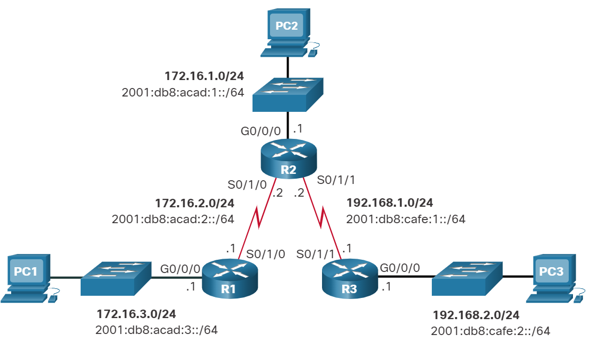
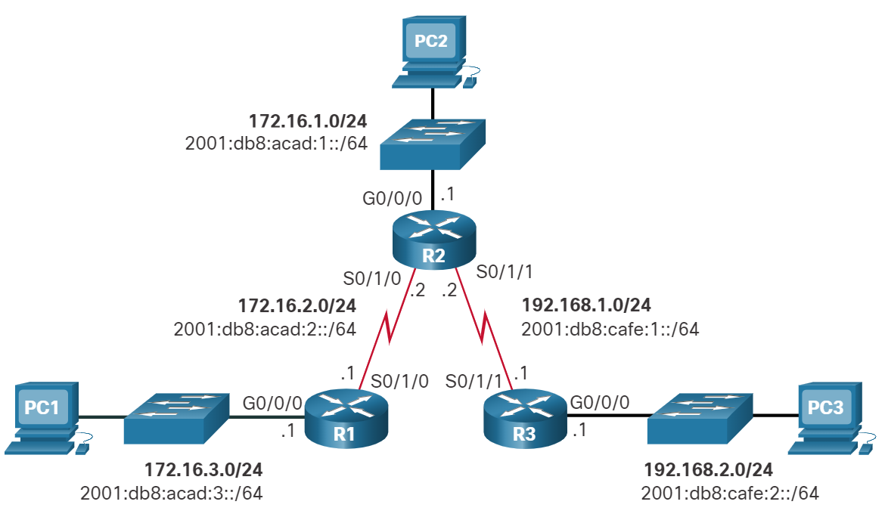
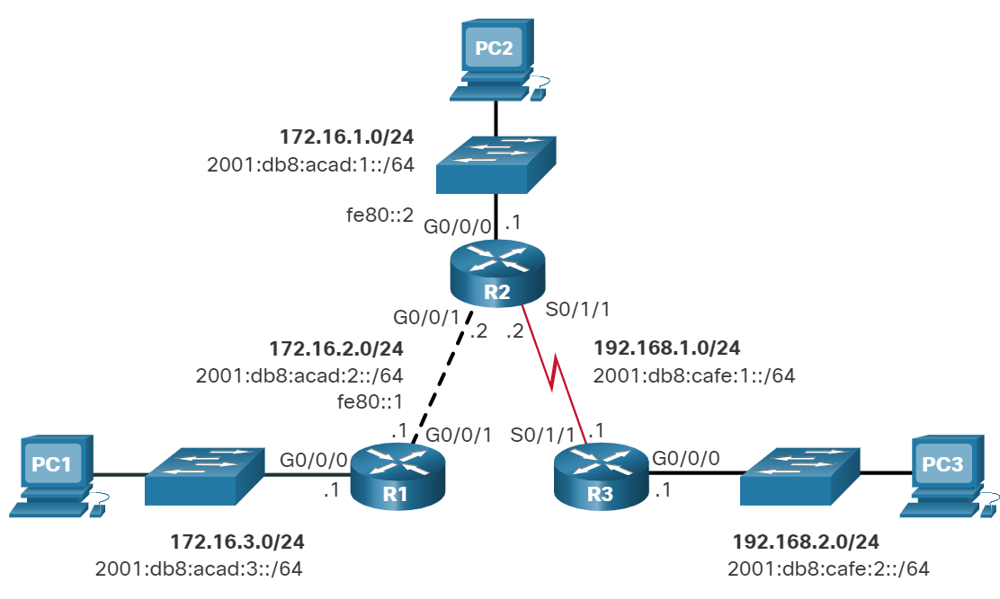
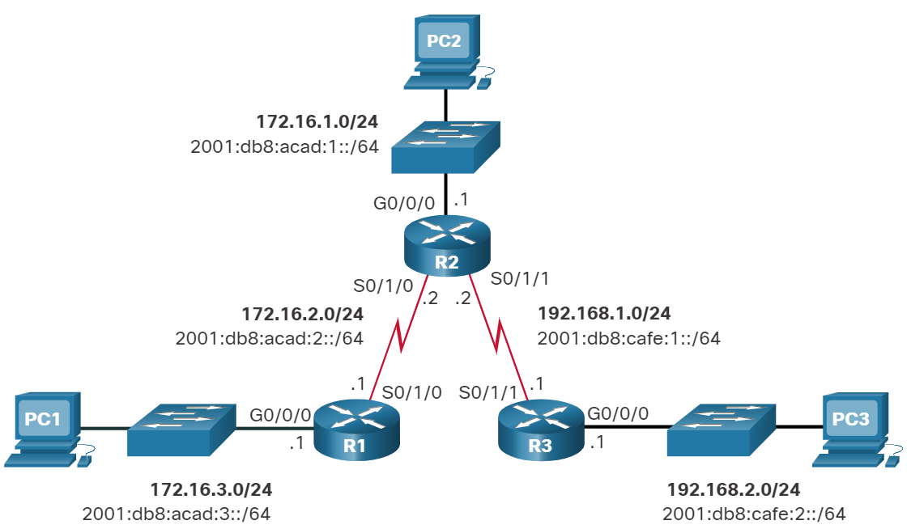

# Настройка статических маршрутов для пересылки IP-пакетов

<!-- 15.2.1 -->
## Статический маршрут IPv4 с использованием следующего перехода

Команды для настройки стандартных статических маршрутов немного различаются между IPv4 и IPv6. В этом разделе показано, как настроить стандартный следующий прыжок, напрямую подключенный и полные заданные статические маршруты для IPv4 и Ipv6.

В статическом маршруте следующего перехода указывается только IP-адрес следующего перехода. Выходной интерфейс определяется исходя из следующего транзитного участка. Например, на маршрутизаторе R1 настроено три статических маршрута следующего перехода с помощью IP-адреса следующего перехода, маршрутизатора R2.

<!-- /courses/srwe-dl/af9ef5a4-34fe-11eb-b1b2-9b1b0c1f7e0d/afb7fbec-34fe-11eb-b1b2-9b1b0c1f7e0d/assets/cae307c2-1c27-11ea-af09-3b2e6521927c.svg -->

Для настройки R1 со статическим маршрутом IPv4 к трем удаленным сетям используются следующие команды:

<pre><code>R1(config)# ip route 172.16.1.0 255.255.255.0 172.16.2.2
R1(config)# ip route 192.168.1.0 255.255.255.0 172.16.2.2
R1(config)# ip route 192.168.2.0 255.255.255.0 172.16.2.2
</code></pre>
Таблица маршрутизации для R1 теперь содержит маршруты к трем удаленным сетям IPv4.

<pre><code>R1# show ip route | begin Gateway
Gateway of last resort is not set
      172.16.0.0/16 is variably subnetted, 5 subnets, 2 masks
S        172.16.1.0/24 [1/0] via 172.16.2.2
C        172.16.2.0/24 is directly connected, Serial0/1/0
L        172.16.2.1/32 is directly connected, Serial0/1/0
C        172.16.3.0/24 is directly connected, GigabitEthernet0/0/0
L        172.16.3.1/32 is directly connected, GigabitEthernet0/0/0
S     192.168.1.0/24 [1/0] via 172.16.2.2
S     192.168.2.0/24 [1/0] via 172.16.2.2
R1#</code></pre>

<!--15.2.2-->
## Статический маршрут IPv6 с использованием следующего перехода
Для настройки R1 со статическим маршрутом IPv6 к трем удаленным сетям используются следующие команды:

<pre><code>R1(config)# ipv6 unicast-routing
R1(config)# ipv6 route 2001:db8:acad:1::/64 2001:db8:acad:2::2
R1(config)# ipv6 route 2001:db8:cafe:1::/64 2001:db8:acad:2::2
R1(config)# ipv6 route 2001:db8:cafe:2::/64 2001:db8:acad:2::2</code></pre>
Таблица маршрутизации для R1 теперь содержит маршруты к трем удаленным сетям IPv6.
<pre><code>R1# show ipv6 route
IPv6 Routing Table - default - 8 entries
Codes: C - Connected, L - Local, S - Static, U - Per-user Static route
       B - BGP, R - RIP, H - NHRP, I1 - ISIS L1
       I2 - ISIS L2, IA - ISIS interarea, IS - ISIS summary, D - EIGRP
       EX - EIGRP external, ND - ND Default, NDp - ND Prefix, DCE - Destination
       NDr - Redirect, RL - RPL, O - OSPF Intra, OI - OSPF Inter
       OE1 - OSPF ext 1, OE2 - OSPF ext 2, ON1 - OSPF NSSA ext 1
       ON2 - OSPF NSSA ext 2, la - LISP alt, lr - LISP site-registrations
       ld - LISP dyn-eid, lA - LISP away, le - LISP extranet-policy
       a - Application
S   2001:DB8:ACAD:1::/64 [1/0]
     via 2001:DB8:ACAD:2::2
C   2001:DB8:ACAD:2::/64 [0/0]
     via Serial0/1/0, directly connected
L   2001:DB8:ACAD:2::1/128 [0/0]
     via Serial0/1/0, receive
C   2001:DB8:ACAD:3::/64 [0/0]
     via GigabitEthernet0/0/0, directly connected
L   2001:DB8:ACAD:3::1/128 [0/0]
     via GigabitEthernet0/0/0, receive
S   2001:DB8:CAFE:1::/64 [1/0]
     via 2001:DB8:ACAD:2::2
S   2001:DB8:CAFE:2::/64 [1/0]
     via 2001:DB8:ACAD:2::2
L   FF00::/8 [0/0]
     via Null0, receive</code></pre>

<!--15.2.3-->
## Статический маршрут IPv4 с прямым подключением
При настройке статического маршрута также можно использовать выходной интерфейс для настройки адреса следующего перехода. На рисунке приведена топология.

<!-- /courses/srwe-dl/af9ef5a4-34fe-11eb-b1b2-9b1b0c1f7e0d/afb7fbec-34fe-11eb-b1b2-9b1b0c1f7e0d/assets/cae41932-1c27-11ea-af09-3b2e6521927c.svg -->

Три напрямую подключенных статических маршрута настроены на маршрутизаторе R1 с использованием выходного интерфейса.

<pre><code>R1(config)# ip route 172.16.1.0 255.255.255.0 s0/1/0
R1(config)# ip route 192.168.1.0 255.255.255.0 s0/1/0
R1(config)# ip route 192.168.2.0 255.255.255.0 s0/1/0</code></pre>
В таблице маршрутизации R1 показано, что когда пакет адресован сети 192.168.2.0/24, маршрутизатор R1 ищет совпадения в таблице маршрутизации и обнаруживает, что он может переслать пакет из своего интерфейса Serial 0/0/0.

**Примечание:** Обычно рекомендуется использовать адрес следующего перехода. Непосредственно подключенные статические маршруты следует использовать только с последовательными интерфейсами «точка-точка», как в данном примере.

<pre><code>R1# show ip route | begin Gateway
Gateway of last resort is not set
      172.16.0.0/16 is variably subnetted, 5 subnets, 2 masks
S        172.16.1.0/24 is directly connected, Serial0/1/0
C        172.16.2.0/24 is directly connected, Serial0/1/0
L        172.16.2.1/32 is directly connected, Serial0/1/0
C        172.16.3.0/24 is directly connected, GigabitEthernet0/0/0
L        172.16.3.1/32 is directly connected, GigabitEthernet0/0/0
S     192.168.1.0/24 is directly connected, Serial0/1/0
S     192.168.2.0/24 is directly connected, Serial0/1/0</code></pre>

<!--15.2.4-->
## Статический маршрут IPv6 с прямым подключением
В примере, три напрямую подключенных статических маршрута настроены на маршрутизаторе R1 с использованием выходного интерфейса.

<pre><code>R1(config)# ipv6 route 2001:db8:acad:1::/64 s0/1/0
R1(config)# ipv6 route 2001:db8:cafe:1::/64 s0/1/0
R1(config)# ipv6 route 2001:db8:cafe:2::/64 s0/1/0</code></pre>

Таблица маршрутизации IPv6 для R1 в выходных данных примера показывает, что когда пакет предназначен для сети 2001:db8:cafe: 2::/64, R1 ищет совпадение в таблице маршрутизации и обнаруживает, что он может переслать пакет из его последовательного интерфейса 0/1/0.

**Примечание:** Обычно рекомендуется использовать адрес следующего перехода. Непосредственно подключенные статические маршруты следует использовать только с последовательными интерфейсами «точка-точка», как в данном примере.

<pre><code>R1# show ipv6 route
IPv6 Routing Table - default - 8 entries
Codes: C - Connected, L - Local, S - Static, U - Per-user Static route
       B - BGP, R - RIP, H - NHRP, I1 - ISIS L1
       I2 - ISIS L2, IA - ISIS interarea, IS - ISIS summary, D - EIGRP
       EX - EIGRP external, ND - ND Default, NDp - ND Prefix, DCE - Destination
       NDr - Redirect, RL - RPL, O - OSPF Intra, OI - OSPF Inter
       OE1 - OSPF ext 1, OE2 - OSPF ext 2, ON1 - OSPF NSSA ext 1
       ON2 - OSPF NSSA ext 2, la - LISP alt, lr - LISP site-registrations
       ld - LISP dyn-eid, lA - LISP away, le - LISP extranet-policy
       a - Application
S   2001:DB8:ACAD:1::/64 [1/0]
     via Serial0/1/0, directly connected
C   2001:DB8:ACAD:2::/64 [0/0]
     via Serial0/1/0, directly connected
L   2001:DB8:ACAD:2::1/128 [0/0]
     via Serial0/1/0, receive
C   2001:DB8:ACAD:3::/64 [0/0]
     via GigabitEthernet0/0/0, directly connected
L   2001:DB8:ACAD:3::1/128 [0/0]
     via GigabitEthernet0/0/0, receive
S   2001:DB8:CAFE:1::/64 [1/0]
     via Serial0/1/0, directly connected
S   2001:DB8:CAFE:2::/64 [1/0]
     via Serial0/1/0, directly connected
L   FF00::/8 [0/0]
     via Null0, receive
R1#</code></pre>

<!--15.2.5-->
## Полностью определенный IPv4 статический маршрут
В полностью заданном статическом маршруте указываются как выходной интерфейс, так и IP-адрес следующего перехода. Такой статический маршрут используется в случаях, когда выходной интерфейс представляет собой интерфейс множественного доступа и необходимо явно определить следующий переход. Следующий переход должен быть напрямую подключен к указанному выходному интерфейсу. Использование интерфейса выхода является необязательным, однако необходимо использовать адрес следующего перехода.

Предположим, что канал сети между маршрутизаторами R1 и R2 является каналом Ethernet и что интерфейс GigabitEthernet 0/1 маршрутизатора R1 подключен к этой сети, как показано на рис. 1.

<!-- /courses/srwe-dl/af9ef5a4-34fe-11eb-b1b2-9b1b0c1f7e0d/afb7fbec-34fe-11eb-b1b2-9b1b0c1f7e0d/assets/cae52aa1-1c27-11ea-af09-3b2e6521927c.svg -->

Различие между сетью Ethernet с множественным доступом и последовательной сетью типа «точка-точка» заключается в том, что сеть «точка-точка» содержит только одно устройство — маршрутизатор на другом конце канала. Сети Ethernet могут содержать множество различных устройств, использующих одну сеть с множественным доступом, включая узлы и даже несколько маршрутизаторов.

Если выходной интерфейс является сетью Ethernet, рекомендуется использовать полностью заданный статический маршрут, включая как выходной интерфейс, так и IP-адрес следующего перехода. Вы также можете использовать полностью указанный статический маршрут, который включает в себя как интерфейс выхода, так и адрес следующего перехода.

<pre><code>R1(config)# ip route 172.16.1.0 255.255.255.0 GigabitEthernet 0/0/1 172.16.2.2
R1(config)# ip route 192.168.1.0 255.255.255.0 GigabitEthernet 0/0/1 172.16.2.2
R1(config)# ip route 192.168.2.0 255.255.255.0 GigabitEthernet 0/0/1 172.16.2.2</code></pre>
При пересылке пакетов на маршрутизатор R2 выходной интерфейс является интерфейсом GigabitEthernet 0/1, а IPv4-адрес следующего перехода равен 172.16.2.2, как показано на выводе **show ip route.**

<pre><code>R1# show ip route | begin Gateway
Gateway of last resort is not set
      172.16.0.0/16 is variably subnetted, 5 subnets, 2 masks
S        172.16.1.0/24 [1/0] via 172.16.2.2, GigabitEthernet0/0/1
C        172.16.2.0/24 is directly connected, GigabitEthernet0/0/1
L        172.16.2.1/32 is directly connected, GigabitEthernet0/0/1
C        172.16.3.0/24 is directly connected, GigabitEthernet0/0/0
L        172.16.3.1/32 is directly connected, GigabitEthernet0/0/0
S     192.168.1.0/24 [1/0] via 172.16.2.2, GigabitEthernet0/0/1
S     192.168.2.0/24 [1/0] via 172.16.2.2, GigabitEthernet0/0/1
</code></pre>

<!--15.2.6-->
## Полностью определенный IPv6 статический маршрут
В полностью заданном статическом маршруте указываются как выходной интерфейс, так и IPv6-адрес следующего перехода. В отличие от IPv4, в IPv6 возможна ситуация, когда требуется использование полностью заданного статического маршрута. Если статический маршрут IPv6 использует IPv6-адрес типа link-local в качестве адреса следующего перехода, то необходимо использовать полностью заданный статический маршрут, включающий выходной интерфейс. На рисунке показан пример полностью заданного статического маршрута IPv6, который использует IPv6-адрес типа link-local в качестве адреса следующего перехода.

<!-- /courses/srwe-dl/af9ef5a4-34fe-11eb-b1b2-9b1b0c1f7e0d/afb7fbec-34fe-11eb-b1b2-9b1b0c1f7e0d/assets/cae5c6e2-1c27-11ea-af09-3b2e6521927c.svg -->

<pre><code>R1(config)# ipv6 route 2001:db8:acad:1::/64 fe80::2
%Interface has to be specified for a link-local nexthop
R1(config)# ipv6 route 2001:db8:acad:1::/64 s0/1/0 fe80::2</code></pre>
В примере показана настройка полностью определенного статического маршрута с использованием адреса типа link-local маршрутизатора R2 в качестве адреса следующего перехода. Обратите внимание, что в IOS требуется определение выходного интерфейса.

Причина, по которой требуется использование полностью заданного статического маршрута, заключается в том, что IPv6-адрес типа link-local не добавлен в таблицу маршрутизации IPv6. Адреса типа link-local являются уникальными только в данном канале или сети. Адреса следующего перехода типа link-local могут быть допустимыми адресами в нескольких сетях, подключенных к маршрутизатору. По этой причине необходимо добавить выходной интерфейс.

В следующем примере показана запись в таблице маршрутизации IPv6 для этого маршрута. Обратите внимание, что в таблицу добавлены оба адреса следующего перехода типа link-local и выходной интерфейс.

<pre><code>R1# show ipv6 route static | begin 2001:db8:acad:1::/64
S   2001:DB8:ACAD:1::/64 [1/0]
    via FE80::2, Seria0/1/0</code></pre>

<!--15.2.7-->
## Проверка статического маршрута

Наряду с командами **show ip route**, **show ipv6 route**, **ping** и **traceroute** для проверки статических маршрутов также используются следующие команды:

- **show ip route static**
- **show ip route** *network*
- **show running-config | section ip route**

Замените **ip** на **ipv6** для версий команды IPv6.

<!-- /courses/srwe-dl/af9ef5a4-34fe-11eb-b1b2-9b1b0c1f7e0d/afb7fbec-34fe-11eb-b1b2-9b1b0c1f7e0d/assets/cae66322-1c27-11ea-af09-3b2e6521927c.svg -->

**Отображать только статические маршруты IPv4**

Эти выходные данные показывают только статические маршруты IPv4 в таблице маршрутизации. Также обратите внимание, где фильтр начинает вывод, исключая все коды.

<pre><code>R1# show ip route static | begin Gateway
Gateway of last resort is not set
      172.16.0.0/16 is variably subnetted, 5 subnets, 2 masks 
S 172.16.1.0/24 [1/0] via 172.16.2.2
S 192.168.1.0/24 [1/0] via 172.16.2.2
S 192.168.2.0/24 [1/0] via 172.16.2.2
R1#</code></pre>

**Отображение определенной сети IPv4**

Эта команда покажет выходные данные только для указанной сети в таблице маршрутизации.

<pre><code>R1# show ip route 192.168.2.1
Routing entry for 192.168.2.0/24
  Known via "static", distance 1, metric 0
  Routing Descriptor Blocks:
  * 172.16.2.2
      Route metric is 0, traffic share count is 1
R1#</code></pre>

**Отображение конфигурации статического маршрута IPv4**

Эта команда фильтрует текущую конфигурацию только для статических маршрутов IPv4.

<pre><code>R1# show running-config | section ip route
ip route 172.16.1.0 255.255.255.0 172.16.2.2
ip route 192.168.1.0 255.255.255.0 172.16.2.2
ip route 192.168.2.0 255.255.255.0 172.16.2.2
R1#</code></pre>

**Отображать только статические маршруты IPv6**

Эти выходные данные показывают только статические маршруты IPv6 в таблице маршрутизации. Также обратите внимание, где фильтр начинает вывод, исключая все коды.

<pre><code>R1# show ipv6 route static
IPv6 Routing Table - default - 8 entries
Codes: C - Connected, L - Local, S - Static, U - Per-user Static route
       B - BGP, R - RIP, H - NHRP, I1 - ISIS L1
       I2 - ISIS L2, IA - ISIS interarea, IS - ISIS summary, D - EIGRP
       EX - EIGRP external, ND - ND Default, NDp - ND Prefix, DCE - Destination
       NDr - Redirect, RL - RPL, O - OSPF Intra, OI - OSPF Inter
       OE1 - OSPF ext 1, OE2 - OSPF ext 2, ON1 - OSPF NSSA ext 1
       ON2 - OSPF NSSA ext 2, la - LISP alt, lr - LISP site-registrations 
       ld - LISP dyn-eid, lA - LISP away, le - LISP extranet policy
       a - Application
S 2001:DB8:ACAD:1::/64 [1/0]
     via 2001:DB8:ACAD:2::2
S 2001:DB8:CAFE:1::/64 [1/0] 
     via 2001:DB8:ACAD:2::2
S 2001:DB8:CAFE:2::/64 [1/0]
     via 2001:DB8:ACAD:2::2
R1#</code></pre>

**Отображение определенной сети IPv6**

Эта команда покажет выходные данные только для указанной сети в таблице маршрутизации.

<pre><code>R1# show ipv6 route 2001:db8:cafe:2:: 
Routing entry for 2001:DB8:CAFE:2::/64
  Known via "static", distance 1, metric 0
  Route count is 1/1, share count 0
  Routing paths:
    2001:DB8:ACAD:2::2
      Last updated 00:23:55 ago
R1#</code></pre>

**Отображение конфигурации статического маршрута IPv6**

Эта команда фильтрует текущую конфигурацию только для статических маршрутов IPv6.

<pre><code>R1# show running-config | section ipv6 route
ipv6 route 2001:DB8:ACAD:1::/64 2001:DB8:ACAD:2::2
ipv6 route 2001:DB8:CAFE:1::/64 2001:DB8:ACAD:2::2
ipv6 route 2001:DB8:CAFE:2::/64 2001:DB8:ACAD:2::2
R1#</code></pre>

<!--15.2.8
Инструмент проверки синтаксиса: настройка статических маршрутов -->