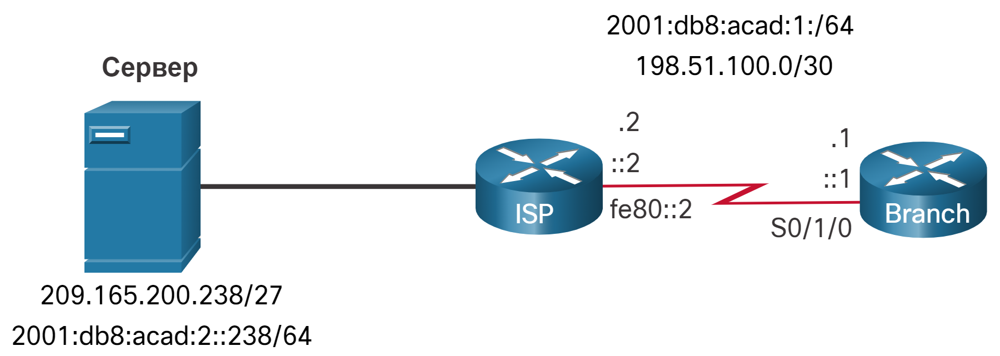
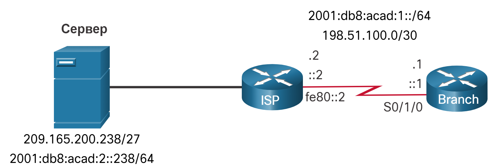

# Настройка статических маршрутов хостов

<!-- 15.5.1 -->
## Маршруты узла
В этом разделе показано, как настроить маршрут статического узла IPv4 и IPv6 и когда их использовать.

Маршрут хоста представляет собой адрес IPv4 с 32-разрядной маской или адрес IPv6 с 128-разрядной маской. Предусмотрено три способа добавления маршрутов узлов в таблицу маршрутизации:

- автоматическая установка при настройке IP-адреса на маршрутизаторе (как показано на рисунке);
- настройка в виде статического маршрута узла;
- автоматическое получение маршрута узла при помощи других методов (которые будут рассматриваться в последующих курсах).

<!--15.5.2-->
## Автоматически устанавливаемые локальные маршруты хостов
Cisco IOS автоматически устанавливает маршрут узла, также известный как локальный маршрут узла, при настройке адреса интерфейса на маршрутизаторе. Маршрут узла обеспечивает более эффективную обработку пакетов, направляемых на сам маршрутизатор, а не пересылку пакетов. Он используется в дополнение к подключенному маршруту, помеченному буквой C рядом с сетевым адресом интерфейса в таблице маршрутизации.

Во время назначения IP-адреса активному интерфейсу на маршрутизаторе в таблицу маршрутизации автоматически добавляется локальный маршрут узла. В выводимой таблице маршрутизации локальные маршруты помечены буквой L.

Например, обратимся к следующей топологии.

На рисунке показана топология двух маршрутизаторов. Слева находится маршрутизатор ISP, подключенный последовательным кабелем к маршрутизатору Branch справа. Интернет-провайдер имеет подключение к устройству под названием Сервер на левой стороне. Сервер имеет адрес IPv4 209.165.200.238/27 и адрес IPv6 2001:db8:acad:2::238/64. Последовательный канал между двумя маршрутизаторами имеет адрес IPv6 2001:db8:acad:1::/64 и адрес IPv4 198.51.100.0/30. Маршрутизатор ISP имеет IP-адреса .2, ::2 и fe80::2 назначены интерфейсу. Маршрутизатор филиала имеет назначенные ему IP-адреса .1, ::1 и fe80::1.


<!-- /courses/srwe-dl/af9ef5a4-34fe-11eb-b1b2-9b1b0c1f7e0d/afb822f2-34fe-11eb-b1b2-9b1b0c1f7e0d/assets/caf2e642-1c27-11ea-af09-3b2e6521927c.svg-->

IP-адресам, назначенным интерфейсу Branch Serial0/1/0, являются 198.51.100.1/30 и 2001:db8:acad:1::1/64. Локальные маршруты для интерфейса устанавливаются IOS в таблицах маршрутизации IPv4 и IPv6, как показано в примере.

```
Branch# show ip route | begin Gateway
Gateway of last resort is not set
      198.51.100.0/24 is variably subnetted, 2 subnets, 2 masks
C        198.51.100.0/30 is directly connected, Serial0/1/0
L        198.51.100.1/32 is directly connected, Serial0/1/0
Branch# show ipv6 route | begin :: 
C   2001:DB8:ACAD:1::/64 [0/0]
     via Serial0/1/0, directly connected
L   2001:DB8:ACAD:1::1/128 [0/0]
     via Serial0/1/0, receive
L   FF00::/8 [0/0]
     via Null0, receive
```

<!--15.5.3-->
## Статический узловой маршрут
Маршрут хоста может быть настроенным вручную статическим маршрутом для направления трафика на определенное целевое устройство, такое как сервер, показанный на рисунке. Статический маршрут использует IP-адрес назначения, а также маску 255.255.255.255 (/32) для маршрутов узлов IPv4 и длину префикса /128 для маршрутов узлов IPv6.

На рисунке показана топология двух маршрутизаторов. Слева находится маршрутизатор ISP, подключенный последовательным кабелем к маршрутизатору Branch справа. Интернет-провайдер имеет подключение к устройству под названием Сервер на левой стороне. Сервер имеет адрес IPv4 209.165.200.238/27 и адрес IPv6 2001:db8:acad:2::238/64. Последовательный канал между двумя маршрутизаторами имеет адрес IPv6 2001:db8:acad:1::/64 и адрес IPv4 198.51.100.0/30. Маршрутизатор ISP имеет IP-адреса .2, ::2 и fe80::2 назначены интерфейсу. Маршрутизатор филиала имеет назначенные ему IP-адреса .1, ::1 и fe80::1.


<!-- /courses/srwe-dl/af9ef5a4-34fe-11eb-b1b2-9b1b0c1f7e0d/afb822f2-34fe-11eb-b1b2-9b1b0c1f7e0d/assets/caf38280-1c27-11ea-af09-3b2e6521927c.svg -->

<!--15.5.4-->
## Настройка статических маршрутов хостов
В примере показана конфигурация статического маршрута узла IPv4 и IPv6 на маршрутизаторе филиала для доступа к серверу.

```
Branch(config)# ip route 209.165.200.238 255.255.255.255 198.51.100.2
Branch(config)# ipv6 route 2001:db8:acad:2::238/128 2001:db8:acad:1::2
Branch(config)# exit
Branch#
```

<!--15.5.5-->
## Проверка статических маршрутов хостов
Проверка таблиц маршрутов IPv4 и IPv6 подтверждает, что маршруты активны.

```
Branch# show ip route | begin Gateway
Gateway of last resort is not set
      198.51.100.0/24 is variably subnetted, 2 subnets, 2 masks
C        198.51.100.0/30 is directly connected, Serial0/1/0
L        198.51.100.1/32 is directly connected, Serial0/1/0
      209.165.200.0/32 is subnetted, 1 subnets
S        209.165.200.238 [1/0] via 198.51.100.2
Branch# show ipv6 route
(Output omitted)
C   2001:DB8:ACAD:1::/64 [0/0]
     via Serial0/1/0, directly connected
L   2001:DB8:ACAD:1::1/128 [0/0]
     via Serial0/1/0, receive
S   2001:DB8:ACAD:2::238/128 [1/0]
     via 2001:DB8:ACAD:1::2
Branch#
```

<!--15.5.6-->
## Настройка статического IPv6-маршрута узла с помощью локального адреса канала (LLA) следующего перехода
Для статических маршрутов IPv6 адресом следующего перехода может быть link-local адрес смежного маршрутизатора. Однако, при использовании link-local адреса в качестве адреса следующего перехода необходимо указать тип интерфейса и номер интерфейса, как показано в примере. Сначала удаляется исходный маршрут статического узла IPv6, затем полностью указанный маршрут, настроенный с IPv6-адресом сервера и локальным адресом канала IPv6 маршрутизатора ISP.

```
Branch(config)# no ipv6 route 2001:db8:acad:2::238/128 2001:db8:acad:1::2
Branch(config)# ipv6 route 2001:db8:acad:2::238/128 serial 0/1/0 fe80::2
Branch# show ipv6 route | begin ::
C   2001:DB8:ACAD:1::/64 [0/0]
     via Serial0/1/0, directly connected
L   2001:DB8:ACAD:1::1/128 [0/0]
     via Serial0/1/0, receive
S   2001:DB8:ACAD:2::238/128 [1/0]
     via FE80::2, Serial0/1/0
Branch#
```
<!--15.5.7 Проверка синтаксиса - Настройка статических маршрутов хостов-->
