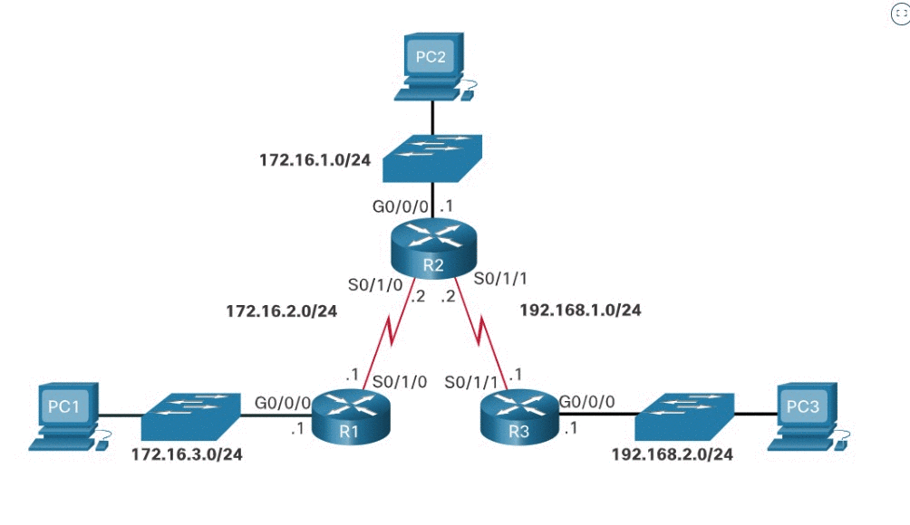

# Обработка пакетов с использованием статических маршрутов

<!-- 16.1.1 -->
## Статические маршруты и пересылка пакетов

Прежде чем перейти к разделу устранения неполадок в этом модуле, в этом разделе содержится краткий обзор того, как пакеты пересылаются в статических маршрутах. Нажмите на кнопку «Воспроизведение» на рисунке для того, чтобы просмотреть анимацию, на которой компьютер PC1 отправляет пакет на компьютер PC3:

Рисунок представляет собой анимацию, изображающую PC2, подключенный к коммутатору сети 172.16.1.0/24. Затем коммутатор подключается к маршрутизатору (R2) на Gigabit интерфейсе G0/0/0 с адресом шлюза .1. R2 имеет два последовательных соединения S0/1/0 и S0/1/1, подключенных к маршрутизатору (R1) для S0/1/0 и маршрутизатору (R3) для подключения S0/1/1. Сетевой адрес от R1 до R2 — 172.16.2.0/14, а для R2 до R3 — 192.181.1.0/24. Адреса последовательного подключения для R2 — .2, а R1 и R3 — .1. R1 подключается через Gigabit интерфейс G0/0/0 к коммутатору сети с адресом 172.16.3.0/24 с подключенным к коммутатору PC1. R3 имеет гигабитные подключения к коммутатору в сети 192.168.2.0/24 с подключенным к коммутатору PC3.

В следующем примере описывается процесс пересылки пакетов с использованием статических маршрутов.

1. Пакет приходит на интерфейс GigabitEthernet 0/0/0 маршрутизатора R1.
2. У маршрутизатора R1 нет определенного маршрута к сети назначения 192.168.2.0/24; таким образом. Поэтому R1 использует статический маршрут по умолчанию.  
3. Маршрутизатор R1 инкапсулирует пакет в новый кадр. Поскольку канал к маршрутизатору R2 является каналом типа «точка-точка», R1 добавляет адрес типа «все единицы» в адрес назначения второго уровня. 
4. Кадр пересылается из интерфейса Serial 0/1/0. Пакет приходит на интерфейс Serial 0/1/0 маршрутизатора R2. 
5. Маршрутизатор R2 деинкапсулирует кадр и выполняет поиск маршрута к адресату. Маршрутизатор R2 содержит статический маршрут к 192.168.2.0/24 из интерфейса Serial 0/1/1. 
6. Маршрутизатор R2 инкапсулирует пакет в новый кадр. Поскольку канал к маршрутизатору R3 является каналом типа «точка-точка», R2 добавляет адрес типа «все единицы» в адрес назначения второго уровня. 
7. Кадр пересылается из интерфейса Serial 0/1/1. Пакет приходит на интерфейс Serial 0/1/1 маршрутизатора R3. 
8. Маршрутизатор R3 деинкапсулирует кадр и выполняет поиск маршрута к адресату. Маршрутизатор R3 имеет статический маршрут к 192.168.2.0/24 из интерфейса GigabitEthernet 0/0/0. 
9. Маршрутизатор R3 выполняет поиск записи для 192.168.2.10 в таблице ARP для того, чтобы найти MAC-адрес второго уровня компьютера PC3. Если записи не существует, маршрутизатор R3 отправляет запрос по протоколу разрешения адресов (ARP) из интерфейса GigabitEthernet 0/0/0, а компьютер PC3 отправляет ARP-ответ, который содержит MAC-адрес PC3. 
10. Маршрутизатор R3 инкапсулирует пакет в новый кадр с MAC-адресом интерфейса GigabitEthernet 0/0/0 в качестве адреса второго уровня и MAC-адресом PC3 в качестве MAC-адреса назначения. 
11. Кадр пересылается из интерфейса GigabitEthernet 0/0/0. Пакет поступает на интерфейс сетевого адаптера (NIC) компьютера PC3. 

<!--16.1.2
Проверьте свое понимание темы Обработка пакетов с использованием статических маршрутов-->
