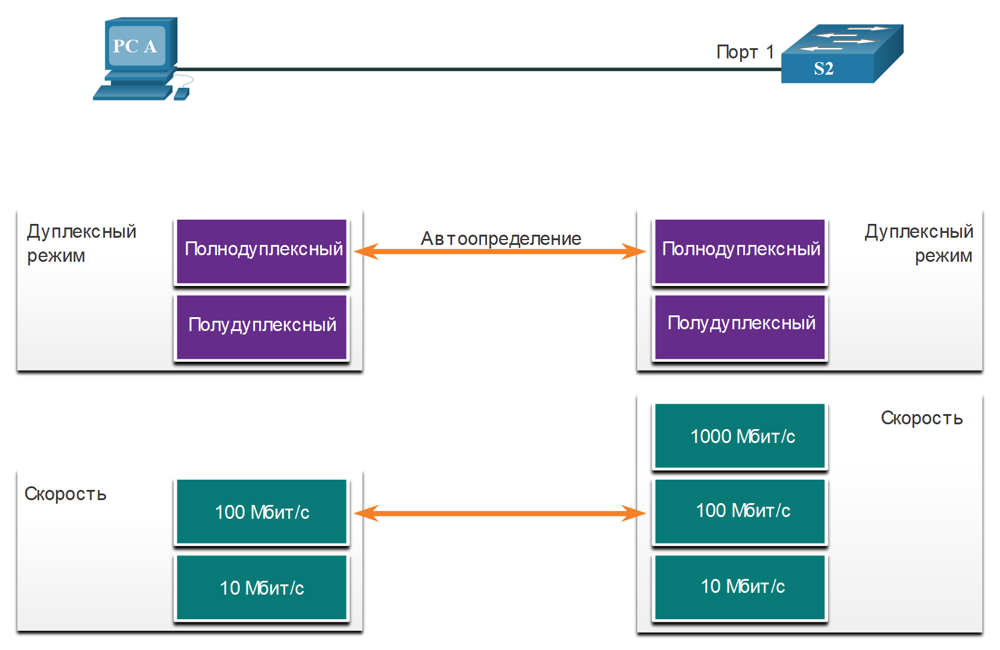
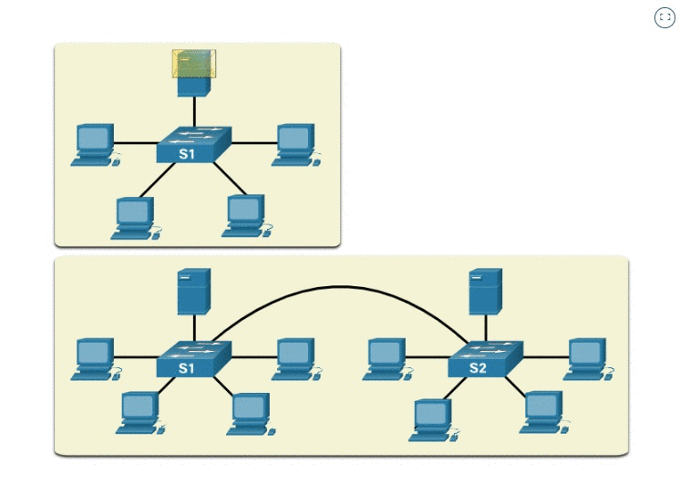

# Коммутационные домены

<!-- 2.2.1 -->
## Домены коллизий
В предыдущем разделе вы получили представление о том, что такое коммутатор и как он работает. В этом разделе описывается, как коммутаторы работают друг с другом и с другими устройствами для устранения коллизий и снижения перегрузки сети. Термины коллизия и перегруженность используются здесь так же, как и в уличном движении.

В старых сегментах Ethernet на основе концентратора сетевые устройства соревновались за общий носитель. Сегменты сети, в которых устройства совместно используют полосу пропускания, называются коллизионными доменами. Если два или более устройств в одном коллизионном домене одновременно пытаются передавать данные, возникает коллизия.

Если коммутационный порт Ethernet работает в полудуплексном режиме, каждый сегмент находится в своем собственном коллизионном домене. При работе портов коммутатора в полнодуплексном режиме не существует доменов столкновений. Тем не менее может существовать домен коллизии, если порт коммутатора работает в полудуплексном режиме.

По умолчанию порты коммутатора Ethernet автоматически согласовывают полнодуплексный режим, если смежное устройство может также работать в полнодуплексном режиме. Если коммутационный порт подключен к устройству, работающему в полудуплексном режиме, такому как традиционный концентратор, то данный порт будет работать в полудуплексном режиме. В случае полудуплексного режима коммутационный порт будет частью коллизионного домена.

Как показано на рисунке, полнодуплексный режим устанавливается в том случае, если оба устройства поддерживают его при максимальной общей пропускной способности.

<!-- 2.2.2 -->
## Домены широковещательной рассылкиа

Совокупность соединенных коммутаторов формирует единый широковещательный домен. Только устройство сетевого уровня, например, маршрутизатор, может разделить широковещательный домен уровня 2. Маршрутизаторы используются для сегментации доменов широковещательной рассылки, но они также сегментируют домен коллизий.

Когда устройство отправляет широковещательную рассылку уровня 2, MAC-адрес назначения в кадре представлен единицами в двоичном формате.

Широковещательный домен уровня 2 называют широковещательным доменом МАС-адресов. В широковещательный домен МАС-адресов входят все устройства локальной сети, которые получают кадры широковещательной рассылки от узла.

Когда коммутатор получает широковещательный кадр, он пересылает кадр из всех своих портов, за исключением входного порта, на котором широковещательный кадр был получен. Каждое устройство, подключенное к коммутатору, получает копию широковещательного кадра и обрабатывает ее.

В некоторых случаях широковещательные рассылки необходимы для первоначального местонахождения других устройств и сетевых сервисов, но, кроме этого, они снижают эффективность сети. Полоса пропускания сети используется для распространения широковещательного трафика. Чрезмерное количество широковещательных рассылок и высокая интенсивность трафика в сети могут привести к перегруженности и в результате к снижению производительности сети.

Когда два коммутатора соединены, широковещательный домен увеличивается, как видно во второй половине анимации. В этом случае широковещательный кадр пересылается по всем подключенным портам коммутатора S1. Коммутатор S1 подключается к коммутатору S2. Затем кадр передается всем устройствам, подключенным к коммутатору S2.

<!-- 2.2.3 -->
## Снижение перегрузок сети

Коммутаторы LAN обладают определенными характеристиками, позволяющими им снижать перегрузки сети. По умолчанию порты коммутаторов, соединенных между собой, пытаются установить связь в полнодуплексном режиме, тем самым исключая коллизионные домены. Каждый полнодуплексный коммутационный порт обеспечивает полную пропускную способность для одного или нескольких устройств, подключенных к этому порту. Полнодуплексные соединения значительно улучшают производительность локальной сети, кроме того, они необходимы для передачи данных со скоростью 1 Гбит/с Ethernet и выше.

Коммутаторы соединяют сегменты локальной сети, используют таблицу MAC-адресов для определения выходных портов и могут сократить или полностью устранить коллизии. Следующие характеристики коммутаторов помогают снизить перегрузку:

- **Быстрая скорость портов** - скорость портов коммутатора Ethernet зависит от модели и назначения. Например, большинство коммутаторов уровня доступа поддерживают скорость портов 100 Мбит/с и 1 Гбит/с. Коммутаторы уровня распределения поддерживают скорость портов 100 Мбит/с, 1 Гбит/с и 10 Гбит/с, а коммутаторы основного уровня и центра обработки данных могут поддерживать скорость портов 100 Гбит/с, 40 Гбит/с и 10 Гбит/с. Коммутаторы с более высокой скоростью портов стоят дороже, но могут снизить перегрузку.
- **Быстрая внутренняя коммутация** - Коммутаторы используют быструю внутреннюю шину или общую память для обеспечения высокой производительности.
- **Большие буферы кадров** - Коммутаторы используют большие буферы памяти для временного хранения большего количества полученных кадров перед тем, как начать их удаление. Это позволяет перенаправлять входящий трафик с более быстрого порта (например, 1 Гбит/с) на более медленный исходящий порт (например, 100 Мбит/с) без потери кадров.
-** Высокая плотность портов.** Коммутатор с высокой плотностью портов снижает общие затраты, так как сокращает необходимое количество коммутаторов. Например, если потребуется 96 портов доступа, дешевле было бы купить два 48-портовых коммутатора вместо четырех 24-портовых коммутаторов. Коммутаторы с высокой плотностью портов также помогают сохранить трафик локальным, что помогает уменьшить перегрузку.