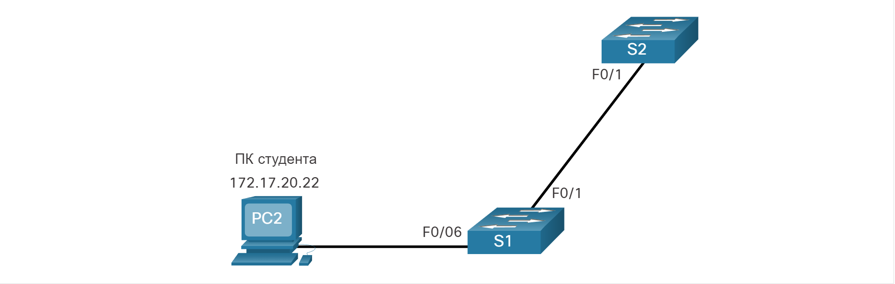
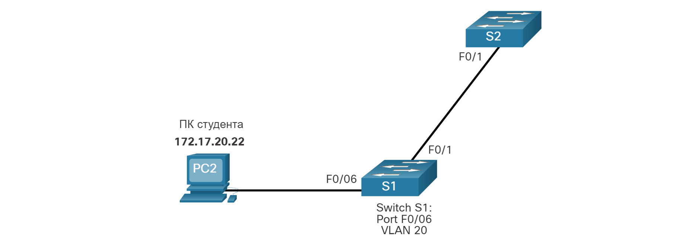
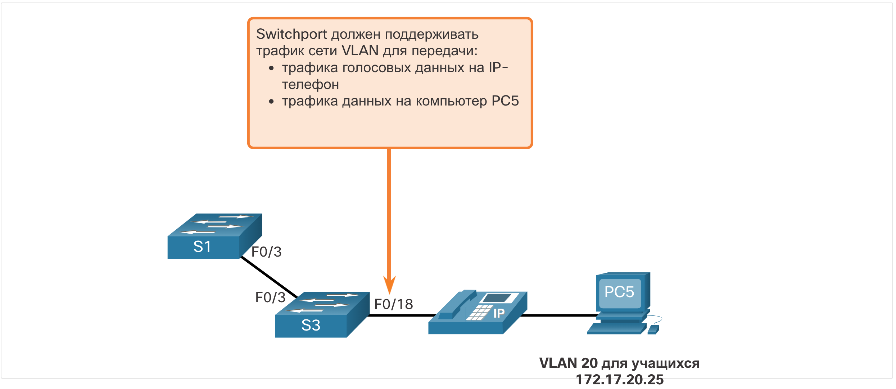

# Настройка VLAN

<!-- 3.3.1 -->
## Диапазоны VLAN на коммутаторах Catalyst

Создание VLAN, как и большинство других аспектов сети, является вопросом ввода соответствующих команд. В этом разделе описывается настройка и проверка различных типов VLAN.

Различные коммутаторы Cisco Catalyst поддерживают различные количества VLAN. Количество поддерживаемых VLAN достаточно велико, чтобы удовлетворить потребности большинства организаций. Коммутаторы Catalyst 2960 и 3560 способны поддерживать более 4000 сетей VLAN. VLAN нормального диапазона на этих коммутаторах нумеруются от 1 до 1 005, а VLAN расширенного диапазона — от 1 006 до 4 094. На рисунке показаны доступные сети VLAN на коммутаторе Catalyst 2960, работающем под управлением Cisco IOS версии 15.x.

```
Switch# show vlan brief

VLAN Name              Status   Ports
---- ----------------- -------  --------------------
1    default           active   Fa0/1, Fa0/2, Fa0/3, Fa0/4
                                Fa0/5, Fa0/6, Fa0/7, Fa0/8
                                Fa0/9, Fa0/10, Fa0/11, Fa0/12
                                Fa0/13, Fa0/14, Fa0/15, Fa0/16
                                Fa0/17, Fa0/18, Fa0/19, Fa0/20
                                Fa0/21, Fa0/22, Fa0/23, Fa0/24
                                Gi0/1, Gi0/2
1002 fddi-default                     act/unsup
1003 token-ring-default               act/unsup
1004 fddinet-default                  act/unsup
1005 trnet-default                    act/unsup
```

**Сети VLAN стандартного диапазона**

Ниже приведены характеристики VLAN нормального диапазона:

- Используются в малых и средних сетях предприятий и организаций.
- Сети VLAN обычного диапазона определяются идентификатором VLAN от 1 до 1005.
- (Идентификаторы от 1002 до 1005 резервируются для сетей VLAN типа Token Ring и FDDI.)
- Идентификаторы 1 и идентификаторы от 1002 до 1005 создаются автоматически и не могут быть удалены.
- Конфигурации хранятся в файле базы данных VLAN (vlan.dat), который находится во флеш-памяти.
- При настройке протокол магистрального соединения VLAN (VTP) помогает синхронизировать базу данных VLAN между коммутаторами.

**Сети VLAN расширенного диапазона**

Ниже приведены характеристики сетей VLAN расширенного диапазона:

- Они используются поставщиками услуг для обслуживания нескольких клиентов и глобальными предприятиями, достаточно крупными для того, чтобы нуждаться в идентификаторах VLAN расширенного диапазона.
- Определяются идентификатором VLAN от 1006 до 4094.
- По умолчанию они сохраняются в файле текущей конфигурации.
- Поддерживают меньше функций VLAN, чем сети VLAN стандартного диапазона.
- Требуется конфигурация прозрачного режима VTP для поддержки сетей VLAN расширенного диапазона.

**Примечание:** 4096 является верхней границей для числа VLAN, доступных на коммутаторах Catalyst, поскольку в поле идентификатора VLAN заголовка IEEE 802.1Q имеется 12 бит.

<!-- 3.3.2 -->
## Диапазоны VLAN на коммутаторах Catalyst

Команды создания VLAN

При настройке сетей VLAN стандартного диапазона сведения о конфигурации хранятся во флеш-памяти коммутатора, в файле vlan.dat. Флэш-память является постоянной и не требует команды **copy running-config startup-config**. Однако, поскольку одновременно с созданием сетей VLAN на коммутаторах Cisco часто также настраиваются и другие параметры, рекомендуется сохранять изменения текущей конфигурации в файл загрузочной конфигурации.

В таблице показан синтаксис команды Cisco IOS, используемый для добавления VLAN к коммутатору и указания ему имени. При настройке коммутатора рекомендуется присваивать имя каждой сети VLAN.

| Задача | 	Команда IOS |
| --- | --- |
| Войдите в режим глобальной настройки. | Switch# **configure terminal** |
| Создайте сеть VLAN с допустимым номером идентификатора. | Switch(config)# **vlan** vlan-id |
| Укажите уникальное имя для идентификации сети VLAN. | Switch(config-vlan)# **name** vlan-name |
| Вернитесь в привилегированный режим. | Switch(config-vlan)# **end** |

<!-- 3.3.3 -->
## Пример создания VLAN

В топологии студенческий компьютер (PC2) еще не связан с VLAN, но имеет IP-адрес 172.17.20.22, который принадлежит VLAN 20.



В примере показано, как настраивается студенческая VLAN (VLAN 20) на коммутаторе S1.

```
S1# configure terminal
S1(config)# vlan 20
S1(config-vlan)# name student
S1(config-vlan)# end
```

**Примечание**: Помимо одного идентификатора VLAN, можно ввести группу идентификаторов VLAN, разделенных запятыми, или диапазон идентификаторов VLAN, разделенных дефисами, с помощью команды **vlan** vlan-id. Например, ввод команды глобальной конфигурации **vlan 100,102,105-107** приведет к созданию сетей VLAN 100, 102, 105, 106 и 107.

<!-- 3.3.4 -->
## Команды назначения портов VLAN

Следующий шаг после создания сети VLAN — назначение портов сетям VLAN.

В таблице показан синтаксис для определения порта в качестве порта доступа и назначения его сети VLAN. Выполнять команду **switchport mode access** необязательно, но настоятельно рекомендуется в целях обеспечения безопасности. С помощью этой команды интерфейс переходит в режим постоянного доступа.

| Задача | 	Команда IOS |
| --- | --- |
| Войдите в режим глобальной настройки. | Switch# **configure terminal** |
| Войдите в режим интерфейсной конфигурации. | Switch(config)# **interface** interface-id |
| Переведите порт в режим доступа. | Switch(config-if)# **switchport mode access** |
| Назначьте порт сети VLAN. | Switch(config-if)# **switchport access vlan** vlan-id |
| Вернитесь в привилегированный исполнительский режим. | Switch(config-if)# **end** |

**Примечание**: Для одновременной настройки нескольких интерфейсов используйте команду **interface range**.

<!-- 3.3.5 -->
## Пример назначения порта VLAN

На рисунке порт F0/6 коммутатора S1 настроен в качестве порта доступа и назначается VLAN 20. Любое устройство, подключенное к этому порту, связывается с VLAN 20. Таким образом, в нашем примере компьютер PC2 находится в сети VLAN 20.



В примере показана конфигурация S1 для назначения F0/6 VLAN 20.

```
S1# configure terminal
S1(config)# interface fa0/6
S1(config-if)# switchport mode access
S1(config-if)# switchport access vlan 20
S1(config-if)# end
```

Сети VLAN настраиваются на коммутационном порте, а не на устройстве. Для компьютера PC2 адрес IPv4 и маска подсети связаны с сетью VLAN, настроенной на коммутационном порте. В данном примере это сеть VLAN 20. При настройке VLAN 20 на других коммутаторах сетевой администратор должен настроить другие компьютеры студентов в той же подсети, в которой находится компьютер PC2 (172.17.20.0/24).

<!-- 3.3.6 -->
## VLAN для передачи данных и голоса

Порт доступа может принадлежать только одной VLAN. Однако, порт также может быть связан с голосовой VLAN. Например, порт, подключенный к IP-телефону и конечному устройству, будет связан с двумя VLAN: одной для голосовой связи и другой для данных.

Рассмотрим топологию на рисунке. В этом примере компьютер PC5 подключен к IP-телефону Cisco, который в свою очередь подключен к интерфейсу FastEthernet 0/18 на коммутаторе S3. Для реализации этой конфигурации создаются сети VLAN 20 и голосовая VLAN 150.



<!-- 3.3.7 -->
## Пример VLAN для передачи данных и голосовых данных

Используйте команду конфигурации интерфейса sw**itchport voice vlan** vlan-id, чтобы назначить голосовую VLAN порту.

Локальные сети, поддерживающие трафик голосовых данных, обычно также имеют включенную гарантированную полосу пропускания (QoS). Трафик голосовых данных должен быть помечен как доверенный сразу при входе в сеть. Используйте команду настройки интерфейса **mls qos trust [cos | device cisco-phone | dscp | ip-precedence]**, чтобы установить доверенное состояние интерфейса и указать, какие поля пакета используются для классификации трафика.

Конфигурация на рис. 4 создает две сети VLAN (VLAN 20 и VLAN 150), а затем назначает интерфейс F0/18 коммутатора S3 в качестве коммутационного порта в сети VLAN 20. Она также назначает трафик голосовых данных в сеть VLAN 150 и включает классификацию QoS на основе класса обслуживания (CoS), назначенного IP-телефоном.

```
S3(config)# vlan 20
S3(config-vlan)# name student
S3(config-vlan)# vlan 150
S3(config-vlan)# name VOICE
S3(config-vlan)# exit
S3(config)# interface fa0/18
S3(config-if)# switchport mode access
S3(config-if)# switchport access vlan 20
S3(config-if)# mls qos trust cos
S3(config-if)# switchport voice vlan 150
S3(config-if)# end
S3#
```

**Примечание**: Реализация QoS выходит за рамки этого курса.

Команда **switchport access vlan** принудительно создаёт VLAN, если таковая ещё не существует на коммутаторе. Например, сеть VLAN 30 отсутствует в данных, выводимых командой **show vlan brief** на коммутаторе. Если команда **switchport access vlan 30** вводится на любом интерфейсе без предыдущей конфигурации, коммутатор отображает следующее:

``` % Access VLAN does not exist. Creating vlan 30 ```

<!-- 3.3.8 -->
## Проверка информации о сетях VLAN

После настройки сети VLAN ее конфигурации можно проверить с помощью команд Cisco IOS категории **«show»**.

Команда **show vlan** отображает список всех настроенных сетей VLAN. Команда **show vlan** также может быть использована с параметрами. Полный синтаксис: **show vlan [brief | id** *vlan-id* | **name** *vlan-name* | **summary**].

В таблице описаны параметры команд **show vlan**.

| Задача | 	Команда IOS |
| --- | --- |
| Отображает имя, состояние и порты VLAN по одной VLAN на строку. | **brief** |
| Отображает информацию об отдельной VLAN, определяемой по номеру идентификатора VLAN. Для vlan-id, диапазон идентификаторов VLAN: от 1 до 4094. | **id** *vlan-id* |
| Отображает информацию об имени одной сети VLAN. Имя VLAN— это код ASCII размером от 1 до 32 символов. | **name** *vlan-name* |
| Отображает общую информацию о VLAN. | **summary** |

Команда **show vlan summary** отображает список всех настроенных сетей VLAN.

```
S1# show vlan summary
Number of existing VLANs              : 7
Number of existing VTP VLANs          : 7
Number of existing extended VLANS     : 0
```

Другими полезными командами являются команды **show interfaces** interface-id **switchport** и **show interfaces vlan** vlan-id. Например, команда **show interfaces fa0/18 switchport** может быть использована для подтверждения того, что порт FastEthernet 0/18 правильно назначен для VLAN данных и голосовых сетей.

```
S1# show interfaces fa0/18 switchport
Name: Fa0/18
Switchport: Enabled
Administrative Mode: static access
Operational Mode: static access
Administrative Trunking Encapsulation: dot1q
Operational Trunking Encapsulation: native
Negotiation of Trunking: Off
Access Mode VLAN: 20 (student) 
Trunking Native Mode VLAN: 1 (default)
Voice VLAN: 150
Administrative private-vlan host-association: none
(Output omitted)
```

<!-- 3.3.9 -->
## Изменение принадлежности порта сети VLAN

Существует несколько способов изменить членство во VLAN.

Если порт доступа коммутатора неправильно назначен VLAN, просто повторно введите команду конфигурации интерфейса **switchport access vlan** vlan-id с правильным идентификатором VLAN. Например, предположим, что Fa0/18 неправильно настроено на VLAN 1 по умолчанию вместо VLAN 20. Чтобы изменить порт на VLAN 20, просто введите **switchport access vlan 20**.

Чтобы изменить членство порта на VLAN 1 по умолчанию, используйте команду **no switchport access vlan** в режиме настройки интерфейса, как показано на иллюстрации.

Например, в выходных данных Fa0/18 настроено на VLAN 1 по умолчанию, что подтверждается командой **show vlan brief**.

```
S1(config)# interface fa0/18
S1(config-if)# no switchport access vlan
S1(config-if)# end
S1#
S1# show vlan brief
VLAN Name                 Status    Ports
---- ------------------ --------- -------------------------------
1    default            active    Fa0/1, Fa0/2, Fa0/3, Fa0/4
                                  Fa0/5, Fa0/6, Fa0/7, Fa0/8
                                  Fa0/9, Fa0/10, Fa0/11, Fa0/12
                                  Fa0/13, Fa0/14, Fa0/15, Fa0/16
                                  Fa0/17, Fa0/18, Fa0/19, Fa0/20
                                  Fa0/21, Fa0/22, Fa0/23, Fa0/24
                                  Gi0/1, Gi0/2
20   student            active    
1002 fddi-default       act/unsup 
1003 token-ring-default act/unsup 
1004 fddinet-default    act/unsup 
1005 trnet-default      act/unsup
```

Обратите внимание, что VLAN 20 по-прежнему активна, несмотря на то, что ей не назначены порты.

Выходные данные **show interfaces f0/18 switchport** также можно использовать для проверки того, что VLAN доступа для интерфейса F0/18 была сброшена на VLAN 1, как показано на выходных данных.

```
S1# show interfaces fa0/18 switchport
Name: Fa0/18
Switchport: Enabled
Administrative Mode: static access
Operational Mode: static access
Administrative Trunking Encapsulation: negotiate
Operational Trunking Encapsulation: native
Negotiation of Trunking: Off
Access Mode VLAN: 1 (default)
Trunking Native Mode VLAN: 1 (default)
```

<!-- 3.3.10 -->
## Удаление VLAN

Команда **no vlan** *vlan-id* режима глобальной конфигурации используется для удаления VLAN из файла коммутатора vlan.dat.

**Внимание**: Перед удалением сети VLAN необходимо сначала переназначить все ее порты другой сети VLAN. Все порты, которые не будут перемещены в активную VLAN, не смогут взаимодействовать с другими станциями после удаления VLAN.

Можно удалить весь файл vlan.dat с помощью команды **delete flash:vlan.dat** в привилегированном исполнительском режиме. Сокращенную версию команды (**delete vlan.dat**) можно использовать только в том случае, если файл vlan.dat находится в своем расположении по умолчанию. После выполнения этой команды и перезагрузки коммутатора ранее настроенные сети VLAN будут недоступны. Фактически, это позволяет восстановить на коммутаторе его заводские настройки VLAN.

**Примечание**: Чтобы восстановить заводское состояние коммутатора Catalyst, отключите от коммутатора все кабели, кроме консоли и кабеля питания. Затем введите привилегированную команду режима EXEC **erase startup-config**, за которой следует команда **delete vlan.dat**.


<!-- 3.3.11 Проверка синтаксиса - конфигурация VLAN-->

<!-- 3.3.12 -->
## Packet Tracer - Конфигурация сетей VLAN

В этом упражнении Packet Tracer вам нужно:

- Проверка конфигурации VLAN, установленной по умолчанию
- Настройка сетей VLAN
- Назначение сетей VLAN портам

[Настройка виртуальной локальной сети - PDF](./assets/3.3.12-packet-tracer---vlan-configuration_ru-RU.pdf)

[Настройка виртуальной локальной сети - PKA](./assets/3.3.12-packet-tracer---vlan-configuration_ru-RU.pka)
